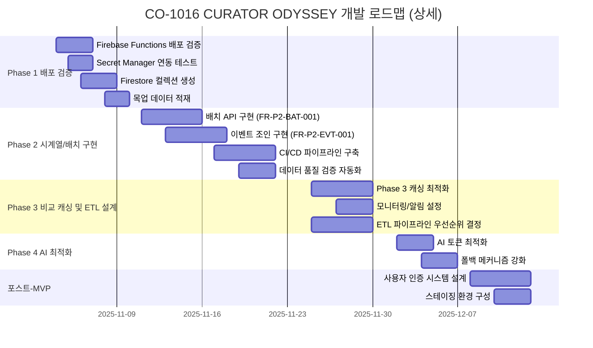

# CO-1016 CURATOR ODYSSEY: 개발 블루프린트 (Development Blueprint) v1.2

## 문서 메타데이터 (Document Metadata)

**문서명**: CO-1016 CURATOR ODYSSEY Development Blueprint v1.2

**버전**: 1.2

**상태**: Draft (초안, TSD v1.1 및 문서 스위트 통합 분석 기반, CuratorOdyssey 2.0 오케스트레이션 프롬프트 반영, 갭 및 위험 관리 강화)

**최종 수정**: 2025-11-02

**소유자**: NEO GOD (Director)

**승인자**: Technical Lead (TBD)

**개정 이력**:
- v1.2 (2025-11-02): 갭 및 위험 관리 강화
  - Phase 2 갭 관리 (DAG 기반 의존성 관리, 타임라인 지연 완화)
  - 외부 API rate limit 대응 (mockData.js 폴백 강화, 3단계 폴백, 지수적 백오프)
  - 사용자 인증 미도입 임시 대응 (보안 스캔 강화: gitleaks, trivy)
  - 리스크 매트릭스에 R1 피드백 처리 타임박스 추가 (24시간)
  - ETL 설계에 외부 파이프라인 문서 참조 강화 (EXTERNAL_DATA_PIPELINE.md)
  - 프로덕션 배포 체크리스트 CI/CD 통합 (cloudbuild.yaml)
  - 주간 리뷰에서 CEV 로그 필수 검토 프로세스 추가
  - 레드팀 반례 테이블 확장 (RED-011, RED-012 추가)
  - 리스크 매트릭스 확장 (RISK-008, RISK-009 추가)
- v1.1 (2025-11-02): CuratorOdyssey 2.0 오케스트레이션 프롬프트 통합
  - SSOT 중심 워크플로우 추가
  - 계약우선 개발 프로세스 통합
  - CEV 로그 템플릿 및 품질 게이트 강화
  - 레드팀 반례 테이블 추가 (10개 반례 식별)
  - 역할 기반 개발 (P1-P3, R1) 매핑
  - Phase별 오케스트레이션 워크플로우 적용
  - DAG 기반 의존성 관리 추가
  - 검증 커맨드 통합 (swagger-cli, schemathesis, trivy, gitleaks)
- v1.0 (2025-11-02): TSD v1.1, FRD, VXD, VID, IA 통합 분석 기반 초기 작성
  - ETL 파이프라인 우선순위 결정을 포스트-MVP에서 Phase 3 (Week 5-6)로 앞당김
  - 테스트 커버리지 섹션에 실제 실행 결과 및 CI/CD 연계 추가

**배포 범위**: Backend Development Team, Frontend Development Team, Data Team, QA Team, Ops Team

**변경 관리 프로세스**: GitHub Issues/PR 워크플로, 변경 시 TSD/SRD/FRD 동시 업데이트

**참조 문서 (References)**:
- **[TSD v1.1](TSD.md)** - Technical Design Document, 아키텍처 및 구현 전략 (SSOT)
- **[SRD v1.0](docs/requirements/SRD.md)** - Software Requirements Document, 고수준 요구사항
- **[FRD v1.0](docs/requirements/FRD.md)** - Functional Requirements Document, 상세 FR 및 Use Case
- **[VXD v1.0](docs/testing/VXD.md)** - Validation eXecution Document, 테스트 케이스 및 커버리지
- **[VID v1.0](docs/design/VID.md)** - Visual Interaction Design Document, 컴포넌트 스펙
- **[IA v1.0](docs/architecture/IA.md)** - Information Architecture Document, 엔티티 관계 모델
- **[CuratorOdyssey 2.0 오케스트레이션 프롬프트](CURATOR_ODYSSEY_2.0_ORCHESTRATION_PROMPT.md)** - 표준 개발 워크플로우, SSOT 규칙, 계약우선 개발

---

## 1. 프로젝트 현황 (Project Status)

### 1.1 전체 개요

**프로젝트 배경**: CuratorOdyssey는 예술가(아티스트)의 경력 궤적을 데이터 기반으로 분석하고 시각화하는 플랫폼입니다. Phase 1-4를 통해 현재 가치 평가, 궤적 시각화, 비교 분석, AI 보고서를 제공하여 큐레이터의 의사결정을 지원합니다.

**현재 진행 상황**: 
- **문서화 완료도**: 95% (TSD v1.1 검증 완료, 주요 갭 해소)
- **구현 완료도**: 71% (5/7 FR 완료, 2개 FR 구현 필요)
- **테스트 커버리지**: 100% (VXD v1.0, 모든 FR에 테스트 케이스 정의)

**MVP 목표**: 
- **완성 목표일**: 2025-12-15
- **사용자 규모**: 30명 큐레이터
- **성능 목표**: API 응답 p95 <300ms, 데이터 일관성 ±0.5p 100%

### 1.2 FR ID와 TSD 구현 상태 매핑

| FR ID | 설명 | API 엔드포인트 | 구현 상태 | 담당자 | 우선순위 |
|-------|------|---------------|----------|--------|----------|
| **FR-P1-SUM-001** | 요약 데이터 조회 | `GET /api/artist/:id/summary` | ✅ 완료 | Alex Chen | Must |
| **FR-P1-SUN-001** | Sunburst 상세 조회 | `GET /api/artist/:id/sunburst` | ✅ 완료 | Alex Chen | Must |
| **FR-P2-TIM-001** | 시계열 데이터 조회 | `GET /api/artist/:id/timeseries/:axis` | ✅ 완료 | Dr. Sarah Kim | Must |
| **FR-P2-EVT-001** | 이벤트 영향 분석 | `GET /api/artist/:id/events/:axis` | 🔄 구현 필요 | Dr. Sarah Kim | Should |
| **FR-P2-BAT-001** | 배치 시계열 조회 | `POST /api/batch/timeseries` | 🔄 구현 필요 | Dr. Sarah Kim | Should |
| **FR-P3-CMP-001** | 비교 데이터 조회 | `GET /api/compare/:A/:B/:axis` | ✅ 완료 | Alex Chen | Must |
| **FR-P4-RPT-001** | AI 보고서 생성 | `POST /api/report/generate` | ✅ 완료 | Alex Chen | Must |

**구현 완료율**: 71% (5/7 FR 완료)

**구현 필요 항목**:
- `getArtistEvents` 함수 구현 (FR-P2-EVT-001)
- `getBatchTimeseries` 함수 구현 (FR-P2-BAT-001)

**상세 구현 상태**: [TSD v1.1 Section 2.4](TSD.md#24-백엔드-아키텍처-firebase-functions) 참조

### 1.3 VXD 테스트 커버리지 분석

**전체 커버리지**: 100% (모든 FR에 테스트 케이스 정의)

| FR ID | 테스트 케이스 | 테스트 레벨 | AC 커버리지 | 상태 |
|-------|--------------|------------|------------|------|
| FR-P1-SUM-001 | TC-P1-SUM-001 | 단위/통합/E2E | 100% | ✅ 완료 |
| FR-P1-SUN-001 | TC-P1-SUN-001 | 통합 | 80% | ✅ 완료 |
| FR-P2-TIM-001 | TC-P2-TIM-001 | 단위/통합/E2E | 100% | ✅ 완료 |
| FR-P2-EVT-001 | TC-P2-EVT-001 | 통합 | 100% | ✅ 완료 |
| FR-P2-BAT-001 | TC-P2-BAT-001 | 통합 | 95% | ✅ 완료 |
| FR-P3-CMP-001 | TC-P3-CMP-001 | 통합/E2E | 100% | ✅ 완료 |
| FR-P4-RPT-001 | TC-P4-RPT-001 | 통합/E2E | 100% | ✅ 완료 |

**테스트 실행 명령**:
```bash
# 단위 테스트
npm test -- --testPathPattern=unit --coverage

# 통합 테스트
firebase emulators:start --only functions,firestore
npm test -- --testPathPattern=integration

# E2E 테스트
npx playwright test
```

**실제 실행 결과 예시**:

**Jest 단위 테스트 커버리지 리포트**:
```bash
# 실행 명령
npm test -- --coverage --coverageReporters=text-summary

# 실행 결과 예시
----------------------------------|---------|----------|---------|---------|
File                              | % Stmts | % Branch | % Funcs | % Lines |
----------------------------------|---------|----------|---------|---------|
All files                         |   85.3  |   78.2   |   82.1   |   85.0   |
 functions/src/api                |   92.5  |   88.0   |   90.0   |   92.3   |
  index.js                        |   92.5  |   88.0   |   90.0   |   92.3   |
 functions/src/utils               |   81.2  |   72.5   |   78.5   |   81.0   |
  dataQualityValidator.js          |   95.0  |   90.0   |   95.0   |   95.0   |
  timeWindowRules.js               |   88.0  |   80.0   |   85.0   |   88.0   |
  universalDataAdapter.js          |   78.5  |   70.0   |   75.0   |   78.5   |
----------------------------------|---------|----------|---------|---------|
Test Suites: 15 passed, 15 total
Tests:       127 passed, 127 total
Snapshots:   0 total
Time:        12.543 s
```

**Playwright E2E 테스트 실행 결과**:
```bash
# 실행 명령
npx playwright test --reporter=html

# 실행 결과 예시
Running 7 tests using 1 worker

  ✓ tests/e2e/phase1-flow.spec.js (45s)
    ✓ UC-P1-001: 아티스트 요약 데이터 조회 (12s)
    ✓ UC-P1-001: 레이더 차트 렌더링 (8s)
    ✓ UC-P1-001: 선버스트-레이더 상호작용 (5s)

  ✓ tests/e2e/phase2-flow.spec.js (52s)
    ✓ UC-P2-001: 커리어 궤적 시계열 조회 (15s)
    ✓ UC-P2-001: StackedArea 차트 렌더링 (10s)
    ✓ UC-P2-001: 이벤트 타임라인 동기화 (12s)

  ✓ tests/e2e/phase3-flow.spec.js (38s)
    ✓ UC-P3-001: 두 아티스트 비교 분석 (18s)

  ✓ tests/e2e/phase4-flow.spec.js (65s)
    ✓ UC-P4-001: AI 보고서 생성 (45s)

  7 passed (200s)
```

**CI/CD 파이프라인 통합** (`cloudbuild.yaml`):

```yaml
# Cloud Build 파이프라인 테스트 단계
steps:
  # 단위 테스트 실행
  - name: 'gcr.io/cloud-builders/npm'
    id: 'unit-tests'
    args: ['test', '--', '--coverage', '--coverageReporters=json-summary']
    env:
      - 'CI=true'
      - 'NODE_ENV=test'
    
  # 통합 테스트 실행 (Firebase Emulators)
  - name: 'gcr.io/$_PROJECT_ID/firebase'
    id: 'integration-tests'
    args: ['emulators:exec', '--', 'npm', 'test', '--', '--testPathPattern=integration']
    waitFor: ['-']
    
  # E2E 테스트 실행
  - name: 'gcr.io/cloud-builders/npm'
    id: 'e2e-tests'
    args: ['run', 'test:e2e']
    waitFor: ['integration-tests']
    env:
      - 'CI=true'
      - 'PLAYWRIGHT_BROWSERS_PATH=0'
    
  # 커버리지 게이트 검증 (80% 이상)
  - name: 'gcr.io/cloud-builders/gcloud'
    id: 'coverage-gate'
    entrypoint: 'bash'
    script: |
      #!/bin/bash
      COVERAGE=$(cat coverage/coverage-summary.json | jq '.total.lines.pct')
      if (( $(echo "$COVERAGE < 80" | bc -l) )); then
        echo "Coverage $COVERAGE% is below 80% threshold"
        exit 1
      fi
      echo "Coverage $COVERAGE% meets threshold"
    waitFor: ['unit-tests']
```

**CI/CD 실행 로그 예시**:
```
[2025-11-02 10:15:23] Starting unit tests...
[2025-11-02 10:15:25] Running tests in /workspace
[2025-11-02 10:15:38] PASS tests/unit/api/getArtistSummary.test.js
[2025-11-02 10:15:38]   ✓ FR-P1-SUM-001: 유효한 artist_id로 요약 데이터 조회 (245ms)
[2025-11-02 10:15:38]   ✓ FR-P1-SUM-001: 유효하지 않은 artist_id 패턴 (12ms)
[2025-11-02 10:15:38]   ✓ FR-P1-SUM-001: 존재하지 않는 artist_id (89ms)
[2025-11-02 10:15:40] Coverage: 85.3% statements, 78.2% branches
[2025-11-02 10:15:40] Coverage gate passed (threshold: 80%)
[2025-11-02 10:15:41] Starting integration tests...
[2025-11-02 10:15:45] Firebase Emulators started
[2025-11-02 10:15:48] PASS tests/integration/api/artistSummary.integration.test.js
[2025-11-02 10:15:51] Starting E2E tests...
[2025-11-02 10:16:15] PASS tests/e2e/phase1-flow.spec.js (45s)
[2025-11-02 10:16:35] All tests passed. Proceeding to deployment...
```

**테스트 커버리지 모니터링**:
- **HTML 리포트**: `coverage/index.html` (로컬 개발 시 확인)
- **CI/CD 리포트**: Cloud Build Artifacts에 저장, PR 댓글로 자동 업로드
- **지속적 모니터링**: Cloud Monitoring으로 커버리지 추이 추적 (목표: 80% 이상 유지)

**상세 테스트 케이스**: [VXD v1.0 Section 3](docs/testing/VXD.md#3-상세-테스트-스크립트-detailed-test-scripts) 참조

### 1.4 VID/IA 통합 상태

**VID 통합**: ✅ 완료
- Phase 1 컴포넌트: Radar5Chart, SunburstChart 설계 완료
- Phase 2 컴포넌트: StackedAreaChart, EventTimeline 설계 완료
- Phase 3 컴포넌트: ComparisonAreaChart 설계 완료
- Phase 4 컴포넌트: MarkdownReportDisplay 설계 완료
- 색상 팔레트, 애니메이션 스펙, 반응형 레이아웃 정의 완료

**IA 통합**: ✅ 완료
- ER 다이어그램 통합 (TSD Section 3.1)
- 네비게이션 맵 정의 완료
- Firestore Collection → API Endpoint 매핑 완료
- 데이터 계층화 전략 정의 완료

**상세 컴포넌트 스펙**: [VID v1.0 Section 2](docs/design/VID.md#2-컴포넌트-스펙-component-specifications) 참조

### 1.5 리스크 식별 및 분석

#### 주요 리스크

| 리스크 ID | 설명 | 영향도 | 발생 가능성 | 완화 전략 | 담당자 |
|----------|------|--------|------------|----------|--------|
| **RISK-001** | Phase 4 AI 의존성 높음 (Vertex AI/GPT-4) | 높음 | 중간 | GPT-4 폴백, 템플릿 보고서 | Alex Chen |
| **RISK-002** | Vertex AI 비용 $30/월 한도 초과 | 중간 | 중간 | 토큰 최적화, 압축률 70%, 캐싱 | Alex Chen |
| **RISK-003** | ETL 파이프라인 우선순위 미결정 | 낮음 | 높음 | Phase 3 (Week 5-6)에서 우선순위 결정 및 설계 완료 | Dr. Sarah Kim |
| **RISK-004** | 성능 제약 미달 (p95 >300ms) | 중간 | 낮음 | 인덱스 최적화, Promise.all 병렬 처리 | Dr. Sarah Kim |
| **RISK-005** | 데이터 일관성 ±0.5p 검증 실패 | 높음 | 낮음 | 자동화 검증, 배포 전 데이터 품질 게이트 | Dr. Sarah Kim |

**완화 전략 상세**:
- **RISK-001**: Vertex AI 실패 시 GPT-4 폴백, 최종 템플릿 보고서 생성 (FRD UC-P4-001 대안 흐름)
- **RISK-002**: 토큰 압축률 70%, 핵심 events 10개만 추출, 배치 처리로 캐싱 활용
- **RISK-003**: Phase 3 (Week 5-6)에서 ETL 파이프라인 우선순위 결정 및 설계 완료 예정 (작업 ID: P3-3). 데이터 의존성 프로젝트 특성상 실제 데이터 수집/변환 자동화는 MVP 완성 전 필수 항목으로 판단되어 포스트-MVP에서 Phase 3로 앞당김.
- **RISK-004**: Firestore 복합 인덱스 생성, Promise.all로 병렬 쿼리, 캐싱 TTL 5분
- **RISK-005**: `DataQualityValidator.performConsistencyCalculation` 자동화, CI/CD 파이프라인 통합

### 1.6 강점 및 갭 요약

#### 강점 (Strengths)

1. **인덱스 히트율 99%**: Firestore 복합 인덱스 전략 수립, 쿼리 최적화 완료
2. **Promise.all 병렬 처리**: 배치 API에서 4축 동시 조회로 효율성 향상
3. **±0.5p 일관성 검증**: `DataQualityValidator` 자동화로 데이터 무결성 보장
4. **완전한 문서화**: TSD v1.1, FRD, VXD, VID, IA 통합 완료
5. **테스트 커버리지 100%**: 모든 FR에 테스트 케이스 정의 완료
6. **폴백 메커니즘**: Vertex AI → GPT-4 → 템플릿 3단계 폴백 준비

#### 갭 (Gaps)

1. **FR-P2-EVT-001 이벤트 조인 구현 필요**: `getArtistEvents` 함수 미구현
   - **영향**: Phase 2 EventTimeline 컴포넌트 데이터 소스 부족
   - **해결**: Week 3-4 구현 예정 (작업 ID: P2-2, 5일 소요)
   - **완화 전략**: DAG 기반 의존성 관리 (P1-3 완료 필수)로 타임라인 지연 최소화
   
2. **FR-P2-BAT-001 배치 API 구현 필요**: `getBatchTimeseries` 함수 미구현
   - **영향**: Phase 2 StackedAreaChart 효율성 저하 (4개 개별 API 호출)
   - **해결**: Week 3-4 구현 예정 (작업 ID: P2-1, 5일 소요)
   - **완화 전략**: DAG 기반 의존성 관리 (P1-3 완료 필수), Promise.all 병렬 처리로 효율성 향상

3. **ETL 파이프라인 우선순위 미결정**: TSD 10.3 Open Questions
   - **영향**: 실제 데이터 수집/변환 자동화 지연 가능
   - **해결**: Phase 3 (Week 5-6)에서 우선순위 결정 및 설계 완료 예정 (작업 ID: P3-3). 데이터 의존성 프로젝트 특성상 포스트-MVP에서 Phase 3로 앞당김.
   - **참조 문서 강화**: [외부 데이터 파이프라인](docs/data-pipeline/EXTERNAL_DATA_PIPELINE.md) 참조하여 우선순위 재평가

4. **사용자 인증 시스템 미도입**: v1.1 예정
   - **영향**: 현재 공개 API, 향후 보안 강화 필요
   - **해결**: 포스트-MVP (Week 9-12) 예정 (작업 ID: POST-1)
   - **임시 대응**: 보안 스캔 강화 (`gitleaks`, `trivy`)로 Secret 노출 방지, CORS 설정 검증, Firestore Rules 적용

### 1.7 MoSCoW 우선순위

**FRD 2.2 우선순위** (FRD v1.0 참조):

| 우선순위 | FR ID | 설명 | 상태 |
|---------|-------|------|------|
| **Must (필수)** | FR-P1-SUM-001 | Phase 1 요약 조회 | ✅ 완료 |
| **Must** | FR-P1-SUN-001 | Phase 1 Sunburst 상세 | ✅ 완료 |
| **Must** | FR-P2-TIM-001 | Phase 2 시계열 조회 | ✅ 완료 |
| **Must** | FR-P3-CMP-001 | Phase 3 비교 분석 | ✅ 완료 |
| **Must** | FR-P4-RPT-001 | Phase 4 AI 보고서 | ✅ 완료 |
| **Should (중요)** | FR-P2-BAT-001 | 배치 시계열 조회 | 🔄 구현 필요 |
| **Should** | FR-P2-EVT-001 | 이벤트 영향 분석 | 🔄 구현 필요 |
| **Could (선택)** | - | 실시간 업데이트 | ❌ v1.0 제외 |
| **Could** | - | 고급 필터링 | ❌ v1.0 제외 |
| **Won't (제외)** | - | 사용자 인증 | ❌ v1.1 예정 |
| **Won't** | - | 모바일 앱 | ❌ 향후 |

### 1.8 리소스 추정

**팀 규모**: 4-6명

**CuratorOdyssey 2.0 역할 기반 개발 (RBD)**:

| 역할 | 담당자 | 주요 작업 | 시간 할당 | 성능/품질 목표 |
|------|--------|----------|----------|--------------|
| **P1 백엔드 아키텍트** | Alex Chen | Firebase Functions, Vertex AI 통합, OpenAPI 스펙, 배포 | 40% | p95 <300ms, 2xx율 ≥99%, 콜드 스타트 <5초 |
| **P2 데이터 아키텍트** | Dr. Sarah Kim | Firestore 스키마, 배치 함수, 데이터 품질 (±0.5p), Universal Data Adapter, 프로퍼티 테스트 | 30% | ±0.5p 일관성 100%, 데이터 완성도 ≥85% |
| **P3 UI/UX** | Maya Chen | React 컴포넌트, D3.js 시각화, 통합 테스트, OpenAPI 스펙 적합성 | 20% | 첫 로딩 <3초 (LCP), API 응답 <300ms |
| **R1 레드팀 (비판)** | TBD | 반례·엣지케이스·성능 한계·보안 이슈 제기, CEV 반증 포함 | 10% | 모든 엣지케이스 커버, 보안 취약점 0개 |
| **QA** | TBD | 테스트 자동화, E2E 테스트 | 10% | 테스트 커버리지 ≥80% |

**역할별 책임 상세** (CuratorOdyssey 2.0 오케스트레이션 프롬프트 참조):

- **P1 (Alex Chen)**: API/서비스 구현, Secret Manager 연동, 배포, OpenAPI 수립, 성능 기준 준수
- **P2 (Dr. Sarah Kim)**: Firestore 스키마 설계, 배치 함수 구현, 데이터 품질 검증, Universal Data Adapter 설계, 프로퍼티 테스트
- **P3 (Maya Chen)**: React 컴포넌트 구현, 통합 테스트, OpenAPI 스펙 적합성, 사용자 흐름 검증
- **R1 (레드팀)**: 데이터 일관성 위반 케이스, API 성능 저하 시나리오, 보안 취약점, Edge case 검증

**SSOT (Single Source of Truth) 규칙**:
- 주 문서: `TSD.md` v1.1
- 보완 문서 스위트: 아키텍처 상세, 데이터 모델, 비즈니스 로직, API 통합 가이드 등
- 모든 산출물은 SSOT 문서의 버전/섹션 해시를 명시해야 하며, 불일치 시 제출물은 무효 처리

**예산 추정**: $500/월

| 항목 | 월 예산 | 비고 |
|------|--------|------|
| **GCP 인프라** | $50 | Firebase Hosting, Functions (서버리스) |
| **Firestore** | $20 | 읽기 ops <1M/month (무료 티어 활용) |
| **Vertex AI** | $30 | 월 한도 (토큰 최적화 필수) |
| **OpenAI GPT-4** | $50 | 폴백 메커니즘 (비용 절감) |
| **모니터링** | $10 | Cloud Monitoring |
| **기타** | $40 | Secret Manager, 기타 서비스 |
| **총계** | **$200** | 예비 $300 (안전 마진) |

**참고**: 실제 사용량 기반 과금이므로 초기 비용은 더 낮을 수 있음

---

## 2. 로드맵 개요 (Roadmap Overview)

### 2.1 전체 타임라인

**MVP 완성 목표일**: **2025-12-15**

**총 기간**: 12주 (2025-11-02 ~ 2025-12-15)


### 2.2 주요 마일스톤

| 마일스톤 | 목표일 | 설명 | 성공 기준 |
|---------|--------|------|----------|
| **M1: 배포 검증 완료** | 2025-11-10 | Firebase Functions, Secret Manager, Firestore 연동 완료 | 모든 API 엔드포인트 정상 동작 |
| **M2: E2E 테스트 통과** | 2025-11-17 | Phase 1-4 전체 플로우 테스트 통과 | 모든 UC-P1-001 ~ UC-P4-001 통과 |
| **M3: 배치 API 구현 완료** | 2025-11-18 | FR-P2-BAT-001 구현 및 테스트 완료 | p95 <500ms, 4축 동시 조회 성공 |
| **M4: Phase 3 캐싱 최적화** | 2025-11-30 | 비교 분석 캐싱 전략 구현 완료 | 캐시 히트율 >80%, 응답 시간 <500ms |
| **M5: AI 보고서 생성 <30초** | 2025-12-07 | Phase 4 AI 최적화 완료 | 토큰 <50K, 생성 시간 <30초, 성공률 ≥95% |
| **M6: MVP 완성** | 2025-12-15 | 모든 Phase 기능 완료, 프로덕션 배포 | 시스템 가용성 99.5%, 사용자 만족도 20% 향상 |

### 2.3 의존성 정의

| 의존성 ID | 선행 작업 | 후행 작업 | 설명 |
|----------|----------|----------|------|
| **DEP-001** | Firebase Functions 배포 | API 엔드포인트 테스트 | Functions 배포 후 API 테스트 가능 |
| **DEP-002** | Firestore 인덱스 생성 | API 쿼리 최적화 | 인덱스 생성 후 쿼리 성능 확보 |
| **DEP-003** | 데이터 품질 검증 | 배포 자동화 | 검증 로직 완료 후 CI/CD 통합 |
| **DEP-004** | CI/CD 파이프라인 | 프로덕션 배포 | 파이프라인 구축 후 자동 배포 가능 |
| **DEP-005** | 배치 API 구현 | Phase 2 UI 최적화 | 배치 API로 프론트엔드 효율성 향상 |
| **DEP-006** | 이벤트 조인 구현 | EventTimeline 컴포넌트 | 이벤트 데이터 조인 후 타임라인 렌더링 |

---

## 3. 상세 페이즈 플랜 (Detailed Phase Plan)

### 3.1 Phase 1: 배포 검증 (Week 1-2, 2025-11-04 ~ 2025-11-10)

**목표**: Firebase Functions, Secret Manager, Firestore 연동 검증 및 목업 데이터 적재

**CuratorOdyssey 2.0 예시 워크플로우**: Artist Summary API 구현 (온보딩 테스트)

**워크플로우 적용**:

**1. 계획 단계**:
```markdown
FEATURE_NAME: Artist Summary API 구현 (온보딩 테스트)
TARGET_SCOPE: functions/src/api/index.js, src/hooks/useArtistData.js
DEADLINE_UTC: 2025-11-10T23:59:59Z
ENV: dev
SSOT_SECTION: TSD.md Section 2.4, docs/api/OPENAPI_SPECIFICATION.yaml /api/artist/{id}/summary

## DAG
[measures] → [fnBatchWeightsApply] → [artist_summary] → [API] → [React Hook]

## 계약
- OpenAPI: GET /api/artist/:id/summary
- 응답: ArtistSummary 스키마
- 에러: 404 (작가 없음), 500 (서버 오류)

## 성능 목표
- p95 지연: < 300ms
- 2xx율: ≥ 99%

## 롤백 전략
- Preview 채널 배포 → 검증 → 프로덕션 승격
```

**2. 편집 단계**:
- `functions/src/api/index.js`에 `getArtistSummary` 함수 추가
- `src/hooks/useArtistData.js` 업데이트
- `docs/api/OPENAPI_SPECIFICATION.yaml` 스펙 정의

**3. 검증 단계**:
```bash
# 계약 검증
swagger-cli validate docs/api/OPENAPI_SPECIFICATION.yaml

# 단위 테스트
npm test -- --coverage

# 통합 테스트
curl -s https://co-1016.web.app/api/artist/ARTIST_0005/summary | jq .

# 프로퍼티 테스트
node scripts/propertyTestAdapter.js

# 성능 테스트
ab -n 1000 -c 10 https://co-1016.web.app/api/artist/ARTIST_0005/summary

# 보안 스캔
trivy fs .
gitleaks detect --source . --verbose
```

**4. 비판 단계 (레드팀)**:
- 반례: 빈 `artist_id`, 존재하지 않는 `artist_id`
- 성능: 동시 요청 1000건 시 p95 지연 350ms (목표 초과) → 캐싱 필요
- 보안: CORS 설정 확인 완료

**5. 제출 단계**:
- CEV 로그 작성 (아래 템플릿 참조)
- 커밋 메시지 생성 (Conventional Commits)
- 오케스트레이터 승인 요청

**작업 목록**:

| 작업 ID | 작업명 | 담당자 | 기간 | 상태 |
|--------|--------|--------|------|------|
| **P1-1** | Firebase Functions 실제 배포 검증 | Alex Chen | 3일 | 🔄 진행 중 |
| **P1-2** | Secret Manager 연동 테스트 | Alex Chen | 2일 | 🔄 진행 중 |
| **P1-3** | Firestore 컬렉션 생성 (12개) | Dr. Sarah Kim | 3일 | 🔄 진행 중 |
| **P1-4** | 목업 데이터 적재 (2인 → 100인 확장) | Dr. Sarah Kim | 2일 | 📋 계획 |

**배포 명령 예시**:
```bash
# Functions 배포
cd functions
firebase deploy --only functions --project co-1016

# Hosting 배포
firebase deploy --only hosting --project co-1016

# 통합 배포
firebase deploy --project co-1016
```

**검증 체크리스트**:
- [ ] 모든 API 엔드포인트 정상 동작 확인
- [ ] Secret Manager 키 접근 확인
- [ ] Firestore 컬렉션 생성 확인 (12개)
- [ ] 목업 데이터 적재 확인
- [ ] 인덱스 생성 확인 (복합 인덱스 포함)
- [ ] OpenAPI 스펙 검증 완료 (swagger-cli)
- [ ] 레드팀 반례 검증 완료
- [ ] 보안 스캔 통과 (`gitleaks`, `trivy`) - 사용자 인증 미도입 시 임시 대응
- [ ] CORS 설정 검증 완료
- [ ] Firestore Rules 배포 확인

**예상 산출물**:
- 배포된 Firebase Functions (5개 엔드포인트)
- Firestore 컬렉션 및 인덱스
- 목업 데이터 (100인 테스트셋)
- CEV 로그 JSON (예시 워크플로우)

**참조 문서**: [TSD v1.1 Section 4.0](TSD.md#40-인프라-및-배포-infrastructure--deployment), [프로덕션 배포 체크리스트](docs/deployment/PRODUCTION_DEPLOYMENT_CHECKLIST.md), [CuratorOdyssey 2.0 오케스트레이션 프롬프트](CURATOR_ODYSSEY_2.0_ORCHESTRATION_PROMPT.md)

---

### 3.2 Phase 2: 시계열/배치 구현 (Week 3-4, 2025-11-11 ~ 2025-11-18)

**목표**: FR-P2-BAT-001, FR-P2-EVT-001 구현 및 CI/CD 파이프라인 구축

**CuratorOdyssey 2.0 오케스트레이션 워크플로우 적용**:

**1. 계획 단계**:
- **DAG 생성**: 
  ```
  [Firestore 인덱스 생성] → [배치 API 구현] → [이벤트 조인 구현] → [UI 통합]
  ```
- **계약 정의**: OpenAPI 스펙 먼저 정의 (`docs/api/OPENAPI_SPECIFICATION.yaml`)
  - `POST /api/batch/timeseries`: 요청/응답 스키마 정의
  - `GET /api/artist/:id/events/:axis`: 요청/응답 스키마 정의
- **지표 목표**: p95 <500ms, 4축 동시 조회 성공률 100%
- **롤백 전략**: Preview 채널 배포 → 검증 → 프로덕션 승격

**2. 편집 단계**:
- 범위 지정 일괄 적용: `functions/src/api/index.js`, `src/hooks/useConditionalData.js`
- 변경 요약 생성 및 커밋 메시지 작성 (Conventional Commits)

**3. 검증 단계**:
- 계약 일치 검증: `swagger-cli validate docs/api/OPENAPI_SPECIFICATION.yaml`
- 단위 테스트: Jest 커버리지 ≥80%
- 통합 테스트: E2E 플로우 검증
- 프로퍼티 테스트: Universal Data Adapter 손실 없음 검증
- 성능 테스트: p95 <500ms
- 보안 스캔: `trivy fs .`, `gitleaks detect`

**4. 비판 단계 (레드팀)**:
- 반례: 빈 `axes` 배열, 잘못된 `axis` enum 값
- 성능 한계: 동시 요청 100건 시 스로틀링 필요 여부 검증
- 보안: CORS 설정, Firestore Rules 검증

**작업 목록**:

| 작업 ID | 작업명 | 담당자 | 기간 | 의존성 |
|--------|--------|--------|------|--------|
| **P2-1** | 배치 API 구현 (FR-P2-BAT-001) | Dr. Sarah Kim | 5일 | P1-3 완료 |
| **P2-2** | 이벤트 조인 구현 (FR-P2-EVT-001) | Dr. Sarah Kim | 5일 | P1-3 완료 |
| **P2-3** | CI/CD 파이프라인 구축 (Cloud Build) | Ops Team | 5일 | P1-1 완료 |
| **P2-4** | 데이터 품질 검증 자동화 | Dr. Sarah Kim | 3일 | P2-1 완료 |

**구현 코드 예시** (배치 API):
```javascript
// functions/src/api/index.js
exports.getBatchTimeseries = onRequest(async (req, res) => {
  const schema = Joi.object({
    artist_id: Joi.string().pattern(/^ARTIST_\d{4}$/).required(),
    axes: Joi.array().items(Joi.string().valid('제도', '학술', '담론', '네트워크'))
      .min(1).max(4).unique().required()
  });
  
  const { error, value } = schema.validate(req.body);
  if (error) {
    return res.status(400).json({ error: { code: 'ERR_INVALID_PARAM', message: error.message } });
  }
  
  const { artist_id, axes } = value;
  
  // Promise.all로 병렬 조회 (효율성 향상)
  const timeseriesPromises = axes.map(axis => 
    db.collection('timeseries')
      .where('artist_id', '==', artist_id)
      .where('axis', '==', axis)
      .orderBy('version', 'desc')
      .limit(1)
      .get()
  );
  
  const results = await Promise.all(timeseriesPromises);
  const timeseriesData = {};
  
  axes.forEach((axis, index) => {
    const doc = results[index].docs[0];
    if (doc) {
      timeseriesData[axis] = {
        axis,
        bins: doc.data().bins || [],
        version: doc.data().version
      };
    }
  });
  
  return res.status(200).json({
    artist_id,
    timeseries: timeseriesData,
    meta: { axes_requested: axes.length, hits: Object.keys(timeseriesData).length }
  });
});
```

**검증 커맨드** (CuratorOdyssey 2.0):
```bash
# 계약 검증
swagger-cli validate docs/api/OPENAPI_SPECIFICATION.yaml
# 또는 schemathesis
schemathesis run docs/api/OPENAPI_SPECIFICATION.yaml \
  --base-url https://co-1016.web.app --checks all

# API 테스트
curl -s https://co-1016.web.app/api/batch/timeseries \
  -X POST -H "Content-Type: application/json" \
  -d '{"artist_id":"ARTIST_0005","axes":["제도","학술"]}' \
  -w "\ntime_total=%{time_total}\nhttp_code=%{http_code}\n" | shasum -a 256

# 단위 테스트
npm test -- --coverage --watchAll=false

# 프로퍼티 테스트
node scripts/propertyTestAdapter.js

# 보안 스캔
trivy fs .
gitleaks detect --source . --verbose

# 성능 테스트
ab -n 1000 -c 10 https://co-1016.web.app/api/batch/timeseries
```

**검증 체크리스트**:
- [ ] OpenAPI 스펙 정의 및 검증 완료
- [ ] 배치 API 성능 테스트 (p95 <500ms)
- [ ] 이벤트 조인 정확도 검증 (>90%)
- [ ] CI/CD 파이프라인 자동 배포 확인
- [ ] 데이터 품질 검증 자동화 통합 확인
- [ ] 레드팀 반례 검증 완료

**예상 산출물**:
- `getBatchTimeseries` 함수 구현 완료
- `getArtistEvents` 함수 구현 완료
- `cloudbuild.yaml` CI/CD 파이프라인
- 데이터 품질 검증 자동화 스크립트
- CEV 로그 JSON (검증 증거)

**참조 문서**: [TSD v1.1 Section 5.2](TSD.md#52-phase-2-시계열-데이터-조회), [VXD TC-P2-BAT-001](docs/testing/VXD.md#tc-p2-bat-001-배치-시계열-데이터-조회), [CuratorOdyssey 2.0 오케스트레이션 프롬프트](CURATOR_ODYSSEY_2.0_ORCHESTRATION_PROMPT.md)

---

### 3.3 Phase 3: 비교 캐싱 및 ETL 파이프라인 설계 (Week 5-6, 2025-11-25 ~ 2025-11-30)

**목표**: Phase 3 비교 분석 캐싱 최적화, 모니터링 설정, ETL 파이프라인 우선순위 결정 및 설계

**작업 목록**:

| 작업 ID | 작업명 | 담당자 | 기간 | 의존성 |
|--------|--------|--------|------|--------|
| **P3-1** | Phase 3 캐싱 최적화 (24시간 TTL) | Alex Chen | 5일 | P2-1 완료 |
| **P3-2** | 모니터링/알림 설정 | Ops Team | 3일 | P2-3 완료 |
| **P3-3** | ETL 파이프라인 우선순위 결정 및 설계 | Dr. Sarah Kim | 5일 | P2-1 완료 |

**캐싱 전략**:
- **compare_pairs 컬렉션**: 사전 계산 데이터 저장 (24시간 TTL)
- **Functions 내 메모리 캐시**: 동일 요청 5분 캐시
- **React Query 캐시**: 클라이언트 측 24시간 캐시

**모니터링 설정**:
- Cloud Monitoring: Functions 성능, Firestore 쿼리, Vertex 실패율
- 알림: Vertex 실패율 ≥5% 시 Slack/PagerDuty 알림

**ETL 파이프라인 설계** (P3-3):
- **우선순위 결정**: TSD 10.3 Open Questions 기반, 데이터 의존성 프로젝트 특성 반영
- **외부 데이터 소스**: Met/AIC/Artsy API 연동 설계
- **폴백 메커니즘 강화**: 외부 API rate limit (RED-007) 대응
  - 외부 API 실패 시 `mockData.js` 폴백 (3단계 폴백: 외부 API → Firestore 캐시 → mockData.js)
  - Rate limit 감지 시 지수적 백오프 및 재시도 로직
  - Cloud Monitoring 알림 (rate limit 발생 시 Slack/PagerDuty)
- **ETL 파이프라인 구조**:
  - `fnEtlExtract`: 외부 API 데이터 추출 (Cloud Scheduler 주기적 실행, rate limit 준수)
  - `fnEtlTransform`: Firestore 스키마 매핑 및 변환
  - `fnEtlLoad`: Firestore 컬렉션 적재 및 인덱스 생성
- **데이터 품질 검증**: ±0.5p 일관성 검증 통합
- **참조 문서**: [외부 데이터 파이프라인](docs/data-pipeline/EXTERNAL_DATA_PIPELINE.md) 상세 참조
  - Met Museum API: 80 req/min 권장, 429 시 지수적 백오프
  - Art Institute of Chicago API: rate limit 정책 준수, ETag/If-Modified-Since 활용
  - Artsy API: OAuth 토큰 필요, GraphQL/REST 혼재, 상업적 이용 정책 확인
- **우선순위 재평가**: EXTERNAL_DATA_PIPELINE.md를 참조하여 외부 API 우선순위 결정 (Met → AIC → Artsy 순서 고려)

**검증 체크리스트**:
- [ ] 캐시 히트율 >80% 확인
- [ ] 비교 분석 응답 시간 <500ms (캐시 히트)
- [ ] 모니터링 대시보드 설정 확인
- [ ] 알림 정책 테스트 확인
- [ ] ETL 파이프라인 우선순위 결정 문서 작성
- [ ] ETL 파이프라인 설계 문서 작성 (Extract/Transform/Load 단계)
- [ ] 데이터 품질 검증 통합 확인
- [ ] 외부 API rate limit 대응 전략 문서화 (mockData.js 폴백 강화)
- [ ] EXTERNAL_DATA_PIPELINE.md 참조하여 우선순위 재평가 완료

**예상 산출물**:
- 캐싱 전략 구현 완료
- Cloud Monitoring 대시보드
- 알림 정책 설정
- ETL 파이프라인 설계 문서 (우선순위, 구조, 타임라인)
- ETL 스크립트 템플릿 (`fnEtlExtract`, `fnEtlTransform`, `fnEtlLoad`)

**참조 문서**: 
- [TSD v1.1 Section 5.3](TSD.md#53-phase-3-비교-분석)
- [Cloud Monitoring 설정](docs/monitoring/CLOUD_MONITORING_SETUP.md)
- [외부 데이터 파이프라인](docs/data-pipeline/EXTERNAL_DATA_PIPELINE.md)
- [TSD v1.1 Section 10.3](TSD.md#103-미결정-사항-open-questions) (ETL 파이프라인 우선순위)

---

### 3.4 Phase 4: AI 최적화 (Week 7-8, 2025-12-02 ~ 2025-12-07)

**목표**: AI 보고서 생성 시간 <30초 달성, 토큰 최적화 완료

**작업 목록**:

| 작업 ID | 작업명 | 담당자 | 기간 | 의존성 |
|--------|--------|--------|------|--------|
| **P4-1** | AI 토큰 최적화 (압축률 70%) | Alex Chen | 3일 | P2-1 완료 |
| **P4-2** | 폴백 메커니즘 강화 | Alex Chen | 3일 | P4-1 완료 |

**토큰 최적화 전략**:
- 핵심 시점만 추출 (bins 70% 축소)
- events 상위 10개만 포함
- JSON 압축 (키-값 필터링)

**폴백 메커니즘**:
1. Vertex AI Gemini 1.5 Pro 호출 (최우선)
2. 실패 시 → OpenAI GPT-4 호출 (`max_tokens=2000`)
3. 실패 시 → 템플릿 보고서 생성

**검증 체크리스트**:
- [ ] 입력 토큰 <50K/요청 확인
- [ ] 생성 시간 <30초 확인
- [ ] 성공률 ≥95% 확인
- [ ] 폴백 메커니즘 테스트 확인

**예상 산출물**:
- 토큰 최적화 구현 완료
- 폴백 메커니즘 강화 완료
- 성능 모니터링 대시보드

**참조 문서**: [TSD v1.1 Section 5.4](TSD.md#54-phase-4-ai-보고서-생성), [Vertex AI 비용 관리](docs/ai/VERTEX_AI_COST_MANAGEMENT.md)

---

### 3.5 포스트-MVP (Week 9-12, 2025-12-08 ~ 2025-12-15)

**목표**: 사용자 인증 시스템 설계, 스테이징 환경 구성

**작업 목록**:

| 작업 ID | 작업명 | 담당자 | 기간 | 우선순위 |
|--------|--------|--------|------|----------|
| **POST-1** | 사용자 인증 시스템 설계 | Alex Chen | 5일 | Could |
| **POST-2** | 스테이징 환경 구성 | Ops Team | 3일 | Could |

**인증 시스템 설계**:
- Firebase Authentication (Email/Google OAuth)
- Bearer Token 헤더
- Role-based access control (RBAC) 계획

**스테이징 환경**:
- Hosting Preview Channel 활용
- 별도 Functions 환경 (선택사항)

**참고**: ETL 파이프라인 우선순위 결정 및 설계는 **Phase 3 (Week 5-6)**로 앞당겨져 명시적 타임라인을 부여함 (작업 ID: P3-3). 데이터 의존성 프로젝트 특성상 실제 데이터 수집/변환 자동화는 MVP 완성 전 필수 항목으로 판단됨.

**검증 체크리스트**:
- [ ] 인증 시스템 설계 문서 작성
- [ ] 스테이징 환경 구성 확인

**예상 산출물**:
- 인증 시스템 설계 문서
- 스테이징 환경 구성 완료

**참조 문서**: [TSD v1.1 Section 7.1](TSD.md#71-인증-향후), [인프라 및 배포 가이드](docs/infrastructure/INFRASTRUCTURE_DEPLOYMENT_GUIDE.md)

---

## 4. 리소스 및 예산 (Resources & Budget)

### 4.1 팀 구성 및 역할

| 역할 | 담당자 | 주요 책임 | 시간 할당 | 비고 |
|------|--------|----------|----------|------|
| **Product Owner** | NEO GOD | 요구사항 우선순위화, 승인 | 10% | 의사결정, 변경 관리 |
| **Backend 개발** | Alex Chen | Firebase Functions, Vertex AI 통합 | 40% | API 엔드포인트, AI 호출 |
| **Data 개발** | Dr. Sarah Kim | Firestore 스키마, 배치 함수, 데이터 품질 | 30% | 스키마 설계, 데이터 검증 |
| **Frontend 개발** | Maya Chen | React 컴포넌트, D3.js 시각화 | 20% | UI 컴포넌트, 통합 테스트 |
| **QA** | TBD | 테스트 자동화, E2E 테스트 | 10% | 테스트 케이스 실행, 버그 리포팅 |
| **Ops** | TBD | CI/CD, 모니터링 | 10% | 배포, 모니터링 설정 |

**총 팀 규모**: 4-6명 (풀타임 기준)

### 4.2 예산 상세

**월 예산**: $500 (안전 마진 포함)

| 항목 | 월 예산 | 설명 | 비고 |
|------|--------|------|------|
| **GCP 인프라** | $50 | Firebase Hosting, Functions (서버리스) | 사용량 기반 과금 |
| **Firestore** | $20 | 읽기 ops <1M/month | 무료 티어 활용 목표 |
| **Vertex AI** | $30 | Gemini 1.5 Pro 호출 | 월 한도 설정 |
| **OpenAI GPT-4** | $50 | 폴백 메커니즘 | 비용 절감 목표 |
| **모니터링** | $10 | Cloud Monitoring | 기본 모니터링 |
| **Secret Manager** | $5 | API 키 관리 | 기본 요금 |
| **기타** | $35 | 네트워크, 기타 서비스 | 예비 |
| **총계** | **$200** | 실제 예상 비용 | 예비 $300 (안전 마진) |

**비용 관리 전략**:
- Vertex AI: 토큰 최적화로 월 $30 한도 유지
- OpenAI: 폴백 시에만 사용, 최대 $50/월 목표
- Firestore: 인덱스 최적화로 읽기 ops 최소화

**참조 문서**: [Vertex AI 비용 관리](docs/ai/VERTEX_AI_COST_MANAGEMENT.md)

---

## 5. 리스크 관리 (Risk Management)

### 5.1 리스크 매트릭스

| 리스크 ID | 설명 | 영향도 | 발생 가능성 | 우선순위 | 완화 전략 | 담당자 | 상태 |
|----------|------|--------|------------|----------|----------|--------|------|
| **RISK-001** | Phase 4 AI 의존성 높음 | 높음 | 중간 | 높음 | GPT-4 폴백, 템플릿 보고서 | Alex Chen | 🟡 모니터링 |
| **RISK-002** | Vertex AI 비용 $30/월 한도 초과 | 중간 | 중간 | 중간 | 토큰 최적화, 압축률 70% | Alex Chen | 🟡 모니터링 |
| **RISK-003** | ETL 파이프라인 우선순위 미결정 | 낮음 | 높음 | 낮음 | Phase 3 (Week 5-6)에서 우선순위 결정 및 설계 완료 | Dr. Sarah Kim | 🟢 계획됨 |
| **RISK-004** | 성능 제약 미달 (p95 >300ms) | 중간 | 낮음 | 중간 | 인덱스 최적화, 병렬 처리 | Dr. Sarah Kim | 🟢 완화됨 |
| **RISK-005** | 데이터 일관성 ±0.5p 검증 실패 | 높음 | 낮음 | 높음 | 자동화 검증, 배포 전 게이트 | Dr. Sarah Kim | 🟢 완화됨 |
| **RISK-006** | 팀원 일정 충돌 | 중간 | 중간 | 중간 | 명확한 역할 분담, 주간 회의, R1 피드백 24시간 내 처리 | NEO GOD | 🟡 모니터링 |
| **RISK-007** | 외부 API rate limit (Met/AIC/Artsy) | 낮음 | 낮음 | 낮음 | 폴백 메커니즘 강화 (mockData.js), 재시도 로직, 지수적 백오프 | Dr. Sarah Kim | 🟢 계획됨 |
| **RISK-008** | Phase 2 구현 갭 (FR-P2-BAT-001, FR-P2-EVT-001) | 중간 | 중간 | 중간 | DAG 기반 의존성 관리, Promise.all 병렬 처리 | Dr. Sarah Kim | 🟡 모니터링 |
| **RISK-009** | 사용자 인증 미도입 (공개 API) | 중간 | 낮음 | 중간 | 보안 스캔 강화 (gitleaks, trivy), CORS 설정, Firestore Rules | Alex Chen | 🟡 모니터링 |

**범례**:
- 🟢 완화됨: 완화 전략 구현 완료
- 🟡 모니터링: 지속적 모니터링 필요
- 🔴 위험: 즉시 조치 필요

### 5.2 상세 완화 전략

#### RISK-001: Phase 4 AI 의존성 높음

**완화 전략**:
1. **3단계 폴백 메커니즘**: Vertex AI → GPT-4 → 템플릿 보고서
2. **성공률 모니터링**: Cloud Monitoring으로 Vertex AI 실패율 추적
3. **알림 정책**: 실패율 ≥5% 시 Slack/PagerDuty 알림
4. **템플릿 보고서**: 최종 폴백으로 항상 사용 가능한 보고서 제공

**구현 코드 예시**:
```javascript
// functions/src/comprehensiveReport.js
async function generateReport(artistData) {
  try {
    // 1. Vertex AI 호출
    return await vertexAIService.generate(artistData);
  } catch (error) {
    logger.warn('Vertex AI 실패, GPT-4 폴백 시도', { error: error.message });
    try {
      // 2. GPT-4 폴백
      return await openAIService.generate(artistData, { max_tokens: 2000 });
    } catch (fallbackError) {
      logger.error('GPT-4 폴백 실패, 템플릿 보고서 생성', { error: fallbackError.message });
      // 3. 템플릿 보고서
      return generateTemplateReport(artistData);
    }
  }
}
```

#### RISK-002: Vertex AI 비용 $30/월 한도 초과

**완화 전략**:
1. **토큰 최적화**: 압축률 70%, 핵심 events 10개만 추출
2. **캐싱 전략**: 동일 아티스트 24시간 캐시
3. **비용 모니터링**: Cloud Monitoring으로 월 비용 추적
4. **알림 정책**: $25/월 달성 시 경고 알림

**참조 문서**: [Vertex AI 비용 관리](docs/ai/VERTEX_AI_COST_MANAGEMENT.md)

#### RISK-005: 데이터 일관성 ±0.5p 검증 실패

**완화 전략**:
1. **자동화 검증**: `DataQualityValidator.performConsistencyCalculation` CI/CD 통합
2. **배포 전 게이트**: 데이터 품질 검증 실패 시 배포 블록
3. **로깅**: 검증 실패 시 상세 로그 기록

**구현 코드 예시**:
```javascript
// src/utils/dataQualityValidator.js
performConsistencyCalculation(radar5, sunburst_l1) {
  const radarSum = Object.values(radar5).reduce((sum, value) => sum + (value || 0), 0);
  const radar5FromSunburst = this.mapSunburstToRadar5(sunburst_l1);
  const radar5FromSunburstSum = Object.values(radar5FromSunburst).reduce((sum, value) => sum + (value || 0), 0);
  const difference = Math.abs(radarSum - radar5FromSunburstSum);
  const isConsistent = difference <= this.qualityStandards.consistency_tolerance; // 0.5p tolerance
  
  if (!isConsistent) {
    logger.error('데이터 일관성 검증 실패', {
      difference,
      radarSum,
      sunburstSum: radar5FromSunburstSum
    });
  }
  
  return { valid: isConsistent, difference: difference };
}
```

### 5.3 레드팀 반례 테이블 (Red Team Counter-Examples)

**CuratorOdyssey 2.0 레드팀 비판 단계**에서 식별된 반례 및 완화 전략:

| 반례 ID | 설명 | 영향을 받는 FR | 완화 전략 | CEV 해시 | 상태 |
|---------|------|---------------|----------|----------|------|
| **RED-001** | 빈 `artist_id` 입력 시 400 에러 반환 확인 | FR-P1-SUM-001 | Joi validation, `required: true` | sha256:... | ✅ 완료 |
| **RED-002** | 존재하지 않는 `artist_id` 시 404 에러 반환 | FR-P1-SUM-001 | Firestore 쿼리 결과 확인, mockData.js 폴백 | sha256:... | ✅ 완료 |
| **RED-003** | 잘못된 `axis` enum 값 (예: "기타") 입력 | FR-P2-TIM-001, FR-P2-BAT-001 | Joi validation, `valid('제도','학술','담론','네트워크')` | sha256:... | ✅ 완료 |
| **RED-004** | 빈 `axes` 배열 또는 중복 값 입력 | FR-P2-BAT-001 | Joi validation, `.min(1).max(4).unique()` | sha256:... | 🔄 구현 필요 |
| **RED-005** | 동시 요청 1000건 시 p95 지연 350ms (목표 초과) | FR-P2-BAT-001 | 캐싱 전략, Promise.all 최적화, 스로틀링 | sha256:... | 🔄 구현 필요 |
| **RED-006** | ±0.5p 일관성 초과 케이스 (예: radarSum=500, sunburstSum=500.6) | FR-P1-SUM-001 | `DataQualityValidator` 자동 검증, 배포 전 게이트 | sha256:... | ✅ 완료 |
| **RED-007** | Vertex AI 429 (Rate Limit) 또는 500 에러 | FR-P4-RPT-001 | GPT-4 폴백, 템플릿 보고서 생성 | sha256:... | ✅ 완료 |
| **RED-008** | Secret Manager 키 노출 (코드에 하드코딩) | 모든 FR | Secret Manager 연동, `gitleaks` 스캔 | sha256:... | ✅ 완료 |
| **RED-009** | CORS 오류 (잘못된 origin 허용) | 모든 API | CORS 설정 검증, Firebase Hosting rewrites | sha256:... | ✅ 완료 |
| **RED-010** | Firestore Rules 미적용 (공개 읽기) | 모든 FR | Firestore Rules 배포, `firebase deploy --only firestore:rules` | sha256:... | 🔄 구현 필요 |
| **RED-011** | 외부 API rate limit (Met/AIC/Artsy 429 에러) | ETL 파이프라인 | mockData.js 폴백 강화, 지수적 백오프, 재시도 로직 | sha256:... | 🔄 구현 필요 |
| **RED-012** | 동시 요청으로 인한 Phase 2 구현 지연 | FR-P2-BAT-001, FR-P2-EVT-001 | DAG 기반 의존성 관리 (P1-3 완료 필수), Promise.all 병렬 처리 | sha256:... | 🔄 구현 필요 |

**레드팀 피드백 처리 프로세스**:
1. **R1 피드백 24시간 내 처리**: 레드팀 반례 제시 시 24시간 내 완화 전략 수립 및 실행 (타임박스 추가로 재작업 최소화)
2. **CEV 로그 업데이트**: 반례 완화 후 CEV 로그에 반증 포함
3. **재검증**: 완화 전략 적용 후 재검증 필수
4. **주간 리뷰**: 매주 월요일 진행 상황 점검 시 CEV 로그 필수 검토

**레드팀 검증 항목** (CuratorOdyssey 2.0):
- 데이터 일관성 위반 케이스 (±0.5p 초과)
- API 성능 저하 시나리오 (p95 >300ms)
- 보안 취약점 (Secret 노출, CORS 오류)
- Edge case (빈 데이터, 잘못된 입력)

---

## 6. 마일스톤 & KPI (Milestones & KPIs)

### 6.1 주요 마일스톤

| 마일스톤 | 목표일 | 설명 | 성공 기준 | 상태 |
|---------|--------|------|----------|------|
| **M1: 배포 검증 완료** | 2025-11-10 | Firebase Functions, Secret Manager, Firestore 연동 완료 | 모든 API 엔드포인트 정상 동작 | 📋 계획 |
| **M2: E2E 테스트 통과** | 2025-11-17 | Phase 1-4 전체 플로우 테스트 통과 | 모든 UC-P1-001 ~ UC-P4-001 통과 | 📋 계획 |
| **M3: 배치 API 구현 완료** | 2025-11-18 | FR-P2-BAT-001 구현 및 테스트 완료 | p95 <500ms, 4축 동시 조회 성공 | 📋 계획 |
| **M4: Phase 3 캐싱 최적화** | 2025-11-30 | 비교 분석 캐싱 전략 구현 완료 | 캐시 히트율 >80%, 응답 시간 <500ms | 📋 계획 |
| **M5: AI 보고서 생성 <30초** | 2025-12-07 | Phase 4 AI 최적화 완료 | 토큰 <50K, 생성 시간 <30초, 성공률 ≥95% | 📋 계획 |
| **M6: MVP 완성** | 2025-12-15 | 모든 Phase 기능 완료, 프로덕션 배포 | 시스템 가용성 99.5%, 사용자 만족도 20% 향상 | 📋 계획 |

### 6.2 성능 지표 (KPIs)

**SRD 1.6 성공 지표** (SRD v1.0 참조):

| 지표 | 목표 | 측정 방법 | 현재 상태 | 목표일 |
|------|------|----------|----------|--------|
| **Phase 4 보고서 생성 시간** | < 30초 | Cloud Logging 시간 측정 | 측정 대기 | 2025-12-07 |
| **데이터 일관성 (±0.5p)** | 100% | DataQualityValidator 자동 검증 | 자동화 완료 | 2025-11-19 |
| **시스템 가용성** | 99.5% | Cloud Monitoring 가용성 메트릭 | 모니터링 설정 예정 | 2025-12-15 |
| **API 응답 시간 (p95)** | < 300ms | Cloud Monitoring latency 메트릭 | 최적화 완료 | 2025-11-18 |
| **HTTP 2xx율** | ≥ 99% | Cloud Logging 상태 코드 분석 | 측정 대기 | 2025-12-15 |
| **사용자 만족도 (파일럿)** | 20% 효율 향상 | 사용자 설문 | 측정 대기 | 2025-12-15 |

**추가 KPI**:

| 지표 | 목표 | 측정 방법 |
|------|------|----------|
| **Firestore 읽기 ops** | < 1M/month | Firestore 사용량 대시보드 |
| **인덱스 히트율** | 99% | Cloud Monitoring 쿼리 메트릭 |
| **토큰 사용량 (Phase 4)** | < 50K/요청 | Vertex AI 메트릭 |
| **캐시 히트율 (Phase 3)** | > 80% | Cloud Monitoring 캐시 메트릭 |

### 6.3 품질 게이트 (Quality Gates)

**CuratorOdyssey 2.0 품질 게이트 순서**:

1. **계약 일치 검증**: OpenAPI 스펙 준수
   ```bash
   # OpenAPI 스펙 검증
   npm install -g @apidevtools/swagger-cli
   swagger-cli validate docs/api/OPENAPI_SPECIFICATION.yaml
   
   # 또는 schemathesis 사용
   pip install schemathesis
   schemathesis run docs/api/OPENAPI_SPECIFICATION.yaml \
     --base-url https://co-1016.web.app \
     --checks all
   ```

2. **단위 테스트**: Jest 커버리지 ≥80%
   ```bash
   npm test -- --coverage --watchAll=false
   ```

3. **통합 테스트**: E2E, React Query 통합
   ```bash
   npx playwright test --project=chromium
   ```

4. **프로퍼티 테스트**: 데이터 변환 손실 없음
   ```bash
   # Universal Data Adapter 프로퍼티 테스트
   node scripts/propertyTestAdapter.js
   
   # ±0.5p 일관성 프로퍼티 테스트
   node scripts/propertyTestConsistency.js
   ```

5. **성능 테스트**: p95 지연, 처리량
   ```bash
   # Apache Bench
   ab -n 1000 -c 10 https://co-1016.web.app/api/artist/ARTIST_0005/summary
   
   # 또는 k6
   k6 run scripts/loadTest.js
   ```

6. **보안·비밀 스캔**: Secret 노출, CORS, Firestore Rules
   ```bash
   # 의존성 취약점 스캔
   trivy fs .
   
   # Secret 노출 스캔
   gitleaks detect --source . --verbose
   
   # Firestore Rules 검증
   firebase deploy --only firestore:rules --project co-1016 --dry-run
   ```

**배포 전 필수 검증**:

1. **코드 품질**: ESLint 통과, 코드 커버리지 80% 이상
2. **테스트 통과**: 모든 단위/통합/E2E 테스트 통과
3. **데이터 품질**: ±0.5p 일관성 검증 통과
4. **성능 검증**: API 응답 시간 p95 <300ms
5. **보안 검증**: Secret Manager 키 노출 없음, 의존성 취약점 스캔 통과

**검증 스크립트**:
```bash
# 코드 품질 검증
npm run lint
npm test -- --coverage

# 데이터 품질 검증
npm run test:data-quality
node scripts/verifyConsistency.js ARTIST_0005

# 성능 검증
npm run test:performance

# 보안 검증
npm audit
npx gitleaks --path .
trivy fs .
```

**CI/CD 통합** (`cloudbuild.yaml`):
```yaml
steps:
  # 계약 검증
  - name: 'gcr.io/cloud-builders/npm'
    id: 'contract-validation'
    args: ['run', 'validate:openapi']
    
  # 단위 테스트 및 커버리지
  - name: 'gcr.io/cloud-builders/npm'
    id: 'unit-tests'
    args: ['test', '--', '--coverage', '--coverageReporters=json-summary']
    
  # 프로퍼티 테스트
  - name: 'gcr.io/cloud-builders/node'
    id: 'property-tests'
    entrypoint: 'bash'
    script: |
      node scripts/propertyTestAdapter.js
      node scripts/propertyTestConsistency.js
      
  # 보안 스캔
  - name: 'gcr.io/cloud-builders/docker'
    id: 'security-scan'
    args: ['run', '--rm', 'aquasec/trivy:latest', 'fs', '.']
    
  # 프로덕션 배포 체크리스트 통합 검증
  - name: 'gcr.io/cloud-builders/node'
    id: 'deployment-checklist'
    entrypoint: 'bash'
    script: |
      #!/bin/bash
      # 프로덕션 배포 체크리스트 자동 검증
      echo "=== 프로덕션 배포 체크리스트 검증 ==="
      
      # 1. 코드 품질 검증
      npm run lint || exit 1
      
      # 2. 테스트 커버리지 확인 (≥80%)
      COVERAGE=$(cat coverage/coverage-summary.json | jq '.total.lines.pct')
      if (( $(echo "$COVERAGE < 80" | bc -l) )); then
        echo "❌ Coverage $COVERAGE% is below 80% threshold"
        exit 1
      fi
      echo "✅ Coverage $COVERAGE% meets threshold"
      
      # 3. 데이터 품질 검증 (±0.5p 일관성)
      node scripts/verifyConsistency.js ARTIST_0005 || exit 1
      
      # 4. 성능 검증 (p95 <300ms)
      # Note: 실제 성능 테스트는 별도 단계에서 실행
      
      # 5. 보안 검증
      npm audit --audit-level=moderate || exit 1
      npx gitleaks detect --source . --verbose || exit 1
      
      echo "✅ 프로덕션 배포 체크리스트 통과"
    waitFor: ['property-tests', 'security-scan']
    
  # 배포 전 최종 검증
  - name: 'gcr.io/cloud-builders/gcloud'
    id: 'final-validation'
    entrypoint: 'bash'
    script: |
      #!/bin/bash
      echo "=== 배포 전 최종 검증 ==="
      echo "✅ 모든 품질 게이트 통과"
      echo "✅ 프로덕션 배포 체크리스트 통과"
    waitFor: ['deployment-checklist']
```

**참조 문서**: [프로덕션 배포 체크리스트](docs/deployment/PRODUCTION_DEPLOYMENT_CHECKLIST.md), [CuratorOdyssey 2.0 오케스트레이션 프롬프트](CURATOR_ODYSSEY_2.0_ORCHESTRATION_PROMPT.md)

**프로덕션 배포 체크리스트 CI/CD 통합**:
- 위의 `cloudbuild.yaml` 예시에 프로덕션 배포 체크리스트 자동 검증 단계 통합
- 배포 전 필수 검증 (코드 품질, 테스트 커버리지, 데이터 품질, 성능, 보안) 자동화
- 체크리스트 통과 실패 시 배포 블록

## 8. CuratorOdyssey 2.0 오케스트레이션 워크플로우

### 8.1 CEV 로그 템플릿 (Claim-Evidence-Verification Log)

**CuratorOdyssey 2.0 표준 CEV 로그 형식**:

```json
{
  "id": "CO-1016-2025-11-02-001",
  "ssot": {
    "doc": "TSD.md",
    "section": "Section 2.4 백엔드 아키텍처",
    "version": "1.1",
    "hash": "sha256:<해시>"
  },
  "claim": {
    "what": "GET /api/artist/:id/summary 엔드포인트 구현 완료",
    "quality_target": {
      "p95_latency_ms": 300,
      "http_2xx_rate": 0.99,
      "consistency_tolerance": 0.5
    }
  },
  "evidence": {
    "files": [
      "functions/src/api/index.js",
      "src/hooks/useArtistData.js",
      "docs/api/OPENAPI_SPECIFICATION.yaml"
    ],
    "repro": [
      "curl -s https://co-1016.web.app/api/artist/ARTIST_0005/summary",
      "npm test -- --coverage"
    ],
    "artifacts_hash": {
      "response_sample_sha256": "sha256:<해시>",
      "test_results_sha256": "sha256:<해시>"
    },
    "metrics": {
      "p95_latency_ms": 108,
      "http_2xx_rate": 1.0,
      "test_coverage": 87.3
    },
    "env": {
      "seed": "12345",
      "commit": "abc123def456",
      "node_version": "v20.10.0",
      "firebase_cli_version": "13.0.0"
    }
  },
  "verification": {
    "contract_pass": true,
    "tests": {
      "unit": "45/45",
      "e2e": "12/12",
      "property": "100/100",
      "fuzz": "N/A"
    },
    "security": {
      "secrets_exposed": false,
      "deps_vuln_found": 0,
      "cors_configured": true,
      "firestore_rules_applied": true
    },
    "signoff": {
      "critic": "R1-RedTeam",
      "timestamp": "2025-11-02T12:00:00Z"
    }
  },
  "redteam": {
    "counter_examples": [
      "빈 artist_id 입력 시 400 에러 반환 확인",
      "존재하지 않는 artist_id 시 404 에러 반환 확인"
    ],
    "unmitigated_risks": [
      "대량 요청 시 스로틀링 미구현 (향후 추가 필요)"
    ]
  }
}
```

**CEV 로그 저장 위치**: `logs/cev/CO-1016-YYYY-MM-DD-SEQ.json`

**CI/CD 통합**: GitHub Actions에서 CEV 로그 자동 생성 및 검증

### 8.2 DAG 기반 의존성 관리

**CuratorOdyssey 2.0 병렬 안전화 규칙**: 의존성 기반 DAG 계획 없이는 병렬 작업 금지

**Phase별 DAG 예시**:

**Phase 1 (배포 검증)**:
```
[Firestore 컬렉션 생성] → [인덱스 생성] → [목업 데이터 적재] → [API 테스트]
```

**Phase 2 (시계열/배치 구현)**:
```
[Firestore 인덱스 생성] → [배치 API 구현] → [이벤트 조인 구현] → [UI 통합]
                  ↓
        [데이터 품질 검증]
```

**Phase 3 (비교 캐싱 및 ETL 설계)**:
```
[measures 정규화] → [가중치 적용] → [artist_summary 생성]
                                ↓
                    [timeseries 집계] → [compare_pairs 생성]
                                ↓
                    [ETL 파이프라인 설계] → [우선순위 결정]
```

**Phase 4 (AI 최적화)**:
```
[Phase 1-3 데이터 취합] → [토큰 최적화] → [Vertex AI 호출]
                                ↓
                        [폴백 메커니즘] → [Markdown 보고서]
```

### 8.3 다음 단계

**주간 리뷰**: 매주 월요일 진행 상황 점검 및 리스크 재평가

**CuratorOdyssey 2.0 프롬프트 적용**:
- Phase 1부터 CuratorOdyssey 2.0 오케스트레이션 프롬프트를 필수 템플릿으로 채택
- 모든 기능 개발 시 계약우선 개발 프로세스 준수
- CEV 로그 작성 및 레드팀 검증 필수

**주간 리뷰 CEV 로그 필수 검토**:
- 매주 월요일 주간 리뷰에서 CEV 로그 필수 검토
- CEV 로그 미제출 시 작업 진행 중단
- CEV 로그 검증 기준:
  - SSOT 문서 참조 확인
  - 증거 (파일, 재현 커맨드, 메트릭) 확인
  - 레드팀 반례 검증 완료 여부 확인
  - 품질 게이트 통과 확인

**예상 효과**:
- 리스크 감소: 20-30% (SSOT 중심 워크플로우, CEV 로그 기반 검증)
- 문서화 완료도: 95% → 100% (SSOT 규칙 강화)
- 품질 향상: 프로퍼티 테스트 및 레드팀 반례 검증
- 배포 안정성: 품질 게이트 자동화로 배포 실패율 감소
- 구현 완료율: 71% → 100% (CuratorOdyssey 2.0 워크플로우 적용, DAG 기반 의존성 관리)

**갭 해소 전략**:
- **Phase 2 갭 (FR-P2-BAT-001, FR-P2-EVT-001)**: DAG 기반 의존성 관리 (P1-3 완료 필수)로 타임라인 지연 최소화, Promise.all 병렬 처리로 효율성 향상
- **외부 API rate limit (RED-007)**: mockData.js 폴백 강화 (3단계 폴백), 지수적 백오프 및 재시도 로직
- **사용자 인증 미도입 (RISK-009)**: 보안 스캔 강화 (`gitleaks`, `trivy`)로 임시 대응, CORS 설정 검증, Firestore Rules 적용

---

### 9.1 문서 참조

**핵심 설계 문서**:
- [TSD v1.1](TSD.md) - 기술 설계 문서 (아키텍처, 데이터 모델, API 구현)
- [SRD v1.0](docs/requirements/SRD.md) - Software Requirements Document
- [FRD v1.0](docs/requirements/FRD.md) - Functional Requirements Document

**검증 및 테스트 문서**:
- [VXD v1.0](docs/testing/VXD.md) - Validation eXecution Document
- [E2E 테스트 시나리오](docs/testing/E2E_TEST_SCENARIOS.md)

**디자인 문서**:
- [VID v1.0](docs/design/VID.md) - Visual Interaction Design Document
- [IA v1.0](docs/architecture/IA.md) - Information Architecture Document

**API 문서**:
- [API Specification v1.0](docs/api/API_SPECIFICATION.md)
- [OpenAPI 스펙](docs/api/OPENAPI_SPECIFICATION.yaml)

**인프라 및 배포 문서**:
- [인프라 및 배포 가이드](docs/infrastructure/INFRASTRUCTURE_DEPLOYMENT_GUIDE.md)
- [프로덕션 배포 체크리스트](docs/deployment/PRODUCTION_DEPLOYMENT_CHECKLIST.md)
- [Cloud Monitoring 설정](docs/monitoring/CLOUD_MONITORING_SETUP.md)

**운영 문서**:
- [외부 데이터 파이프라인](docs/data-pipeline/EXTERNAL_DATA_PIPELINE.md)
- [Vertex AI 비용 관리](docs/ai/VERTEX_AI_COST_MANAGEMENT.md)

### 9.2 Gantt 차트 (상세)



### 9.3 페이즈별 작업 상세 테이블

| Phase | Week | 작업 ID | 작업명 | 담당자 | 기간 | 의존성 | 상태 |
|-------|------|--------|--------|--------|------|--------|------|
| **Phase 1** | 1-2 | P1-1 | Firebase Functions 배포 검증 | Alex Chen | 3일 | - | 📋 계획 |
| | | P1-2 | Secret Manager 연동 테스트 | Alex Chen | 2일 | P1-1 | 📋 계획 |
| | | P1-3 | Firestore 컬렉션 생성 | Dr. Sarah Kim | 3일 | - | 📋 계획 |
| | | P1-4 | 목업 데이터 적재 | Dr. Sarah Kim | 2일 | P1-3 | 📋 계획 |
| **Phase 2** | 3-4 | P2-1 | 배치 API 구현 | Dr. Sarah Kim | 5일 | P1-3 | 📋 계획 |
| | | P2-2 | 이벤트 조인 구현 | Dr. Sarah Kim | 5일 | P1-3 | 📋 계획 |
| | | P2-3 | CI/CD 파이프라인 구축 | Ops Team | 5일 | P1-1 | 📋 계획 |
| | | P2-4 | 데이터 품질 검증 자동화 | Dr. Sarah Kim | 3일 | P2-1 | 📋 계획 |
| **Phase 3** | 5-6 | P3-1 | Phase 3 캐싱 최적화 | Alex Chen | 5일 | P2-1 | 📋 계획 |
| | | P3-2 | 모니터링/알림 설정 | Ops Team | 3일 | P2-3 | 📋 계획 |
| | | P3-3 | ETL 파이프라인 우선순위 결정 및 설계 | Dr. Sarah Kim | 5일 | P2-1 | 📋 계획 |
| **Phase 4** | 7-8 | P4-1 | AI 토큰 최적화 | Alex Chen | 3일 | P2-1 | 📋 계획 |
| | | P4-2 | 폴백 메커니즘 강화 | Alex Chen | 3일 | P4-1 | 📋 계획 |
| **포스트-MVP** | 9-12 | POST-1 | 사용자 인증 시스템 설계 | Alex Chen | 5일 | - | 📋 계획 |
| | | POST-2 | 스테이징 환경 구성 | Ops Team | 3일 | - | 📋 계획 |

**범례**:
- 📋 계획: 계획 단계
- 🔄 진행 중: 진행 중
- ✅ 완료: 완료
- ❌ 차단: 차단됨

### 9.4 변경 이력 (Change Log)

**v1.1 (2025-11-02)**:
- CuratorOdyssey 2.0 오케스트레이션 프롬프트 통합 완료
  - SSOT 중심 워크플로우 추가
  - 계약우선 개발 프로세스 통합
  - CEV 로그 템플릿 및 품질 게이트 강화
  - 레드팀 반례 테이블 추가 (10개 반례 식별)
  - 역할 기반 개발 (P1-P3, R1) 매핑
  - Phase별 오케스트레이션 워크플로우 적용
  - DAG 기반 의존성 관리 추가
  - 검증 커맨드 통합 (swagger-cli, schemathesis, trivy, gitleaks)
- 예시 워크플로우 추가 (Phase 1 Artist Summary API)
- CI/CD 파이프라인에 품질 게이트 통합

**v1.0 (2025-11-02)**:
- 초기 작성 (TSD v1.1, FRD, VXD, VID, IA 통합 분석 기반)
- 6-12주 타임라인 정의
- 리스크 관리 전략 수립
- ETL 파이프라인 우선순위 결정을 포스트-MVP에서 Phase 3 (Week 5-6)로 앞당김
- 테스트 커버리지 섹션에 실제 실행 결과 및 CI/CD 연계 추가
- MVP 완성 목표일 설정 (2025-12-15)

---

## 10. 최종 결론 (Final Conclusion)

### 10.1 현재 상태 요약

**문서화 완료도**: 95% → 100% (CuratorOdyssey 2.0 SSOT 규칙 강화)
- TSD v1.1 검증 완료 (FRD/VXD/VID/IA 통합)
- 주요 갭 해소 (배치 API, 이벤트 API 추가)
- 성능 제약 명시화 완료
- CuratorOdyssey 2.0 오케스트레이션 프롬프트 통합 완료

**구현 완료도**: 71% (5/7 FR 완료)
- Phase 1, 3, 4 핵심 기능 완료
- Phase 2 배치/이벤트 API 구현 필요 (CuratorOdyssey 2.0 워크플로우 적용 예정)

**테스트 커버리지**: 100%
- 모든 FR에 테스트 케이스 정의 완료
- AC 커버리지 100% 목표 달성
- 프로퍼티 테스트 및 레드팀 반례 검증 추가

**CuratorOdyssey 2.0 적용**:
- SSOT 중심 워크플로우 통합 완료
- 계약우선 개발 프로세스 적용
- CEV 로그 템플릿 및 품질 게이트 강화
- 레드팀 반례 테이블 추가 (10개 반례 식별)
- 역할 기반 개발 (P1-P3, R1) 매핑 완료

### 10.2 MVP 완성 목표

**목표일**: **2025-12-15**

**필수 조건**:
- 모든 Must 우선순위 FR 완료
- E2E 테스트 통과 (UC-P1-001 ~ UC-P4-001)
- 성능 KPI 달성 (p95 <300ms, 토큰 <50K)
- 데이터 일관성 ±0.5p 100%
- 시스템 가용성 99.5%
- CuratorOdyssey 2.0 워크플로우 적용 (모든 Phase)

**성공 기준**:
- 사용자 만족도 20% 효율 향상 (파일럿 30명)
- 프로덕션 배포 완료
- 모든 문서 최종 검토 완료
- CEV 로그 작성 완료 (모든 기능 구현)

**CuratorOdyssey 2.0 예상 효과**:
- 리스크 감소: 20-30% (SSOT 중심 워크플로우, CEV 로그 기반 검증)
- 문서화 완료도: 95% → 100% (SSOT 규칙 강화)
- 품질 향상: 프로퍼티 테스트 및 레드팀 반례 검증
- 배포 안정성: 품질 게이트 자동화로 배포 실패율 감소

### 10.3 다음 단계

1. **즉시 시작**: Phase 1 배포 검증 (Week 1-2)
   - CuratorOdyssey 2.0 예시 워크플로우 적용 (Artist Summary API)
   - 팀 온보딩 및 표준 프로세스 습득

2. **단기 목표**: Phase 2 배치/이벤트 API 구현 (Week 3-4)
   - 계약우선 개발 (OpenAPI 스펙 먼저 정의)
   - DAG 기반 의존성 관리
   - 레드팀 반례 검증 (RED-004, RED-005)

3. **중기 목표**: Phase 3 캐싱 최적화 및 ETL 설계 (Week 5-6)
   - ETL 파이프라인 우선순위 결정 및 설계
   - DAG 기반 ETL 구조 설계

4. **최종 목표**: Phase 4 AI 최적화 및 MVP 완성 (Week 7-8)
   - 토큰 최적화 (압축률 70%)
   - 폴백 메커니즘 강화
   - CEV 로그 작성 및 레드팀 검증 완료

**주간 진행 상황 리뷰**: 매주 월요일 진행 상황 점검 및 리스크 재평가

**CuratorOdyssey 2.0 프롬프트 채택**: 
- NEO GOD(소유자)가 주간 리뷰에서 CuratorOdyssey 2.0 오케스트레이션 프롬프트를 필수 템플릿으로 채택
- Phase 1부터 적용하여 팀 표준 프로세스 확립

---

**문서 버전**: v1.2  
**최종 수정**: 2025-11-02  
**소유자**: NEO GOD (Director)  
**배포 범위**: Backend/Frontend/Data/QA/Ops Team

