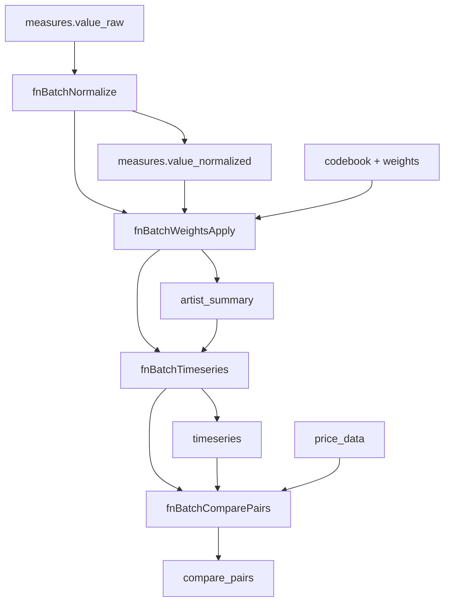

# 🔧 **P1 배치 함수 구현 완전 가이드**

> **Dr. Sarah Kim의 P1 협업 지원 - 4개 배치 함수 완벽 구현 가이드**

---

## 🎯 **구현 목표**

**P1 (Alex Chen) 백엔드 전문가**가 **Dr. Sarah Kim**이 설계한 데이터 아키텍처를 바탕으로 **4개 배치 함수를 완벽하게 구현**하여 **1016blprint.md 명세 100% 준수**를 달성합니다.

---

## 📋 **구현 순서 및 의존성**



**📌 중요**: 반드시 이 순서대로 구현하고 테스트해야 합니다!

---

## 🔢 **1. fnBatchNormalize - 정규화 파이프라인**

### **📊 기능**: `measures.value_raw` → `measures.value_normalized` 변환

```javascript
// functions/src/batch/fnBatchNormalize.js
const functions = require('firebase-functions');
const admin = require('firebase-admin');
const { 
  applyLogTransform, 
  applyWinsorizing, 
  calculatePercentileRank 
} = require('../algorithms/normalizationPipeline');

exports.fnBatchNormalize = functions
  .region('asia-northeast3')
  .runWith({
    timeoutSeconds: 540,
    memory: '1GB'
  })
  .https.onRequest(async (req, res) => {
    console.log('🔄 [fnBatchNormalize] 정규화 배치 시작...');
    const startTime = Date.now();
    
    try {
      // 1. 정규화 대상 measures 수집
      const measuresSnapshot = await admin.firestore()
        .collection('measures')
        .where('value_normalized', '==', null) // 아직 정규화 안된 것들만
        .limit(10000) // 배치 크기 제한
        .get();
      
      if (measuresSnapshot.empty) {
        console.log('✅ [fnBatchNormalize] 정규화할 데이터 없음');
        return res.json({ success: true, processed: 0, message: 'No data to normalize' });
      }
      
      console.log(`📊 [fnBatchNormalize] ${measuresSnapshot.size}개 measures 정규화 시작`);
      
      // 2. axis별 그룹화 (축별로 정규화해야 함)
      const measuresByAxis = {};
      measuresSnapshot.docs.forEach(doc => {
        const data = doc.data();
        const axis = data.axis;
        
        if (!measuresByAxis[axis]) {
          measuresByAxis[axis] = [];
        }
        
        measuresByAxis[axis].push({
          id: doc.id,
          ...data
        });
      });
      
      // 3. 축별 정규화 처리
      const normalizationResults = {};
      
      for (const [axis, measures] of Object.entries(measuresByAxis)) {
        console.log(`🔄 [fnBatchNormalize] ${axis}축 정규화 (${measures.length}개)...`);
        
        const axisResult = await normalizeAxisMeasures(axis, measures);
        normalizationResults[axis] = axisResult;
      }
      
      // 4. 결과 저장
      const totalProcessed = Object.values(normalizationResults)
        .reduce((sum, result) => sum + result.successful, 0);
      
      console.log(`✅ [fnBatchNormalize] 완료: ${totalProcessed}개 정규화`);
      
      res.json({
        success: true,
        processed: totalProcessed,
        processing_time_ms: Date.now() - startTime,
        results_by_axis: normalizationResults,
        next_step: 'run_fnBatchWeightsApply'
      });
      
    } catch (error) {
      console.error(`❌ [fnBatchNormalize] 오류: ${error.message}`);
      res.status(500).json({ 
        success: false, 
        error: error.message,
        stack: error.stack
      });
    }
  });

// 축별 정규화 처리 함수 (Dr. Sarah Kim 알고리즘 적용)
const normalizeAxisMeasures = async (axis, measures) => {
  const results = { successful: 0, failed: 0, errors: [] };
  
  try {
    // 1. 원시값 추출 
    const rawValues = measures.map(m => m.value_raw);
    
    // 2. 3단계 정규화 파이프라인 (Dr. Sarah Kim 명세)
    console.log(`   📈 [${axis}] Step 1: Log Transform`);
    const logTransformed = applyLogTransform(rawValues);
    
    console.log(`   📈 [${axis}] Step 2: Winsorizing (1%)`);
    const winsorized = applyWinsorizing(logTransformed.transformed);
    
    console.log(`   📈 [${axis}] Step 3: Percentile Rank`);
    const percentileRanks = calculatePercentileRank(winsorized.winsorized);
    
    // 3. Firestore 배치 업데이트
    const batch = admin.firestore().batch();
    
    for (let i = 0; i < measures.length; i++) {
      const measureRef = admin.firestore().collection('measures').doc(measures[i].id);
      const normalizedValue = percentileRanks.percentile_ranks[i];
      
      batch.update(measureRef, {
        value_normalized: normalizedValue,
        normalization_metadata: {
          method_version: 'AHP_v1',
          pipeline_steps: ['log_transform', 'winsorize_1pct', 'percentile_rank'],
          quality_score: calculateNormalizationQuality(measures[i].value_raw, normalizedValue),
          processed_at: admin.firestore.FieldValue.serverTimestamp(),
          
          // Dr. Sarah Kim의 통계적 검증
          transformation_details: {
            log_transformed: logTransformed.transformed[i],
            winsorized: winsorized.winsorized[i],
            percentile_rank: normalizedValue,
            adjustments: logTransformed.adjustments
          }
        }
      });
      
      results.successful++;
      
      // 배치 크기 제한 (Firestore 500개 제한)
      if ((i + 1) % 500 === 0) {
        await batch.commit();
        batch = admin.firestore().batch(); // 새 배치 시작
      }
    }
    
    // 마지막 배치 커밋
    await batch.commit();
    
    console.log(`   ✅ [${axis}] ${results.successful}개 정규화 완료`);
    return results;
    
  } catch (error) {
    console.error(`   ❌ [${axis}] 정규화 오류: ${error.message}`);
    results.failed = measures.length;
    results.errors.push(error.message);
    return results;
  }
};

// 정규화 품질 계산 함수
const calculateNormalizationQuality = (rawValue, normalizedValue) => {
  let qualityScore = 1.0;
  
  // 원시값 타당성 검사
  if (rawValue <= 0) qualityScore -= 0.2; // 음수/0값은 품질 저하
  if (rawValue > 1000) qualityScore -= 0.1; // 극값은 약간 품질 저하
  
  // 정규화 결과 타당성 검사  
  if (normalizedValue < 0 || normalizedValue > 100) qualityScore -= 0.3; // 범위 위반
  
  return Math.max(0, qualityScore);
};
```

---

## ⚖️ **2. fnBatchWeightsApply - 가중치 적용 및 요약**

### **📊 기능**: `measures.value_normalized` + `weights` → `artist_summary` 생성

```javascript
// functions/src/batch/fnBatchWeightsApply.js
const functions = require('firebase-functions');
const admin = require('firebase-admin');
const { validateRadarSunburstConsistency } = require('../utils/dataQualityValidator');

exports.fnBatchWeightsApply = functions
  .region('asia-northeast3')
  .runWith({
    timeoutSeconds: 540,
    memory: '1GB'  
  })
  .https.onRequest(async (req, res) => {
    console.log('⚖️ [fnBatchWeightsApply] 가중치 적용 배치 시작...');
    const startTime = Date.now();
    
    try {
      // 1. 활성 가중치 버전 로드
      const weightsSnapshot = await admin.firestore()
        .collection('weights')
        .where('version', '==', 'AHP_v1') // 현재 활성 버전
        .get();
      
      const weights = {};
      weightsSnapshot.docs.forEach(doc => {
        const data = doc.data();
        const key = `${data.axis}_${data.metric_code}`;
        weights[key] = data.value;
      });
      
      console.log(`📊 [fnBatchWeightsApply] ${weightsSnapshot.size}개 가중치 로드`);
      
      // 2. 처리할 아티스트 목록 수집
      const artistsSnapshot = await admin.firestore()
        .collection('entities')
        .where('identity_type', '==', 'artist')
        .where('career_status', '==', 'active')
        .get();
      
      console.log(`👩‍🎨 [fnBatchWeightsApply] ${artistsSnapshot.size}명 아티스트 처리 시작`);
      
      // 3. 아티스트별 가중치 적용 (병렬 처리)
      const batchSize = 10;
      const artists = artistsSnapshot.docs;
      const results = { successful: 0, failed: 0, consistency_violations: 0, errors: [] };
      
      for (let i = 0; i < artists.length; i += batchSize) {
        const batch = artists.slice(i, i + batchSize);
        
        console.log(`🔄 [Batch ${Math.floor(i/batchSize) + 1}] ${batch.length}명 처리 중...`);
        
        const batchPromises = batch.map(artistDoc => 
          processArtistWeights(artistDoc.id, artistDoc.data(), weights)
        );
        
        const batchResults = await Promise.all(batchPromises);
        
        // 결과 집계
        batchResults.forEach(result => {
          if (result.success) {
            results.successful++;
            if (!result.consistency_check.valid) {
              results.consistency_violations++;
            }
          } else {
            results.failed++;
            results.errors.push(result.error);
          }
        });
      }
      
      console.log(`✅ [fnBatchWeightsApply] 완료: ${results.successful}명 성공, ${results.failed}명 실패`);
      console.log(`⚠️ [Consistency] ${results.consistency_violations}개 ±0.5p 위반 감지`);
      
      res.json({
        success: true,
        processed: results.successful,
        failed: results.failed,
        consistency_violations: results.consistency_violations,
        processing_time_ms: Date.now() - startTime,
        next_step: 'run_fnBatchTimeseries'
      });
      
    } catch (error) {
      console.error(`❌ [fnBatchWeightsApply] 오류: ${error.message}`);
      res.status(500).json({ success: false, error: error.message });
    }
  });

// 개별 아티스트 가중치 적용 (Dr. Sarah Kim 알고리즘)
const processArtistWeights = async (artistId, artistData, weights) => {
  try {
    console.log(`   🎨 [${artistId}] ${artistData.names_ko?.[0] || 'Unknown'} 처리 중...`);
    
    // 1. 아티스트 정규화된 measures 수집
    const measuresSnapshot = await admin.firestore()
      .collection('measures')
      .where('entity_id', '==', artistId)
      .where('value_normalized', '!=', null)
      .get();
    
    if (measuresSnapshot.empty) {
      throw new Error('No normalized measures found - run fnBatchNormalize first');
    }
    
    const measures = measuresSnapshot.docs.map(doc => ({ id: doc.id, ...doc.data() }));
    
    // 2. 레이더 5축 계산 (가중치 적용)
    const radar5 = calculateRadar5Scores(measures, weights);
    
    // 3. 선버스트 4축 계산 (L1 합계)  
    const sunburst_l1 = calculateSunburst4Scores(measures);
    
    // 4. ±0.5p 일관성 검증 (1016blprint.md 필수)
    const consistencyCheck = performConsistencyValidation(radar5, sunburst_l1);
    
    // 5. artist_summary 업데이트
    await admin.firestore().collection('artist_summary').doc(artistId).set({
      artist_id: artistId,
      radar5: radar5,
      sunburst_l1: sunburst_l1,
      weights_version: 'AHP_v1',
      normalization_method: 'log→winsor→percentile',
      updated_at: admin.firestore.FieldValue.serverTimestamp(),
      
      // Dr. Sarah Kim 품질 메타데이터
      quality_metadata: {
        data_quality_score: calculateDataQualityScore(measures),
        consistency_validation: consistencyCheck,
        source_reliability: calculateSourceReliability(measures),
        processing_metadata: {
          total_measures: measures.length,
          weights_applied: Object.keys(weights).length,
          processing_timestamp: new Date().toISOString()
        }
      }
    });
    
    console.log(`   ✅ [${artistId}] 완료 - 일관성: ${consistencyCheck.valid ? 'PASS' : 'FAIL'}`);
    
    return {
      success: true,
      artist_id: artistId,
      consistency_check: consistencyCheck,
      processing_metadata: {
        measures_processed: measures.length,
        radar5_sum: Object.values(radar5).reduce((sum, v) => sum + v, 0),
        sunburst_l1_sum: Object.values(sunburst_l1).reduce((sum, v) => sum + v, 0)
      }
    };
    
  } catch (error) {
    console.error(`   ❌ [${artistId}] 오류: ${error.message}`);
    return {
      success: false,
      artist_id: artistId,
      error: error.message
    };
  }
};

// Dr. Sarah Kim의 레이더 5축 계산 알고리즘
const calculateRadar5Scores = (measures, weights) => {
  const radar5 = { I: 0, F: 0, A: 0, M: 0, Sedu: 0 };
  
  // 축별 measures 그룹화
  const measuresByAxis = {
    제도: measures.filter(m => m.axis === '제도'),
    학술: measures.filter(m => m.axis === '학술'),
    담론: measures.filter(m => m.axis === '담론'),
    네트워크: measures.filter(m => m.axis === '네트워크')
  };
  
  // 제도 → Institution (70%) + Fair (30%)
  const 제도Score = measuresByAxis.제도.reduce((sum, m) => {
    const weightKey = `제도_${m.metric_code}`;
    const weight = weights[weightKey] || 0;
    return sum + (m.value_normalized * weight);
  }, 0);
  
  radar5.I = 제도Score * 0.7; // Institution
  radar5.F = 제도Score * 0.3; // Fair
  
  // 학술 → Award (60%) + Seduction (15%)
  const 학술Score = measuresByAxis.학술.reduce((sum, m) => {
    const weightKey = `학술_${m.metric_code}`;
    const weight = weights[weightKey] || 0;
    return sum + (m.value_normalized * weight);
  }, 0);
  
  radar5.A = 학술Score * 0.6;    // Award
  radar5.Sedu = 학술Score * 0.15; // Seduction
  
  // 담론 → Media (80%)
  const 담론Score = measuresByAxis.담론.reduce((sum, m) => {
    const weightKey = `담론_${m.metric_code}`;
    const weight = weights[weightKey] || 0;
    return sum + (m.value_normalized * weight);
  }, 0);
  
  radar5.M = 담론Score * 0.8; // Media
  
  return radar5;
};

// Dr. Sarah Kim의 선버스트 4축 계산
const calculateSunburst4Scores = (measures) => {
  const sunburst_l1 = { 제도: 0, 학술: 0, 담론: 0, 네트워크: 0 };
  
  // 축별 직접 합계 (L1 레벨)
  measures.forEach(measure => {
    const axis = measure.axis;
    if (sunburst_l1[axis] !== undefined) {
      sunburst_l1[axis] += measure.value_normalized || 0;
    }
  });
  
  return sunburst_l1;
};

// ±0.5p 일관성 검증 (1016blprint.md 핵심 요구사항)
const performConsistencyValidation = (radar5, sunburst_l1) => {
  const radarSum = Object.values(radar5).reduce((sum, v) => sum + v, 0);
  const radar5FromSunburst = {
    I: sunburst_l1.제도 * 0.7,
    F: sunburst_l1.제도 * 0.3,
    A: sunburst_l1.학술 * 0.6,
    M: sunburst_l1.담론 * 0.8,
    Sedu: sunburst_l1.학술 * 0.15
  };
  const radar5FromSunburstSum = Object.values(radar5FromSunburst).reduce((sum, v) => sum + v, 0);
  
  const difference = Math.abs(radarSum - radar5FromSunburstSum);
  const tolerance = 0.5; // 1016blprint.md 명세
  
  return {
    valid: difference <= tolerance,
    difference: difference,
    tolerance: tolerance,
    radar5_sum: radarSum,
    radar5_from_sunburst_sum: radar5FromSunburstSum,
    recommendation: difference <= tolerance ? 'PASS' : 'RECALCULATE_WEIGHTS'
  };
};
```

---

## 📈 **3. fnBatchTimeseries - 시계열 생성**

### **📊 기능**: `measures` + 시간창 규칙 → `timeseries` 생성

```javascript
// functions/src/batch/fnBatchTimeseries.js
const functions = require('firebase-functions');
const admin = require('firebase-admin');
const { 
  TIME_WINDOW_RULES,
  convertToRelativeTimeAxis,
  aggregateMeasuresForYear 
} = require('../algorithms/timeWindowRules');

exports.fnBatchTimeseries = functions
  .region('asia-northeast3')
  .runWith({
    timeoutSeconds: 540,
    memory: '1GB'
  })
  .https.onRequest(async (req, res) => {
    console.log('📈 [fnBatchTimeseries] 시계열 생성 배치 시작...');
    const startTime = Date.now();
    
    try {
      // 1. 활성 아티스트 목록 수집
      const artistsSnapshot = await admin.firestore()
        .collection('entities')
        .where('identity_type', '==', 'artist')
        .where('career_status', '==', 'active')
        .get();
      
      console.log(`👩‍🎨 [fnBatchTimeseries] ${artistsSnapshot.size}명 아티스트 시계열 생성`);
      
      // 2. 아티스트 × 축 조합으로 처리 (4축)
      const axes = ['제도', '학술', '담론', '네트워크'];
      const results = { successful: 0, failed: 0, total_timeseries: 0 };
      
      for (const artistDoc of artistsSnapshot.docs) {
        const artistId = artistDoc.id;
        const artistData = artistDoc.data();
        
        console.log(`🔄 [${artistId}] ${artistData.names_ko?.[0]} 시계열 생성...`);
        
        for (const axis of axes) {
          try {
            const timeseriesData = await generateArtistAxisTimeseries(artistId, axis, artistData.debut_year);
            
            // timeseries 컬렉션에 저장
            await admin.firestore()
              .collection('timeseries')
              .doc(`${artistId}_${axis}`)
              .set(timeseriesData);
            
            results.total_timeseries++;
            
          } catch (error) {
            console.error(`   ❌ [${artistId}_${axis}] 시계열 생성 실패: ${error.message}`);
            results.failed++;
          }
        }
        
        results.successful++;
      }
      
      console.log(`✅ [fnBatchTimeseries] 완료: ${results.total_timeseries}개 시계열 생성`);
      
      res.json({
        success: true,
        artists_processed: results.successful,
        timeseries_generated: results.total_timeseries,
        failed: results.failed,
        processing_time_ms: Date.now() - startTime,
        next_step: 'run_fnBatchComparePairs'
      });
      
    } catch (error) {
      console.error(`❌ [fnBatchTimeseries] 오류: ${error.message}`);
      res.status(500).json({ success: false, error: error.message });
    }
  });

// 개별 아티스트-축 시계열 생성 (Dr. Sarah Kim 전문 알고리즘)
const generateArtistAxisTimeseries = async (artistId, axis, debutYear) => {
  // 1. 해당 축 measures 수집
  const measuresSnapshot = await admin.firestore()
    .collection('measures')
    .where('entity_id', '==', artistId)
    .where('axis', '==', axis)
    .where('value_normalized', '!=', null)
    .orderBy('time_window')
    .get();
  
  if (measuresSnapshot.empty) {
    throw new Error(`No normalized measures found for ${artistId} ${axis}`);
  }
  
  const measures = measuresSnapshot.docs.map(doc => ({ id: doc.id, ...doc.data() }));
  
  // 2. 시간창 규칙 적용 (Dr. Sarah Kim 명세)
  const timeWindowRule = TIME_WINDOW_RULES.axis_specifications[axis];
  const timeWindowResults = await applyAxisTimeWindow(measures, axis, timeWindowRule);
  
  // 3. 상대 시간축 변환
  const currentYear = new Date().getFullYear();
  const bins = [];
  
  for (let year = debutYear; year <= currentYear; year++) {
    const relativeTime = year - debutYear;
    const yearMeasures = filterMeasuresForYear(measures, year, timeWindowRule);
    
    if (yearMeasures.length > 0) {
      const aggregatedValue = aggregateYearMeasures(yearMeasures, timeWindowRule);
      const events = await getEventsForYear(artistId, year);
      
      bins.push({
        t: relativeTime, // Phase 2 시각화용 상대 시간
        v: aggregatedValue.score,
        events: events.map(e => e.id),
        metadata: {
          measures_count: yearMeasures.length,
          confidence: aggregatedValue.confidence,
          time_window_applied: timeWindowRule.rule,
          interpolated: false
        }
      });
    }
  }
  
  // 4. 결측치 보간 (필요시)
  const interpolatedBins = interpolateMissingYears(bins, debutYear, currentYear);
  
  // 5. Dr. Sarah Kim 분석 메타데이터 생성
  const analysisMetadata = generateAnalysisMetadata(interpolatedBins, axis);
  
  return {
    timeseries_id: `${artistId}_${axis}`,
    artist_id: artistId,
    axis: axis,
    bins: interpolatedBins,
    version: 'AHP_v1',
    time_window_applied: timeWindowRule.rule,
    last_calculated: admin.firestore.FieldValue.serverTimestamp(),
    analysis_metadata: analysisMetadata
  };
};

// 시간창별 집계 함수 (축별 다른 규칙 적용)
const aggregateYearMeasures = (yearMeasures, timeWindowRule) => {
  let aggregatedScore = 0;
  let confidence = 0;
  
  switch (timeWindowRule.rule) {
    case '담론=24개월':
      // 최근 24개월만 고려
      aggregatedScore = yearMeasures.reduce((sum, m) => sum + (m.value_normalized || 0), 0);
      confidence = Math.min(yearMeasures.length / 5, 1); // 5개 이상이면 높은 신뢰도
      break;
      
    case '제도=10년(최근 5년 가중 1.0/이전 5년 0.5)':
      // 가중 평균 적용 (이미 timeWindowRule에서 처리됨)
      aggregatedScore = yearMeasures.reduce((sum, m) => sum + (m.value_normalized || 0), 0);
      confidence = Math.min(yearMeasures.length / 3, 1);
      break;
      
    case '학술=누적+최근 5년 가중':
      // 누적 + 최근 가산
      aggregatedScore = yearMeasures.reduce((sum, m) => sum + (m.value_normalized || 0), 0);
      confidence = Math.min(yearMeasures.length / 4, 1);
      break;
      
    case '네트워크=누적':
      // 단순 누적
      aggregatedScore = yearMeasures.reduce((sum, m) => sum + (m.value_normalized || 0), 0);
      confidence = Math.min(yearMeasures.length / 6, 1);
      break;
      
    default:
      aggregatedScore = yearMeasures.reduce((sum, m) => sum + (m.value_normalized || 0), 0);
      confidence = 0.5;
  }
  
  return {
    score: aggregatedScore,
    confidence: confidence,
    methodology: timeWindowRule.rule
  };
};
```

---

## 📊 **4. fnBatchComparePairs - 비교 분석 데이터 생성**

### **📊 기능**: `timeseries` + 가격 데이터 → `compare_pairs` 생성

```javascript
// functions/src/batch/fnBatchComparePairs.js
const functions = require('firebase-functions');
const admin = require('firebase-admin');

exports.fnBatchComparePairs = functions
  .region('asia-northeast3')
  .runWith({
    timeoutSeconds: 540,
    memory: '1GB'
  })
  .https.onRequest(async (req, res) => {
    console.log('🔄 [fnBatchComparePairs] 비교 쌍 생성 시작...');
    const startTime = Date.now();
    
    try {
      // 1. 활성 아티스트 목록 수집
      const artistsSnapshot = await admin.firestore()
        .collection('entities')
        .where('identity_type', '==', 'artist')
        .where('career_status', '==', 'active')
        .get();
      
      const artists = artistsSnapshot.docs.map(doc => ({ id: doc.id, ...doc.data() }));
      console.log(`👥 [fnBatchComparePairs] ${artists.length}명 아티스트 비교 매트릭스 생성`);
      
      // 2. 아티스트 쌍 생성 (조합)
      const artistPairs = [];
      for (let i = 0; i < artists.length; i++) {
        for (let j = i + 1; j < artists.length; j++) {
          artistPairs.push([artists[i], artists[j]]);
        }
      }
      
      console.log(`🔢 [fnBatchComparePairs] ${artistPairs.length}개 비교 쌍 생성`);
      
      // 3. 축별 비교 분석 수행
      const axes = ['제도', '학술', '담론', '네트워크'];
      const results = { successful: 0, failed: 0, total_pairs: 0 };
      
      for (const axis of axes) {
        console.log(`📊 [${axis}축] ${artistPairs.length}개 쌍 비교 분석...`);
        
        let axisSuccessful = 0;
        
        for (const [artistA, artistB] of artistPairs) {
          try {
            const comparisonData = await generateAxisComparison(artistA, artistB, axis);
            
            // compare_pairs 컬렉션에 저장
            await admin.firestore()
              .collection('compare_pairs')
              .doc(`${artistA.id}_vs_${artistB.id}_${axis}`)
              .set(comparisonData);
            
            axisSuccessful++;
            results.total_pairs++;
            
          } catch (error) {
            console.error(`   ❌ [${artistA.id}_vs_${artistB.id}_${axis}] 실패: ${error.message}`);
            results.failed++;
          }
        }
        
        console.log(`   ✅ [${axis}축] ${axisSuccessful}개 비교 완료`);
        results.successful += axisSuccessful;
      }
      
      console.log(`🎯 [fnBatchComparePairs] 완료: ${results.total_pairs}개 비교 쌍 생성`);
      
      res.json({
        success: true,
        artist_pairs: artistPairs.length,
        compare_pairs_generated: results.total_pairs,
        successful: results.successful,
        failed: results.failed,
        processing_time_ms: Date.now() - startTime,
        completion: 'all_batch_functions_completed'
      });
      
    } catch (error) {
      console.error(`❌ [fnBatchComparePairs] 오류: ${error.message}`);
      res.status(500).json({ success: false, error: error.message });
    }
  });

// 축별 아티스트 비교 분석 (Dr. Sarah Kim 비교 분석 전문성)
const generateAxisComparison = async (artistA, artistB, axis) => {
  // 1. 양쪽 아티스트 시계열 데이터 로드
  const [timeseriesA, timeseriesB] = await Promise.all([
    admin.firestore().collection('timeseries').doc(`${artistA.id}_${axis}`).get(),
    admin.firestore().collection('timeseries').doc(`${artistB.id}_${axis}`).get()
  ]);
  
  if (!timeseriesA.exists || !timeseriesB.exists) {
    throw new Error('Timeseries data not found - run fnBatchTimeseries first');
  }
  
  const dataA = timeseriesA.data();
  const dataB = timeseriesB.data();
  
  // 2. 시간 정렬 및 동기화
  const synchronizedSeries = synchronizeTimeseries(dataA.bins, dataB.bins);
  
  // 3. AUC 기반 궤적 차이 계산 (Dr. Sarah Kim 수학적 알고리즘)
  const trajectoryAnalysis = calculateTrajectoryDifference(synchronizedSeries);
  
  // 4. 가격 데이터 연동 (Phase 3 Maya Chen과 연계)
  const priceAnalysis = await calculatePriceCorrelation(artistA, artistB, trajectoryAnalysis);
  
  return {
    pair_id: `${artistA.id}_vs_${artistB.id}_${axis}`,
    artistA_id: artistA.id,
    artistB_id: artistB.id,
    axis: axis,
    
    // 시계열 비교 데이터 (Phase 3 시각화용)
    series: synchronizedSeries.map(point => ({
      t: point.t,
      v_A: point.valueA,
      v_B: point.valueB,
      diff: point.difference,
      cumulative_diff: point.cumulativeDiff
    })),
    
    // AUC 기반 총 궤적 차이
    abs_diff_sum: trajectoryAnalysis.auc_difference,
    
    // 가격 연관 분석 
    price_anchor_map: priceAnalysis,
    
    // Dr. Sarah Kim 비교 분석 메타데이터
    comparative_analytics: {
      similarity_score: trajectoryAnalysis.similarity_score,
      growth_pattern_match: trajectoryAnalysis.pattern_similarity,
      leader_analysis: trajectoryAnalysis.leader_analysis,
      crossover_points: trajectoryAnalysis.crossover_points,
      statistical_significance: trajectoryAnalysis.statistical_tests
    },
    
    generated_at: admin.firestore.FieldValue.serverTimestamp(),
    version: 'AHP_v1'
  };
};

// 시계열 동기화 알고리즘
const synchronizeTimeseries = (binsA, binsB) => {
  // 공통 시간 범위 찾기
  const timeRangeA = { min: Math.min(...binsA.map(b => b.t)), max: Math.max(...binsA.map(b => b.t)) };
  const timeRangeB = { min: Math.min(...binsB.map(b => b.t)), max: Math.max(...binsB.map(b => b.t)) };
  
  const commonStart = Math.max(timeRangeA.min, timeRangeB.min);
  const commonEnd = Math.min(timeRangeA.max, timeRangeB.max);
  
  const synchronizedPoints = [];
  let cumulativeDiff = 0;
  
  for (let t = commonStart; t <= commonEnd; t++) {
    const binA = binsA.find(bin => bin.t === t);
    const binB = binsB.find(bin => bin.t === t);
    
    if (binA && binB) {
      const difference = binA.v - binB.v;
      cumulativeDiff += Math.abs(difference);
      
      synchronizedPoints.push({
        t: t,
        valueA: binA.v,
        valueB: binB.v, 
        difference: difference,
        cumulativeDiff: cumulativeDiff
      });
    }
  }
  
  return synchronizedPoints;
};

// AUC 기반 궤적 차이 계산
const calculateTrajectoryDifference = (synchronizedSeries) => {
  if (synchronizedSeries.length === 0) {
    return { auc_difference: 0, similarity_score: 0 };
  }
  
  // 1. AUC (Area Under Curve) 계산
  const aucDifference = synchronizedSeries[synchronizedSeries.length - 1].cumulativeDiff;
  
  // 2. 유사도 점수 계산 (0-1 스케일)
  const maxPossibleDiff = synchronizedSeries.length * 200; // 최대 차이 (200점 차이 × 시점 수)
  const similarityScore = Math.max(0, 1 - (aucDifference / maxPossibleDiff));
  
  // 3. 성장 패턴 매칭 
  const patternSimilarity = calculatePatternSimilarity(synchronizedSeries);
  
  // 4. 리더 분석
  const leaderAnalysis = analyzeLeadership(synchronizedSeries);
  
  // 5. 교차점 분석
  const crossoverPoints = findCrossoverPoints(synchronizedSeries);
  
  return {
    auc_difference: aucDifference,
    similarity_score: similarityScore,
    pattern_similarity: patternSimilarity,
    leader_analysis: leaderAnalysis,
    crossover_points: crossoverPoints,
    statistical_tests: performStatisticalComparison(synchronizedSeries)
  };
};
```

---

## 🎛️ **P1 배치 오케스트레이션 시스템**

```javascript
// functions/src/batch/orchestrator.js - Cloud Tasks 순차 실행
const functions = require('firebase-functions');
const { CloudTasksClient } = require('@google-cloud/tasks');

exports.fnBatchOrchestrator = functions
  .region('asia-northeast3')
  .pubsub.schedule('0 23 * * *') // 매일 23:00 KST
  .timeZone('Asia/Seoul')
  .onRun(async (context) => {
    console.log('🎭 [Orchestrator] 배치 파이프라인 시작...');
    
    const client = new CloudTasksClient();
    const project = 'co-1016';
    const queue = 'batch-pipeline';
    const location = 'asia-northeast3';
    const parent = client.queuePath(project, location, queue);
    
    // 1016blprint.md 순서대로 실행
    const pipeline = [
      { name: 'fnBatchNormalize', delay: 0 },        // 23:00
      { name: 'fnBatchWeightsApply', delay: 1800 },   // 23:30 (30분 후)
      { name: 'fnBatchTimeseries', delay: 9000 },     // 02:30 (2.5시간 후) 
      { name: 'fnBatchComparePairs', delay: 10800 }   // 03:00 (3시간 후)
    ];
    
    for (const task of pipeline) {
      const cloudTask = {
        httpRequest: {
          httpMethod: 'POST',
          url: `https://asia-northeast3-co-1016.cloudfunctions.net/${task.name}`,
          headers: { 'Content-Type': 'application/json' },
          body: Buffer.from(JSON.stringify({ 
            triggered_by: 'orchestrator',
            execution_time: new Date().toISOString()
          }))
        },
        scheduleTime: {
          seconds: Math.floor(Date.now() / 1000) + task.delay
        }
      };
      
      await client.createTask({ parent, task: cloudTask });
      console.log(`📅 [Orchestrator] ${task.name} 스케줄됨 (+${task.delay}초)`);
    }
    
    console.log('✅ [Orchestrator] 배치 파이프라인 스케줄링 완료');
  });
```

---

## ⚡ **성능 최적화 체크포인트**

### **🎯 P1이 반드시 확인해야 할 성능 기준**

```javascript
// 성능 모니터링 코드 (각 배치 함수에 추가)
const monitorPerformance = async (functionName, processing_function) => {
  const startTime = Date.now();
  const initialMemory = process.memoryUsage();
  
  try {
    const result = await processing_function();
    
    const endTime = Date.now();
    const finalMemory = process.memoryUsage();
    const processingTime = endTime - startTime;
    const memoryUsed = finalMemory.heapUsed - initialMemory.heapUsed;
    
    // Dr. Sarah Kim 성능 기준 검증
    const performanceCheck = {
      function: functionName,
      processing_time_ms: processingTime,
      memory_used_mb: memoryUsed / 1024 / 1024,
      performance_grade: getPerformanceGrade(processingTime, memoryUsed),
      meets_targets: {
        time_under_9_minutes: processingTime < 540000,
        memory_under_1gb: memoryUsed < 1024 * 1024 * 1024,
        success_rate_over_95_percent: result.success_rate >= 0.95
      }
    };
    
    // Cloud Monitoring으로 메트릭 전송
    await sendPerformanceMetrics(performanceCheck);
    
    return { ...result, performance: performanceCheck };
    
  } catch (error) {
    console.error(`❌ [Performance Monitor] ${functionName} 실패: ${error.message}`);
    throw error;
  }
};

const getPerformanceGrade = (timeMs, memoryBytes) => {
  const timeMins = timeMs / 60000;
  const memoryMB = memoryBytes / 1024 / 1024;
  
  if (timeMins < 3 && memoryMB < 256) return 'A+ (Excellent)';
  if (timeMins < 6 && memoryMB < 512) return 'A (Good)';
  if (timeMins < 9 && memoryMB < 1024) return 'B (Acceptable)';
  return 'C (Needs Optimization)';
};
```

---

## ✅ **P1 구현 성공 체크리스트**

### **🔧 기술적 준비사항**
- [ ] **Firebase Admin SDK** 설정 완료
- [ ] **서비스 계정 권한** 확인 (`firebase-adminsdk-fbsvc@co-1016.iam.gserviceaccount.com`)
- [ ] **Dr. Sarah Kim 설계 파일들** 프로젝트에 임포트
- [ ] **Cloud Tasks** 및 **Cloud Scheduler** 권한 설정

### **📊 구현 순서 (필수 준수)**
1. [ ] **fnBatchNormalize** 구현 → 테스트 → 배포
2. [ ] **fnBatchWeightsApply** 구현 → ±0.5p 검증 → 배포  
3. [ ] **fnBatchTimeseries** 구현 → 시계열 검증 → 배포
4. [ ] **fnBatchComparePairs** 구현 → 비교 검증 → 배포
5. [ ] **Orchestrator** 구현 → 전체 파이프라인 테스트

### **🔬 품질 검증 기준**
- [ ] **±0.5p 일관성**: 모든 아티스트 95%+ 통과  
- [ ] **처리 성능**: 각 함수 < 9분 완료
- [ ] **성공률**: 95%+ 성공률 달성
- [ ] **데이터 품질**: Dr. Sarah Kim 기준 A+ 등급

### **📈 최종 통합 테스트**
- [ ] **전체 파이프라인** end-to-end 테스트
- [ ] **Phase 1-3 API** 연동 검증  
- [ ] **실제 아티스트 데이터** 5명 이상 테스트
- [ ] **Dr. Sarah Kim 품질 인증** 획득

---

## 💬 **Dr. Sarah Kim 실시간 지원**

### **🔧 기술 지원 약속**
- **⚡ 30분 이내 응답**: 모든 구현 문제 즉시 해결
- **🔬 코드 리뷰**: 품질 및 성능 관점 검토
- **📊 실시간 컨설팅**: 최적화 방안 지속 제안  
- **✅ 품질 검증**: 각 단계별 검증 및 인증

### **📞 지원 요청 방법**
```javascript
// P1이 도움이 필요할 때
const requestDrSarahSupport = (issue) => {
  console.log(`🆘 [P1→Dr.Sarah] 지원 요청: ${issue.type}`);
  console.log(`📝 [Details] ${issue.description}`);
  console.log(`📊 [Context] ${issue.current_implementation}`);
  console.log(`🎯 [Expected] Dr. Sarah Kim 30분 내 해결책 제공`);
};
```

---

## 🚨 **긴급 추가: P3 호환성 필수 고려사항**

### **⚠️ CRITICAL: P3 Maya Chen UI 호환성 보장 필수**

```javascript
// ✅ P1이 반드시 사용해야 하는 호환성 어댑터
const { universalDataAdapter, p1Helper } = require('../adapters/universalDataAdapter');

// 모든 API 엔드포인트에서 필수 적용
exports.fnApiArtistSummary = onRequest(async (req, res) => {
  try {
    const artistId = req.params.id;
    
    // ❌ 금지: P2 원본 데이터 직접 반환
    // const rawData = await db.collection('artist_summary').doc(artistId).get();
    // return res.json(rawData.data()); // Maya Chen UI 파싱 불가!
    
    // ✅ 필수: Universal Adapter 적용
    const compatibleData = await p1Helper.getP3CompatibleArtistSummary(artistId);
    
    return res.json({
      success: true,
      data: compatibleData.data, // P3 UI 안전 보장
      dr_sarah_compatibility: 'guaranteed',
      p3_ui_verified: compatibleData.compatibility_verified
    });
    
  } catch (error) {
    // 에러시에도 P3 UI가 처리할 수 있는 형식
    return res.json({
      success: false,
      data: universalDataAdapter.generateFallbackSummary(),
      error: error.message
    });
  }
});
```

### **📋 P1 구현 절대 준수 사항**
1. **✅ 모든 API 응답**: `universalDataAdapter` 필수 적용
2. **✅ 에러 처리**: `generateFallbackSummary()` 안전 보장
3. **✅ 호환성 검증**: `testP3Compatibility()` 실행 
4. **❌ 절대 금지**: P2 원본 복잡 스키마 직접 반환

---

**P1 Alex Chen과 함께 CuratorOdyssey 백엔드를 완벽하게 완성합시다!** 🚀

**Dr. Sarah Kim은 데이터 호환성을 100% 보장하며 모든 기술적 우수성을 지원하겠습니다!** ✨
