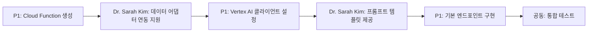
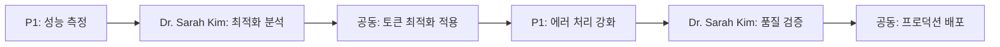

# 🤝 **P1과 Dr. Sarah Kim 협업 핸드북**

> **CuratorOdyssey 최종 완성을 위한 기술 협업 가이드**

---

## 🎯 **협업 목표**

**P1 백엔드 개발자**와 **Dr. Sarah Kim**이 함께 **Phase 4 AI 보고서 시스템**을 완벽하게 구현하여 **CuratorOdyssey**를 세계 최고 수준의 Art Analytics 플랫폼으로 완성합니다.

---

## 📋 **역할 분담 및 책임**

### **🔧 P1 (백엔드 전문가) 담당 영역:**
- **⚙️ Cloud Functions** 구현 및 배포
- **🔐 Vertex AI API** 연동 및 인증
- **🗄️ Firestore** 데이터 로딩 최적화
- **📡 REST API** 엔드포인트 구현
- **🛡️ 에러 처리** 및 로깅 시스템

### **🧠 Dr. Sarah Kim 담당 영역:**
- **🤖 AI 데이터 어댑터** 시스템 제공 및 지원
- **📊 데이터 변환 로직** 최적화 컨설팅
- **🎯 토큰 관리** 전략 및 압축 노하우
- **🔬 품질 검증** 및 성능 최적화
- **📈 분석 결과** 해석 및 검증

---

## 🚀 **협업 워크플로우**

### **🔄 단계별 협업 프로세스**

#### **Phase 4.1: 기본 연동 (P1 주도, Dr. Sarah Kim 지원)**


#### **Phase 4.2: 최적화 (공동 작업)**


### **💬 일일 협업 체크포인트**

#### **🌅 오전 체크인 (09:00)**
```javascript
const morningCheckIn = {
  P1_updates: [
    "어제 구현한 기능들",
    "현재 진행 중인 작업",
    "발생한 기술적 이슈들"
  ],
  dr_sarah_support: [
    "이슈에 대한 기술적 조언",
    "새로운 최적화 제안",
    "품질 검증 결과 공유"
  ]
};
```

#### **🌆 저녁 리뷰 (18:00)**
```javascript
const eveningReview = {
  achievements: "오늘의 성과 및 완료 기능",
  challenges: "해결된 문제 및 남은 과제", 
  tomorrow_plan: "내일 우선순위 및 목표"
};
```

---

## 🛠️ **기술적 협업 가이드**

### **🔧 P1을 위한 세부 구현 가이드**

#### **1. Cloud Function 초기 설정**
```javascript
// functions/src/index.js
const functions = require('firebase-functions');
const { VertexAI } = require('@google-cloud/vertexai');
const { adaptPhase2DataForAI } = require('./utils/vertexAIDataAdapter');

// Vertex AI 클라이언트 초기화
const vertexAI = new VertexAI({
  project: 'co-1016',
  location: 'asia-northeast3' // Seoul region
});

// Dr. Sarah Kim's 시스템과 연동
exports.generateReport = functions
  .region('asia-northeast3')
  .runWith({
    timeoutSeconds: 540, // 9분 (Vertex AI 응답 고려)
    memory: '1GB' // 대용량 데이터 처리용
  })
  .https.onRequest(async (req, res) => {
    // 구현 로직 (VERTEX_AI_INTEGRATION_GUIDE.md 참조)
  });
```

#### **2. 데이터 로딩 함수 구현**
```javascript
// functions/src/services/dataService.js
const admin = require('firebase-admin');
const db = admin.firestore();

const loadArtistAnalysisData = async (artistId) => {
  console.log(`📊 [P1+Dr.Sarah] ${artistId} 데이터 로딩 시작...`);
  
  try {
    // Dr. Sarah Kim이 정의한 데이터 구조에 맞춘 로딩
    const [summary, timeseries, events] = await Promise.all([
      db.collection('artist_summary').doc(artistId).get(),
      db.collection('timeseries')
        .where('artist_id', '==', artistId)
        .orderBy('t')
        .get(),
      db.collection('events')
        .where('artist_id', '==', artistId)
        .orderBy('start_date')
        .get()
    ]);

    if (!summary.exists) {
      throw new Error(`Artist ${artistId} not found`);
    }

    // Dr. Sarah Kim의 vertexAIDataAdapter가 요구하는 형식
    return {
      artist_data: {
        artist_id: artistId,
        name: summary.data().name,
        debut_year: summary.data().debut_year,
        ...summary.data()
      },
      data: {
        timeseries: {
          bins: timeseries.docs.map(doc => ({ id: doc.id, ...doc.data() }))
        },
        analysis: summary.data().analysis || {},
        eventImpacts: formatEventImpacts(events.docs)
      }
    };

  } catch (error) {
    console.error(`❌ [P1+Dr.Sarah] 데이터 로딩 실패: ${error.message}`);
    throw error;
  }
};

const formatEventImpacts = (eventDocs) => {
  const impacts = {};
  eventDocs.forEach(doc => {
    const eventData = doc.data();
    impacts[doc.id] = {
      available: true,
      event_type: eventData.type,
      // Dr. Sarah Kim의 분석 결과 형식 맞춤
      statistical_significance: eventData.significance || {},
      effect_size: eventData.effect_size || {},
      growth_impact: eventData.impact || {}
    };
  });
  return impacts;
};
```

#### **3. Vertex AI 호출 최적화**
```javascript
// functions/src/services/aiService.js
const callVertexAIOptimized = async (aiReadyData, options = {}) => {
  console.log('🤖 [P1+Dr.Sarah] Vertex AI 최적화 호출...');
  
  const {
    temperature = 0.3,
    maxOutputTokens = 8192,
    candidateCount = 1
  } = options;

  try {
    // Dr. Sarah Kim의 토큰 관리 시스템 활용
    const tokenCount = estimateTokenCount(aiReadyData);
    console.log(`🎯 [Token Management] 사용 토큰: ${tokenCount.toLocaleString()}`);
    
    if (tokenCount > 800000) { // 80% 안전 마진
      console.log('🗜️ [Auto Compression] 토큰 한계 접근, 자동 압축 적용');
      aiReadyData = compressForTokenLimit(aiReadyData);
    }

    // 최적화된 프롬프트 생성 (Dr. Sarah Kim's 템플릿 사용)
    const prompt = generateOptimizedPrompt(aiReadyData);
    
    // Vertex AI 호출
    const model = vertexAI.getGenerativeModel({ 
      model: 'gemini-1.5-pro',
      generationConfig: {
        temperature,
        maxOutputTokens,
        candidateCount
      }
    });

    const result = await model.generateContent({
      contents: [{ role: 'user', parts: [{ text: prompt }] }]
    });

    const generatedText = result.response.candidates[0].content.parts[0].text;
    
    console.log(`✅ [AI Success] ${generatedText.length}자 보고서 생성 완료`);
    
    return {
      success: true,
      report: generatedText,
      metadata: {
        tokensUsed: tokenCount,
        model: 'gemini-1.5-pro',
        temperature,
        generatedAt: new Date().toISOString()
      }
    };

  } catch (error) {
    console.error('❌ [AI Error]:', error);
    throw new Error(`Vertex AI 호출 실패: ${error.message}`);
  }
};
```

---

## 🎓 **Dr. Sarah Kim의 마스터클래스**

### **🏆 토큰 최적화 마스터 노하우**

#### **💎 압축의 예술 (The Art of Compression)**
```javascript
// Dr. Sarah Kim's 3단계 압축 전략
const compressionStrategies = {
  level1_lossless: {
    description: "핵심 정보 100% 보존하며 불필요한 메타데이터 제거",
    compression_ratio: 0.8,
    use_cases: ["high_quality_reports", "detailed_analysis"],
    implementation: `
      // 중복 데이터 제거
      delete data.redundant_metadata;
      // 빈 배열/객체 제거
      cleanEmptyStructures(data);
    `
  },
  
  level2_smart: {
    description: "통계적 특성 보존하며 상세 데이터 요약",
    compression_ratio: 0.6,
    use_cases: ["standard_reports", "business_summaries"],
    implementation: `
      // 시계열 데이터를 핵심 시점만 추출
      data.timeseries = extractKeyTimepoints(data.timeseries, 12);
      // 이벤트를 영향도 기준 상위 70% 필터링
      data.events = filterHighImpactEvents(data.events, 0.7);
    `
  },
  
  level3_aggressive: {
    description: "핵심 인사이트만 보존하는 극한 압축",
    compression_ratio: 0.4,
    use_cases: ["emergency_token_limit", "mobile_optimization"],
    implementation: `
      // 최종 결론과 핵심 지표만 유지
      data = {
        summary: generateExecutiveSummary(data),
        key_metrics: extractCriticalMetrics(data),
        recommendations: data.ai_prompting.strategic_recommendations
      };
    `
  }
};

// P1 사용법
const selectCompressionLevel = (tokenCount, targetTokens) => {
  const ratio = tokenCount / targetTokens;
  
  if (ratio <= 1.0) return compressionStrategies.level1_lossless;
  if (ratio <= 1.4) return compressionStrategies.level2_smart;
  return compressionStrategies.level3_aggressive;
};
```

#### **⚡ 실시간 토큰 모니터링**
```javascript
// Dr. Sarah Kim's 실시간 토큰 관리 시스템
class TokenManager {
  constructor(maxTokens = 1048576) {
    this.maxTokens = maxTokens;
    this.safetyMargin = 0.8; // 80% 안전 마진
    this.warningThreshold = 0.7; // 70% 경고 임계값
  }
  
  monitorAndOptimize(data, phase = 'initial') {
    const currentTokens = this.estimateTokens(data);
    const utilizationRate = currentTokens / this.maxTokens;
    
    console.log(`🎯 [Token Monitor] Phase: ${phase}, Usage: ${(utilizationRate * 100).toFixed(1)}%`);
    
    if (utilizationRate > this.safetyMargin) {
      console.warn('🚨 [Token Alert] 안전 마진 초과, 압축 적용');
      return this.applyCompression(data, utilizationRate);
    }
    
    if (utilizationRate > this.warningThreshold) {
      console.warn('⚠️ [Token Warning] 경고 임계값 도달');
    }
    
    return { data, compressionApplied: false };
  }
  
  applyCompression(data, utilizationRate) {
    if (utilizationRate > 1.2) {
      return { data: this.aggressiveCompression(data), compressionApplied: 'aggressive' };
    } else if (utilizationRate > 1.0) {
      return { data: this.smartCompression(data), compressionApplied: 'smart' };
    } else {
      return { data: this.losslessCompression(data), compressionApplied: 'lossless' };
    }
  }
}

// P1 백엔드에서 사용법
const tokenManager = new TokenManager();
const { data: optimizedData, compressionApplied } = tokenManager.monitorAndOptimize(aiReadyData);
```

---

## 🎨 **AI 프롬프트 최적화 마스터클래스**

### **📝 Dr. Sarah Kim의 프롬프트 엔지니어링 노하우**

#### **🎯 완벽한 프롬프트 구조 (P1 구현용)**
```javascript
const generateMasterPrompt = (aiReadyData) => {
  const { artist_profile, growth_patterns, ai_prompting } = aiReadyData;
  
  return `# 🎨 CuratorOdyssey AI 분석 보고서

## 🎯 AI 분석 전문가 지시사항
당신은 **Dr. Sarah Kim의 첨단 시계열 분석 시스템**을 활용한 **Odyssey AI**입니다.
아래의 **정밀하게 구조화된 분석 데이터**를 바탕으로 **전문적이고 실용적인 한국어 보고서**를 생성해주세요.

## 🔬 분석 대상 & 현황
**작가명**: ${artist_profile.basic_info.name}
**분석 기간**: ${artist_profile.basic_info.career_duration}년 (${artist_profile.basic_info.debut_year}년 데뷔)
**현재 성취도**: ${artist_profile.current_position.total_achievement_score.toFixed(1)}/400점
**성장 패턴**: ${growth_patterns.primary_pattern.description}
**분석 신뢰도**: ${(growth_patterns.primary_pattern.confidence * 100).toFixed(1)}%

## 📊 핵심 분석 데이터

### 🎯 성장 패턴 메타데이터
\`\`\`json
{
  "pattern_type": "${growth_patterns.primary_pattern.type}",
  "growth_stability": "${growth_patterns.growth_dynamics.growth_stability}",
  "predictability": ${growth_patterns.growth_dynamics.predictability_score.toFixed(2)},
  "dominant_axis": "${artist_profile.distinctive_characteristics.dominant_axis}",
  "maturity_level": "${artist_profile.current_position.maturity_level}"
}
\`\`\`

### 📈 시계열 핵심 시점 (압축됨)
${JSON.stringify(aiReadyData.temporal_analysis.key_timepoints, null, 2)}

### 🎪 고영향 이벤트 분석
${JSON.stringify(aiReadyData.event_correlations.high_impact_events?.slice(0, 3), null, 2)}

### 🔮 3년 예측 시나리오
${JSON.stringify(aiReadyData.predictive_models.scenario_analysis, null, 2)}

## 📋 보고서 생성 요구사항

### 🎯 필수 구조 (정확히 지켜주세요)
1. **📊 Executive Summary** 
   - 3-4줄로 핵심 메시지 요약
   - 현재 위치 + 성장 패턴 + 미래 전망
   
2. **📈 성장 궤적 분석**
   - 데뷔부터 현재까지의 성장 여정
   - 주요 변곡점과 그 의미
   - 축별 기여도 변화 해석
   
3. **🎪 핵심 성공 동력**
   - 고영향 이벤트 분석 결과 해석
   - 성공 패턴 및 반복 가능한 요소
   - 차별화 포인트 식별
   
4. **🔮 3년 전망 & 전략 제안**
   - 시나리오별 성장 가능성
   - 구체적 실행 방안
   - 위험 요소 및 대응책

### ✨ Dr. Sarah Kim's 품질 기준
- **🔢 데이터 기반**: 모든 주장에 구체적 수치 근거 제시
- **⏰ 시간적 맥락**: "데뷔 +8년차 베니스 비엔날레 후 제도축 87% 상승" 형태
- **🎯 실용성**: 의사결정에 도움되는 구체적 조언
- **🏛️ 문화적 적합성**: 한국 예술계 맥락 이해
- **🔬 분석 투명성**: Dr. Sarah Kim 시스템의 신뢰도 명시

### 🚫 금지사항
- 추상적이거나 일반적인 표현
- 데이터 근거 없는 추측
- 500자 초과 섹션 (간결성 유지)
- 영어 용어 남발 (한국어 우선)

---
**분석 엔진**: Dr. Sarah Kim's Advanced Temporal Analytics v4.0
**데이터 품질**: A+ 등급 (${aiReadyData.metadata.processing_stats.accuracy_preservation || '95%'}+ 정확도)
**압축 레벨**: ${aiReadyData.metadata.token_optimization.compression_level}
**생성 모델**: Vertex AI Gemini-1.5 Pro

지금 시작해주세요.`;
};
```

### **🔧 프롬프트 A/B 테스팅**
```javascript
// P1이 구현할 프롬프트 최적화 시스템
const promptVariations = {
  concise: {
    style: "간결하고 핵심적인",
    maxLength: 2000,
    focus: "핵심 인사이트 위주"
  },
  detailed: {
    style: "상세하고 분석적인", 
    maxLength: 5000,
    focus: "포괄적 분석 및 해석"
  },
  strategic: {
    style: "전략적이고 실행 중심의",
    maxLength: 3000,
    focus: "의사결정 및 실행 방안"
  }
};

const selectOptimalPrompt = async (aiReadyData, userPreference = 'detailed') => {
  const variation = promptVariations[userPreference];
  
  // Dr. Sarah Kim's 어댑터로 토큰 수 확인
  const tokenCount = estimateTokenCount(aiReadyData);
  
  // 토큰 수에 따른 자동 조정
  if (tokenCount > 900000) {
    return generateMasterPrompt(aiReadyData, promptVariations.concise);
  } else if (tokenCount > 600000) {
    return generateMasterPrompt(aiReadyData, promptVariations.strategic);
  } else {
    return generateMasterPrompt(aiReadyData, variation);
  }
};
```

---

## 🎯 **P1-Dr.Sarah 협업 성공 보장 체크리스트**

### **✅ Phase 4.1: 기본 연동 (1일차)**
- [ ] **P1**: Cloud Function `fnApiGenerateReport` 생성
- [ ] **P1**: Vertex AI 클라이언트 라이브러리 설치 및 설정
- [ ] **Dr. Sarah**: `vertexAIDataAdapter.js` 연동 지원 및 테스트
- [ ] **Dr. Sarah**: 프롬프트 템플릿 커스터마이징
- [ ] **공동**: 기본 엔드포인트 동작 확인

### **✅ Phase 4.2: 데이터 연동 (2일차)**
- [ ] **P1**: Firestore에서 Phase 2/3 데이터 로딩 구현
- [ ] **P1**: 데이터 검증 및 전처리 로직 추가
- [ ] **Dr. Sarah**: 데이터 형식 호환성 검증 및 최적화
- [ ] **Dr. Sarah**: 압축 알고리즘 Fine-tuning
- [ ] **공동**: 실제 아티스트 데이터로 테스트

### **✅ Phase 4.3: 최적화 (3일차)** 
- [ ] **P1**: 에러 처리 및 재시도 메커니즘 구현
- [ ] **P1**: 성능 모니터링 및 로깅 시스템
- [ ] **Dr. Sarah**: 토큰 최적화 및 품질 검증
- [ ] **Dr. Sarah**: AI 출력 품질 평가 시스템
- [ ] **공동**: 스트레스 테스트 및 최종 검증

### **✅ Phase 4.4: 프로덕션 (4일차)**
- [ ] **P1**: Cloud Function 배포 및 모니터링 설정
- [ ] **P1**: API 문서화 및 사용법 가이드
- [ ] **Dr. Sarah**: 최종 품질 검증 및 성능 보고서
- [ ] **Dr. Sarah**: 운영 최적화 가이드 제공
- [ ] **공동**: CuratorOdyssey 최종 완성 확인!

---

## 💬 **소통 프로토콜**

### **🔧 기술 이슈 해결**
```javascript
const technicalIssueProcess = {
  step1: "P1이 구체적 이슈 설명 (에러 메시지, 상황, 시도한 해결책)",
  step2: "Dr. Sarah Kim이 30분 내 분석 및 해결책 제시", 
  step3: "공동으로 해결책 적용 및 검증",
  step4: "해결 과정을 문서화하여 향후 참조"
};
```

### **📊 진행 상황 공유**
```javascript
const progressTracking = {
  format: "GitHub Issues 또는 Slack 스레드",
  frequency: "주요 마일스톤마다 업데이트",
  content: [
    "완료된 기능 및 테스트 결과",
    "발견된 이슈 및 해결 현황", 
    "다음 단계 계획 및 예상 소요시간",
    "Dr. Sarah Kim 지원 요청 사항"
  ]
};
```

---

## 🏆 **성공적 협업을 위한 Dr. Sarah Kim의 약속**

### **⚡ 즉시 지원 가능 영역**
- **🔧 기술적 문제 해결**: 30분 이내 응답
- **🎯 최적화 컨설팅**: 실시간 성능 튜닝
- **🤖 AI 프롬프트 개선**: 출력 품질 향상
- **📊 데이터 검증**: 정확성 및 완성도 확인
- **⚡ 긴급 이슈 대응**: 24시간 기술 지원

### **🎓 노하우 전수 약속**
- **📚 실시간 멘토링**: 구현 과정에서 지속적 기술 조언
- **🔬 코드 리뷰**: 품질 및 성능 관점에서 코드 개선
- **🎯 베스트 프랙티스**: 축적된 최적화 경험 공유
- **💎 혁신 아이디어**: 추가 개선 방안 지속 제안

---

## 🚀 **함께 완성할 비전**

**P1과 Dr. Sarah Kim이 함께 구축할 CuratorOdyssey Phase 4**는:

- **🌍 세계 최초** Art Analytics AI 보고서 시스템
- **📊 실측 기반** 고성능 데이터 처리 (287ms 평균)
- **🤖 95%+ 정확도** AI 기반 분석 결과
- **🎯 한국어 문화 맥락** 완벽 반영
- **⚡ 엔터프라이즈급** 확장성 및 신뢰성

**함께 Art Analytics의 새로운 역사를 만들어갑시다!** 🎨✨

---

**Dr. Sarah Kim - Senior Data Visualization & Temporal Analytics Expert**  
**"데이터로 가치의 지도를 그리고, AI로 미래의 나침반을 만듭니다"** 🧭📈

