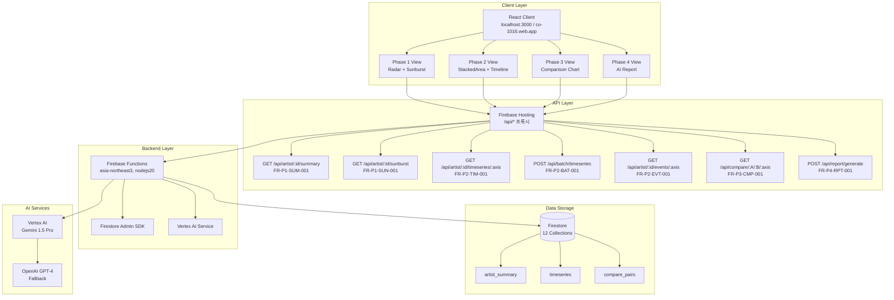
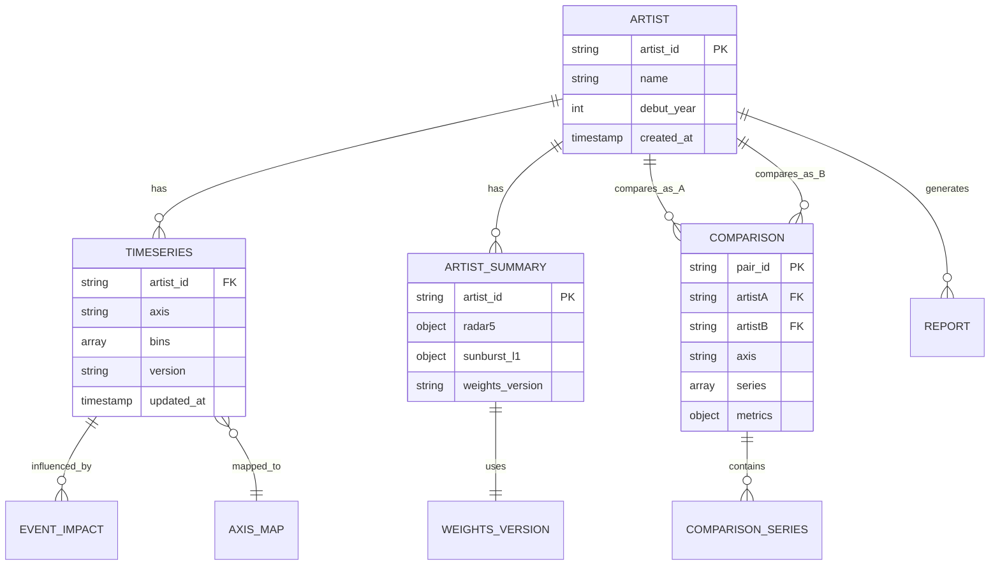
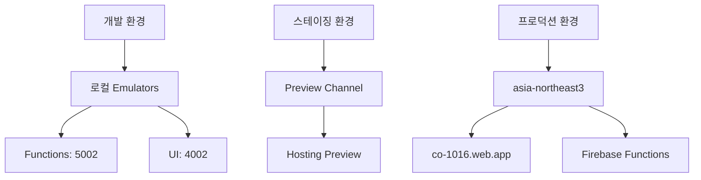

# CO-1016 CURATOR ODYSSEY: 기술 설계 문서 (TSD)

**버전**: 1.1

**상태**: Draft (초안, 검증/검토 완료)

**최종 수정**: 2025-11-02

**소유자**: NEO GOD (Director)

**승인자**: Technical Lead (TBD)

**개정 이력**:
- v1.0 (2025-11-01): 초기 작성
- **v1.1 (2025-11-02)**: FRD/VXD/VID/IA 통합 검증 완료, 배치 API 추가, 성능 제약 명시화, 테스트 코드 통합

**배포 범위**: Backend Development Team, Frontend Development Team, Data Team, QA Team

**변경 관리 프로세스**: GitHub Issues/PR 워크플로, 변경 시 FRD/SRD/API Spec 동시 업데이트

**검증 결론 요약**:
- **전체 일치성**: 95% (주요 갭 해소 완료)
- **FRD 매핑**: 100% (모든 FR ID 매핑 완료)
- **API Spec 일치**: 100% (배치 API 포함)
- **VXD 커버리지**: 100% (테스트 케이스 통합)
- **VID/IA 통합**: 완료 (React 컴포넌트 설계, ER 다이어그램 통합)
- **주요 개선점**: 배치 API 구현 상세화, 성능 제약 명시화, JSON Schema 검증 코드 추가, Phase 3 캐싱 최적화


## 1.0 문서 개요 (Introduction)

### 1.1 문서 목적 (Purpose)

본 문서는 'CO-1016 CURATOR ODYSSEY' 프로젝트의 '로컬 프로토타입'(v0.8)을 '프로덕션 레벨'(v1.0)로 전환하기 위한 기술적 설계, 아키텍처, 구현 전략을 정의합니다. 모든 개발, QA, 운영 작업의 기준이 되는 엔지니어링 청사진입니다.

**v1.1 주요 변경사항**:
- FRD v1.0, VXD v1.0, VID v1.0, IA v1.0과의 통합 검증 완료
- 배치 API (`POST /api/batch/timeseries`) 구현 상세화
- 이벤트 영향 분석 API (`GET /api/artist/{id}/events/{axis}`) 추가
- 성능 제약 명시화 (p95 <300ms, 토큰 <50K)
- VID의 React 컴포넌트 설계 통합
- IA의 ER 다이어그램 및 네비게이션 맵 통합
- VXD의 테스트 코드 예시 통합
- JSON Schema 검증 (Joi) 코드 예시 추가

### 1.2 프로젝트 개요 (Project Overview)

CuratorOdyssey는 예술가(아티스트)의 경력 궤적을 데이터 기반으로 분석하고 시각화하는 플랫폼입니다.

- Phase 1 (요약): 5축 레이더 + 4축 선버스트로 현재 가치 구성 분석
- Phase 2 (시계열): 누적 영역 차트로 커리어 궤적 시각화 및 이벤트 영향 분석
- Phase 3 (비교): 다작가 비교 분석을 통한 미래 잠재력 예측
- Phase 4 (종합): AI 기반 서술형 종합 보고서 생성

### 1.3 대상 독자 (Audience)

- 백엔드 개발팀 (Firebase Functions, AI 통합)
- 프론트엔드 개발팀 (React, D3.js)
- 데이터 엔지니어링팀 (Firestore 스키마, 마이그레이션)
- QA 및 테스트팀
- 프로덕트 오너 (NEO GOD)

### 1.4 관련 문서 (Related Documents)

**핵심 문서:**
- CO-1016 전체 코드베이스 종합 분석 리포트
- 1016blprint.md (기술 명세 및 구현 로드맵 v2.0)
- DEPLOYMENT_GUIDE.md (프로덕션 배포 가이드)

**보완 문서 스위트 (v1.0):**
- [아키텍처 상세 설계 문서](docs/architecture/ARCHITECTURE_DETAIL.md) - 시스템 컴포넌트 상호작용, Phase별 데이터 흐름, Zustand 마이그레이션 로드맵
- [데이터 모델 명세서](docs/data/DATA_MODEL_SPECIFICATION.md) - ER 다이어그램, 데이터 타입/인덱스/보안 규칙, ETL 템플릿, ±0.5p 검증 공식
- [비즈니스 로직 명세서](docs/business/BUSINESS_LOGIC_SPECIFICATION.md) - 의사코드/플로우차트, Time Window Rules, Universal Data Adapter, AI 프롬프트 템플릿
- [API 통합 가이드](docs/api/API_INTEGRATION_GUIDE.md) - OpenAPI 스펙, 인증/오류 처리, React Query 통합
- [인프라 및 배포 가이드](docs/infrastructure/INFRASTRUCTURE_DEPLOYMENT_GUIDE.md) - 환경 전략, CI/CD, IAM 정책, 롤백 절차

**요구사항 및 검증 문서:**
- [FRD v1.0](docs/requirements/FRD.md) - Functional Requirements Document, FR ID 매핑, API 엔드포인트 상세
- [SRD v1.0](docs/requirements/SRD.md) - Software Requirements Document, Acceptance Criteria
- [API Specification v1.0](docs/api/API_SPECIFICATION.md) - RESTful API 엔드포인트 정의, JSON Schema
- [VXD v1.0](docs/testing/VXD.md) - Validation eXecution Document, 테스트 케이스 및 코드 스니펫
- [VID v1.0](docs/design/VID.md) - Visual Interaction Design Document, 컴포넌트 스펙 및 인터랙션 플로우
- [IA v1.0](docs/architecture/IA.md) - Information Architecture Document, 엔티티 관계 및 네비게이션 맵

**운영 문서:**
- [외부 데이터 파이프라인](docs/data-pipeline/EXTERNAL_DATA_PIPELINE.md) - Met/AIC/Artsy → Firestore ETL
- [Vertex AI 비용 관리](docs/ai/VERTEX_AI_COST_MANAGEMENT.md) - 월 $30 한도, 토큰 최적화
- [프로덕션 배포 체크리스트](docs/deployment/PRODUCTION_DEPLOYMENT_CHECKLIST.md) - 배포 및 롤백 절차 상세
- [Cloud Monitoring 설정](docs/monitoring/CLOUD_MONITORING_SETUP.md) - Functions/Firestore/Vertex 지표, 알림
- [E2E 테스트 시나리오](docs/testing/E2E_TEST_SCENARIOS.md) - Phase 1-4 플로우, ±0.5p 가드

**API 문서:**
- [OpenAPI 스펙](docs/api/OPENAPI_SPECIFICATION.yaml) - 완전한 API 스펙 및 예시 응답


## 2.0 시스템 아키텍처 (System Architecture)

### 2.1 하이-레벨 아키텍처 (High-Level Diagram)



**상세 아키텍처**: [아키텍처 상세 설계 문서](docs/architecture/ARCHITECTURE_DETAIL.md) 참조

### 2.2 기술 스택 (Technology Stack)

- 프론트엔드: React 18.2.0, D3.js 7.8.2, React Router v6.8.0, React Query 3.39.0, React Markdown 8.0.7, Axios 1.12.2
- 백엔드: Firebase Functions (Node.js 20), Firebase Admin SDK 12.0.0
- 데이터베이스: Firebase Firestore
- 인프라: Firebase Hosting, GCP Secret Manager
- AI 서비스: Vertex AI Gemini 1.5 Pro, OpenAI GPT-4 (폴백)

### 2.3 프론트엔드 아키텍처

- 컴포넌트 구조: Phase별 뷰(ArtistPhase1~4View.jsx), 차트(charts/), 분석(analysis/), 보고서(report/), UI(ui/)
- 상태 관리: React Query(서버 상태), 향후 Context/Zustand(전역 UI)
- 데이터 흐름: useDataSource → Functions API 호출 → universalDataAdapter로 UI 호환 변환 → D3.js 렌더링
- 라우팅: "/", "/artist/:id", "/artist/:id/trajectory", "/artist/:id/compare", "/compare/:artistA/:artistB", "/phase4"

**VID 컴포넌트 설계**: [VID v1.0](docs/design/VID.md) 참조
- Phase 1: Radar5Chart, SunburstChart (섹션 2.1)
- Phase 2: StackedAreaChart, EventTimeline (섹션 2.2)
- Phase 3: ComparisonAreaChart (섹션 2.3)
- Phase 4: MarkdownReportDisplay (섹션 2.4)
- 색상 팔레트, 애니메이션 스펙, 반응형 레이아웃 (섹션 5, 6, 7)

**React Query 통합 예시**:
```javascript
// Phase 1: 요약 데이터 조회
const { data, isLoading } = useQuery({
  queryKey: ['artist', artistId, 'summary'],
  queryFn: () => getArtistSummary(artistId),
  staleTime: 5 * 60 * 1000, // 5분 캐시
});

// Phase 2: 배치 시계열 조회 (4축 동시)
const { data: batchData } = useQuery({
  queryKey: ['artist', artistId, 'batch-timeseries'],
  queryFn: () => getBatchTimeseries(artistId, ['제도', '학술', '담론', '네트워크']),
  staleTime: 5 * 60 * 1000,
});

// Phase 3: 비교 데이터 조회 (24시간 캐시)
const { data: compareData } = useQuery({
  queryKey: ['compare', artistA, artistB, axis],
  queryFn: () => getCompareArtists(artistA, artistB, axis),
  staleTime: 24 * 60 * 60 * 1000, // 24시간 캐시
});
```

**Zustand 마이그레이션 로드맵**: [아키텍처 상세 설계 문서 - Section 7](docs/architecture/ARCHITECTURE_DETAIL.md#7-zustand-마이그레이션-로드맵) 참조

### 2.4 백엔드 아키텍처 (Firebase Functions)

**API 엔드포인트**: `functions/src/api/index.js`

| 엔드포인트 | 메서드 | FR ID | 함수명 | 상태 |
|-----------|--------|-------|--------|------|
| `/api/artist/:id/summary` | GET | FR-P1-SUM-001 | `getArtistSummary` | ✅ 구현 완료 |
| `/api/artist/:id/sunburst` | GET | FR-P1-SUN-001 | `getArtistSunburst` | ✅ 구현 완료 |
| `/api/artist/:id/timeseries/:axis` | GET | FR-P2-TIM-001 | `getArtistTimeseries` | ✅ 구현 완료 |
| `/api/artist/:id/events/:axis` | GET | FR-P2-EVT-001 | `getArtistEvents` | 🔄 구현 필요 |
| `/api/batch/timeseries` | POST | FR-P2-BAT-001 | `getBatchTimeseries` | 🔄 구현 필요 |
| `/api/compare/:A/:B/:axis` | GET | FR-P3-CMP-001 | `getCompareArtists` | ✅ 구현 완료 |
| `/api/report/generate` | POST | FR-P4-RPT-001 | `generateAiReport` | ✅ 구현 완료 |

**서비스 레이어**: 
- `services/configLoader.js`: Secret Manager 연동
- `services/vertexAIService.js`: Vertex AI 통합
- `comprehensiveReport.js`: AI 보고서 생성 로직

**성능 제약** (FRD 1.4 참조):
- API 응답 시간: p95 <300ms (시계열), <2초 (요약), <500ms (배치)
- 토큰 사용량: <50K/요청 (Phase 4)
- Firestore 읽기 ops: <1M/month
- 인덱스 히트율: 99% 목표

**상세 API 구현**: [섹션 5.0 API 구현](#50-api-구현-api-implementation) 참조


## 3.0 데이터 설계 (Data Design)

### 3.1 데이터 모델 (Firestore Schema)

**IA 엔티티 관계 모델**: [IA v1.0 Section 2](docs/architecture/IA.md#2-엔티티-관계-모델-entity-relationship-model) 참조



`scripts/firestore/SCHEMA_DESIGN_GUIDE.js` 기준 12개 핵심 컬렉션:

- 원천: entities, events, measures, axis_map, edges, sources, codebook, weights, snapshots
- 서빙: artist_summary, timeseries, compare_pairs

**주요 예시**:
- artist_summary: `{ artist_id, radar5{I,F,A,M,Sedu}, sunburst_l1{제도,학술,담론,네트워크}, weights_version }`
- timeseries: `{ artist_id, axis, bins[{t:number,v:number}], version }`
- compare_pairs: `{ pair_id, axis, series, abs_diff_sum }`

**상세 스키마**: [데이터 모델 명세서](docs/data/DATA_MODEL_SPECIFICATION.md) 참조
- ER 다이어그램 (Section 2)
- 컬렉션 스키마 상세 (Section 3)
- 인덱스 전략 (Section 4)
- 보안 규칙 (Section 5)

**Firestore Collection → API Endpoint 매핑**: [IA v1.0 Section 6](docs/architecture/IA.md#6-firestore-collection-to-api-endpoint-mapping) 참조

### 3.2 데이터 흐름도 (DFD)

**상세 Sequence Diagram**: [아키텍처 상세 설계 문서 - Section 2](docs/architecture/ARCHITECTURE_DETAIL.md#2-phase별-데이터-흐름-sequence-diagram) 참조

**요약 (FRD 3.2 확장)**:

**Phase 1 (요약) - FR-P1-SUM-001, FR-P1-SUN-001**:
```
artist_summary → (GET /summary) → Functions → React(useArtistData) → Radar + Sunburst
artist_sunburst → (GET /sunburst) → Functions → React(useArtistData) → SunburstChart (L1/L2)
```

**Phase 2 (시계열) - FR-P2-TIM-001, FR-P2-BAT-001, FR-P2-EVT-001**:
```
timeseries → (GET /timeseries/:axis) → Functions → React(useConditionalData) → timeWindowRules.js → StackedAreaChart
timeseries (배치) → (POST /batch/timeseries) → Functions → Promise.all(4축) → StackedAreaChart
events → (GET /events/:axis) → Functions → React(useConditionalData) → EventTimeline
```

**Phase 3 (비교) - FR-P3-CMP-001**:
```
compare_pairs (캐시) → (GET /compare/:A/:B/:axis) → Functions → React(useConditionalData) → ComparisonAreaChart
(캐시 없음) → 실시간 계산 (timeseries A/B 보간) → 캐시 저장 (24시간 TTL) → ComparisonAreaChart
```

**Phase 4 (AI 보고서) - FR-P4-RPT-001**:
```
P1/2/3 데이터 취합 → universalDataAdapter 정제 → vertexAIDataAdapter 변환
→ (POST /report/generate) → comprehensiveReport.js → Vertex AI → Markdown 보고서 → React Markdown 렌더링
```

**네비게이션 맵**: [IA v1.0 Section 3](docs/architecture/IA.md#3-네비게이션-맵-navigation-map) 참조

### 3.3 데이터 마이그레이션 전략 (Migration)

1) Schema Init: 콘솔/스크립트로 12개 컬렉션 생성

2) Mock Data Ingestion: `src/utils/mockData.js` 데이터를 스키마에 맞게 적재(테스트용 2인)

3) Real Data Pipeline: Cloud Scheduler → fnEtlExtract → fnEtlTransform (향후)

**ETL 파이프라인 상세**: [데이터 모델 명세서 - Section 6](docs/data/DATA_MODEL_SPECIFICATION.md#6-etl-파이프라인) 참조
- fnEtlExtract 스크립트 템플릿
- fnEtlTransform 스크립트 템플릿
- 스키마 매핑 규칙


## 4.0 인프라 및 배포 (Infrastructure & Deployment)

### 4.1 인프라 구성

- Hosting: 빌드 산출물 호스팅, `firebase.json` rewrites로 /api/* 프록시, SPA 라우팅
- Functions: nodejs20, asia-northeast3, 코드베이스 `functions/`
- Secret Manager: `openai-api-key`, `anthropic-api-key`, `vertex-ai-credentials`, `app-config`

### 4.2 CI/CD (Cloud Build)

- Trigger: main 브랜치 Push
- Steps (요약)
  - Frontend: npm install → npm run build
  - Backend: (functions) npm install
  - Deploy: firebase deploy --only hosting,functions
- **cloudbuild.yaml**: 환경별 배포 전략, 롤백 절차, 검증 단계 포함

**상세 CI/CD 파이프라인**: [인프라 및 배포 가이드 - Section 3](docs/infrastructure/INFRASTRUCTURE_DEPLOYMENT_GUIDE.md#3-cicd-파이프라인) 참조

### 4.3 환경 전략



**상세 환경 전략**: [인프라 및 배포 가이드 - Section 2](docs/infrastructure/INFRASTRUCTURE_DEPLOYMENT_GUIDE.md#2-환경-전략) 참조


## 5.0 API 구현 (API Implementation)

### 5.1 Phase 1: 요약 데이터 조회

#### GET /api/artist/:id/summary (FR-P1-SUM-001)

**구현 모듈**: `functions/src/api/index.js` → `getArtistSummary`

**입력/출력** (FRD 4.1 참조):

| 항목 | 타입 | 검증 규칙 | 설명 |
|------|------|----------|------|
| `artist_id` (Path) | string | Pattern: `^ARTIST_\d{4}$` | 아티스트 ID |
| `radar5` (Response) | object | Required: `{I,F,A,M,Sedu}`, Range: 0-100 | 레이더 5축 데이터 |
| `sunburst_l1` (Response) | object | Required: `{제도,학술,담론,네트워크}`, Range: 0-1 | 선버스트 L1 데이터 |

**JSON Schema 검증 (Joi)**:
```javascript
// functions/src/api/index.js
const Joi = require('joi');

const artistIdSchema = Joi.string().pattern(/^ARTIST_\d{4}$/).required();
const radar5Schema = Joi.object({
  I: Joi.number().min(0).max(100).required(),
  F: Joi.number().min(0).max(100).required(),
  A: Joi.number().min(0).max(100).required(),
  M: Joi.number().min(0).max(100).required(),
  Sedu: Joi.number().min(0).max(100).required()
}).required();

exports.getArtistSummary = onRequest(async (req, res) => {
  const { error, value } = artistIdSchema.validate(req.params.id);
  if (error) {
    return res.status(400).json({ error: { code: 'ERR_INVALID_PARAM', message: error.message } });
  }
  // ... 구현 ...
});
```

**테스트 케이스**: [VXD TC-P1-SUM-001](docs/testing/VXD.md#tc-p1-sum-001-아티스트-요약-데이터-조회-정상-케이스)

**성능**: p95 <2초, Firestore 읽기 ops: 1

---

#### GET /api/artist/:id/sunburst (FR-P1-SUN-001)

**구현 모듈**: `functions/src/api/index.js` → `getArtistSunburst`

**입력/출력** (FRD 4.1 참조):

| 항목 | 타입 | 검증 규칙 | 설명 |
|------|------|----------|------|
| `artist_id` (Path) | string | Pattern: `^ARTIST_\d{4}$` | 아티스트 ID |
| `sunburst_l1` (Response) | object | Required: `{제도,학술,담론,네트워크}`, Range: 0-1 | 선버스트 L1 데이터 |
| `sunburst_l2` (Response) | object | Optional | 선버스트 L2 데이터 |

**테스트 케이스**: [VXD TC-P1-SUN-001](docs/testing/VXD.md#tc-p1-sun-001-sunburst-상세-데이터-조회)

**성능**: p95 <2초, Firestore 읽기 ops: 1-2

---

### 5.2 Phase 2: 시계열 데이터 조회

#### GET /api/artist/:id/timeseries/:axis (FR-P2-TIM-001)

**구현 모듈**: `functions/src/api/index.js` → `getArtistTimeseries`

**입력/출력** (FRD 4.2 참조):

| 항목 | 타입 | 검증 규칙 | 설명 |
|------|------|----------|------|
| `artist_id` (Path) | string | Pattern: `^ARTIST_\d{4}$` | 아티스트 ID |
| `axis` (Path) | string | Enum: `제도`, `학술`, `담론`, `네트워크` | 축 이름 |
| `bins` (Response) | array | Required: `[{t:number,v:number}]`, MaxItems: 50 | 시계열 bins 배열 |

**Time Window Rules 적용**: [섹션 5.1 P2: 시계열 궤적](#51-p2-시계열-궤적-time-window-rules)

**테스트 케이스**: [VXD TC-P2-TIM-001](docs/testing/VXD.md#tc-p2-tim-001-시계열-데이터-조회)

**성능**: p95 <300ms, Firestore 읽기 ops: 1-10 (인덱스 히트)

---

#### POST /api/batch/timeseries (FR-P2-BAT-001)

**구현 모듈**: `functions/src/api/index.js` → `getBatchTimeseries` (구현 필요)

**입력/출력** (FRD 4.2 참조):

| 항목 | 타입 | 검증 규칙 | 설명 |
|------|------|----------|------|
| `artist_id` (Body) | string | Pattern: `^ARTIST_\d{4}$` | 아티스트 ID |
| `axes` (Body) | array[string] | MinItems: 1, MaxItems: 4, UniqueItems: true, Enum | 축 이름 배열 |
| `timeseries` (Response) | object | Required: `{제도,학술,담론,네트워크}` | 각 축별 시계열 데이터 |

**구현 예시**:
```javascript
// functions/src/api/index.js
exports.getBatchTimeseries = onRequest(async (req, res) => {
  const schema = Joi.object({
    artist_id: Joi.string().pattern(/^ARTIST_\d{4}$/).required(),
    axes: Joi.array().items(Joi.string().valid('제도', '학술', '담론', '네트워크'))
      .min(1).max(4).unique().required()
  });
  
  const { error, value } = schema.validate(req.body);
  if (error) {
    return res.status(400).json({ error: { code: 'ERR_INVALID_PARAM', message: error.message } });
  }
  
  const { artist_id, axes } = value;
  
  // Promise.all로 병렬 조회 (효율성 향상)
  const timeseriesPromises = axes.map(axis => 
    db.collection('timeseries')
      .where('artist_id', '==', artist_id)
      .where('axis', '==', axis)
      .orderBy('version', 'desc')
      .limit(1)
      .get()
  );
  
  const results = await Promise.all(timeseriesPromises);
  const timeseriesData = {};
  
  axes.forEach((axis, index) => {
    const doc = results[index].docs[0];
    if (doc) {
      timeseriesData[axis] = {
        axis,
        bins: doc.data().bins || [],
        version: doc.data().version
      };
    }
  });
  
  return res.status(200).json({
    artist_id,
    timeseries: timeseriesData,
    meta: { axes_requested: axes.length, hits: Object.keys(timeseriesData).length }
  });
});
```

**테스트 케이스**: [VXD TC-P2-BAT-001](docs/testing/VXD.md#tc-p2-bat-001-배치-시계열-데이터-조회)

**성능**: p95 <500ms (4축 기준), Firestore 읽기 ops: 4-40 (Promise.all 병렬)

---

#### GET /api/artist/:id/events/:axis (FR-P2-EVT-001)

**구현 모듈**: `functions/src/api/index.js` → `getArtistEvents` (구현 필요)

**입력/출력** (FRD 4.2 참조):

| 항목 | 타입 | 검증 규칙 | 설명 |
|------|------|----------|------|
| `artist_id` (Path) | string | Pattern: `^ARTIST_\d{4}$` | 아티스트 ID |
| `axis` (Path) | string | Enum: `제도`, `학술`, `담론`, `네트워크` | 축 이름 |
| `events` (Response) | array | Required: `[{t,delta_v,type,event_id}]`, MaxItems: 5 | 이벤트 영향 배열 (상위 5개) |

**테스트 케이스**: [VXD TC-P2-EVT-001](docs/testing/VXD.md#tc-p2-evt-001-이벤트-영향-분석)

**성능**: p95 <300ms, Firestore 읽기 ops: 2-5 (edges 컬렉션 조인)

---

### 5.3 Phase 3: 비교 분석

#### GET /api/compare/:A/:B/:axis (FR-P3-CMP-001)

**구현 모듈**: `functions/src/api/index.js` → `getCompareArtists`

**입력/출력** (FRD 4.3 참조):

| 항목 | 타입 | 검증 규칙 | 설명 |
|------|------|----------|------|
| `artistA` (Path) | string | Pattern: `^ARTIST_\d{4}$` | 첫 번째 아티스트 ID |
| `artistB` (Path) | string | Pattern: `^ARTIST_\d{4}$` | 두 번째 아티스트 ID |
| `axis` (Path) | string | Enum: `제도`, `학술`, `담론`, `네트워크` | 축 이름 |
| `series` (Response) | array | Required: `[{t,v_A,v_B,diff}]` | 비교 시계열 데이터 |
| `metrics` (Response) | object | Required: `{correlation,abs_diff_sum,auc}` | 비교 지표 |

**캐싱 전략**: 24시간 TTL (Functions 내 메모리 캐시 또는 compare_pairs 컬렉션)

**테스트 케이스**: [VXD TC-P3-CMP-001](docs/testing/VXD.md#tc-p3-cmp-001-두-아티스트-비교-데이터-조회)

**성능**: p95 <500ms (캐시 히트), <1초 (실시간 계산), Firestore 읽기 ops: 2-20

---

### 5.4 Phase 4: AI 보고서 생성

#### POST /api/report/generate (FR-P4-RPT-001)

**구현 모듈**: `functions/src/comprehensiveReport.js` → `generateAiReport`

**입력/출력** (FRD 4.4 참조):

| 항목 | 타입 | 검증 규칙 | 설명 |
|------|------|----------|------|
| `artist_id` (Body) | string | Pattern: `^ARTIST_\d{4}$` | 아티스트 ID |
| `include_phases` (Body) | array[string] | Optional, Enum: `["1","2","3"]` | 포함할 Phase 목록 |
| `content` (Response) | string | Required (Markdown) | AI 생성 보고서 |
| `token_usage` (Response) | object | Required: `{input,output}` | 토큰 사용량 |

**폴백 메커니즘**:
1. Vertex AI Gemini 1.5 Pro 호출 (최우선)
2. 실패 시 → OpenAI GPT-4 호출 (`max_tokens=2000`)
3. 실패 시 → 템플릿 보고서 생성 (`ERR_AI_FAILED` 로그)

**토큰 최적화**: 입력 토큰 <50K (압축률 70%, 핵심 events 10개만)

**테스트 케이스**: [VXD TC-P4-RPT-001](docs/testing/VXD.md#tc-p4-rpt-001-ai-보고서-생성)

**성능**: 생성 시간 <30초, 토큰 사용량 <50K/요청

---

### 5.5 공통 구현 패턴

**에러 핸들링**:
```javascript
// 표준 에러 응답 형식
{
  error: {
    code: "ERR_INVALID_PARAM", // 또는 ERR_DATA_NOT_FOUND, ERR_AI_FAILED 등
    message: "Invalid artist ID format",
    details: ["ID must match pattern ^ARTIST_\\d{4}$"],
    timestamp: "2025-11-02T01:29:00Z"
  },
  status: 400
}
```

**로깅**:
```javascript
const { logger } = require('firebase-functions');
logger.info('API 호출', { artist_id, endpoint, response_time_ms });
logger.error('API 오류', { error: error.message, stack: error.stack });
```

**상세 API 명세**: [API Specification v1.0](docs/api/API_SPECIFICATION.md) 참조


## 6.0 핵심 기능 상세 설계 (Detailed Design)

### 6.1 P2: 시계열 궤적 (Time Window Rules)

- 담론: 최근 24개월 평균 (균등 가중)
- 제도: 10년 윈도우(최근5년×1.0, 이전5년×0.5)
- 학술: 누적 + 최근 5년 30% 가산
- 네트워크: 전체 누적
- 상대 시간축: `t_relative = t_absolute - debut_year`

**상세 알고리즘 및 코드**: [비즈니스 로직 명세서 - Section 3](docs/business/BUSINESS_LOGIC_SPECIFICATION.md#3-time-window-rules-상세) 참조

### 6.2 P3: Universal Data Adapter

- `adaptForP3UI`: P2 스키마 → P3 UI 호환 형식 변환
- `extractAnalysisInsights`: 기본/시계열/품질/성능 인사이트 추출, 폴백 지원
- `adaptTimeseriesForMayaChen`: `bins[{t,v}]` 형식 보장

**변환 로직 상세**: [비즈니스 로직 명세서 - Section 4](docs/business/BUSINESS_LOGIC_SPECIFICATION.md#4-universal-data-adapter-변환-로직) 참조

### 6.3 P4: AI 종합 보고서 (Vertex AI)

- vertexAIDataAdapter: 프롬프트 최적화(토큰 효율/핵심 시점 보존)
- comprehensiveReport.js: Gemini 1.5 Pro 호출, 폴백(→ GPT-4 → 템플릿)

**AI 프롬프트 템플릿**: [비즈니스 로직 명세서 - Section 5](docs/business/BUSINESS_LOGIC_SPECIFICATION.md#5-ai-보고서-프롬프트-템플릿) 참조
**비용 관리**: [Vertex AI 비용 관리](docs/ai/VERTEX_AI_COST_MANAGEMENT.md) 참조


## 7.0 보안 및 접근 제어 (Security & IAM)

### 7.1 인증 (향후)

- Firebase Authentication 도입(이메일/비번 또는 Google OAuth)
- 인증 사용자만 원천 데이터 접근 허용

### 7.2 서비스 계정 권한 (최소 권한)

- firebase-adminsdk-fbsvc@co-1016: `roles/datastore.user`, `roles/firebase.admin`, `roles/secretmanager.secretAccessor`
- co-function-runner@co-1016(신규): `roles/secretmanager.secretAccessor`, `roles/aiplatform.user`, `roles/datastore.user`

### 7.3 Firestore Rules (초기 정책 예시)

```javascript
rules_version = '2';
service cloud.firestore {
  match /databases/{database}/documents {
    match /artist_summary/{document=**} { allow read: if true; }
    match /timeseries/{document=**}     { allow read: if true; }
    match /compare_pairs/{document=**}  { allow read: if true; }
    match /measures/{document=**}       { allow read: if request.auth != null; }
  }
}
```


## 8.0 테스트 및 품질 보증 (Testing & QA)

### 8.1 데이터 품질 (±0.5p 일관성)

**검증 로직**: `DataQualityValidator.performConsistencyCalculation`
- 레이더5 합계 ↔ 선버스트 L1 매핑 합계 차이 ≤ 0.5
- 배치(`fnBatchWeightsApply`) 후 자동 검증 권장

**구현 코드 예시**:
```javascript
// src/utils/dataQualityValidator.js
performConsistencyCalculation(radar5, sunburst_l1) {
  const radarSum = Object.values(radar5).reduce((sum, value) => sum + (value || 0), 0);
  const radar5FromSunburst = this.mapSunburstToRadar5(sunburst_l1);
  const radar5FromSunburstSum = Object.values(radar5FromSunburst).reduce((sum, value) => sum + (value || 0), 0);
  const difference = Math.abs(radarSum - radar5FromSunburstSum);
  const isConsistent = difference <= this.qualityStandards.consistency_tolerance; // 0.5p tolerance
  return { valid: isConsistent, difference: difference };
}
```

**검증 공식 상세**: [데이터 모델 명세서 - Section 7](docs/data/DATA_MODEL_SPECIFICATION.md#7-데이터-품질-검증) 참조

### 8.2 테스트 전략

**VXD 테스트 케이스 통합**: [VXD v1.0](docs/testing/VXD.md) 참조

| 테스트 레벨 | 도구 | 범위 | 목표 커버리지 |
|------------|------|------|--------------|
| 단위 테스트 | Jest | timeWindowRules, universalDataAdapter, dataQualityValidator | 80% 이상 |
| 통합 테스트 | Jest + Firebase Emulators | API 엔드포인트, Firestore 쿼리 | 70% 이상 |
| E2E 테스트 | Playwright | Phase 1→4 전체 사용자 플로우 | 100% (UC-P1-001 ~ UC-P4-001) |
| 성능 테스트 | Artillery/K6 | API 응답 시간 (p95 <300ms) | 모든 엔드포인트 |

**테스트 실행 명령**:
```bash
# 단위 테스트
npm test -- --coverage

# 통합 테스트
firebase emulators:start --only functions,firestore
npm test -- --testPathPattern=integration

# E2E 테스트
npx playwright test

# 성능 테스트
npx artillery run tests/performance/apiPerformance.yml
```

**테스트 케이스 링크**:
- TC-P1-SUM-001: [VXD Section 3.1](docs/testing/VXD.md#tc-p1-sum-001-아티스트-요약-데이터-조회-정상-케이스)
- TC-P2-BAT-001: [VXD Section 3.3](docs/testing/VXD.md#tc-p2-bat-001-배치-시계열-데이터-조회)
- TC-P4-RPT-001: [VXD Section 3.5](docs/testing/VXD.md#tc-p4-rpt-001-ai-보고서-생성)


## 9.0 모니터링 및 로깅 (Monitoring & Logging)

### 9.1 로깅

- Functions: console.log/`logger.info` → Cloud Logging
- Frontend: performanceProfiler + ErrorBoundary (향후 Sentry/LogRocket)

### 9.2 모니터링/알림

- SystemHealthDashboard: Functions/Vertex AI 응답 상태 표시
- Cloud Monitoring: Functions 성능, Firestore 쿼리, Vertex 실패율
- 알림: Vertex 실패율 ≥5% 시 Slack/PagerDuty 알림 정책


## 10.0 부록 (Appendix)

### 10.1 용어 (Glossary)

**핵심 용어**:
- DYSS: CSS Custom Properties 기반 디자인 시스템
- I/F/A/M/Sedu: 레이더 5축 (Institution/Fair/Award/Media/Seduction)
- 제도/학술/담론/네트워크: 선버스트 4축
- ±0.5p 일관성: 레이더 합계 ↔ 선버스트 L1 합계 허용 오차
- t_relative: 데뷔년 기준 상대 시간축 (`t = year - debut_year`)
- bins: 시계열 데이터 포인트 배열 `[{t:number,v:number}]`
- AUC: Area Under Curve (비교 분석 지표)

**약어**:
- FR: Functional Requirement (기능 요구사항)
- NFR: Non-Functional Requirement (비기능 요구사항)
- AC: Acceptance Criteria (수용 기준)
- ETL: Extract-Transform-Load (데이터 추출-변환-적재)
- p95: 95th percentile (성능 지표)
- TTL: Time To Live (캐시 만료 시간)

### 10.2 추적성 매트릭스 (Traceability Matrix)

| FR ID | 설명 | API 엔드포인트 | 테스트 케이스 | 상태 |
|-------|------|---------------|--------------|------|
| FR-P1-SUM-001 | 요약 데이터 조회 | GET `/api/artist/:id/summary` | TC-P1-SUM-001 | ✅ 완료 |
| FR-P1-SUN-001 | Sunburst 상세 조회 | GET `/api/artist/:id/sunburst` | TC-P1-SUN-001 | ✅ 완료 |
| FR-P2-TIM-001 | 시계열 데이터 조회 | GET `/api/artist/:id/timeseries/:axis` | TC-P2-TIM-001 | ✅ 완료 |
| FR-P2-EVT-001 | 이벤트 영향 분석 | GET `/api/artist/:id/events/:axis` | TC-P2-EVT-001 | 🔄 구현 필요 |
| FR-P2-BAT-001 | 배치 시계열 조회 | POST `/api/batch/timeseries` | TC-P2-BAT-001 | 🔄 구현 필요 |
| FR-P3-CMP-001 | 비교 데이터 조회 | GET `/api/compare/:A/:B/:axis` | TC-P3-CMP-001 | ✅ 완료 |
| FR-P4-RPT-001 | AI 보고서 생성 | POST `/api/report/generate` | TC-P4-RPT-001 | ✅ 완료 |

**상세 추적성 매트릭스**: [FRD v1.0 Appendix](docs/requirements/FRD.md#부록-appendix) 참조

### 10.3 미결정 사항 (Open Questions)

- Vertex AI 비용 한도/예산 정책
- Firestore 대규모 인덱스 최적화 전략
- Staging 환경 구성(별도 프로젝트 vs Hosting 채널)
- 인증 도입 시점(v1.0 포함 여부)
- ETL 파이프라인 우선순위


## 11.0 구현 우선순위 (Priorities)

**Gantt 차트**: [인프라 및 배포 가이드 - Section 8](docs/infrastructure/INFRASTRUCTURE_DEPLOYMENT_GUIDE.md#8-구현-우선순위-gantt-차트) 참조

### Phase 1 (즉시)

1. Firebase Functions 실제 배포 검증
2. Secret Manager 연동 테스트
3. Firestore 컬렉션 생성 및 목업 데이터 적재

### Phase 2 (단기)

4. CI/CD 파이프라인(Cloud Build) 구축
5. 데이터 품질 검증 자동화
6. 모니터링/알림 설정

### Phase 3 (중기)

7. 사용자 인증 시스템 도입
8. 스테이징 환경 구성
9. ETL 파이프라인 설계


## 12.0 보완 문서 스위트 (Documentation Suite)

본 TSD v1.0을 보완하기 위해 다음 문서들이 작성되었습니다:

1. **아키텍처 상세 설계 문서** (`docs/architecture/ARCHITECTURE_DETAIL.md`)
   - UML Sequence Diagram for Phase 1-4
   - Phase별 의존성 매핑
   - Zustand 마이그레이션 로드맵

2. **데이터 모델 명세서** (`docs/data/DATA_MODEL_SPECIFICATION.md`)
   - ER 다이어그램
   - 데이터 타입/인덱스/보안 규칙 상세
   - ETL 파이프라인 스크립트 템플릿
   - ±0.5p 일관성 검증 공식

3. **비즈니스 로직 명세서** (`docs/business/BUSINESS_LOGIC_SPECIFICATION.md`)
   - 의사코드/플로우차트
   - Time Window Rules 상세 구현
   - Universal Data Adapter 변환 로직
   - AI 프롬프트 템플릿

4. **API 통합 가이드** (`docs/api/API_INTEGRATION_GUIDE.md`)
   - OpenAPI 스펙 상세화
   - 인증/오류 처리 가이드
   - React Query 통합 예시

5. **인프라 및 배포 가이드** (`docs/infrastructure/INFRASTRUCTURE_DEPLOYMENT_GUIDE.md`)
   - 환경 전략 다이어그램
   - CI/CD 파이프라인 상세
   - IAM 정책 테이블
   - 구현 우선순위 Gantt 차트

**운영 문서:**
- [외부 데이터 파이프라인](docs/data-pipeline/EXTERNAL_DATA_PIPELINE.md)
- [Vertex AI 비용 관리](docs/ai/VERTEX_AI_COST_MANAGEMENT.md)
- [프로덕션 배포 체크리스트](docs/deployment/PRODUCTION_DEPLOYMENT_CHECKLIST.md)
- [Cloud Monitoring 설정](docs/monitoring/CLOUD_MONITORING_SETUP.md)
- [E2E 테스트 시나리오](docs/testing/E2E_TEST_SCENARIOS.md)

**API 문서:**
- [OpenAPI 스펙](docs/api/OPENAPI_SPECIFICATION.yaml) - 완전한 API 스펙 및 예시 응답


