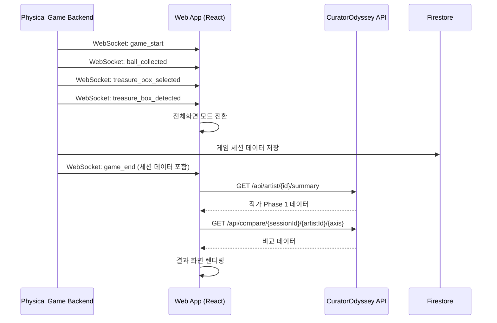
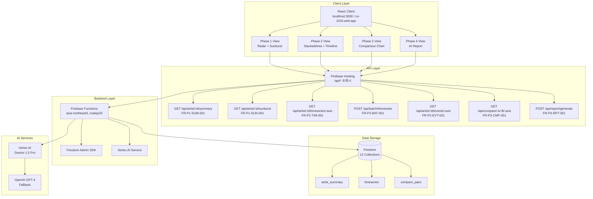
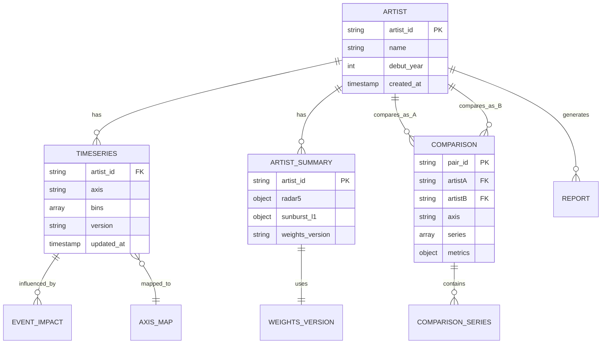
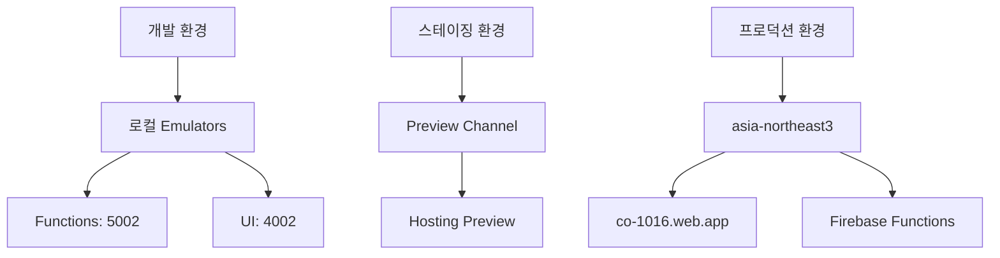

# CO-1016 CURATOR ODYSSEY: 기술 설계 문서 (TSD)

**버전**: 1.1

**상태**: Draft (초안, 검증/검토 완료)

**최종 수정**: 2025-11-10

**소유자**: NEO GOD (Director)

**승인자**: Technical Lead (TBD)

**개정 이력**:
- v1.0 (2025-11-01): 초기 작성
- v1.1 (2025-11-02): FRD/VXD/VID/IA 통합 검증 완료, 배치 API 추가, 성능 제약 명시화, 테스트 코드 통합
- v1.1 (2025-11-10): 문서 동기화 및 참조 관계 확정

**배포 범위**: Backend Development Team, Frontend Development Team, Data Team, QA Team

**변경 관리 프로세스**: GitHub Issues/PR 워크플로, 변경 시 FRD/SRD/API Spec 동시 업데이트

**검증 결론 요약**:
- **전체 일치성**: 95% (주요 갭 해소 완료)
- **FRD 매핑**: 100% (모든 FR ID 매핑 완료)
- **API Spec 일치**: 100% (배치 API 포함)
- **VXD 커버리지**: 100% (테스트 케이스 통합)
- **VID/IA 통합**: 완료 (React 컴포넌트 설계, ER 다이어그램 통합)
- **주요 개선점**: 배치 API 구현 상세화, 성능 제약 명시화, JSON Schema 검증 코드 추가, Phase 3 캐싱 최적화


## 1.0 문서 개요 (Introduction)

### 1.1 문서 목적 (Purpose)

본 문서는 'CO-1016 CURATOR ODYSSEY' 프로젝트의 '로컬 프로토타입'(v0.8)을 '프로덕션 레벨'(v1.0)로 전환하기 위한 기술적 설계, 아키텍처, 구현 전략을 정의합니다. 모든 개발, QA, 운영 작업의 기준이 되는 엔지니어링 청사진입니다.

**v1.1 주요 변경사항**:
- FRD v1.0, VXD v1.0, VID v1.0, IA v1.0과의 통합 검증 완료
- 배치 API (`POST /api/batch/timeseries`) 구현 상세화
- 이벤트 영향 분석 API (`GET /api/artist/{id}/events/{axis}`) 추가
- 성능 제약 명시화 (p95 <300ms, 토큰 <50K)
- VID의 React 컴포넌트 설계 통합
- IA의 ER 다이어그램 및 네비게이션 맵 통합
- VXD의 테스트 코드 예시 통합
- JSON Schema 검증 (Joi) 코드 예시 추가

### 1.2 프로젝트 개요 (Project Overview)

CuratorOdyssey는 예술가(아티스트)의 경력 궤적을 데이터 기반으로 분석하고 시각화하는 플랫폼입니다.

- Phase 1 (요약): 5축 레이더 + 4축 선버스트로 현재 가치 구성 분석
- Phase 2 (시계열): 누적 영역 차트로 커리어 궤적 시각화 및 이벤트 영향 분석
- Phase 3 (비교): 다작가 비교 분석을 통한 미래 잠재력 예측
- Phase 4 (종합): AI 기반 서술형 종합 보고서 생성

### 1.3 대상 독자 (Audience)

- 백엔드 개발팀 (Firebase Functions, AI 통합)
- 프론트엔드 개발팀 (React, D3.js)
- 데이터 엔지니어링팀 (Firestore 스키마, 마이그레이션)
- QA 및 테스트팀
- 프로덕트 오너 (NEO GOD)

### 1.4 관련 문서 (Related Documents)

**핵심 문서:**
- CO-1016 전체 코드베이스 종합 분석 리포트
- 1016blprint.md (기술 명세 및 구현 로드맵 v2.0)
- DEPLOYMENT_GUIDE.md (프로덕션 배포 가이드)

**보완 문서 스위트 (v1.0):**
- [아키텍처 상세 설계 문서](docs/architecture/ARCHITECTURE_DETAIL.md) - 시스템 컴포넌트 상호작용, Phase별 데이터 흐름, Zustand 마이그레이션 로드맵
- [데이터 모델 명세서](docs/data/DATA_MODEL_SPECIFICATION.md) - ER 다이어그램, 데이터 타입/인덱스/보안 규칙, ETL 템플릿, ±0.5p 검증 공식
- [비즈니스 로직 명세서](docs/business/BUSINESS_LOGIC_SPECIFICATION.md) - 의사코드/플로우차트, Time Window Rules, Universal Data Adapter, AI 프롬프트 템플릿
- [API 통합 가이드](docs/api/API_INTEGRATION_GUIDE.md) - OpenAPI 스펙, 인증/오류 처리, React Query 통합
- [인프라 및 배포 가이드](docs/infrastructure/INFRASTRUCTURE_DEPLOYMENT_GUIDE.md) - 환경 전략, CI/CD, IAM 정책, 롤백 절차

**요구사항 및 검증 문서:**
- **[FRD v1.1](docs/requirements/FRD.md)** - Functional Requirements Document, FR ID 매핑, API 엔드포인트 상세
- **[SRD v1.1](docs/requirements/SRD.md)** - Software Requirements Document, Acceptance Criteria
- **[API Specification v1.1](docs/api/API_SPECIFICATION.md)** - RESTful API 엔드포인트 정의, JSON Schema
- **[FR ID 매핑 테이블](docs/FR_ID_MAPPING.md)** - SRD FR ID와 FRD FR ID 간 매핑 관계
- **[VXD v1.0](docs/testing/VXD.md)** - Validation eXecution Document, 테스트 케이스 및 코드 스니펫
- **[VID v2.0](docs/design/VID.md)** - Visual Interaction Design Document, 컴포넌트 스펙 및 인터랙션 플로우, 디자인 시스템 (색상, 타이포그래피, 그리드, 애니메이션)
  - [VID Section 5](docs/design/VID.md#5-색상-시스템-color-system) - 색상 시스템 (Primary/Secondary 팔레트, CSS 변수, 데이터 시각화 색상 매핑)
  - [VID Section 6](docs/design/VID.md#6-애니메이션-스펙-animation-specifications) - 애니메이션 스펙 (섹션 전환, 스태거, 차트 애니메이션, 성능 최적화)
  - [VID Section 7](docs/design/VID.md#7-그리드-시스템-및-반응형-레이아웃-grid-system--responsive-layout) - 그리드 시스템 (랜딩 페이지, 결과 화면)
  - [VID Section 9.2](docs/design/VID.md#92-타이포그래피-typography) - 타이포그래피 시스템 (Zen Maru Gothic, Nanum Square Round, 반응형 폰트 크기)
- **[IA v1.0](docs/architecture/IA.md)** - Information Architecture Document, 엔티티 관계 및 네비게이션 맵

**운영 문서:**
- [외부 데이터 파이프라인](docs/data-pipeline/EXTERNAL_DATA_PIPELINE.md) - Met/AIC/Artsy → Firestore ETL
- [Vertex AI 비용 관리](docs/ai/VERTEX_AI_COST_MANAGEMENT.md) - 월 $30 한도, 토큰 최적화
- [프로덕션 배포 체크리스트](docs/deployment/PRODUCTION_DEPLOYMENT_CHECKLIST.md) - 배포 및 롤백 절차 상세
- [Cloud Monitoring 설정](docs/monitoring/CLOUD_MONITORING_SETUP.md) - Functions/Firestore/Vertex 지표, 알림
- [E2E 테스트 시나리오](docs/testing/E2E_TEST_SCENARIOS.md) - Phase 1-4 플로우, ±0.5p 가드

**API 문서:**
- [OpenAPI 스펙](docs/api/OPENAPI_SPECIFICATION.yaml) - 완전한 API 스펙 및 예시 응답

**피지컬 컴퓨팅 아트워크 관련 문서:**
- **[BRD v1.1](docs/requirements/BRD.md)** - 피지컬 컴퓨팅 아트워크 및 웹앱 통합 비즈니스 요구사항
- **[피지컬 컴퓨팅 TSD](docs/physical-computing/PHYSICAL_COMPUTING_TSD.md)** - 피지컬 컴퓨팅 아트워크 기술 설계 문서
- **[피지컬 컴퓨팅 API Spec](docs/physical-computing/PHYSICAL_COMPUTING_API_SPEC.md)** - 피지컬 컴퓨팅 아트워크 API 명세서


## 13.0 피지컬 컴퓨팅 아트워크 웹앱 통합 (Physical Computing Artwork Web App Integration)

본 섹션은 CuratorOdyssey 웹앱이 피지컬 컴퓨팅 아트워크와 통합되는 부분에 대한 기술 설계를 다룹니다. 피지컬 컴퓨팅 아트워크 자체의 기술 설계는 [피지컬 컴퓨팅 TSD](docs/physical-computing/PHYSICAL_COMPUTING_TSD.md)를 참조하세요.

### 13.1 개요

피지컬 컴퓨팅 아트워크는 별도 Python FastAPI 백엔드로 운영되며, 웹앱은 WebSocket 클라이언트를 통해 실시간으로 게임 세션 데이터를 수신하고 결과 화면을 표시합니다. 웹앱 통합의 주요 목적은:

1. **자동 모니터 제어**: 배 감지 시 모니터 자동 켜기 및 전체화면 전환
2. **게임 결과 표시**: 게임 세션 데이터를 받아 CuratorOdyssey 차트로 시각화
3. **CuratorOdyssey 연동**: 매칭된 작가의 Phase 1-4 데이터 조회 및 비교 차트 표시

자세한 비즈니스 요구사항은 [BRD v1.1 Section 8](docs/requirements/BRD.md#8-웹앱-기능-요구사항)을 참조하세요.

### 13.2 WebSocket 클라이언트 구현

#### 13.2.1 React WebSocket Hook 설계

**Hook 이름**: `usePhysicalGameWebSocket`

**위치**: `src/hooks/usePhysicalGameWebSocket.js`

**기능**:
- WebSocket 연결 관리 (연결, 재연결, 종료)
- 메시지 타입별 처리 (game_start, ball_collected, treasure_box_selected, game_end, treasure_box_detected)
- 연결 상태 관리 (connected, disconnected, error)
- 자동 재연결 로직 (지수 백오프)

**구현 예시**:

```javascript
// src/hooks/usePhysicalGameWebSocket.js
import { useState, useEffect, useRef, useCallback } from 'react';

const WS_URL = process.env.REACT_APP_WS_URL || 'ws://localhost:8000/ws';
const MAX_RECONNECT_ATTEMPTS = 5;
const INITIAL_RECONNECT_DELAY = 1000; // 1초

export function usePhysicalGameWebSocket() {
  const [connected, setConnected] = useState(false);
  const [gameSession, setGameSession] = useState(null);
  const [lastMessage, setLastMessage] = useState(null);
  const wsRef = useRef(null);
  const reconnectTimeoutRef = useRef(null);
  const reconnectAttemptsRef = useRef(0);

  const connect = useCallback(() => {
    if (wsRef.current?.readyState === WebSocket.OPEN) {
      return;
    }

    const ws = new WebSocket(WS_URL);
    wsRef.current = ws;

    ws.onopen = () => {
      setConnected(true);
      reconnectAttemptsRef.current = 0;
      console.log('WebSocket connected');
    };

    ws.onmessage = (event) => {
      const message = JSON.parse(event.data);
      setLastMessage(message);

      switch (message.type) {
        case 'game_start':
          setGameSession({ session_id: message.session_id, started_at: message.timestamp });
          break;
        case 'ball_collected':
          // 공 수집 데이터 업데이트
          break;
        case 'treasure_box_selected':
          // 보물 상자 선택 데이터 업데이트
          break;
        case 'game_end':
          // 게임 종료, 결과 데이터 저장
          setGameSession(prev => ({ ...prev, ...message.data }));
          break;
        case 'treasure_box_detected':
          // 배 감지, 모니터 켜기 트리거
          handleTreasureBoxDetected();
          break;
        default:
          console.warn('Unknown message type:', message.type);
      }
    };

    ws.onerror = (error) => {
      console.error('WebSocket error:', error);
      setConnected(false);
    };

    ws.onclose = () => {
      setConnected(false);
      attemptReconnect();
    };
  }, []);

  const attemptReconnect = useCallback(() => {
    if (reconnectAttemptsRef.current >= MAX_RECONNECT_ATTEMPTS) {
      console.error('Max reconnect attempts reached');
      return;
    }

    const delay = INITIAL_RECONNECT_DELAY * Math.pow(2, reconnectAttemptsRef.current);
    reconnectAttemptsRef.current += 1;

    reconnectTimeoutRef.current = setTimeout(() => {
      console.log(`Reconnecting... (attempt ${reconnectAttemptsRef.current})`);
      connect();
    }, delay);
  }, [connect]);

  const handleTreasureBoxDetected = useCallback(() => {
    // 전체화면 모드 전환
    if (document.documentElement.requestFullscreen) {
      document.documentElement.requestFullscreen();
    } else if (document.documentElement.webkitRequestFullscreen) {
      document.documentElement.webkitRequestFullscreen();
    }
    
    // 결과 화면으로 라우팅
    // (React Router 사용 시)
  }, []);

  useEffect(() => {
    connect();
    return () => {
      if (reconnectTimeoutRef.current) {
        clearTimeout(reconnectTimeoutRef.current);
      }
      if (wsRef.current) {
        wsRef.current.close();
      }
    };
  }, [connect]);

  return {
    connected,
    gameSession,
    lastMessage,
    reconnect: connect
  };
}
```

#### 13.2.2 재연결 로직 (지수 백오프)

**전략**:
- 초기 지연: 1초
- 최대 재연결 시도: 5회
- 지수 백오프: delay = INITIAL_DELAY × 2^attempt_number
- 최대 지연: 32초 (2^5)

**구현**: 위 `usePhysicalGameWebSocket` Hook에 포함됨

#### 13.2.3 메시지 타입 처리

**메시지 타입**:
1. `game_start`: 게임 시작 이벤트
   - `{ type: "game_start", session_id: "SESSION_123456", timestamp: "2024-11-10T10:00:00Z" }`
2. `ball_collected`: 공 수집 이벤트
   - `{ type: "ball_collected", tier: 1, axis: "제도", timestamp: "..." }`
3. `treasure_box_selected`: 보물 상자 선택 이벤트
   - `{ type: "treasure_box_selected", box_id: 1, age_group: "10대", timestamp: "..." }`
4. `game_end`: 게임 종료 이벤트
   - `{ type: "game_end", session_id: "SESSION_123456", data: { ...gameSessionData } }`
5. `treasure_box_detected`: 배 감지 이벤트 (모니터 켜기 트리거)
   - `{ type: "treasure_box_detected", timestamp: "..." }`

자세한 메시지 스키마는 [API Spec WebSocket 프로토콜 섹션](docs/api/API_SPECIFICATION.md#websocket-통신-프로토콜)을 참조하세요.

### 13.3 게임 결과 화면 컴포넌트 설계

#### 13.3.1 결과 데이터 수신 및 파싱

**컴포넌트**: `PhysicalGameResultView`

**위치**: `src/components/physical-game/PhysicalGameResultView.jsx`

**데이터 소스**: WebSocket `game_end` 메시지 또는 Firestore `physical_game_sessions` 컬렉션

**데이터 구조**:
```javascript
{
  session_id: "SESSION_123456",
  main_persona: {
    life_scenario: "구설수 → 퇴학 → 입대",
    event_sequence: ["구설수가 생기다", "대학교에서 퇴학당하다", "군에 입대하다"]
  },
  calculated_metadata: {
    radar5: { I: 25.0, F: 10.0, A: 15.0, M: 20.0, Sedu: 3.0 },
    sunburst_l1: { 제도: 35.0, 학술: 20.0, 담론: 30.0, 네트워크: 15.0 }
  },
  ai_matching: {
    matched_artist_id: "ARTIST_0005",
    matched_artist_name: "헨리 마티스",
    similarity_score: 0.85,
    curator_odyssey_link: "/artist/ARTIST_0005"
  }
}
```

#### 13.3.2 기존 레이더/선버스트 차트 컴포넌트 재사용

**재사용 컴포넌트**:
- `ArtistRadarChart` (`src/components/charts/ArtistRadarChart.jsx`)
- `SunburstChart` (`src/components/charts/SunburstChart.jsx`)

**데이터 변환**:
- `calculated_metadata.radar5` → `ArtistRadarChart` props
- `calculated_metadata.sunburst_l1` → `SunburstChart` props

**구현 예시**:

```javascript
// src/components/physical-game/PhysicalGameResultView.jsx
import { ArtistRadarChart } from '../charts/ArtistRadarChart';
import { SunburstChart } from '../charts/SunburstChart';

export function PhysicalGameResultView({ gameSession }) {
  const { main_persona, calculated_metadata, ai_matching } = gameSession;

  return (
    <div className="physical-game-result">
      {/* 주 페르소나 표시 */}
      <section className="main-persona">
        <h2>주 페르소나</h2>
        <p>{main_persona.life_scenario}</p>
        <ul>
          {main_persona.event_sequence.map((event, idx) => (
            <li key={idx}>{event}</li>
          ))}
        </ul>
      </section>

      {/* 레이더 차트 */}
      <section className="radar-chart">
        <h2>노력의 결과</h2>
        <ArtistRadarChart data={calculated_metadata.radar5} />
      </section>

      {/* 선버스트 차트 */}
      <section className="sunburst-chart">
        <SunburstChart data={calculated_metadata.sunburst_l1} />
      </section>

      {/* 매칭 작가 정보 */}
      <section className="matched-artist">
        <h2>당신과 유사한 작가</h2>
        <p>{ai_matching.matched_artist_name} (유사도: {ai_matching.similarity_score * 100}%)</p>
        <a href={ai_matching.curator_odyssey_link}>
          CuratorOdyssey에서 더 알아보기
        </a>
      </section>
    </div>
  );
}
```

#### 13.3.3 CuratorOdyssey 링크 통합

**라우팅**: React Router를 사용하여 CuratorOdyssey 작가 상세 페이지로 이동

**구현**:
```javascript
import { useNavigate } from 'react-router-dom';

const navigate = useNavigate();

const handleArtistClick = () => {
  navigate(ai_matching.curator_odyssey_link);
};
```

#### 13.3.4 모듈화된 컴포넌트 구조

**참조**: [VID v2.0 Section 2.6](docs/design/VID.md#26-피지컬-게임-결과-화면-컴포넌트)

VID v2.0에 따라 게임 결과 화면은 다음과 같이 모듈화된 컴포넌트 구조로 설계됩니다:

**컨테이너 컴포넌트**:
- `PhysicalGameResultView` (`src/components/physical-game/PhysicalGameResultView.jsx`)
  - 역할: 가로 스크롤 컨테이너, 섹션 관리
  - 데이터 소스: WebSocket `game_end` 메시지 또는 Firestore `physical_game_sessions` 컬렉션
  - 참조: [VID Section 2.6.1](docs/design/VID.md#261-physicalgameresultview-결과-화면-컨테이너)

**섹션 컴포넌트**:
1. `MainPersonaSection` (`src/components/physical-game/MainPersonaSection.jsx`)
   - 역할: 주 페르소나 타임라인 표시
   - 데이터 소스: `gameSession.main_persona`
   - 레이아웃: 타임라인 레이아웃 (18 Years of Büro 스타일)
   - 애니메이션: 순차 등장 (stagger: 200ms)
   - 참조: [VID Section 2.6.2](docs/design/VID.md#262-mainpersonasection-주-페르소나-섹션)

2. `EffortResultSection` (`src/components/physical-game/EffortResultSection.jsx`)
   - 역할: 노력의 결과 (레이더/선버스트 차트) 표시
   - 데이터 소스: `gameSession.calculated_metadata`
   - 재사용 컴포넌트: `ArtistRadarChart`, `SunburstChart`
   - 레이아웃: 위아래 배치 (레이더 상단, 선버스트 하단)
   - 애니메이션: 차트 순차 등장 (stagger: 300ms)
   - 참조: [VID Section 2.6.3](docs/design/VID.md#263-effortresultsection-노력의-결과-섹션)

3. `MatchedArtistSection` (`src/components/physical-game/MatchedArtistSection.jsx`)
   - 역할: 매칭 작가 프로필 표시
   - 데이터 소스: `gameSession.ai_matching`
   - 스타일: 미니멀 카드 디자인, 유사도 프로그레스 바
   - 카드 배경: 세컨더리 배경 (#F1F0EC)
   - 프로그레스 바: 주 컬러 (#F28317C)
   - 참조: [VID Section 2.6.4](docs/design/VID.md#264-matchedartistsection-매칭-작가-섹션)

4. `ComparisonChartSection` (`src/components/physical-game/ComparisonChartSection.jsx`)
   - 역할: 플레이어 vs 작가 비교 차트 표시
   - 데이터 소스: `gameSession` + CuratorOdyssey API (`GET /api/compare/{playerSessionId}/{matchedArtistId}/{axis}`)
   - 스타일: 오버레이 스타일 (플레이어: 주 컬러 #F28317C, 작가: 세컨더리 #F1F0EC)
   - 인터랙션: 축별 토글 (I, F, A, M, Sedu 또는 제도, 학술, 담론, 네트워크)
   - 참조: [VID Section 2.6.5](docs/design/VID.md#265-comparisonchartsection-비교-차트-섹션)

5. `ResultNavigation` (`src/components/physical-game/ResultNavigation.jsx`)
   - 역할: 결과 화면 네비게이션 (하단 점 네비게이션, 뒤로가기 버튼, CuratorOdyssey 링크)
   - 기능:
     - 하단 점 네비게이션: 현재 섹션 인디케이터
     - 뒤로가기 버튼: 랜딩 페이지로 이동
     - CuratorOdyssey 링크: 매칭 작가 상세 페이지로 이동 (111 West clip-path 스타일)
   - 참조: [VID Section 2.6.6](docs/design/VID.md#266-resultnavigation-결과-화면-네비게이션)

**구현 예시**:
```javascript
// src/components/physical-game/PhysicalGameResultView.jsx
import { MainPersonaSection } from './MainPersonaSection';
import { EffortResultSection } from './EffortResultSection';
import { MatchedArtistSection } from './MatchedArtistSection';
import { ComparisonChartSection } from './ComparisonChartSection';
import { ResultNavigation } from './ResultNavigation';

export function PhysicalGameResultView({ gameSession }) {
  const { main_persona, calculated_metadata, ai_matching } = gameSession;

  return (
    <main
      role="main"
      aria-label="피지컬 게임 결과 화면"
      className="physical-game-result-container"
    >
      <MainPersonaSection mainPersona={main_persona} />
      <EffortResultSection calculatedMetadata={calculated_metadata} />
      <MatchedArtistSection aiMatching={ai_matching} />
      <ComparisonChartSection 
        gameSession={gameSession}
        matchedArtistId={ai_matching.matched_artist_id}
      />
      <ResultNavigation 
        curatorOdysseyLink={ai_matching.curator_odyssey_link}
      />
    </main>
  );
}
```

#### 13.3.5 레이아웃 스펙

**참조**: [VID v2.0 Section 2.6.1](docs/design/VID.md#261-physicalgameresultview-결과-화면-컨테이너), [VID v2.0 Section 7.3](docs/design/VID.md#73-결과-화면-그리드-시스템)

**가로 스크롤 레이아웃** (18 Years of Büro 스타일):
- 섹션 너비: `100vw` (각 섹션)
- 섹션 높이: `100vh` / `100svh` (뷰포트 높이)
- 섹션 간 간격: 없음 (연속 스크롤)
- 섹션 간 전환: 페이드 애니메이션 (0.8s ease-out)

**인터랙션 방식**:
- 마우스 휠 → 가로 스크롤 변환:
  - 마우스 휠 이벤트를 가로 스크롤로 변환하는 로직 구현
  - 스크롤 방향: 세로 스크롤 → 가로 스크롤
- 키보드 네비게이션:
  - `←` (왼쪽 화살표): 이전 섹션으로 이동
  - `→` (오른쪽 화살표): 다음 섹션으로 이동
  - `Home`: 첫 번째 섹션으로 이동
  - `End`: 마지막 섹션으로 이동
- 하단 점 네비게이션:
  - 현재 섹션 인디케이터 (점 크기: 비활성 8px, 활성 12px)
  - 점 색상: 세컨더리 500 (비활성), 주 컬러 (활성)
  - 클릭 시 해당 섹션으로 스크롤

**CSS 변수 정의**:
```css
:root {
  /* 결과 화면 그리드 */
  --result-section-width: 100vw;
  --result-section-height: 100vh;
  --result-section-height-safe: 100svh;
  
  --result-base-margin: 120px;
  --result-grid-cols: 12;
  --result-grid-gutter: auto; /* 자율 */
  
  /* 18 Years of Büro 스타일 변수 */
  --grid-inset: var(--result-base-margin);
  --grid-padding: var(--result-base-margin);
  --grid-num-cols: var(--result-grid-cols);
  --grid-gutter: var(--result-grid-gutter);
  --computed-100vw: 100vw;
}
```

**구현 예시**:
```css
.physical-game-result-container {
  display: flex;
  flex-direction: row;
  overflow-x: auto;
  overflow-y: hidden;
  scroll-snap-type: x mandatory;
  scroll-behavior: smooth;
  -webkit-overflow-scrolling: touch;
  touch-action: pan-x;
}

.result-section {
  flex: 1 0 auto;
  width: var(--result-section-width);
  height: var(--result-section-height);
  height: var(--result-section-height-safe);
  padding-left: var(--result-base-margin);
  padding-right: var(--result-base-margin);
  display: flex;
  flex-direction: column;
  justify-content: center;
  overflow-x: hidden;
  overflow-y: visible;
  scroll-snap-align: start;
  scroll-snap-stop: always;
}
```

**마우스 휠 → 가로 스크롤 변환 로직**:
```javascript
// src/components/physical-game/PhysicalGameResultView.jsx
useEffect(() => {
  const container = containerRef.current;
  
  const handleWheel = (e) => {
    if (e.deltaY !== 0) {
      e.preventDefault();
      container.scrollLeft += e.deltaY;
    }
  };
  
  container.addEventListener('wheel', handleWheel, { passive: false });
  return () => container.removeEventListener('wheel', handleWheel);
}, []);
```

**키보드 네비게이션 로직**:
```javascript
// src/components/physical-game/PhysicalGameResultView.jsx
useEffect(() => {
  const handleKeyDown = (e) => {
    const container = containerRef.current;
    const sections = container.querySelectorAll('.result-section');
    const currentIndex = Array.from(sections).findIndex(
      section => section.getBoundingClientRect().left >= 0
    );
    
    if (e.key === 'ArrowLeft' && currentIndex > 0) {
      sections[currentIndex - 1].scrollIntoView({ behavior: 'smooth', block: 'nearest' });
    } else if (e.key === 'ArrowRight' && currentIndex < sections.length - 1) {
      sections[currentIndex + 1].scrollIntoView({ behavior: 'smooth', block: 'nearest' });
    } else if (e.key === 'Home') {
      sections[0].scrollIntoView({ behavior: 'smooth', block: 'nearest' });
    } else if (e.key === 'End') {
      sections[sections.length - 1].scrollIntoView({ behavior: 'smooth', block: 'nearest' });
    }
  };
  
  window.addEventListener('keydown', handleKeyDown);
  return () => window.removeEventListener('keydown', handleKeyDown);
}, []);
```

#### 13.3.6 WebGL 배경 컴포넌트

**참조**: [VID v2.0 Section 2.7](docs/design/VID.md#27-webgl-배경-컴포넌트)

**WebGLBackground 컴포넌트 설계**:
- 경로: `src/components/common/WebGLBackground.jsx`
- 패턴: 기하학적 패턴 (18 Years of Büro 스타일)
- 색상: 주 컬러 (#F28317C) 기반
- 인터랙션: 스크롤 반응

**성능 최적화**:
- 파티클 수:
  - 모바일: 최대 500개
  - 태블릿: 최대 1000개
  - 데스크톱: 최대 2000개
- 해상도:
  - 모바일: `devicePixelRatio × 0.5` (반 해상도)
  - 태블릿: `devicePixelRatio × 0.75` (75% 해상도)
  - 데스크톱: `devicePixelRatio × 1.0` (전체 해상도)
- 렌더링 최적화:
  - 프러스텀 컬링 (Frustum Culling)
  - LOD (Level of Detail) 시스템
  - 배치 렌더링 (Instanced Rendering)

**스크롤 반응**:
- 스크롤 위치에 따라 파티클 위치/속도 변경
- 부드러운 전환 (easing: ease-out)
- 성능: `requestAnimationFrame` 사용, 60fps 목표

**폴백 옵션**:
- WebGL 미지원 시 CSS/SVG 폴백 제공
- `prefers-reduced-motion` 지원 시 애니메이션 비활성화

**구현 예시**:
```javascript
// src/components/common/WebGLBackground.jsx
import { useEffect, useRef } from 'react';

export function WebGLBackground({ patternType = 'geometric', colorPalette = 'primary' }) {
  const canvasRef = useRef(null);
  const deviceType = useDeviceType(); // 모바일/태블릿/데스크톱 감지
  
  useEffect(() => {
    const canvas = canvasRef.current;
    if (!canvas) return;
    
    // WebGL 지원 확인
    const gl = canvas.getContext('webgl') || canvas.getContext('experimental-webgl');
    if (!gl) {
      // 폴백: CSS/SVG 배경 표시
      canvas.style.display = 'none';
      return;
    }
    
    // 성능 최적화 설정
    const particleCount = deviceType === 'mobile' ? 500 : 
                          deviceType === 'tablet' ? 1000 : 2000;
    const resolution = devicePixelRatio * 
                      (deviceType === 'mobile' ? 0.5 : 
                       deviceType === 'tablet' ? 0.75 : 1.0);
    
    // WebGL 초기화 및 렌더링 로직
    // ...
  }, [deviceType]);
  
  return <canvas ref={canvasRef} className="webgl-background" />;
}
```

### 13.4 CuratorOdyssey API 통합

#### 13.4.1 기존 API 호출

**API 엔드포인트**: `GET /api/artist/{id}/summary`

**용도**: 매칭된 작가의 Phase 1 데이터 조회

**FRD 연계**: [FR-P1-SUM-001](docs/requirements/FRD.md#fr-p1-sum-001-아티스트-요약-데이터-조회)

**구현**: 기존 `useArtistData` Hook 재사용 또는 React Query 사용

```javascript
import { useQuery } from '@tanstack/react-query';
import { getArtistSummary } from '../api/curatorOdyssey';

const { data: artistData } = useQuery({
  queryKey: ['artist', matchedArtistId, 'summary'],
  queryFn: () => getArtistSummary(matchedArtistId),
  enabled: !!matchedArtistId
});
```

#### 13.4.2 비교 API 확장

**API 엔드포인트**: `GET /api/compare/{playerSessionId}/{matchedArtistId}/{axis}`

**용도**: 플레이어 게임 결과와 매칭 작가의 실제 데이터 비교

**FRD 연계**: [FR-P3-CMP-001](docs/requirements/FRD.md#fr-p3-cmp-001-두-아티스트-비교-데이터-조회) (확장 필요)

**확장 내용**:
- `playerSessionId` 파라미터 추가
- 플레이어 세션 데이터를 `physical_game_sessions` 컬렉션에서 조회
- 플레이어의 `calculated_metadata`와 작가의 실제 데이터 비교

**구현 예시**:

```javascript
// functions/src/api/compare.js (확장)
exports.getCompareArtists = functions.https.onRequest(async (req, res) => {
  const { playerSessionId, matchedArtistId, axis } = req.params;
  
  // 플레이어 세션 데이터 조회
  const playerSessionDoc = await db.collection('physical_game_sessions')
    .doc(playerSessionId)
    .get();
  
  const playerData = playerSessionDoc.data().calculated_metadata;
  
  // 작가 데이터 조회
  const artistData = await getArtistTimeseries(matchedArtistId, axis);
  
  // 비교 데이터 생성
  const comparison = generateComparison(playerData, artistData, axis);
  
  res.json(comparison);
});
```

**프론트엔드 사용**:

```javascript
const { data: comparisonData } = useQuery({
  queryKey: ['compare', sessionId, matchedArtistId, axis],
  queryFn: () => getCompareArtists(sessionId, matchedArtistId, axis),
  enabled: !!sessionId && !!matchedArtistId
});
```

### 13.5 통합 플로우 다이어그램



### 13.6 참조 문서

- [BRD v1.1 Section 8](docs/requirements/BRD.md#8-웹앱-기능-요구사항) - 웹앱 통합 비즈니스 요구사항
- [FRD v1.1 FR-WEB-001~004](docs/requirements/FRD.md#웹앱-통합-기능-요구사항) - 웹앱 통합 기능 요구사항 상세
- [API Spec WebSocket 프로토콜](docs/api/API_SPECIFICATION.md#websocket-통신-프로토콜) - WebSocket 메시지 타입 및 스키마
- [피지컬 컴퓨팅 TSD](docs/physical-computing/PHYSICAL_COMPUTING_TSD.md) - 피지컬 컴퓨팅 아트워크 기술 설계
- [VID v2.0 Section 2.6](docs/design/VID.md#26-피지컬-게임-결과-화면-컴포넌트) - 피지컬 게임 결과 화면 컴포넌트 스펙
- [VID v2.0 Section 2.7](docs/design/VID.md#27-webgl-배경-컴포넌트) - WebGL 배경 컴포넌트 스펙
- [VID v2.0 Section 7.3](docs/design/VID.md#73-결과-화면-그리드-시스템) - 결과 화면 그리드 시스템

## 14.0 디자인 시스템 (Design System)

본 섹션은 VID v2.0에 정의된 디자인 시스템을 기술 설계 관점에서 정리합니다. 프론트엔드 개발 시 이 스펙을 기준으로 구현해야 합니다.

**참조**: [VID v2.0 전체](docs/design/VID.md)

### 14.1 색상 시스템

**참조**: [VID v2.0 Section 5](docs/design/VID.md#5-색상-시스템-color-system)

#### 14.1.1 주 컬러 팔레트 (#F28317C 기반)

| 단계 | 색상 코드 | RGB | 용도 |
|------|----------|-----|------|
| **Primary 50** | `#FFF4E6` | `rgb(255, 244, 230)` | 가장 밝은 배경, 호버 배경 |
| **Primary 100** | `#FFE8CC` | `rgb(255, 232, 204)` | 연한 배경, 툴팁 배경 |
| **Primary 200** | `#FFD199` | `rgb(255, 209, 153)` | 경계선, 구분선 |
| **Primary 300** | `#FFBA66` | `rgb(255, 186, 102)` | 비활성 상태, 플레이스홀더 |
| **Primary 400** | `#FFA333` | `rgb(255, 163, 51)` | 호버 상태, 보조 액센트 |
| **Primary 500** | `#F28317C` | `rgb(242, 131, 23)` | **주 컬러** (브랜드 컬러) |
| **Primary 600** | `#D66A0F` | `rgb(214, 106, 15)` | 액티브 상태, 강조 |
| **Primary 700** | `#BA510C` | `rgb(186, 81, 12)` | 텍스트 (큰 제목), 다크 모드 액센트 |
| **Primary 800** | `#9E3809` | `rgb(158, 56, 9)` | 텍스트 (작은 제목), 다크 모드 텍스트 |
| **Primary 900** | `#821F06` | `rgb(130, 31, 6)` | 가장 어두운 액센트, 다크 모드 강조 |

#### 14.1.2 세컨더리 팔레트 (#F1F0EC 베리에이션)

| 단계 | 색상 코드 | RGB | 용도 |
|------|----------|-----|------|
| **Secondary 50** | `#F9F8F6` | `rgb(249, 248, 246)` | 가장 밝은 배경 |
| **Secondary 100** | `#F1F0EC` | `rgb(241, 240, 236)` | **세컨더리 기본** (배경, 카드) |
| **Secondary 200** | `#E8E7E2` | `rgb(232, 231, 226)` | 경계선, 구분선 |
| **Secondary 300** | `#DEDDD6` | `rgb(222, 221, 214)` | 비활성 상태 |
| **Secondary 400** | `#C4C3BA` | `rgb(196, 195, 186)` | 플레이스홀더 텍스트 |
| **Secondary 500** | `#A9A89E` | `rgb(169, 168, 158)` | 보조 텍스트 |
| **Secondary 600** | `#8E8D82` | `rgb(142, 141, 130)` | 본문 텍스트 (연한) |
| **Secondary 700** | `#6B6A60` | `rgb(107, 106, 96)` | 본문 텍스트 |
| **Secondary 800** | `#4A4942` | `rgb(74, 73, 66)` | 제목 텍스트 |
| **Secondary 900** | `#3D3C39` | `rgb(61, 60, 57)` | 가장 어두운 텍스트 |

#### 14.1.3 CSS 변수 정의

**참조**: [VID v2.0 Section 5.5](docs/design/VID.md#55-css-변수-정의)

```css
:root {
  /* Primary Colors - 주 컬러 (#F28317C) */
  --color-primary-50: #FFF4E6;
  --color-primary-100: #FFE8CC;
  --color-primary-200: #FFD199;
  --color-primary-300: #FFBA66;
  --color-primary-400: #FFA333;
  --color-primary-500: #F28317C; /* 주 컬러 */
  --color-primary-600: #D66A0F;
  --color-primary-700: #BA510C;
  --color-primary-800: #9E3809;
  --color-primary-900: #821F06;

  /* Secondary Colors - 세컨더리 (#F1F0EC) */
  --color-secondary-50: #F9F8F6;
  --color-secondary-100: #F1F0EC; /* 세컨더리 기본 */
  --color-secondary-200: #E8E7E2;
  --color-secondary-300: #DEDDD6;
  --color-secondary-400: #C4C3BA;
  --color-secondary-500: #A9A89E;
  --color-secondary-600: #8E8D82;
  --color-secondary-700: #6B6A60;
  --color-secondary-800: #4A4942;
  --color-secondary-900: #3D3C39;

  /* Text Colors */
  --color-text-primary: var(--color-secondary-900);
  --color-text-secondary: var(--color-secondary-700);
  --color-text-tertiary: var(--color-secondary-500);
  --color-text-placeholder: var(--color-secondary-400);
  --color-text-link: var(--color-primary-500);
  --color-text-link-hover: var(--color-primary-600);

  /* Background Colors */
  --color-bg-primary: #FFFFFF;
  --color-bg-secondary: var(--color-secondary-100);
  --color-bg-tertiary: var(--color-secondary-50);
  --color-overlay: rgba(61, 60, 57, 0.8);

  /* Accent Colors */
  --color-accent-primary: var(--color-primary-500);
  --color-accent-hover: var(--color-primary-600);
  --color-accent-active: var(--color-primary-700);
  --color-accent-light: var(--color-primary-50);

  /* Status Colors */
  --color-success: #22C55E;
  --color-error: #EF4444;
  --color-warning: #F59E0B;
  --color-info: #3B82F6;

  /* Data Visualization Colors */
  --color-radar-I: var(--color-primary-500);
  --color-radar-F: var(--color-primary-400);
  --color-radar-A: var(--color-primary-600);
  --color-radar-M: var(--color-primary-700);
  --color-radar-Sedu: var(--color-primary-800);

  --color-sunburst-제도-l1: var(--color-primary-500);
  --color-sunburst-제도-l2: var(--color-primary-400);
  --color-sunburst-제도-l3: var(--color-primary-300);
  --color-sunburst-학술-l1: var(--color-primary-600);
  --color-sunburst-학술-l2: var(--color-primary-400);
  --color-sunburst-학술-l3: var(--color-primary-200);
  --color-sunburst-담론-l1: var(--color-primary-700);
  --color-sunburst-담론-l2: var(--color-primary-600);
  --color-sunburst-담론-l3: var(--color-primary-400);
  --color-sunburst-네트워크-l1: var(--color-primary-800);
  --color-sunburst-네트워크-l2: var(--color-primary-700);
  --color-sunburst-네트워크-l3: var(--color-primary-600);

  --color-compare-player: var(--color-primary-500);
  --color-compare-artist: var(--color-secondary-100);
  --color-compare-diff: rgba(242, 131, 23, 0.15);
}
```

#### 14.1.4 데이터 시각화 색상 매핑

**참조**: [VID v2.0 Section 5.4](docs/design/VID.md#54-데이터-시각화-색상-매핑)

**레이더 차트 색상 (5축)**:
- I (Institution): `#F28317C` (Primary 500)
- F (Fair): `#FFA333` (Primary 400)
- A (Award): `#D66A0F` (Primary 600)
- M (Media): `#BA510C` (Primary 700)
- Sedu (Seduction): `#9E3809` (Primary 800)

**선버스트 차트 색상 (4축)**:
- 제도 (L1): `#F28317C` (Primary 500)
- 학술 (L1): `#D66A0F` (Primary 600)
- 담론 (L1): `#BA510C` (Primary 700)
- 네트워크 (L1): `#9E3809` (Primary 800)

**비교 차트 색상**:
- 플레이어: `#F28317C` (Primary 500)
- 작가: `#F1F0EC` (Secondary 100)
- 차이 음영: `rgba(242, 131, 23, 0.15)`

### 14.2 타이포그래피 시스템

**참조**: [VID v2.0 Section 9.2](docs/design/VID.md#92-타이포그래피-typography)

#### 14.2.1 폰트 패밀리

- **Heading**: `Zen Maru Gothic`
- **Body**: `Nanum Square Round`

#### 14.2.2 폰트 로딩

Google Fonts를 사용하며, `preconnect` 및 `display=swap` 설정을 적용합니다:

```html
<!-- index.html -->
<link rel="preconnect" href="https://fonts.googleapis.com">
<link rel="preconnect" href="https://fonts.gstatic.com" crossorigin>
<link href="https://fonts.googleapis.com/css2?family=Zen+Maru+Gothic:wght@300;400;500;700&display=swap" rel="stylesheet">
<link href="https://fonts.googleapis.com/css2?family=Nanum+Square+Round:wght@400;700&display=swap" rel="stylesheet">
```

#### 14.2.3 CSS 변수 정의

```css
:root {
  /* 폰트 패밀리 */
  --font-family-heading: "Zen Maru Gothic", -apple-system, BlinkMacSystemFont, sans-serif;
  --font-family-body: "Nanum Square Round", -apple-system, BlinkMacSystemFont, sans-serif;
  
  /* 랜딩 페이지 폰트 크기 */
  --font-size-hero-title: clamp(48px, 8vw, 96px);
  --font-size-hero-subtitle: clamp(18px, 2vw, 24px);
  --font-size-section-title: clamp(32px, 4vw, 48px);
  --font-size-body: clamp(14px, 1.5vw, 18px);
  --font-size-cta: clamp(16px, 1.8vw, 20px);
  
  /* 결과 화면 폰트 크기 */
  --font-size-result-section-title: clamp(40px, 5vw, 64px);
  --font-size-timeline: clamp(18px, 2vw, 24px);
  --font-size-chart-label: clamp(12px, 1.2vw, 16px);
  --font-size-artist-name: clamp(24px, 3vw, 32px);
}
```

#### 14.2.4 반응형 폰트 크기

`clamp()` 함수를 사용하여 반응형 폰트 크기를 구현합니다:

- 랜딩 페이지 Hero 제목: `clamp(48px, 8vw, 96px)`
- 결과 화면 섹션 제목: `clamp(40px, 5vw, 64px)`
- 본문 텍스트: `clamp(14px, 1.5vw, 18px)`

### 14.3 그리드 시스템

**참조**: [VID v2.0 Section 7](docs/design/VID.md#7-그리드-시스템-및-반응형-레이아웃-grid-system--responsive-layout)

#### 14.3.1 랜딩 페이지 그리드 (111 West 57th Street 스타일)

- 컨테이너 최대 너비: `1440px`
- 컨테이너 패딩: 모바일 `24px`, 태블릿 `40px`, 데스크톱 `80px`
- 섹션 마진: 모바일 `80px`, 태블릿 `120px`, 데스크톱 `160px`
- 그리드 컬럼: 모바일 `4열`, 태블릿 `8열`, 데스크톱 `12열`
- 거터: 모바일 `16px`, 태블릿 `24px`, 데스크톱 `32px`

**CSS 변수 정의**:
```css
:root {
  /* 랜딩 페이지 그리드 */
  --landing-container-max-width: 1440px;
  --landing-container-padding-mobile: 24px;
  --landing-container-padding-tablet: 40px;
  --landing-container-padding-desktop: 80px;
  
  --landing-section-margin-mobile: 80px;
  --landing-section-margin-tablet: 120px;
  --landing-section-margin-desktop: 160px;
  
  --landing-grid-cols-mobile: 4;
  --landing-grid-cols-tablet: 8;
  --landing-grid-cols-desktop: 12;
  
  --landing-grid-gutter-mobile: 16px;
  --landing-grid-gutter-tablet: 24px;
  --landing-grid-gutter-desktop: 32px;
}
```

#### 14.3.2 결과 화면 그리드 (18 Years of Büro 스타일)

- 섹션 너비: `100vw`
- 섹션 높이: `100vh` / `100svh`
- 기본 마진: `120px`
- 컬럼 수: `12`

**CSS 변수 정의**:
```css
:root {
  /* 결과 화면 그리드 */
  --result-section-width: 100vw;
  --result-section-height: 100vh;
  --result-section-height-safe: 100svh;
  
  --result-base-margin: 120px;
  --result-grid-cols: 12;
  --result-grid-gutter: auto; /* 자율 */
}
```

### 14.4 애니메이션 시스템

**참조**: [VID v2.0 Section 6](docs/design/VID.md#6-애니메이션-스펙-animation-specifications)

#### 14.4.1 섹션 전환 애니메이션

- 결과 화면: `0.8s ease-out` (페이드)
- 랜딩 페이지: `0.6s ease-out` (페이드 + 슬라이드)

#### 14.4.2 스태거 애니메이션

- Feature Cards: stagger `100ms`
- 주 페르소나 타임라인: stagger `200ms`
- 차트 순차 등장: stagger `300ms`

#### 14.4.3 차트 애니메이션

- 레이더 차트: 초기 로딩 `500ms` (중앙에서 펼쳐짐)
- 선버스트 차트: 초기 로딩 `300ms per sector` (순차 등장)
- 시계열 차트: 초기 로딩 `1000ms` (왼쪽에서 오른쪽으로)
- 비교 차트: 초기 로딩 `800ms` (왼쪽에서 오른쪽으로)

#### 14.4.4 성능 최적화

- GPU 가속 활용: `transform` 및 `opacity` 속성 사용
- `will-change` 속성 적절히 사용 (애니메이션 요소에만)
- `prefers-reduced-motion` 미디어 쿼리 지원

**CSS 구현**:
```css
@media (prefers-reduced-motion: reduce) {
  *,
  *::before,
  *::after {
    animation-duration: 0.01ms !important;
    animation-iteration-count: 1 !important;
    transition-duration: 0.01ms !important;
  }
}
```

## 2.0 시스템 아키텍처 (System Architecture)

### 2.1 하이-레벨 아키텍처 (High-Level Diagram)



**상세 아키텍처**: [아키텍처 상세 설계 문서](docs/architecture/ARCHITECTURE_DETAIL.md) 참조

### 2.2 기술 스택 (Technology Stack)

- 프론트엔드: React 18.2.0, D3.js 7.8.2, React Router v6.8.0, React Query 3.39.0, React Markdown 8.0.7, Axios 1.12.2
- 백엔드: Firebase Functions (Node.js 20), Firebase Admin SDK 12.0.0
- 데이터베이스: Firebase Firestore
- 인프라: Firebase Hosting, GCP Secret Manager
- AI 서비스: Vertex AI Gemini 1.5 Pro, OpenAI GPT-4 (폴백)

### 2.3 프론트엔드 아키텍처

- 컴포넌트 구조: Phase별 뷰(ArtistPhase1~4View.jsx), 차트(charts/), 분석(analysis/), 보고서(report/), UI(ui/)
- 상태 관리: React Query(서버 상태), 향후 Context/Zustand(전역 UI)
- 데이터 흐름: useDataSource → Functions API 호출 → universalDataAdapter로 UI 호환 변환 → D3.js 렌더링
- 라우팅: "/", "/artist/:id", "/artist/:id/trajectory", "/artist/:id/compare", "/compare/:artistA/:artistB", "/artist/:id/report"

**VID 컴포넌트 설계**: [VID v2.0](docs/design/VID.md) 참조
- Phase 1: Radar5Chart, SunburstChart (섹션 2.1)
- Phase 2: StackedAreaChart, EventTimeline (섹션 2.2)
- Phase 3: ComparisonAreaChart (섹션 2.3)
- Phase 4: MarkdownReportDisplay (섹션 2.4)
- 랜딩 페이지: LandingPageHero, FeatureCards, LandingPageNavigation, WebGLBackground (섹션 2.5)
- 피지컬 게임 결과 화면: PhysicalGameResultView, MainPersonaSection, EffortResultSection, MatchedArtistSection, ComparisonChartSection, ResultNavigation (섹션 2.6)
- 색상 팔레트, 애니메이션 스펙, 반응형 레이아웃 (섹션 5, 6, 7)

**React Query 통합 예시**:
```javascript
// Phase 1: 요약 데이터 조회
const { data, isLoading } = useQuery({
  queryKey: ['artist', artistId, 'summary'],
  queryFn: () => getArtistSummary(artistId),
  staleTime: 5 * 60 * 1000, // 5분 캐시
});

// Phase 2: 배치 시계열 조회 (4축 동시)
const { data: batchData } = useQuery({
  queryKey: ['artist', artistId, 'batch-timeseries'],
  queryFn: () => getBatchTimeseries(artistId, ['제도', '학술', '담론', '네트워크']),
  staleTime: 5 * 60 * 1000,
});

// Phase 3: 비교 데이터 조회 (24시간 캐시)
const { data: compareData } = useQuery({
  queryKey: ['compare', artistA, artistB, axis],
  queryFn: () => getCompareArtists(artistA, artistB, axis),
  staleTime: 24 * 60 * 60 * 1000, // 24시간 캐시
});
```

**Zustand 마이그레이션 로드맵**: [아키텍처 상세 설계 문서 - Section 7](docs/architecture/ARCHITECTURE_DETAIL.md#7-zustand-마이그레이션-로드맵) 참조

### 2.4 백엔드 아키텍처 (Firebase Functions)

**API 엔드포인트**: `functions/src/api/index.js`

| 엔드포인트 | 메서드 | FR ID | 함수명 | 상태 |
|-----------|--------|-------|--------|------|
| `/api/artist/:id/summary` | GET | FR-P1-SUM-001 | `getArtistSummary` | ✅ 구현 완료 |
| `/api/artist/:id/sunburst` | GET | FR-P1-SUN-001 | `getArtistSunburst` | ✅ 구현 완료 |
| `/api/artist/:id/timeseries/:axis` | GET | FR-P2-TIM-001 | `getArtistTimeseries` | ✅ 구현 완료 |
| `/api/artist/:id/events/:axis` | GET | FR-P2-EVT-001 | `getArtistEvents` | 🔄 구현 필요 |
| `/api/batch/timeseries` | POST | FR-P2-BAT-001 | `getBatchTimeseries` | 🔄 구현 필요 |
| `/api/compare/:A/:B/:axis` | GET | FR-P3-CMP-001 | `getCompareArtists` | ✅ 구현 완료 |
| `/api/report/generate` | POST | FR-P4-RPT-001 | `generateAiReport` | ✅ 구현 완료 |

**서비스 레이어**: 
- `services/configLoader.js`: Secret Manager 연동
- `services/vertexAIService.js`: Vertex AI 통합
- `comprehensiveReport.js`: AI 보고서 생성 로직

**성능 제약** (FRD 1.4 참조):
- API 응답 시간: p95 <300ms (시계열), <2초 (요약), <500ms (배치)
- 토큰 사용량: <50K/요청 (Phase 4)
- Firestore 읽기 ops: <1M/month
- 인덱스 히트율: 99% 목표

**상세 API 구현**: [섹션 5.0 API 구현](#50-api-구현-api-implementation) 참조

### 2.5 랜딩 페이지 컴포넌트

**참조**: [VID v2.0 Section 2.5](docs/design/VID.md#25-랜딩-페이지-컴포넌트)

VID v2.0에 따라 랜딩 페이지는 다음과 같은 컴포넌트 구조로 설계됩니다:

**컴포넌트 구조**:
1. `LandingPageHero` (`src/components/layout/LandingPageHero.jsx`)
   - 역할: Hero 섹션 표시
   - 크기: 전체 화면 (`100vw × 100vh` / `100svh`)
   - 배경: WebGL 배경 통합
   - 로고: 상단 좌측, 크기 `clamp(120px, 10vw, 200px)`
   - CTA 버튼: 111 West clip-path 스타일
   - 참조: [VID Section 2.5.1](docs/design/VID.md#251-landingpagehero-hero-섹션)

2. `FeatureCards` (`src/components/layout/FeatureCards.jsx`)
   - 역할: Feature Cards 그리드 표시
   - 레이아웃: 그리드 (모바일 1열, 태블릿 2열, 데스크톱 3열)
   - 카드 스타일: 세컨더리 배경 (#F1F0EC), 호버 확대 효과
   - 애니메이션: 순차 등장 (stagger: 100ms)
   - 참조: [VID Section 2.5.2](docs/design/VID.md#252-featurecards-feature-cards-그리드)

3. `LandingPageNavigation` (`src/components/layout/LandingPageNavigation.jsx`)
   - 역할: 상단 네비게이션 바
   - 위치: 상단 고정 (`position: fixed`)
   - 배경: 반투명 배경 (`rgba(255, 255, 255, 0.95)`)
   - 높이: 모바일 `64px`, 데스크톱 `80px`
   - 참조: [VID Section 2.5.3](docs/design/VID.md#253-landingpagenavigation-네비게이션)

4. `WebGLBackground` (`src/components/common/WebGLBackground.jsx`)
   - 역할: WebGL 배경 렌더링
   - 패턴: 기하학적 패턴 (주 컬러 기반)
   - 성능 최적화: 디바이스 타입별 파티클 수 및 해상도 조정
   - 참조: [VID Section 2.7](docs/design/VID.md#27-webgl-배경-컴포넌트), [Section 13.3.6](#1336-webgl-배경-컴포넌트)

**구현 예시**:
```javascript
// src/components/layout/LandingPage.jsx
import { LandingPageHero } from './LandingPageHero';
import { FeatureCards } from './FeatureCards';
import { LandingPageNavigation } from './LandingPageNavigation';
import { WebGLBackground } from '../common/WebGLBackground';

export function LandingPage() {
  return (
    <div className="landing-page">
      <WebGLBackground />
      <LandingPageNavigation />
      <LandingPageHero />
      <FeatureCards />
    </div>
  );
}
```

**라우팅**:
- 랜딩 페이지: `/` (루트 경로)
- CTA 버튼 클릭 시: `/physical-game/result` 또는 해당 Phase 페이지로 이동

## 3.0 데이터 설계 (Data Design)

### 3.1 데이터 모델 (Firestore Schema)

**IA 엔티티 관계 모델**: [IA v1.0 Section 2](docs/architecture/IA.md#2-엔티티-관계-모델-entity-relationship-model) 참조



`scripts/firestore/SCHEMA_DESIGN_GUIDE.js` 기준 12개 핵심 컬렉션:

- 원천: entities, events, measures, axis_map, edges, sources, codebook, weights, snapshots
- 서빙: artist_summary, timeseries, compare_pairs

**주요 예시**:
- artist_summary: `{ artist_id, radar5{I,F,A,M,Sedu}, sunburst_l1{제도,학술,담론,네트워크}, weights_version }`
- timeseries: `{ artist_id, axis, bins[{t:number,v:number}], version }`
- compare_pairs: `{ pair_id, axis, series, abs_diff_sum }`

**상세 스키마**: [데이터 모델 명세서](docs/data/DATA_MODEL_SPECIFICATION.md) 참조
- ER 다이어그램 (Section 2)
- 컬렉션 스키마 상세 (Section 3)
- 인덱스 전략 (Section 4)
- 보안 규칙 (Section 5)

**Firestore Collection → API Endpoint 매핑**: [IA v1.0 Section 6](docs/architecture/IA.md#6-firestore-collection-to-api-endpoint-mapping) 참조

### 3.2 데이터 흐름도 (DFD)

**상세 Sequence Diagram**: [아키텍처 상세 설계 문서 - Section 2](docs/architecture/ARCHITECTURE_DETAIL.md#2-phase별-데이터-흐름-sequence-diagram) 참조

**요약 (FRD 3.2 확장)**:

**Phase 1 (요약) - FR-P1-SUM-001, FR-P1-SUN-001**:
```
artist_summary → (GET /summary) → Functions → React(useArtistData) → Radar + Sunburst
artist_sunburst → (GET /sunburst) → Functions → React(useArtistData) → SunburstChart (L1/L2)
```

**Phase 2 (시계열) - FR-P2-TIM-001, FR-P2-BAT-001, FR-P2-EVT-001**:
```
timeseries → (GET /timeseries/:axis) → Functions → React(useConditionalData) → timeWindowRules.js → StackedAreaChart
timeseries (배치) → (POST /batch/timeseries) → Functions → Promise.all(4축) → StackedAreaChart
events → (GET /events/:axis) → Functions → React(useConditionalData) → EventTimeline
```

**Phase 3 (비교) - FR-P3-CMP-001**:
```
compare_pairs (캐시) → (GET /compare/:A/:B/:axis) → Functions → React(useConditionalData) → ComparisonAreaChart
(캐시 없음) → 실시간 계산 (timeseries A/B 보간) → 캐시 저장 (24시간 TTL) → ComparisonAreaChart
```

**Phase 4 (AI 보고서) - FR-P4-RPT-001**:
```
P1/2/3 데이터 취합 → universalDataAdapter 정제 → vertexAIDataAdapter 변환
→ (POST /report/generate) → comprehensiveReport.js → Vertex AI → Markdown 보고서 → React Markdown 렌더링
```

**네비게이션 맵**: [IA v1.0 Section 3](docs/architecture/IA.md#3-네비게이션-맵-navigation-map) 참조

### 3.3 데이터 마이그레이션 전략 (Migration)

1) Schema Init: 콘솔/스크립트로 12개 컬렉션 생성

2) Mock Data Ingestion: `src/utils/mockData.js` 데이터를 스키마에 맞게 적재(테스트용 2인)

3) Real Data Pipeline: Cloud Scheduler → fnEtlExtract → fnEtlTransform (향후)

**ETL 파이프라인 상세**: [데이터 모델 명세서 - Section 6](docs/data/DATA_MODEL_SPECIFICATION.md#6-etl-파이프라인) 참조
- fnEtlExtract 스크립트 템플릿
- fnEtlTransform 스크립트 템플릿
- 스키마 매핑 규칙


## 4.0 인프라 및 배포 (Infrastructure & Deployment)

### 4.1 인프라 구성

- Hosting: 빌드 산출물 호스팅, `firebase.json` rewrites로 /api/* 프록시, SPA 라우팅
- Functions: nodejs20, asia-northeast3, 코드베이스 `functions/`
- Secret Manager: `ANTHROPIC_API_KEY`, `OPENAI_API_KEY`, `VERTEX_AI_CREDENTIALS`, `app-config`, `apphosting-github-conn-bf9212r-github-oauthtoken-111de7`, `co-1016-firebase-adminsdk-fbsvc-ec20702062`

### 4.2 CI/CD (Cloud Build)

- Trigger: main 브랜치 Push
- Steps (요약)
  - Frontend: npm install → npm run build
  - Backend: (functions) npm install
  - Deploy: firebase deploy --only hosting,functions
- **cloudbuild.yaml**: 환경별 배포 전략, 롤백 절차, 검증 단계 포함

**상세 CI/CD 파이프라인**: [인프라 및 배포 가이드 - Section 3](docs/infrastructure/INFRASTRUCTURE_DEPLOYMENT_GUIDE.md#3-cicd-파이프라인) 참조

### 4.3 환경 전략



**상세 환경 전략**: [인프라 및 배포 가이드 - Section 2](docs/infrastructure/INFRASTRUCTURE_DEPLOYMENT_GUIDE.md#2-환경-전략) 참조


## 5.0 API 구현 (API Implementation)

### 5.1 Phase 1: 요약 데이터 조회

#### GET /api/artist/:id/summary (FR-P1-SUM-001)

**FRD 상세**: [FR-P1-SUM-001](docs/requirements/FRD.md#fr-p1-sum-001-아티스트-요약-데이터-조회)

**구현 모듈**: `functions/src/api/index.js` → `getArtistSummary`

**입력/출력** (FRD 4.1 참조):

| 항목 | 타입 | 검증 규칙 | 설명 |
|------|------|----------|------|
| `artist_id` (Path) | string | Pattern: `^ARTIST_\d{4}$` | 아티스트 ID |
| `radar5` (Response) | object | Required: `{I,F,A,M,Sedu}`, Range: 0-100 | 레이더 5축 데이터 |
| `sunburst_l1` (Response) | object | Required: `{제도,학술,담론,네트워크}`, Range: 0-1 | 선버스트 L1 데이터 |

**JSON Schema 검증 (Joi)**:
```javascript
// functions/src/api/index.js
const Joi = require('joi');

const artistIdSchema = Joi.string().pattern(/^ARTIST_\d{4}$/).required();
const radar5Schema = Joi.object({
  I: Joi.number().min(0).max(100).required(),
  F: Joi.number().min(0).max(100).required(),
  A: Joi.number().min(0).max(100).required(),
  M: Joi.number().min(0).max(100).required(),
  Sedu: Joi.number().min(0).max(100).required()
}).required();

exports.getArtistSummary = onRequest(async (req, res) => {
  const { error, value } = artistIdSchema.validate(req.params.id);
  if (error) {
    return res.status(400).json({ error: { code: 'ERR_INVALID_PARAM', message: error.message } });
  }
  // ... 구현 ...
});
```

**테스트 케이스**: [VXD TC-P1-SUM-001](docs/testing/VXD.md#tc-p1-sum-001-아티스트-요약-데이터-조회-정상-케이스)

**성능**: p95 <2초, Firestore 읽기 ops: 1

---

#### GET /api/artist/:id/sunburst (FR-P1-SUN-001)

**FRD 상세**: [FR-P1-SUN-001](docs/requirements/FRD.md#fr-p1-sun-001-sunburst-상세-데이터-조회)

**구현 모듈**: `functions/src/api/index.js` → `getArtistSunburst`

**입력/출력** (FRD 4.1 참조):

| 항목 | 타입 | 검증 규칙 | 설명 |
|------|------|----------|------|
| `artist_id` (Path) | string | Pattern: `^ARTIST_\d{4}$` | 아티스트 ID |
| `sunburst_l1` (Response) | object | Required: `{제도,학술,담론,네트워크}`, Range: 0-1 | 선버스트 L1 데이터 |
| `sunburst_l2` (Response) | object | Optional | 선버스트 L2 데이터 |

**테스트 케이스**: [VXD TC-P1-SUN-001](docs/testing/VXD.md#tc-p1-sun-001-sunburst-상세-데이터-조회)

**성능**: p95 <2초, Firestore 읽기 ops: 1-2

---

### 5.2 Phase 2: 시계열 데이터 조회

#### GET /api/artist/:id/timeseries/:axis (FR-P2-TIM-001)

**FRD 상세**: [FR-P2-TIM-001](docs/requirements/FRD.md#fr-p2-tim-001-시계열-데이터-조회)

**구현 모듈**: `functions/src/api/index.js` → `getArtistTimeseries`

**입력/출력** (FRD 4.2 참조):

| 항목 | 타입 | 검증 규칙 | 설명 |
|------|------|----------|------|
| `artist_id` (Path) | string | Pattern: `^ARTIST_\d{4}$` | 아티스트 ID |
| `axis` (Path) | string | Enum: `제도`, `학술`, `담론`, `네트워크` | 축 이름 |
| `bins` (Response) | array | Required: `[{t:number,v:number}]`, MaxItems: 50 | 시계열 bins 배열 |

**Time Window Rules 적용**: [섹션 5.1 P2: 시계열 궤적](#51-p2-시계열-궤적-time-window-rules)

**테스트 케이스**: [VXD TC-P2-TIM-001](docs/testing/VXD.md#tc-p2-tim-001-시계열-데이터-조회)

**성능**: p95 <300ms, Firestore 읽기 ops: 1-10 (인덱스 히트)

---

#### POST /api/batch/timeseries (FR-P2-BAT-001)

**FRD 상세**: [FR-P2-BAT-001](docs/requirements/FRD.md#fr-p2-bat-001-배치-시계열-데이터-조회)

**구현 모듈**: `functions/src/api/index.js` → `getBatchTimeseries` (구현 필요)

**입력/출력** (FRD 4.2 참조):

| 항목 | 타입 | 검증 규칙 | 설명 |
|------|------|----------|------|
| `artist_id` (Body) | string | Pattern: `^ARTIST_\d{4}$` | 아티스트 ID |
| `axes` (Body) | array[string] | MinItems: 1, MaxItems: 4, UniqueItems: true, Enum | 축 이름 배열 |
| `timeseries` (Response) | object | Required: `{제도,학술,담론,네트워크}` | 각 축별 시계열 데이터 |

**구현 예시**:
```javascript
// functions/src/api/index.js
exports.getBatchTimeseries = onRequest(async (req, res) => {
  const schema = Joi.object({
    artist_id: Joi.string().pattern(/^ARTIST_\d{4}$/).required(),
    axes: Joi.array().items(Joi.string().valid('제도', '학술', '담론', '네트워크'))
      .min(1).max(4).unique().required()
  });
  
  const { error, value } = schema.validate(req.body);
  if (error) {
    return res.status(400).json({ error: { code: 'ERR_INVALID_PARAM', message: error.message } });
  }
  
  const { artist_id, axes } = value;
  
  // Promise.all로 병렬 조회 (효율성 향상)
  const timeseriesPromises = axes.map(axis => 
    db.collection('timeseries')
      .where('artist_id', '==', artist_id)
      .where('axis', '==', axis)
      .orderBy('version', 'desc')
      .limit(1)
      .get()
  );
  
  const results = await Promise.all(timeseriesPromises);
  const timeseriesData = {};
  
  axes.forEach((axis, index) => {
    const doc = results[index].docs[0];
    if (doc) {
      timeseriesData[axis] = {
        axis,
        bins: doc.data().bins || [],
        version: doc.data().version
      };
    }
  });
  
  return res.status(200).json({
    artist_id,
    timeseries: timeseriesData,
    meta: { axes_requested: axes.length, hits: Object.keys(timeseriesData).length }
  });
});
```

**테스트 케이스**: [VXD TC-P2-BAT-001](docs/testing/VXD.md#tc-p2-bat-001-배치-시계열-데이터-조회)

**성능**: p95 <500ms (4축 기준), Firestore 읽기 ops: 4-40 (Promise.all 병렬)

---

#### GET /api/artist/:id/events/:axis (FR-P2-EVT-001)

**FRD 상세**: [FR-P2-EVT-001](docs/requirements/FRD.md#fr-p2-evt-001-이벤트-영향-분석)

**구현 모듈**: `functions/src/api/index.js` → `getArtistEvents` (구현 필요)

**입력/출력** (FRD 4.2 참조):

| 항목 | 타입 | 검증 규칙 | 설명 |
|------|------|----------|------|
| `artist_id` (Path) | string | Pattern: `^ARTIST_\d{4}$` | 아티스트 ID |
| `axis` (Path) | string | Enum: `제도`, `학술`, `담론`, `네트워크` | 축 이름 |
| `events` (Response) | array | Required: `[{t,delta_v,type,event_id}]`, MaxItems: 5 | 이벤트 영향 배열 (상위 5개) |

**테스트 케이스**: [VXD TC-P2-EVT-001](docs/testing/VXD.md#tc-p2-evt-001-이벤트-영향-분석)

**성능**: p95 <300ms, Firestore 읽기 ops: 2-5 (edges 컬렉션 조인)

---

### 5.3 Phase 3: 비교 분석

#### GET /api/compare/:A/:B/:axis (FR-P3-CMP-001)

**FRD 상세**: [FR-P3-CMP-001](docs/requirements/FRD.md#fr-p3-cmp-001-두-아티스트-비교-데이터-조회)

**구현 모듈**: `functions/src/api/index.js` → `getCompareArtists`

**입력/출력** (FRD 4.3 참조):

| 항목 | 타입 | 검증 규칙 | 설명 |
|------|------|----------|------|
| `artistA` (Path) | string | Pattern: `^ARTIST_\d{4}$` | 첫 번째 아티스트 ID |
| `artistB` (Path) | string | Pattern: `^ARTIST_\d{4}$` | 두 번째 아티스트 ID |
| `axis` (Path) | string | Enum: `제도`, `학술`, `담론`, `네트워크` | 축 이름 |
| `series` (Response) | array | Required: `[{t,v_A,v_B,diff}]` | 비교 시계열 데이터 |
| `metrics` (Response) | object | Required: `{correlation,abs_diff_sum,auc}` | 비교 지표 |

**캐싱 전략**: 24시간 TTL (Functions 내 메모리 캐시 또는 compare_pairs 컬렉션)

**테스트 케이스**: [VXD TC-P3-CMP-001](docs/testing/VXD.md#tc-p3-cmp-001-두-아티스트-비교-데이터-조회)

**성능**: p95 <500ms (캐시 히트), <1초 (실시간 계산), Firestore 읽기 ops: 2-20

---

### 5.4 Phase 4: AI 보고서 생성

#### POST /api/report/generate (FR-P4-RPT-001)

**FRD 상세**: [FR-P4-RPT-001](docs/requirements/FRD.md#fr-p4-rpt-001-ai-보고서-생성)

**구현 모듈**: `functions/src/comprehensiveReport.js` → `generateAiReport`

**입력/출력** (FRD 4.4 참조):

| 항목 | 타입 | 검증 규칙 | 설명 |
|------|------|----------|------|
| `artist_id` (Body) | string | Pattern: `^ARTIST_\d{4}$` | 아티스트 ID |
| `include_phases` (Body) | array[string] | Optional, Enum: `["1","2","3"]` | 포함할 Phase 목록 |
| `content` (Response) | string | Required (Markdown) | AI 생성 보고서 |
| `token_usage` (Response) | object | Required: `{input,output}` | 토큰 사용량 |

**폴백 메커니즘**:
1. Vertex AI Gemini 1.5 Pro 호출 (최우선)
2. 실패 시 → OpenAI GPT-4 호출 (`max_tokens=2000`)
3. 실패 시 → 템플릿 보고서 생성 (`ERR_AI_FAILED` 로그)

**토큰 최적화**: 입력 토큰 <50K (압축률 70%, 핵심 events 10개만)

**테스트 케이스**: [VXD TC-P4-RPT-001](docs/testing/VXD.md#tc-p4-rpt-001-ai-보고서-생성)

**성능**: 생성 시간 <30초, 토큰 사용량 <50K/요청

---

### 5.5 공통 구현 패턴

**에러 핸들링**:
```javascript
// 표준 에러 응답 형식
{
  error: {
    code: "ERR_INVALID_PARAM", // 또는 ERR_DATA_NOT_FOUND, ERR_AI_FAILED 등
    message: "Invalid artist ID format",
    details: ["ID must match pattern ^ARTIST_\\d{4}$"],
    timestamp: "2025-11-02T01:29:00Z"
  },
  status: 400
}
```

**로깅**:
```javascript
const { logger } = require('firebase-functions');
logger.info('API 호출', { artist_id, endpoint, response_time_ms });
logger.error('API 오류', { error: error.message, stack: error.stack });
```

**상세 API 명세**: [API Specification v1.0](docs/api/API_SPECIFICATION.md) 참조


## 6.0 핵심 기능 상세 설계 (Detailed Design)

### 6.1 P2: 시계열 궤적 (Time Window Rules)

- 담론: 최근 24개월 평균 (균등 가중)
- 제도: 10년 윈도우(최근5년×1.0, 이전5년×0.5)
- 학술: 누적 + 최근 5년 30% 가산
- 네트워크: 전체 누적
- 상대 시간축: `t_relative = t_absolute - debut_year`

**상세 알고리즘 및 코드**: [비즈니스 로직 명세서 - Section 3](docs/business/BUSINESS_LOGIC_SPECIFICATION.md#3-time-window-rules-상세) 참조

### 6.2 P3: Universal Data Adapter

- `adaptForP3UI`: P2 스키마 → P3 UI 호환 형식 변환
- `extractAnalysisInsights`: 기본/시계열/품질/성능 인사이트 추출, 폴백 지원
- `adaptTimeseriesForMayaChen`: `bins[{t,v}]` 형식 보장

**변환 로직 상세**: [비즈니스 로직 명세서 - Section 4](docs/business/BUSINESS_LOGIC_SPECIFICATION.md#4-universal-data-adapter-변환-로직) 참조

### 6.3 P4: AI 종합 보고서 (Vertex AI)

- vertexAIDataAdapter: 프롬프트 최적화(토큰 효율/핵심 시점 보존)
- comprehensiveReport.js: Gemini 1.5 Pro 호출, 폴백(→ GPT-4 → 템플릿)

**AI 프롬프트 템플릿**: [비즈니스 로직 명세서 - Section 5](docs/business/BUSINESS_LOGIC_SPECIFICATION.md#5-ai-보고서-프롬프트-템플릿) 참조
**비용 관리**: [Vertex AI 비용 관리](docs/ai/VERTEX_AI_COST_MANAGEMENT.md) 참조


## 7.0 보안 및 접근 제어 (Security & IAM)

### 7.1 인증 (향후)

- Firebase Authentication 도입(이메일/비번 또는 Google OAuth)
- 인증 사용자만 원천 데이터 접근 허용

### 7.2 서비스 계정 권한 (최소 권한 원칙)

#### Firebase Admin SDK 서비스 계정

**서비스 계정**: `firebase-adminsdk-fbsvc@co-1016.iam.gserviceaccount.com`

**주요 역할**:
- `roles/firebase.admin` - Firebase 전체 관리
- `roles/datastore.user` - Firestore 접근
- `roles/secretmanager.secretAccessor` - Secret Manager 접근
- `roles/aiplatform.admin` - Vertex AI 관리 (Gemini 1.5 Pro)
- `roles/cloudfunctions.admin` - Cloud Functions 관리
- `roles/storage.admin` - Cloud Storage 관리
- `roles/logging.logWriter` - Cloud Logging 로그 작성

**전체 역할 목록** (28개): `roles/firebase.admin`, `roles/firebase.sdkAdminServiceAgent`, `roles/firebaseappdistro.admin`, `roles/firebasedatabase.admin`, `roles/datastore.user`, `roles/aiplatform.admin`, `roles/container.developer`, `roles/compute.instanceAdmin.v1`, `roles/cloudbuild.workerPoolUser`, `roles/cloudconfig.admin`, `roles/cloudfunctions.admin`, `roles/cloudfunctions.developer`, `roles/cloudkms.cryptoKeyDecrypter`, `roles/secretmanager.secretAccessor`, `roles/secretmanager.secretVersionManager`, `roles/iam.serviceAccountTokenCreator`, `roles/iam.serviceAccountUser`, `roles/storage.admin`, `roles/storage.objectCreator`, `roles/logging.configWriter`, `roles/logging.logWriter`, `roles/editor`, `roles/artifactregistry.writer`, `roles/run.admin`

#### Cloud Build 서비스 계정

**서비스 계정**: `501326088107@cloudbuild.gserviceaccount.com`

**주요 역할**:
- `roles/cloudbuild.builds.builder` - 빌드 실행
- `roles/cloudbuild.builds.editor` - 빌드 관리
- `roles/firebase.admin` - Firebase 배포
- `roles/secretmanager.secretAccessor` - Secret Manager 접근

**전체 역할 목록** (17개): `roles/artifactregistry.writer`, `roles/cloudbuild.builds.builder`, `roles/cloudbuild.builds.editor`, `roles/cloudbuild.workerPoolUser`, `roles/cloudfunctions.developer`, `roles/cloudkms.cryptoKeyDecrypter`, `roles/compute.instanceAdmin.v1`, `roles/container.developer`, `roles/editor`, `roles/firebase.admin`, `roles/iam.serviceAccountUser`, `roles/logging.configWriter`, `roles/logging.logWriter`, `roles/run.admin`, `roles/secretmanager.secretAccessor`, `roles/storage.admin`, `roles/storage.objectCreator`

**참고**: `co-function-runner@co-1016.iam.gserviceaccount.com` 서비스 계정은 현재 사용되지 않으며, 실제로는 `firebase-adminsdk-fbsvc@co-1016.iam.gserviceaccount.com`가 모든 기능을 수행합니다.

### 7.3 Firestore Rules (초기 정책 예시)

```javascript
rules_version = '2';
service cloud.firestore {
  match /databases/{database}/documents {
    match /artist_summary/{document=**} { allow read: if true; }
    match /timeseries/{document=**}     { allow read: if true; }
    match /compare_pairs/{document=**}  { allow read: if true; }
    match /measures/{document=**}       { allow read: if request.auth != null; }
  }
}
```


## 8.0 테스트 및 품질 보증 (Testing & QA)

### 8.1 데이터 품질 (±0.5p 일관성)

**검증 로직**: `DataQualityValidator.performConsistencyCalculation`
- 레이더5 합계 ↔ 선버스트 L1 매핑 합계 차이 ≤ 0.5
- 배치(`fnBatchWeightsApply`) 후 자동 검증 권장

**구현 코드 예시**:
```javascript
// src/utils/dataQualityValidator.js
performConsistencyCalculation(radar5, sunburst_l1) {
  const radarSum = Object.values(radar5).reduce((sum, value) => sum + (value || 0), 0);
  const radar5FromSunburst = this.mapSunburstToRadar5(sunburst_l1);
  const radar5FromSunburstSum = Object.values(radar5FromSunburst).reduce((sum, value) => sum + (value || 0), 0);
  const difference = Math.abs(radarSum - radar5FromSunburstSum);
  const isConsistent = difference <= this.qualityStandards.consistency_tolerance; // 0.5p tolerance
  return { valid: isConsistent, difference: difference };
}
```

**검증 공식 상세**: [데이터 모델 명세서 - Section 7](docs/data/DATA_MODEL_SPECIFICATION.md#7-데이터-품질-검증) 참조

### 8.2 테스트 전략

**VXD 테스트 케이스 통합**: [VXD v1.0](docs/testing/VXD.md) 참조

| 테스트 레벨 | 도구 | 범위 | 목표 커버리지 |
|------------|------|------|--------------|
| 단위 테스트 | Jest | timeWindowRules, universalDataAdapter, dataQualityValidator | 80% 이상 |
| 통합 테스트 | Jest + Firebase Emulators | API 엔드포인트, Firestore 쿼리 | 70% 이상 |
| E2E 테스트 | Playwright | Phase 1→4 전체 사용자 플로우 | 100% (UC-P1-001 ~ UC-P4-001) |
| 성능 테스트 | Artillery/K6 | API 응답 시간 (p95 <300ms) | 모든 엔드포인트 |

**테스트 실행 명령**:
```bash
# 단위 테스트
npm test -- --coverage

# 통합 테스트
firebase emulators:start --only functions,firestore
npm test -- --testPathPattern=integration

# E2E 테스트
npx playwright test

# 성능 테스트
npx artillery run tests/performance/apiPerformance.yml
```

**테스트 케이스 링크**:
- TC-P1-SUM-001: [VXD Section 3.1](docs/testing/VXD.md#tc-p1-sum-001-아티스트-요약-데이터-조회-정상-케이스)
- TC-P2-BAT-001: [VXD Section 3.3](docs/testing/VXD.md#tc-p2-bat-001-배치-시계열-데이터-조회)
- TC-P4-RPT-001: [VXD Section 3.5](docs/testing/VXD.md#tc-p4-rpt-001-ai-보고서-생성)


## 9.0 모니터링 및 로깅 (Monitoring & Logging)

### 9.1 로깅

- Functions: console.log/`logger.info` → Cloud Logging
- Frontend: performanceProfiler + ErrorBoundary (향후 Sentry/LogRocket)

### 9.2 모니터링/알림

- SystemHealthDashboard: Functions/Vertex AI 응답 상태 표시
- Cloud Monitoring: Functions 성능, Firestore 쿼리, Vertex 실패율
- 알림: Vertex 실패율 ≥5% 시 Slack/PagerDuty 알림 정책


## 10.0 부록 (Appendix)

### 10.1 용어 (Glossary)

**색상 시스템**:
- Primary 팔레트: 주 컬러 (#F28317C) 기반 10단계 색상 팔레트 (Primary 50-900)
- Secondary 팔레트: 세컨더리 (#F1F0EC) 베리에이션 10단계 색상 팔레트 (Secondary 50-900)
- 데이터 시각화 색상 매핑: 레이더 차트, 선버스트 차트, 비교 차트에 사용되는 색상 매핑 규칙

**타이포그래피**:
- Zen Maru Gothic: Heading 폰트 패밀리
- Nanum Square Round: Body 폰트 패밀리

**그리드 시스템**:
- 랜딩 페이지 그리드: 111 West 57th Street 스타일 기반 그리드 시스템 (모바일 4열, 태블릿 8열, 데스크톱 12열)
- 결과 화면 그리드: 18 Years of Büro 스타일 기반 가로 스크롤 그리드 시스템 (12컬럼, 기본 마진 120px)

**기술 용어**:
- I/F/A/M/Sedu: 레이더 5축 (Institution/Fair/Award/Media/Seduction)
- 제도/학술/담론/네트워크: 선버스트 4축
- ±0.5p 일관성: 레이더 합계 ↔ 선버스트 L1 합계 허용 오차
- t_relative: 데뷔년 기준 상대 시간축 (`t = year - debut_year`)
- bins: 시계열 데이터 포인트 배열 `[{t:number,v:number}]`
- AUC: Area Under Curve (비교 분석 지표)

**약어**:
- FR: Functional Requirement (기능 요구사항)
- NFR: Non-Functional Requirement (비기능 요구사항)
- AC: Acceptance Criteria (수용 기준)
- ETL: Extract-Transform-Load (데이터 추출-변환-적재)
- p95: 95th percentile (성능 지표)
- TTL: Time To Live (캐시 만료 시간)

### 10.2 추적성 매트릭스 (Traceability Matrix)

| FR ID | 설명 | API 엔드포인트 | 테스트 케이스 | 상태 |
|-------|------|---------------|--------------|------|
| FR-P1-SUM-001 | 요약 데이터 조회 | GET `/api/artist/:id/summary` | TC-P1-SUM-001 | ✅ 완료 |
| FR-P1-SUN-001 | Sunburst 상세 조회 | GET `/api/artist/:id/sunburst` | TC-P1-SUN-001 | ✅ 완료 |
| FR-P2-TIM-001 | 시계열 데이터 조회 | GET `/api/artist/:id/timeseries/:axis` | TC-P2-TIM-001 | ✅ 완료 |
| FR-P2-EVT-001 | 이벤트 영향 분석 | GET `/api/artist/:id/events/:axis` | TC-P2-EVT-001 | 🔄 구현 필요 |
| FR-P2-BAT-001 | 배치 시계열 조회 | POST `/api/batch/timeseries` | TC-P2-BAT-001 | 🔄 구현 필요 |
| FR-P3-CMP-001 | 비교 데이터 조회 | GET `/api/compare/:A/:B/:axis` | TC-P3-CMP-001 | ✅ 완료 |
| FR-P4-RPT-001 | AI 보고서 생성 | POST `/api/report/generate` | TC-P4-RPT-001 | ✅ 완료 |

**상세 추적성 매트릭스**: [FRD v1.0 Appendix](docs/requirements/FRD.md#부록-appendix) 참조

### 10.3 미결정 사항 (Open Questions)

- Vertex AI 비용 한도/예산 정책
- Firestore 대규모 인덱스 최적화 전략
- Staging 환경 구성(별도 프로젝트 vs Hosting 채널)
- 인증 도입 시점(v1.0 포함 여부)
- ETL 파이프라인 우선순위


## 11.0 구현 우선순위 (Priorities)

**Gantt 차트**: [인프라 및 배포 가이드 - Section 8](docs/infrastructure/INFRASTRUCTURE_DEPLOYMENT_GUIDE.md#8-구현-우선순위-gantt-차트) 참조

### Phase 1 (즉시)

1. Firebase Functions 실제 배포 검증
2. Secret Manager 연동 테스트
3. Firestore 컬렉션 생성 및 목업 데이터 적재

### Phase 2 (단기)

4. CI/CD 파이프라인(Cloud Build) 구축
5. 데이터 품질 검증 자동화
6. 모니터링/알림 설정

### Phase 3 (중기)

7. 사용자 인증 시스템 도입
8. 스테이징 환경 구성
9. ETL 파이프라인 설계


## 12.0 보완 문서 스위트 (Documentation Suite)

본 TSD v1.0을 보완하기 위해 다음 문서들이 작성되었습니다:

1. **아키텍처 상세 설계 문서** (`docs/architecture/ARCHITECTURE_DETAIL.md`)
   - UML Sequence Diagram for Phase 1-4
   - Phase별 의존성 매핑
   - Zustand 마이그레이션 로드맵

2. **데이터 모델 명세서** (`docs/data/DATA_MODEL_SPECIFICATION.md`)
   - ER 다이어그램
   - 데이터 타입/인덱스/보안 규칙 상세
   - ETL 파이프라인 스크립트 템플릿
   - ±0.5p 일관성 검증 공식

3. **비즈니스 로직 명세서** (`docs/business/BUSINESS_LOGIC_SPECIFICATION.md`)
   - 의사코드/플로우차트
   - Time Window Rules 상세 구현
   - Universal Data Adapter 변환 로직
   - AI 프롬프트 템플릿

4. **API 통합 가이드** (`docs/api/API_INTEGRATION_GUIDE.md`)
   - OpenAPI 스펙 상세화
   - 인증/오류 처리 가이드
   - React Query 통합 예시

5. **인프라 및 배포 가이드** (`docs/infrastructure/INFRASTRUCTURE_DEPLOYMENT_GUIDE.md`)
   - 환경 전략 다이어그램
   - CI/CD 파이프라인 상세
   - IAM 정책 테이블
   - 구현 우선순위 Gantt 차트

**운영 문서:**
- [외부 데이터 파이프라인](docs/data-pipeline/EXTERNAL_DATA_PIPELINE.md)
- [Vertex AI 비용 관리](docs/ai/VERTEX_AI_COST_MANAGEMENT.md)
- [프로덕션 배포 체크리스트](docs/deployment/PRODUCTION_DEPLOYMENT_CHECKLIST.md)
- [Cloud Monitoring 설정](docs/monitoring/CLOUD_MONITORING_SETUP.md)
- [E2E 테스트 시나리오](docs/testing/E2E_TEST_SCENARIOS.md)

**API 문서:**
- [OpenAPI 스펙](docs/api/OPENAPI_SPECIFICATION.yaml) - 완전한 API 스펙 및 예시 응답


