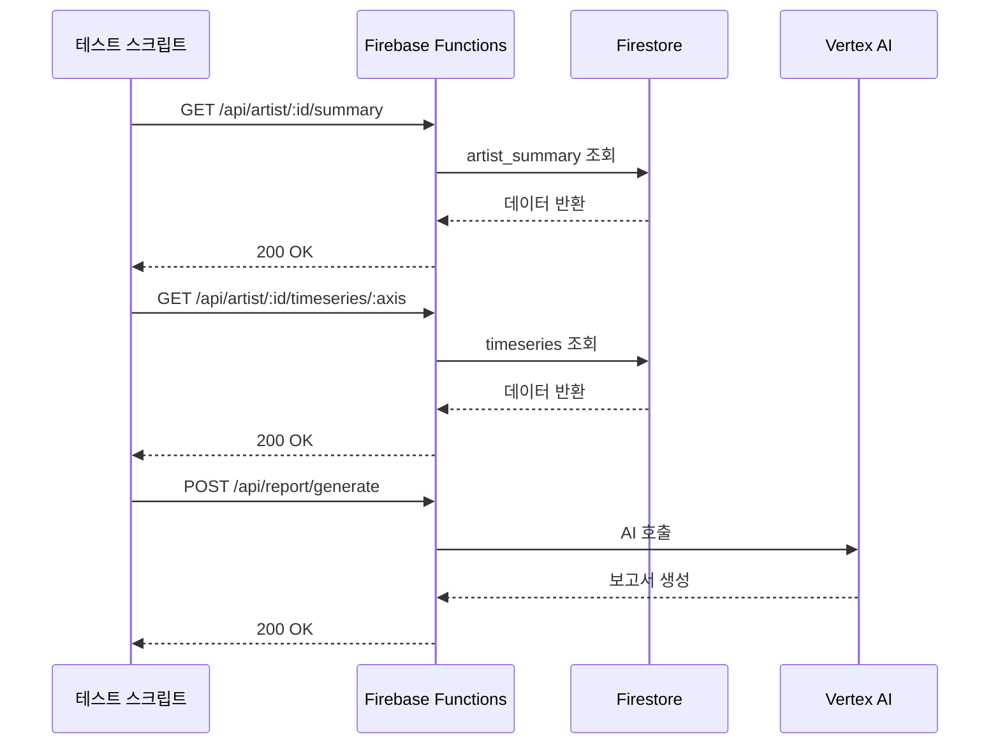

# CO-1016 CURATOR ODYSSEY: API 통합 가이드

버전: 1.0  
최종 수정: 2025-01-XX  
작성자: NEO GOD (Director)  

## 목차

1. [API 개요](#1-api-개요)
2. [OpenAPI 스펙](#2-openapi-스펙)
3. [인증 및 보안](#3-인증-및-보안)
4. [에러 처리](#4-에러-처리)
5. [React Query 통합](#5-react-query-통합)
6. [Vertex AI 통합](#6-vertex-ai-통합)
7. [E2E 테스트 플로우](#7-e2e-테스트-플로우)

---

## 1. API 개요

### 1.1 기본 정보

- **Base URL**: `https://co-1016.web.app/api`
- **프로토콜**: HTTPS
- **인증**: 현재 없음 (향후 Firebase Authentication 도입 예정)
- **응답 형식**: JSON

### 1.2 엔드포인트 목록

| Method | Path | 설명 | Phase |
|--------|------|------|-------|
| GET | `/api/artist/:id/summary` | 작가 요약 데이터 (radar5, sunburst_l1) | Phase 1 |
| GET | `/api/artist/:id/sunburst` | 선버스트 데이터 | Phase 1 |
| GET | `/api/artist/:id/timeseries/:axis` | 시계열 데이터 | Phase 2 |
| GET | `/api/compare/:A/:B/:axis` | 작가 비교 데이터 | Phase 3 |
| POST | `/api/report/generate` | AI 보고서 생성 | Phase 4 |

---

## 2. OpenAPI 스펙

**파일 위치**: `docs/api/OPENAPI_SPECIFICATION.yaml`

자세한 스펙은 `docs/api/OPENAPI_SPECIFICATION.yaml` 파일을 참조하세요.

### 2.1 요청/응답 예시

#### GET /api/artist/:id/summary

**요청:**
```bash
GET /api/artist/ARTIST_0005/summary
```

**응답 (200 OK):**
```json
{
  "artist_id": "ARTIST_0005",
  "name": "양혜규",
  "radar5": {
    "I": 97.5,
    "F": 90.0,
    "A": 92.0,
    "M": 86.0,
    "Sedu": 9.8
  },
  "sunburst_l1": {
    "제도": 91.2,
    "학술": 88.0,
    "담론": 86.0,
    "네트워크": 90.0
  },
  "weights_version": "AHP_v1",
  "updated_at": "2024-10-16T00:00:00Z",
  "data_source": "firestore_p2"
}
```

**에러 응답 (404):**
```json
{
  "error": "작가 ARTIST_0005의 데이터를 찾을 수 없습니다.",
  "code": "ARTIST_NOT_FOUND"
}
```

#### GET /api/artist/:id/timeseries/:axis

**요청:**
```bash
GET /api/artist/ARTIST_0005/timeseries/제도
```

**응답 (200 OK):**
```json
{
  "artist_id": "ARTIST_0005",
  "axis": "제도",
  "bins": [
    {"t": 0, "v": 45.2},
    {"t": 5, "v": 58.7},
    {"t": 10, "v": 72.3},
    {"t": 15, "v": 85.1},
    {"t": 20, "v": 91.2}
  ],
  "version": "v1.0",
  "debut_year": 1994
}
```

---

## 3. 인증 및 보안

### 3.1 Secret Manager 연동

**서비스 계정 권한:**
- `roles/secretmanager.secretAccessor`

**시크릿 키 목록:**
- `openai-api-key`: OpenAI API 키
- `anthropic-api-key`: Anthropic API 키
- `vertex-ai-credentials`: Vertex AI 인증 정보 (JSON)
- `app-config`: 애플리케이션 설정 (JSON)

**사용 예시:**

```javascript
// functions/src/services/configLoader.js
const { loadAppConfig } = require('./configLoader');

const config = await loadAppConfig();
const openaiApiKey = config.openai.apiKey;
```

### 3.2 CORS 설정

**firebase.json rewrites:**
```json
{
  "headers": [
    {
      "source": "/api/**",
      "headers": [
        {
          "key": "Access-Control-Allow-Origin",
          "value": "*"
        },
        {
          "key": "Access-Control-Allow-Methods",
          "value": "GET, POST, OPTIONS"
        }
      ]
    }
  ]
}
```

---

## 4. 에러 처리

### 4.1 에러 코드 목록

| 코드 | HTTP 상태 | 설명 |
|------|----------|------|
| `MISSING_ARTIST_ID` | 400 | 작가 ID가 제공되지 않음 |
| `ARTIST_NOT_FOUND` | 404 | 작가 데이터를 찾을 수 없음 |
| `MISSING_AXIS` | 400 | 축 파라미터가 제공되지 않음 |
| `MISSING_PROMPT` | 400 | AI 프롬프트가 제공되지 않음 |
| `VERTEX_AI_ERROR` | 500 | Vertex AI 호출 실패 |
| `INTERNAL_ERROR` | 500 | 서버 내부 오류 |

### 4.2 에러 처리 예시

**Axios 호출:**
```javascript
import axios from 'axios';

try {
  const response = await axios.get(`/api/artist/${artistId}/summary`);
  return response.data;
} catch (error) {
  if (error.response?.status === 404) {
    console.error('작가를 찾을 수 없습니다:', artistId);
    return null; // 또는 fallback 데이터
  }
  throw error;
}
```

**재시도 로직:**
```javascript
async function fetchWithRetry(url, maxRetries = 3) {
  for (let i = 0; i < maxRetries; i++) {
    try {
      const response = await axios.get(url);
      return response.data;
    } catch (error) {
      if (i === maxRetries - 1) throw error;
      await new Promise(resolve => setTimeout(resolve, 1000 * (i + 1)));
    }
  }
}
```

---

## 5. React Query 통합

### 5.1 useArtistData Hook 예시

```javascript
import { useQuery } from 'react-query';
import axios from 'axios';

export const useArtistData = (artistId) => {
  return useQuery(
    ['artist', artistId, 'summary'],
    async () => {
      const response = await axios.get(`/api/artist/${artistId}/summary`);
      return response.data;
    },
    {
      staleTime: 5 * 60 * 1000, // 5분
      cacheTime: 10 * 60 * 1000, // 10분
      retry: 2,
      retryDelay: 1000
    }
  );
};
```

### 5.2 useConditionalData Hook 예시

```javascript
import { useQuery } from 'react-query';

export const useConditionalData = (artistId) => {
  const { data: summary, isLoading: summaryLoading } = useQuery(
    ['artist', artistId, 'summary'],
    () => fetch(`/api/artist/${artistId}/summary`).then(r => r.json())
  );
  
  const { data: timeseries, isLoading: timeseriesLoading } = useQuery(
    ['artist', artistId, 'timeseries'],
    () => fetch(`/api/artist/${artistId}/timeseries/제도`).then(r => r.json())
  );
  
  return {
    summary,
    timeseries,
    loading: summaryLoading || timeseriesLoading
  };
};
```

---

## 6. Vertex AI 통합

### 6.1 인증 및 호출

**Secret Manager에서 인증 정보 로드:**
```javascript
const config = await loadAppConfig();
const vertexCredentials = config.vertex.credentials;
```

**Vertex AI 호출:**
```javascript
const { VertexAI } = require('@google-cloud/vertexai');

const vertexAI = new VertexAI({
  project: 'co-1016',
  location: 'asia-northeast3'
});

const model = vertexAI.getGenerativeModel({ model: 'gemini-1.5-pro' });
const result = await model.generateContent(prompt);
```

### 6.2 폴백 전략

**순서:**
1. Vertex AI Gemini 1.5 Pro 호출 시도
2. 실패 시 OpenAI GPT-4 호출
3. 실패 시 템플릿 기반 보고서 생성

**코드 예시:**
```javascript
async function generateReport(prompt) {
  try {
    // Vertex AI 시도
    return await callVertexAI(prompt);
  } catch (error) {
    if (error.code === 'VERTEX_AI_ERROR') {
      try {
        // OpenAI 폴백
        return await callOpenAI(prompt);
      } catch (openaiError) {
        // 템플릿 폴백
        return generateTemplateReport(prompt);
      }
    }
    throw error;
  }
}
```

---

## 7. E2E 테스트 플로우

### 7.1 threewayIntegrationTest 플로우



### 7.2 테스트 스크립트 예시

```javascript
// scripts/testApiIntegration.js
const axios = require('axios');

async function testArtistSummary(artistId) {
  const response = await axios.get(`/api/artist/${artistId}/summary`);
  console.assert(response.status === 200);
  console.assert(response.data.radar5 !== undefined);
  console.assert(response.data.sunburst_l1 !== undefined);
}

async function testTimeseries(artistId, axis) {
  const response = await axios.get(`/api/artist/${artistId}/timeseries/${axis}`);
  console.assert(response.status === 200);
  console.assert(Array.isArray(response.data.bins));
}

async function runAllTests() {
  await testArtistSummary('ARTIST_0005');
  await testTimeseries('ARTIST_0005', '제도');
  console.log('✅ 모든 테스트 통과');
}
```

---

**문서 버전 관리:**
- v1.0 (2025-01-XX): 초기 작성

