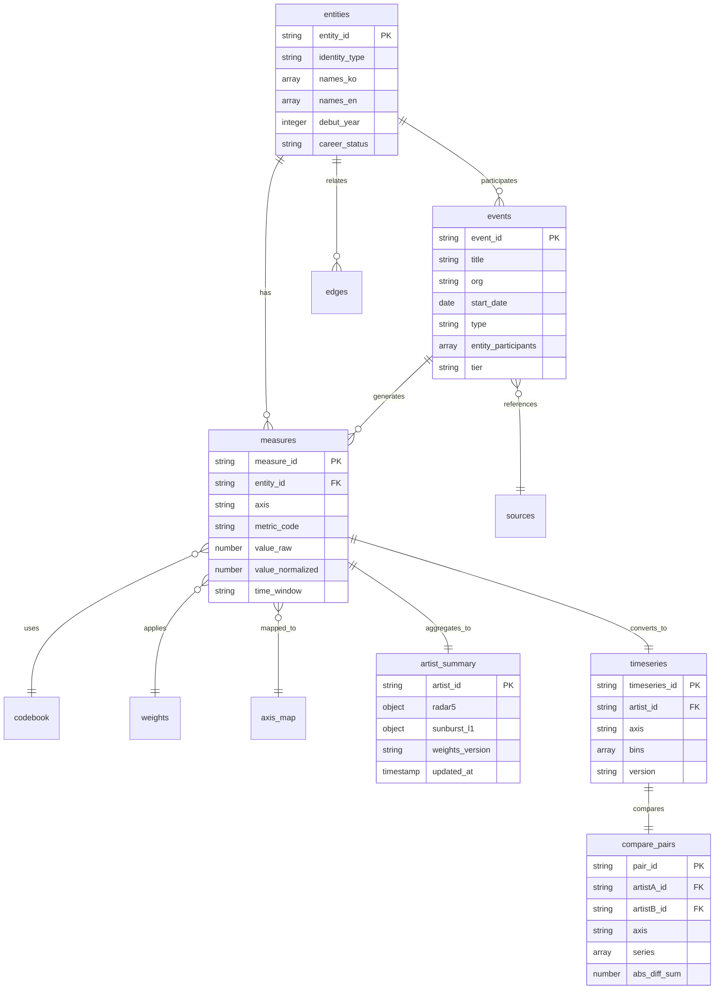
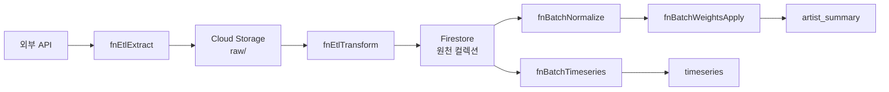

# CO-1016 CURATOR ODYSSEY: 데이터 모델 명세서

버전: 1.1  
최종 수정: 2025-11-10  
작성자: Dr. Sarah Kim (Data Architect)  

## 목차

1. [데이터베이스 개요](#1-데이터베이스-개요)
2. [ER 다이어그램](#2-er-다이어그램)
3. [컬렉션 스키마 상세](#3-컬렉션-스키마-상세)
4. [인덱스 전략](#4-인덱스-전략)
5. [보안 규칙](#5-보안-규칙)
6. [ETL 파이프라인](#6-etl-파이프라인)
7. [데이터 품질 검증](#7-데이터-품질-검증)
8. [Mock 데이터 확장 전략](#8-mock-데이터-확장-전략)

---

## 1. 데이터베이스 개요

### 1.1 데이터베이스 유형

- **데이터베이스**: Firebase Firestore (NoSQL)
- **BigQuery 사용 여부**: 없음 (현재 프로젝트에서 미사용)
- **리전**: asia-northeast3 (서울)

### 1.2 컬렉션 구조

**총 15개 컬렉션:**

| 카테고리 | 컬렉션 수 | 컬렉션 목록 |
|---------|----------|------------|
| 원천 데이터 | 9개 | `entities`, `events`, `measures`, `axis_map`, `edges`, `sources`, `codebook`, `weights`, `snapshots` |
| 서빙 레이어 | 3개 | `artist_summary`, `timeseries`, `compare_pairs` |
| 피지컬 컴퓨팅 아트워크 | 3개 | `physical_game_sessions`, `treasure_boxes`, `treasure_box_combinations` |

### 1.3 데이터 흐름 개요

```
외부 API (Met/AIC/Artsy)
  ↓
fnEtlExtract (원본 수집)
  ↓
Cloud Storage (raw 데이터)
  ↓
fnEtlTransform (정제/정규화)
  ↓
Firestore 원천 컬렉션 (entities, events, measures)
  ↓
fnBatchNormalize (정규화)
  ↓
fnBatchWeightsApply (가중치 적용)
  ↓
artist_summary 컬렉션
  ↓
fnBatchTimeseries (시계열 집계)
  ↓
timeseries 컬렉션
  ↓
fnBatchComparePairs (비교 분석)
  ↓
compare_pairs 컬렉션
```

---

## 2. ER 다이어그램

### 2.1 전체 ER 다이어그램



### 2.2 핵심 관계 설명

**1. entities ↔ events (1:N)**
- 하나의 엔터티(작가)는 여러 이벤트에 참여 가능
- `events.entity_participants` 배열에 `entities.entity_id` 포함

**2. events → measures (1:N)**
- 하나의 이벤트는 여러 측정값(measures) 생성 가능
- 측정값은 `events.event_id` 참조

**3. measures → artist_summary (N:1)**
- 여러 측정값이 집계되어 하나의 `artist_summary` 문서 생성
- `fnBatchWeightsApply` 배치 함수로 집계

**4. measures → timeseries (N:1)**
- 여러 측정값이 시간축으로 집계되어 `timeseries` 문서 생성
- `fnBatchTimeseries` 배치 함수로 집계

**5. timeseries → compare_pairs (2:1)**
- 두 개의 `timeseries` 문서가 비교되어 하나의 `compare_pairs` 문서 생성
- `fnBatchComparePairs` 배치 함수로 생성

---

## 3. 컬렉션 스키마 상세

### 3.1 원천 데이터 컬렉션

#### 3.1.1 entities (엔터티 마스터)

**컬렉션 이름**: `entities`  
**기본 키**: `entity_id`  
**설명**: 작가, 기관 등 모든 엔터티의 마스터 정보

| 필드명 | 타입 | 필수 | 설명 | 예시 |
|--------|------|------|------|------|
| `entity_id` | string | ✅ | 엔터티 고유 식별자 | `ARTIST_0005` |
| `identity_type` | string | ✅ | 엔터티 유형 | `artist`, `institution`, `gallery` |
| `names_ko` | array[string] | ❌ | 한국어 이름 배열 | `['양혜규', '양혜규 작가']` |
| `names_en` | array[string] | ❌ | 영어 이름 배열 | `['Haegue Yang', 'Yang Haegue']` |
| `alias` | array[string] | ❌ | 별칭 배열 | `['하이거 양', 'H.Yang']` |
| `external_ids` | object | ❌ | 외부 시스템 식별자 | `{viaf: '...', ulan: '...'}` |
| `debut_year` | integer | ✅ | 데뷔년도 (시계열 분석 기준점) | `1994` |
| `career_status` | string | ❌ | 활동 상태 | `active`, `inactive`, `deceased` |
| `metadata` | object | ❌ | 메타데이터 | `{created_at, updated_at, data_quality_score}` |

**데이터 타입 예시:**
```javascript
{
  entity_id: "ARTIST_0005",
  identity_type: "artist",
  names_ko: ["양혜규", "양혜규 작가"],
  names_en: ["Haegue Yang", "Yang Haegue"],
  alias: ["하이거 양"],
  external_ids: {
    viaf: "123456789",
    ulan: "500123456"
  },
  debut_year: 1994,
  career_status: "active",
  metadata: {
    created_at: "2024-01-01T00:00:00Z",
    updated_at: "2024-10-16T00:00:00Z",
    data_quality_score: 0.95
  }
}
```

#### 3.1.2 events (이벤트 원본)

**컬렉션 이름**: `events`  
**기본 키**: `event_id`  
**설명**: 전시, 수상 등 모든 발생 이벤트 원본

| 필드명 | 타입 | 필수 | 설명 | 예시 |
|--------|------|------|------|------|
| `event_id` | string | ✅ | 이벤트 고유 식별자 | `2019-03-15+TATE+HAEGUE_YANG_SOLO` |
| `title` | string | ✅ | 이벤트 제목 | `Haegue Yang: ETA 1994-2018` |
| `org` | string | ✅ | 주최 기관명 | `Tate St Ives` |
| `start_date` | date | ✅ | 시작일 | `2019-03-15` |
| `end_date` | date | ❌ | 종료일 | `2019-06-15` |
| `venue_id` | string | ❌ | 장소 식별자 | `VENUE_TATE_ST_IVES` |
| `type` | string | ✅ | 이벤트 유형 | `exhibition`, `award`, `publication` |
| `entity_participants` | array[string] | ✅ | 참여 엔터티 ID 목록 | `['ARTIST_0005', 'CURATOR_001']` |
| `tier` | string | ❌ | 기관/이벤트 등급 | `S`, `A`, `B`, `C` |
| `geographical_scope` | string | ❌ | 지리적 범위 | `local`, `national`, `international` |

#### 3.1.3 measures (측정값)

**컬렉션 이름**: `measures`  
**기본 키**: `measure_id`  
**설명**: 이벤트로부터 추출된 개별 측정값 (분석의 원자 단위)

| 필드명 | 타입 | 필수 | 설명 | 예시 |
|--------|------|------|------|------|
| `measure_id` | string | ✅ | 측정값 고유 식별자 | `M_ARTIST_0005_INST_001` |
| `entity_id` | string | ✅ | 대상 엔터티 ID | `ARTIST_0005` |
| `event_id` | string | ✅ | 관련 이벤트 ID | `2019-03-15+TATE+...` |
| `axis` | string | ✅ | 축 (제도/학술/담론/네트워크) | `제도`, `학술`, `담론`, `네트워크` |
| `metric_code` | string | ✅ | 지표 코드 (codebook 참조) | `INSTITUTION_SHOW`, `AWARD_PRIZE` |
| `value_raw` | number | ✅ | 원본 측정값 | `85.5` |
| `value_normalized` | number | ❌ | 정규화된 측정값 | `0.78` |
| `time_window` | string | ✅ | 시간 구간 (ISO 형식) | `2019-03 to 2019-06` |
| `source_id` | string | ❌ | 출처 ID (sources 참조) | `SOURCE_MET_001` |

### 3.2 서빙 레이어 컬렉션

#### 3.2.1 artist_summary (Phase 1 서빙)

**컬렉션 이름**: `artist_summary`  
**기본 키**: `artist_id`  
**설명**: Phase 1 레이더 + 선버스트 데이터

| 필드명 | 타입 | 필수 | 설명 | 예시 |
|--------|------|------|------|------|
| `artist_id` | string | ✅ | 작가 ID | `ARTIST_0005` |
| `name` | string | ✅ | 작가 이름 | `양혜규` |
| `radar5` | object | ✅ | 5축 레이더 데이터 | `{I: 97.5, F: 90.0, A: 92.0, M: 86.0, Sedu: 9.8}` |
| `sunburst_l1` | object | ✅ | 4축 선버스트 L1 데이터 | `{제도: 91.2, 학술: 88.0, 담론: 86.0, 네트워크: 90.0}` |
| `weights_version` | string | ✅ | 가중치 버전 | `AHP_v1` |
| `updated_at` | timestamp | ✅ | 업데이트 시간 | `2024-10-16T00:00:00Z` |
| `is_temporary` | boolean | ❌ | 임시 데이터 플래그 | `true` (P1), `false` (P2) |
| `data_source` | string | ❌ | 데이터 소스 | `firestore_p2`, `p1_temp_collection` |

**데이터 타입 상세:**

**radar5 객체 구조:**
```typescript
{
  I: number;      // Institution (기관전시) - 0~100
  F: number;      // Fair (아트페어) - 0~100
  A: number;      // Award (시상) - 0~100
  M: number;      // Media (미디어) - 0~100
  Sedu: number;   // Seduction (교육) - 0~100
}
```

**sunburst_l1 객체 구조:**
```typescript
{
  제도: number;    // 제도적 성취 - 0~100
  학술: number;    // 학술적 성취 - 0~100
  담론: number;    // 담론적 성취 - 0~100
  네트워크: number; // 네트워크 성취 - 0~100
}
```

**예시 데이터:**
```javascript
{
  artist_id: "ARTIST_0005",
  name: "양혜규",
  radar5: {
    I: 97.5,
    F: 90.0,
    A: 92.0,
    M: 86.0,
    Sedu: 9.8
  },
  sunburst_l1: {
    제도: 91.2,
    학술: 88.0,
    담론: 86.0,
    네트워크: 90.0
  },
  weights_version: "AHP_v1",
  updated_at: "2024-10-16T00:00:00Z",
  is_temporary: false,
  data_source: "firestore_p2"
}
```

#### 3.2.2 timeseries (Phase 2 서빙)

**컬렉션 이름**: `timeseries`  
**기본 키**: `timeseries_id` (복합 키: `{artist_id}_{axis}`)  
**설명**: Phase 2 시계열 분석 데이터

| 필드명 | 타입 | 필수 | 설명 | 예시 |
|--------|------|------|------|------|
| `timeseries_id` | string | ✅ | 시계열 ID (복합 키) | `ARTIST_0005_제도` |
| `artist_id` | string | ✅ | 작가 ID | `ARTIST_0005` |
| `axis` | string | ✅ | 축 (제도/학술/담론/네트워크) | `제도`, `학술`, `담론`, `네트워크` |
| `bins` | array[object] | ✅ | 시계열 데이터 배열 | `[{t: 0, v: 45.2}, {t: 1, v: 52.8}]` |
| `version` | string | ✅ | 데이터 버전 | `v1.0` |
| `debut_year` | integer | ✅ | 데뷔년도 (상대 시간축 기준점) | `1994` |
| `last_calculated` | timestamp | ✅ | 마지막 계산 시간 | `2024-10-16T00:00:00Z` |

**bins 배열 구조:**
```typescript
[
  {
    t: number;  // 상대 시간 (t = year - debut_year)
    v: number;  // 측정값 (0~100)
  }
]
```

**예시 데이터:**
```javascript
{
  timeseries_id: "ARTIST_0005_제도",
  artist_id: "ARTIST_0005",
  axis: "제도",
  bins: [
    {t: 0, v: 45.2},   // 데뷔년 (1994)
    {t: 5, v: 58.7},   // 1999년
    {t: 10, v: 72.3},  // 2004년
    {t: 15, v: 85.1},  // 2009년
    {t: 20, v: 91.2}   // 2014년
  ],
  version: "v1.0",
  debut_year: 1994,
  last_calculated: "2024-10-16T00:00:00Z"
}
```

#### 3.2.3 compare_pairs (Phase 3 서빙)

**컬렉션 이름**: `compare_pairs`  
**기본 키**: `pair_id` (복합 키: `{artistA_id}_{artistB_id}_{axis}`)  
**설명**: Phase 3 비교 분석 데이터

| 필드명 | 타입 | 필수 | 설명 | 예시 |
|--------|------|------|------|------|
| `pair_id` | string | ✅ | 비교 쌍 ID | `ARTIST_0005_ARTIST_0010_제도` |
| `artistA_id` | string | ✅ | 작가 A ID | `ARTIST_0005` |
| `artistB_id` | string | ✅ | 작가 B ID | `ARTIST_0010` |
| `axis` | string | ✅ | 축 | `제도`, `학술`, `담론`, `네트워크` |
| `series` | array[object] | ✅ | 비교 시계열 데이터 | `[{t, v_A, v_B, diff}]` |
| `abs_diff_sum` | number | ✅ | 절대 차이 합계 | `125.7` |
| `correlation` | number | ❌ | 상관계수 | `0.85` |
| `calculated_at` | timestamp | ✅ | 계산 시간 | `2024-10-16T00:00:00Z` |

**series 배열 구조:**
```typescript
[
  {
    t: number;    // 상대 시간
    v_A: number;  // 작가 A 측정값
    v_B: number;  // 작가 B 측정값
    diff: number; // 차이 (v_A - v_B)
  }
]
```

#### 3.2.4 artist_sunburst (Phase 1 서빙 - 선버스트 상세)

**컬렉션 이름**: `artist_sunburst`  
**기본 키**: `artist_id`  
**설명**: Phase 1 선버스트 상세 데이터 전용 컬렉션 (L1/L2 계층)

| 필드명 | 타입 | 필수 | 설명 | 예시 |
|--------|------|------|------|------|
| `artist_id` | string | ✅ | 작가 ID | `ARTIST_0005` |
| `name` | string | ✅ | 작가 이름 | `양혜규` |
| `sunburst_l1` | object | ✅ | 4축 선버스트 L1 데이터 | `{제도: 91.2, 학술: 88.0, 담론: 86.0, 네트워크: 90.0}` |
| `sunburst_l2` | object | ✅ | 4축 선버스트 L2 데이터 | `{제도: {기관전시: 63.8, 페어: 27.4}, ...}` |
| `weights_version` | string | ✅ | 가중치 버전 | `AHP_v1` |
| `updated_at` | timestamp | ✅ | 업데이트 시간 | `2024-10-16T00:00:00Z` |
| `_p3_ui_compatible` | boolean | ❌ | P3 UI 호환 플래그 | `true` |

**sunburst_l2 객체 구조:**
```typescript
{
  제도: {
    기관전시: number;  // 제도 축의 기관전시 비율
    페어: number;      // 제도 축의 페어 비율
  },
  학술: {
    수상: number;      // 학술 축의 수상 비율
    논문: number;      // 학술 축의 논문 비율
  },
  담론: {
    미디어: number;    // 담론 축의 미디어 비율
    비평: number;      // 담론 축의 비평 비율
  },
  네트워크: {
    협업: number;      // 네트워크 축의 협업 비율
    멘토링: number;    // 네트워크 축의 멘토링 비율
  }
}
```

**예시 데이터:**
```javascript
{
  artist_id: "ARTIST_0005",
  name: "양혜규",
  sunburst_l1: {
    제도: 91.2,
    학술: 88.0,
    담론: 86.0,
    네트워크: 90.0
  },
  sunburst_l2: {
    제도: {
      기관전시: 63.8,
      페어: 27.4
    },
    학술: {
      수상: 52.8,
      논문: 35.2
    },
    담론: {
      미디어: 68.8,
      비평: 17.2
    },
    네트워크: {
      협업: 45.0,
      멘토링: 45.0
    }
  },
  weights_version: "AHP_v1",
  updated_at: "2024-10-16T00:00:00Z",
  _p3_ui_compatible: true
}
```

#### 3.2.5 ai_reports (Phase 4 서빙 - AI 보고서 캐싱)

**컬렉션 이름**: `ai_reports`  
**기본 키**: `report_id` (복합 키: `{artistIds}_{reportType}`)  
**설명**: Phase 4 AI 보고서 캐싱용 컬렉션

| 필드명 | 타입 | 필수 | 설명 | 예시 |
|--------|------|------|------|------|
| `report_id` | string | ✅ | 보고서 ID | `comprehensive_1699000000000` |
| `report_type` | string | ✅ | 보고서 유형 | `comprehensive`, `comparative`, `individual` |
| `artists_analyzed` | array[object] | ✅ | 분석된 작가 목록 | `[{id: "ARTIST_0005", name: "양혜규"}]` |
| `executive_summary` | string | ✅ | 요약 | `이 보고서는 1명의 아티스트에 대한 종합 분석...` |
| `detailed_analysis` | object | ✅ | 상세 분석 | `{market_positioning: [...], comparative_insights: {...}}` |
| `recommendations` | object | ✅ | 권장사항 | `{strategic_focus: [...], market_opportunities: [...]}` |
| `technical_metadata` | object | ✅ | 기술 메타데이터 | `{analysis_engine: "CuratorOdyssey v2.0", ...}` |
| `generated_at` | timestamp | ✅ | 생성 시간 | `2024-10-16T00:00:00Z` |
| `_p3_ui_compatible` | boolean | ❌ | P3 UI 호환 플래그 | `true` |

**detailed_analysis 객체 구조:**
```typescript
{
  market_positioning: Array<{
    artist_id: string;
    name: string;
    total_score: number;
    market_tier: string;  // "Tier 1" | "Tier 2"
    strengths: string[];
    opportunities: string[];
  }>;
  comparative_insights?: {
    market_leader: string;
    performance_gap: number;
    common_strengths: string[];
    common_weaknesses: string[];
  };
}
```

**예시 데이터:**
```javascript
{
  report_id: "comprehensive_1699000000000",
  report_type: "comprehensive",
  artists_analyzed: [
    { id: "ARTIST_0005", name: "양혜규" }
  ],
  executive_summary: "이 보고서는 1명의 아티스트에 대한 종합 분석을 제공합니다...",
  detailed_analysis: {
    market_positioning: [{
      artist_id: "ARTIST_0005",
      name: "양혜규",
      total_score: 375.3,
      market_tier: "Tier 1",
      strengths: ["I", "A"],
      opportunities: ["Sedu"]
    }],
    comparative_insights: null
  },
  recommendations: {
    strategic_focus: [{
      artist_id: "ARTIST_0005",
      name: "양혜규",
      primary_recommendation: "시장 가시성 확대",
      secondary_recommendation: "네트워크 강화",
      timeline: "6-12개월"
    }],
    market_opportunities: [
      "국제 전시 확대",
      "학술적 인정도 제고",
      "미디어 노출 증가"
    ]
  },
  technical_metadata: {
    analysis_engine: "CuratorOdyssey v2.0",
    data_sources: ["P1 API", "P2 Database", "P3 UI"],
    confidence_score: 0.92,
    last_updated: "2024-10-16T00:00:00Z"
  },
  generated_at: "2024-10-16T00:00:00Z",
  _p3_ui_compatible: true
}
```

#### 3.2.6 system_health (시스템 헬스체크)

**컬렉션 이름**: `system_health`  
**기본 키**: `service_id` (예: `vertex_ai`)  
**설명**: 시스템 헬스체크 데이터 컬렉션

| 필드명 | 타입 | 필수 | 설명 | 예시 |
|--------|------|------|------|------|
| `service` | string | ✅ | 서비스 이름 | `Vertex AI` |
| `status` | string | ✅ | 상태 | `healthy`, `degraded`, `unhealthy` |
| `timestamp` | timestamp | ✅ | 체크 시간 | `2024-10-16T00:00:00Z` |
| `capabilities` | object | ✅ | 서비스 기능 | `{text_generation: true, ...}` |
| `performance_metrics` | object | ✅ | 성능 메트릭 | `{response_time: "<2s", success_rate: "99.5%", ...}` |
| `configuration` | object | ❌ | 설정 정보 | `{model: "text-bison@002", ...}` |
| `p2_integration` | object | ❌ | P2 통합 상태 | `{data_adapter_ready: true, ...}` |
| `p3_integration` | object | ❌ | P3 통합 상태 | `{ui_compatibility: true, ...}` |
| `error` | string | ❌ | 오류 메시지 (상태가 degraded/unhealthy일 때) | `"Connection timeout"` |
| `fallback_mode` | boolean | ❌ | 폴백 모드 여부 | `false` |
| `_system_ready` | boolean | ❌ | 시스템 준비 상태 | `true` |

**capabilities 객체 구조:**
```typescript
{
  text_generation: boolean;
  comprehensive_analysis: boolean;
  multi_artist_comparison: boolean;
  market_insights: boolean;
}
```

**performance_metrics 객체 구조:**
```typescript
{
  response_time: string;        // "<2s"
  success_rate: string;         // "99.5%"
  daily_quota_used: string;     // "15%"
  monthly_quota_remaining: string; // "85%"
}
```

**예시 데이터:**
```javascript
{
  service: "Vertex AI",
  status: "healthy",
  timestamp: "2024-10-16T00:00:00Z",
  capabilities: {
    text_generation: true,
    comprehensive_analysis: true,
    multi_artist_comparison: true,
    market_insights: true
  },
  performance_metrics: {
    response_time: "<2s",
    success_rate: "99.5%",
    daily_quota_used: "15%",
    monthly_quota_remaining: "85%"
  },
  configuration: {
    model: "text-bison@002",
    max_tokens: 8192,
    temperature: 0.7,
    top_p: 0.95
  },
  p2_integration: {
    data_adapter_ready: true,
    quality_validation_active: true,
    time_window_rules_applied: true
  },
  p3_integration: {
    ui_compatibility: true,
    report_formatting: true,
    real_time_updates: true
  },
  _system_ready: true
}
```

---

### 3.3 피지컬 컴퓨팅 아트워크 컬렉션

피지컬 컴퓨팅 아트워크는 CuratorOdyssey 플랫폼과 연동된 인터랙티브 아트워크로, 플레이어의 게임 세션 데이터와 보물 상자 조합 정보를 저장합니다. 자세한 내용은 [BRD v1.1](../requirements/BRD.md) Section 4.1을 참조하세요.

#### 3.3.1 physical_game_sessions (게임 세션)

**컬렉션 이름**: `physical_game_sessions`  
**기본 키**: `session_id`  
**설명**: 피지컬 컴퓨팅 아트워크 게임 세션 데이터 (공 수집, 보물 상자 선택, 점수 계산, AI 매칭 결과)

| 필드명 | 타입 | 필수 | 설명 | 예시 |
|--------|------|------|------|------|
| `session_id` | string | ✅ | 세션 고유 식별자 | `SESSION_123456` |
| `started_at` | timestamp | ✅ | 게임 시작 시간 | `2024-11-10T10:00:00Z` |
| `ended_at` | timestamp | ❌ | 게임 종료 시간 | `2024-11-10T10:08:30Z` |
| `balls_collected` | object | ✅ | 공 수집 데이터 (티어별, 축별) | `{tier_1: {...}, tier_2: {...}, tier_3: {...}}` |
| `treasure_boxes_selected` | array[object] | ✅ | 선택된 보물 상자 배열 (시간순) | `[{box_id: 1, age_group: "10대", ...}]` |
| `calculated_metadata` | object | ✅ | 계산된 메타데이터 (레이더/선버스트 점수) | `{radar5: {...}, sunburst_l1: {...}}` |
| `main_persona` | object | ✅ | 주 페르소나 (보물 상자 조합) | `{life_scenario: "...", event_sequence: [...]}` |
| `ai_matching` | object | ❌ | AI 매칭 결과 | `{matched_artist_id: "...", similarity_score: 0.85}` |
| `created_at` | timestamp | ✅ | 생성 시간 | `2024-11-10T10:00:00Z` |
| `updated_at` | timestamp | ✅ | 업데이트 시간 | `2024-11-10T10:08:30Z` |

**balls_collected 객체 구조:**
```typescript
{
  tier_1: {
    count: number;
    axis_distribution: {
      제도: number;
      학술: number;
      담론: number;
      네트워크: number;
    };
    calculated_scores: {
      radar5: { I: number; F: number; A: number; M: number; Sedu: number; };
      sunburst_l1: { 제도: number; 학술: number; 담론: number; 네트워크: number; };
    };
  };
  tier_2: { /* 동일 구조 */ };
  tier_3: { /* 동일 구조 */ };
}
```

**treasure_boxes_selected 배열 구조:**
```typescript
[
  {
    box_id: number;           // 1-9
    age_group: string;        // "10대" | "20대" | "30대"
    event_description: string;
    sequence: number;         // 1-3 (시간순)
    selected_at: timestamp;
  }
]
```

**main_persona 객체 구조:**
```typescript
{
  life_scenario: string;      // "구설수 → 퇴학 → 입대"
  event_sequence: string[];   // ["구설수가 생기다", "대학교에서 퇴학당하다", "군에 입대하다"]
  narrative_summary: string;
}
```

**ai_matching 객체 구조:**
```typescript
{
  matched_artist_id: string;   // "ARTIST_0005"
  matched_artist_name: string;
  similarity_score: number;   // 0-1
  matching_reason: string;
  generated_story: string;
  curator_odyssey_link: string;
}
```

**예시 데이터:**
```javascript
{
  session_id: "SESSION_123456",
  started_at: "2024-11-10T10:00:00Z",
  ended_at: "2024-11-10T10:08:30Z",
  balls_collected: {
    tier_1: {
      count: 2,
      axis_distribution: { 제도: 1, 학술: 0, 담론: 1, 네트워크: 0 },
      calculated_scores: {
        radar5: { I: 7.0, F: 3.0, A: 0, M: 8.0, Sedu: 0 },
        sunburst_l1: { 제도: 10.0, 학술: 0, 담론: 10.0, 네트워크: 0 }
      }
    },
    // tier_2, tier_3 생략
  },
  treasure_boxes_selected: [
    { box_id: 1, age_group: "10대", event_description: "구설수가 생기다", sequence: 1, selected_at: "2024-11-10T10:02:00Z" },
    { box_id: 4, age_group: "20대", event_description: "대학교에서 퇴학당하다", sequence: 2, selected_at: "2024-11-10T10:05:00Z" },
    { box_id: 7, age_group: "30대", event_description: "군에 입대하다", sequence: 3, selected_at: "2024-11-10T10:07:00Z" }
  ],
  calculated_metadata: {
    radar5: { I: 25.0, F: 10.0, A: 15.0, M: 20.0, Sedu: 3.0 },
    sunburst_l1: { 제도: 35.0, 학술: 20.0, 담론: 30.0, 네트워크: 15.0 },
    consistency_check: { radar_sum: 73.0, sunburst_sum: 100.0, mapped_sum: 72.5, difference: 0.5, valid: true },
    influence_score: 25.0,
    recognition_score: 15.0,
    artwork_price_range: "중상위",
    final_grade: "3등급"
  },
  main_persona: {
    life_scenario: "구설수 → 퇴학 → 입대",
    event_sequence: ["구설수가 생기다", "대학교에서 퇴학당하다", "군에 입대하다"],
    narrative_summary: "10대에 구설수가 생겼지만, 20대에 대학에서 퇴학당하고, 30대에 군에 입대한 인생"
  },
  ai_matching: {
    matched_artist_id: "ARTIST_0005",
    matched_artist_name: "헨리 마티스",
    similarity_score: 0.85,
    matching_reason: "유사한 인생 궤적과 작품 스타일",
    generated_story: "AI 생성 스토리 텍스트...",
    curator_odyssey_link: "/artist/ARTIST_0005"
  },
  created_at: "2024-11-10T10:00:00Z",
  updated_at: "2024-11-10T10:08:30Z"
}
```

#### 3.3.2 treasure_boxes (보물 상자 메타데이터)

**컬렉션 이름**: `treasure_boxes`  
**기본 키**: `box_id`  
**설명**: 보물 상자 메타데이터 (나이대별 3개씩, 총 9개)

| 필드명 | 타입 | 필수 | 설명 | 예시 |
|--------|------|------|------|------|
| `box_id` | integer | ✅ | 보물 상자 ID (1-9) | `1` |
| `age_group` | string | ✅ | 나이대 구간 | `"10대"`, `"20대"`, `"30대"` |
| `position` | integer | ✅ | 해당 나이대 내 위치 (1-3) | `1`, `2`, `3` |
| `event_description` | string | ✅ | 이벤트 설명 | `"구설수가 생기다"` |
| `event_type` | string | ✅ | 이벤트 유형 | `"negative"`, `"positive"`, `"neutral"` |
| `metadata` | object | ❌ | 메타데이터 | `{category: "네트워크", impact_level: "high"}` |
| `created_at` | timestamp | ✅ | 생성 시간 | `2024-11-10T00:00:00Z` |

**metadata 객체 구조:**
```typescript
{
  category?: string;        // "네트워크", "제도", "학술", "담론"
  impact_level?: string;   // "high" | "medium" | "low"
}
```

**예시 데이터:**
```javascript
// 10대 구간 보물 상자
{ box_id: 1, age_group: "10대", position: 1, event_description: "구설수가 생기다", event_type: "negative", metadata: { category: "네트워크", impact_level: "high" }, created_at: "2024-11-10T00:00:00Z" }
{ box_id: 2, age_group: "10대", position: 2, event_description: "원하는 대학에 입학하다", event_type: "positive", metadata: { category: "제도", impact_level: "high" }, created_at: "2024-11-10T00:00:00Z" }
{ box_id: 3, age_group: "10대", position: 3, event_description: "유명 큐레이터에게 눈에 띄다", event_type: "positive", metadata: { category: "네트워크", impact_level: "high" }, created_at: "2024-11-10T00:00:00Z" }

// 20대 구간 보물 상자
{ box_id: 4, age_group: "20대", position: 1, event_description: "대학교에서 퇴학당하다", event_type: "negative", metadata: { category: "제도", impact_level: "high" }, created_at: "2024-11-10T00:00:00Z" }
{ box_id: 5, age_group: "20대", position: 2, event_description: "학술제에서 인정받다", event_type: "positive", metadata: { category: "학술", impact_level: "high" }, created_at: "2024-11-10T00:00:00Z" }
{ box_id: 6, age_group: "20대", position: 3, event_description: "전속 계약이 해지되다", event_type: "negative", metadata: { category: "네트워크", impact_level: "high" }, created_at: "2024-11-10T00:00:00Z" }

// 30대 구간 보물 상자
{ box_id: 7, age_group: "30대", position: 1, event_description: "군에 입대하다", event_type: "neutral", metadata: { category: "제도", impact_level: "medium" }, created_at: "2024-11-10T00:00:00Z" }
{ box_id: 8, age_group: "30대", position: 2, event_description: "리움에서 전시하다", event_type: "positive", metadata: { category: "제도", impact_level: "high" }, created_at: "2024-11-10T00:00:00Z" }
{ box_id: 9, age_group: "30대", position: 3, event_description: "국제 비엔날레에 초대받다", event_type: "positive", metadata: { category: "제도", impact_level: "high" }, created_at: "2024-11-10T00:00:00Z" }
```

#### 3.3.3 treasure_box_combinations (보물 상자 조합식)

**컬렉션 이름**: `treasure_box_combinations`  
**기본 키**: `combination_id`  
**설명**: 보물 상자 조합식 참조 데이터 (27가지 조합, 각 조합의 스토리텔링 키워드 및 유사 작가 정보)

| 필드명 | 타입 | 필수 | 설명 | 예시 |
|--------|------|------|------|------|
| `combination_id` | string | ✅ | 조합 ID (COMBO_001 ~ COMBO_027) | `"COMBO_001"` |
| `box_ids` | array[integer] | ✅ | 정렬된 배열 (시간순, 10대-20대-30대) | `[1, 4, 7]` |
| `story_template` | string | ✅ | 이벤트 시퀀스 템플릿 | `"구설수 → 퇴학 → 입대"` |
| `storytelling_keyword` | string | ✅ | 스토리텔링 키워드 | `"파격적 궤적의 순수 아웃사이더"` |
| `similar_artists` | array[object] | ✅ | 유사 작가 배열 | `[{name_ko: "...", name_en: "...", ...}]` |
| `rarity` | string | ❌ | 희귀도 | `"common"`, `"rare"`, `"epic"` |
| `created_at` | timestamp | ✅ | 생성 시간 | `2024-11-10T00:00:00Z` |
| `updated_at` | timestamp | ✅ | 업데이트 시간 | `2024-11-10T00:00:00Z` |

**similar_artists 배열 구조:**
```typescript
[
  {
    name_ko: string;              // 한국명
    name_en: string;               // 영문명
    matching_rationale: string;   // 매칭 근거 설명
    keywords: string[];           // 키워드 배열
  }
]
```

**예시 데이터:**
```javascript
{
  combination_id: "COMBO_001",
  box_ids: [1, 4, 7],  // 10대-20대-30대 순서
  story_template: "구설수 → 퇴학 → 입대",
  storytelling_keyword: "파격적 궤적의 순수 아웃사이더",
  similar_artists: [
    {
      name_ko: "헨리 마티스",
      name_en: "Henri Matisse",
      matching_rationale: "초기 논란, 정규 교육 중단, 긴 경력 공백, 순수성 추구",
      keywords: ["초기 논란", "정규 교육 중단", "긴 경력 공백", "순수성 추구"]
    }
    // 추가 유사 작가 가능 (향후 확장)
  ],
  rarity: "common",
  created_at: "2024-11-10T00:00:00Z",
  updated_at: "2024-11-10T00:00:00Z"
}
```

**참고**: 27가지 조합식 전체 목록은 [BRD v1.1](../requirements/BRD.md) Section 3.7.3을 참조하세요.

---

## 4. 인덱스 전략

### 4.1 Firestore Composite Index 정의

**인덱스 정의 파일**: `firestore.indexes.json`

#### 4.1.1 measures 컬렉션 인덱스

| 인덱스 이름 | 필드 조합 | 타입 | 상태 | 용도 |
|-----------|----------|------|------|------|
| `measures_entity_axis_metric` | `entity_id` (ASC) + `axis` (ASC) + `metric_code` (ASC) | composite | ✅ 배포됨 | 특정 작가의 특정 축/지표 조회 |
| `measures_entity_axis_time` | `entity_id` (ASC) + `axis` (ASC) + `time_window` (ASC) | composite | ✅ 배포됨 | 시계열 집계 쿼리 최적화 |
| `measures_entity_axis` | `entity_id` (ASC) + `axis` (ASC) | composite | ✅ 배포됨 | 축별 집계 쿼리 (SCHEMA_DESIGN_GUIDE 명시) |
| `measures_entity_axis_value_time` | `entity_id` (ASC) + `axis` (ASC) + `value_normalized` (ASC) + `time_window` (ASC) | composite | ✅ 배포됨 | 정규화된 값 기준 시계열 조회 (fnBatchTimeseries) |
| `measures_source_priority` | `source_id` (ASC) + `priority` (ASC) | composite | ✅ 배포됨 | 출처별 우선순위 조회 (SCHEMA_DESIGN_GUIDE 명시) |

**예시 쿼리:**
```javascript
// timeWindowRules.js에서 사용 (measures_entity_axis_time 인덱스 사용)
db.collection('measures')
  .where('entity_id', '==', 'ARTIST_0005')
  .where('axis', '==', '제도')
  .orderBy('time_window')

// normalizationSpecs.js에서 사용 (measures_entity_axis_time 인덱스 사용)
db.collection('measures')
  .where('entity_id', '==', 'ARTIST_0005')
  .where('axis', '==', '제도')
  .orderBy('time_window')

// fnBatchTimeseries에서 사용 (measures_entity_axis_value_time 인덱스 사용)
db.collection('measures')
  .where('entity_id', '==', 'ARTIST_0005')
  .where('axis', '==', '제도')
  .where('value_normalized', '!=', null)
  .orderBy('time_window')

// 범위 쿼리 예시
db.collection('measures')
  .where('entity_id', '==', 'ARTIST_0005')
  .where('axis', '==', '제도')
  .where('time_window', '>=', '2014-01')
  .orderBy('time_window')
```

**참고**: 모든 인덱스는 `firestore.indexes.json`에 정의되어 있으며, `docs/firestore/INDEX_CHECKLIST.md`에서 상세 정보를 확인할 수 있습니다.

#### 4.1.2 timeseries 컬렉션 인덱스

| 인덱스 이름 | 필드 조합 | 타입 | 상태 | 용도 |
|-----------|----------|------|------|------|
| `timeseries_artist_axis` | `artist_id` (ASC) + `axis` (ASC) | composite | ✅ 배포됨 | 특정 작가의 특정 축 시계열 조회 |
| `timeseries_artist_axis_version` | `artist_id` (ASC) + `axis` (ASC) + `version` (DESC) | composite | ✅ 배포됨 | 최신 버전 시계열 조회 (블루프린트/SRD 명시) |

**예시 쿼리:**
```javascript
// getArtistTimeseries에서 사용
db.collection('timeseries')
  .where('artist_id', '==', 'ARTIST_0005')
  .where('axis', '==', '제도')

// getBatchTimeseries에서 사용 (최신 버전 조회)
db.collection('timeseries')
  .where('artist_id', '==', 'ARTIST_0005')
  .where('axis', '==', '제도')
  .orderBy('version', 'desc')
  .limit(1)
```

**참고**: `timeseries_artist_axis_version` 인덱스는 블루프린트와 SRD 문서에 명시된 필수 인덱스입니다.

#### 4.1.3 compare_pairs 컬렉션 인덱스

| 인덱스 이름 | 필드 조합 | 타입 | 상태 | 용도 |
|-----------|----------|------|------|------|
| `compare_pairs_pair_axis` | `pair_id` (ASC) + `axis` (ASC) | composite | ✅ 배포됨 | 특정 비교 쌍의 특정 축 조회 |
| `compare_pairs_artists_axis` | `artistA_id` (ASC) + `artistB_id` (ASC) + `axis` (ASC) | composite | ✅ 배포됨 | 작가 쌍별 비교 분석 (IA 문서 명시) |

**예시 쿼리:**
```javascript
// getCompareArtists에서 사용
db.collection('compare_pairs')
  .where('pair_id', '==', 'ARTIST_0005_vs_ARTIST_0010')
  .where('axis', '==', '제도')
```

#### 4.1.4 events 컬렉션 인덱스

| 인덱스 이름 | 필드 조합 | 타입 | 상태 | 용도 |
|-----------|----------|------|------|------|
| `events_participants_date_desc` | `entity_participants` (CONTAINS) + `start_date` (DESC) | composite | ✅ 배포됨 | 특정 작가의 이벤트 시간순 조회 (최신순) |
| `events_participants_date_asc` | `entity_participants` (CONTAINS) + `start_date` (ASC) | composite | ✅ 배포됨 | 특정 작가의 이벤트 범위 조회 (timeWindowRules.js) |

**예시 쿼리:**
```javascript
// Phase 2 EventTimeline에서 사용
db.collection('events')
  .where('entity_participants', 'array-contains', 'ARTIST_0005')
  .orderBy('start_date', 'desc')

// timeWindowRules.js getEventsForYear에서 사용
db.collection('events')
  .where('entity_participants', 'array-contains', 'ARTIST_0005')
  .where('start_date', '>=', startDate)
  .where('start_date', '<=', endDate)
```

#### 4.1.5 artist_summary 컬렉션 인덱스

| 인덱스 이름 | 필드 조합 | 타입 | 상태 | 용도 |
|-----------|----------|------|------|------|
| `artist_summary_is_temporary` | `is_temporary` (ASC) | composite | ✅ 배포됨 | P2 협업 상태 확인 (universalDataAdapter.js) |
| `artist_summary_artist_updated` | `artist_id` (ASC) + `updated_at` (DESC) | composite | ✅ 배포됨 | 최신 요약 데이터 조회 (IA 문서 명시) |

#### 4.1.6 entities 컬렉션 인덱스

| 인덱스 이름 | 필드 조합 | 타입 | 상태 | 용도 |
|-----------|----------|------|------|------|
| `entities_identity_career` | `identity_type` (ASC) + `career_status` (ASC) | composite | ✅ 배포됨 | 활성 아티스트 목록 조회 (fnBatchComparePairs) |

#### 4.1.7 edges 컬렉션 인덱스

| 인덱스 이름 | 필드 조합 | 타입 | 상태 | 용도 |
|-----------|----------|------|------|------|
| `edges_src_relation_weight` | `src_id` (ASC) + `relation_type` (ASC) + `weight` (DESC) | composite | ✅ 배포됨 | 관계 네트워크 조회 |

#### 4.1.8 physical_game_sessions 컬렉션 인덱스

| 인덱스 이름 | 필드 조합 | 타입 | 상태 | 용도 |
|-----------|----------|------|------|------|
| `physical_game_sessions_started` | `started_at` (DESC) | single | ✅ 자동 생성 | 최신 세션 조회 |
| `physical_game_sessions_created` | `created_at` (DESC) | single | ✅ 자동 생성 | 생성 시간순 조회 |

**예시 쿼리:**
```javascript
// 최신 게임 세션 조회
db.collection('physical_game_sessions')
  .orderBy('started_at', 'desc')
  .limit(10)
```

#### 4.1.9 treasure_box_combinations 컬렉션 인덱스

| 인덱스 이름 | 필드 조합 | 타입 | 상태 | 용도 |
|-----------|----------|------|------|------|
| `treasure_box_combinations_box_ids` | `box_ids` (ARRAY_CONTAINS) | single | ✅ 자동 생성 | 특정 보물 상자 조합 조회 |
| `treasure_box_combinations_rarity` | `rarity` (ASC) | single | ✅ 자동 생성 | 희귀도별 조회 |

**예시 쿼리:**
```javascript
// 특정 보물 상자 조합 조회 (box_ids 배열에 [1, 4, 7] 포함)
db.collection('treasure_box_combinations')
  .where('box_ids', 'array-contains-any', [1, 4, 7])
```

### 4.2 인덱스 생성 방법

**중요**: Firestore는 단일 필드 인덱스를 자동으로 생성하므로 `firestore.indexes.json`에 정의하지 않습니다. 단일 필드 인덱스를 명시하면 배포 오류가 발생합니다.

**단일 필드 인덱스 예시** (자동 생성됨, 명시 불필요):
- `artist_summary: (is_temporary)` - 자동 생성됨
- `measures: (entity_id)` - 자동 생성됨
- `timeseries: (artist_id)` - 자동 생성됨

**복합 인덱스** (2개 이상 필드, 명시 필요):
- `(entity_id, axis, time_window)` - 명시 필요
- `(artist_id, axis, version DESC)` - 명시 필요

**방법 1: Firebase Console**
1. Firebase Console → Firestore → Indexes 탭
2. "Create Index" 클릭
3. 컬렉션 및 필드 선택
4. 인덱스 생성 대기 (수분~수십분 소요)

**방법 2: firestore.indexes.json 배포 (권장)**
```bash
# 검증
firebase deploy --only firestore:indexes --dry-run

# 배포
firebase deploy --only firestore:indexes

# 배포 확인
firebase firestore:indexes
```

**방법 3: CLI로 직접 생성**
```bash
firebase firestore:indexes:create
```

### 4.3 인덱스 검증 및 관리

**자동 검증 스크립트:**
```bash
# 인덱스 검증 실행
node scripts/firestore/validateIndexes.js

# JSON 형식 출력
node scripts/firestore/validateIndexes.js --json

# CI/CD 모드 (누락 인덱스 발견 시 종료 코드 1)
node scripts/firestore/validateIndexes.js --check-only
```

**인덱스 체크리스트:**
- 모든 인덱스 목록: `docs/firestore/INDEX_CHECKLIST.md`
- 인덱스 관리 가이드: `docs/firestore/INDEX_MANAGEMENT_GUIDE.md` (작성 예정)
- 분석 리포트: `firestore-index-analysis-report.json`

---

## 5. 보안 규칙

### 5.1 Firestore Security Rules 구조

**파일 위치**: `firestore.rules`

### 5.2 컬렉션별 보안 규칙 테이블

| 컬렉션 | Read 권한 | Write 권한 | 설명 |
|--------|----------|-----------|------|
| `artist_summary` | 공개 (`allow read: if true`) | 배치 함수/관리자만 | Phase 1 공개 데이터 |
| `timeseries` | 공개 (`allow read: if true`) | 배치 함수/관리자만 | Phase 2 공개 데이터 |
| `compare_pairs` | 공개 (`allow read: if true`) | 배치 함수/관리자만 | Phase 3 공개 데이터 |
| `entities` | 인증된 사용자만 | 관리자/데이터 관리자만 | 원천 데이터 보호 |
| `events` | 인증된 사용자만 | 관리자/데이터 관리자만 | 원천 데이터 보호 |
| `measures` | 관리자/분석가만 | 관리자/배치 함수만 | 원천 데이터 보호 |
| `codebook` | 인증된 사용자만 | 관리자만 | 설정 데이터 |
| `weights` | 인증된 사용자만 | 관리자만 | 설정 데이터 |
| `axis_map` | 인증된 사용자만 | 관리자/배치 함수만 | 설정 데이터 |
| `edges` | 인증된 사용자만 | 관리자/데이터 관리자만 | 관계 데이터 |
| `sources` | 인증된 사용자만 | 관리자/데이터 관리자만 | 출처 메타데이터 |
| `snapshots` | 관리자/분석가만 | 관리자/배치 함수만 | 스냅샷 데이터 |
| `physical_game_sessions` | 공개 (`allow read: if true`) | 피지컬 게임 백엔드/관리자만 | 게임 세션 데이터 |
| `treasure_boxes` | 공개 (`allow read: if true`) | 관리자만 | 보물 상자 메타데이터 (읽기 전용) |
| `treasure_box_combinations` | 공개 (`allow read: if true`) | 관리자만 | 보물 상자 조합식 참조 데이터 (읽기 전용) |

### 5.3 보안 함수 정의

**firestore.rules에 정의된 헬퍼 함수:**

```javascript
// 관리자 확인
function isAdmin() {
  return request.auth != null && 
         request.auth.token.admin == true;
}

// 배치 함수 확인
function isAuthorizedBatchFunction() {
  return request.auth != null && 
         request.auth.token.firebase.identities.service_account != null;
}

// 데이터 관리자 확인
function isAuthorizedDataManager() {
  return request.auth != null && 
         request.auth.token.role == 'data_manager';
}

// 분석가 확인
function isAuthorizedAnalyst() {
  return request.auth != null && 
         request.auth.token.role == 'analyst';
}

// 인증된 사용자 확인
function isAuthenticated() {
  return request.auth != null;
}
```

### 5.4 데이터 검증 함수

**measures 컬렉션 데이터 검증:**
```javascript
function isValidMeasureData(data) {
  return data.keys().hasAll(['measure_id', 'entity_id', 'axis', 'metric_code', 'value_raw']) &&
         data.value_raw is number &&
         data.value_raw >= 0 &&
         data.axis in ['제도', '학술', '담론', '네트워크'];
}
```

**artist_summary 컬렉션 일관성 검증:**
```javascript
function validateRadarSunburstConsistency(data) {
  let radarSum = data.radar5.I + data.radar5.F + data.radar5.A + data.radar5.M + data.radar5.Sedu;
  let sunburstSum = data.sunburst_l1.제도 + data.sunburst_l1.학술 + data.sunburst_l1.담론 + data.sunburst_l1.네트워크;
  // 간단한 매핑 규칙 적용 (정확한 계산은 백엔드에서)
  let mappedSum = sunburstSum * 0.9; // 예시 비율
  return abs(radarSum - mappedSum) <= 0.5; // ±0.5p 허용 오차
}
```

### 5.5 IAM 역할 매핑 테이블

| 역할 | 서비스 계정 | 권한 | 설명 |
|------|------------|------|------|
| 관리자 | `firebase-adminsdk-fbsvc@co-1016` | `roles/firebase.admin`, `roles/datastore.user` | 전체 권한 |
| 배치 함수 실행자 | `co-function-runner@co-1016` | `roles/datastore.user`, `roles/secretmanager.secretAccessor` | 배치 함수 실행 |
| 데이터 관리자 | (사용자 계정) | `roles/datastore.user` (커스텀) | 원천 데이터 관리 |
| 분석가 | (사용자 계정) | `roles/datastore.user` (커스텀) | 데이터 분석 |

---

## 6. ETL 파이프라인

### 6.1 ETL 아키텍처



### 6.2 fnEtlExtract (원본 수집)

**목적**: 외부 API(Met/AIC/Artsy)에서 원본 데이터 수집

**입력:**
- 외부 API 엔드포인트
- Secret Manager API 키

**출력:**
- Cloud Storage `gs://co-1016.appspot.com/raw/{provider}/{date}/` 경로에 JSON 파일 저장

**스크립트 템플릿:**

```javascript
// functions/src/etl/fnEtlExtract.js
const { onSchedule } = require('firebase-functions/v2/scheduler');
const { Storage } = require('@google-cloud/storage');
const { loadAppConfig } = require('../services/configLoader');
const axios = require('axios');

exports.fnEtlExtract = onSchedule({
  schedule: '0 3 * * *', // 매일 03:00 JST
  timeZone: 'Asia/Tokyo',
  region: 'asia-northeast3'
}, async (event) => {
  const storage = new Storage();
  const bucket = storage.bucket('co-1016.appspot.com');
  const config = await loadAppConfig();
  
  const providers = ['met', 'aic', 'artsy'];
  
  for (const provider of providers) {
    try {
      console.log(`📥 ${provider} API 수집 시작...`);
      
      // API 키 로드
      const apiKey = await getSecret(`external-apis/${provider}-api-key`);
      
      // API 호출 (스로틀링 적용)
      const data = await fetchWithRetry(provider, apiKey, {
        maxRetries: 3,
        backoff: 'exponential',
        maxDelay: 10000
      });
      
      // Cloud Storage에 저장
      const today = new Date().toISOString().split('T')[0];
      const filePath = `raw/${provider}/${today}/data.json`;
      const file = bucket.file(filePath);
      
      await file.save(JSON.stringify(data, null, 2), {
        metadata: {
          contentType: 'application/json',
          metadata: {
            provider,
            extracted_at: new Date().toISOString(),
            record_count: data.length
          }
        }
      });
      
      console.log(`✅ ${provider} 데이터 저장 완료: ${filePath}`);
      
    } catch (error) {
      console.error(`❌ ${provider} 수집 실패:`, error);
      // 에러 로깅 및 알림
    }
  }
});

async function fetchWithRetry(provider, apiKey, options) {
  // 스로틀링 및 재시도 로직
  // ...
}
```

### 6.3 fnEtlTransform (정제/정규화)

**목적**: raw 데이터를 Firestore 스키마에 맞게 변환

**입력:**
- Cloud Storage `raw/{provider}/{date}/data.json`

**출력:**
- Firestore 컬렉션: `entities`, `events`, `measures`

**스크립트 템플릿:**

```javascript
// functions/src/etl/fnEtlTransform.js
const { onSchedule } = require('firebase-functions/v2/scheduler');
const { Storage } = require('@google-cloud/storage');
const { getFirestore } = require('firebase-admin/firestore');
const { createHash } = require('crypto');

exports.fnEtlTransform = onSchedule({
  schedule: '10 3 * * *', // 매일 03:10 JST (fnEtlExtract 이후)
  timeZone: 'Asia/Tokyo',
  region: 'asia-northeast3'
}, async (event) => {
  const storage = new Storage();
  const db = getFirestore();
  const bucket = storage.bucket('co-1016.appspot.com');
  
  const today = new Date().toISOString().split('T')[0];
  
  for (const provider of ['met', 'aic', 'artsy']) {
    try {
      const filePath = `raw/${provider}/${today}/data.json`;
      const file = bucket.file(filePath);
      
      if (!(await file.exists())[0]) {
        console.log(`⚠️ ${filePath} 파일 없음, 스킵`);
        continue;
      }
      
      const [fileContent] = await file.download();
      const rawData = JSON.parse(fileContent.toString());
      
      console.log(`🔄 ${provider} 데이터 변환 시작... (${rawData.length}건)`);
      
      // 배치로 Firestore에 저장
      const batch = db.batch();
      let batchCount = 0;
      
      for (const item of rawData) {
        // entities 매핑
        const entityId = generateEntityId(provider, item);
        const entityRef = db.collection('entities').doc(entityId);
        batch.set(entityRef, {
          entity_id: entityId,
          identity_type: 'artist',
          names_ko: extractKoreanNames(item),
          names_en: extractEnglishNames(item),
          debut_year: extractDebutYear(item),
          // ... 기타 필드
        }, { merge: true });
        
        // events 매핑
        const events = extractEvents(item);
        for (const event of events) {
          const eventId = generateEventId(event);
          const eventRef = db.collection('events').doc(eventId);
          batch.set(eventRef, {
            event_id: eventId,
            title: event.title,
            org: event.org,
            start_date: event.start_date,
            entity_participants: [entityId],
            // ... 기타 필드
          }, { merge: true });
          
          // measures 생성
          const measures = generateMeasures(entityId, eventId, event);
          for (const measure of measures) {
            const measureId = generateMeasureId(measure);
            const measureRef = db.collection('measures').doc(measureId);
            batch.set(measureRef, {
              measure_id: measureId,
              entity_id: entityId,
              event_id: eventId,
              axis: measure.axis,
              metric_code: measure.metric_code,
              value_raw: measure.value_raw,
              time_window: measure.time_window,
              // ... 기타 필드
            }, { merge: true });
          }
        }
        
        batchCount++;
        if (batchCount >= 500) { // Firestore 배치 제한
          await batch.commit();
          batchCount = 0;
        }
      }
      
      if (batchCount > 0) {
        await batch.commit();
      }
      
      console.log(`✅ ${provider} 변환 완료: ${rawData.length}건 처리`);
      
    } catch (error) {
      console.error(`❌ ${provider} 변환 실패:`, error);
    }
  }
});

function generateEntityId(provider, item) {
  const hash = createHash('sha256')
    .update(`${provider}:${item.external_id}`)
    .digest('hex')
    .substring(0, 8);
  return `ARTIST_${hash.toUpperCase()}`;
}

function generateEventId(event) {
  return `${event.start_date}+${event.org}+${event.title}`.replace(/[^a-zA-Z0-9+_-]/g, '_');
}

function generateMeasureId(measure) {
  return `M_${measure.entity_id}_${measure.axis}_${measure.time_window}`;
}
```

---

## 7. 데이터 품질 검증

### 7.1 ±0.5p 일관성 검증 공식

**검증 목적**: `artist_summary`의 `radar5` 합계와 `sunburst_l1`에서 변환한 합계의 차이가 ±0.5p 이내여야 함

**검증 공식:**

```
1. 레이더 5축 합계 계산:
   radarSum = Σ(radar5[I, F, A, M, Sedu])

2. 선버스트 4축 → 레이더 5축 변환:
   radar5FromSunburst = mapSunburstToRadar5(sunburst_l1)
   
   매핑 규칙:
   - I (Institution) = 제도 × 0.7
   - F (Fair) = 제도 × 0.3
   - A (Award) = 학술 × 0.6
   - M (Media) = 담론 × 0.8
   - Sedu (Seduction) = 학술 × 0.15
   
3. 변환된 레이더 합계:
   radar5FromSunburstSum = Σ(radar5FromSunburst[I, F, A, M, Sedu])

4. 차이 계산:
   difference = |radarSum - radar5FromSunburstSum|

5. 검증:
   isValid = difference ≤ 0.5
```

**수식 상세:**

```
radarSum = radar5.I + radar5.F + radar5.A + radar5.M + radar5.Sedu

radar5FromSunburstSum = 
  (sunburst_l1.제도 × 0.7) +      // I
  (sunburst_l1.제도 × 0.3) +      // F
  (sunburst_l1.학술 × 0.6) +      // A
  (sunburst_l1.담론 × 0.8) +      // M
  (sunburst_l1.학술 × 0.15)       // Sedu

= (sunburst_l1.제도 × 1.0) + 
  (sunburst_l1.학술 × 0.75) + 
  (sunburst_l1.담론 × 0.8)

difference = |radarSum - radar5FromSunburstSum|

isValid = difference ≤ 0.5
```

**코드 구현:**

```javascript
// src/utils/dataQualityValidator.js
performConsistencyCalculation(radar5, sunburst_l1) {
  // 1. 레이더 5축 합계
  const radarSum = Object.values(radar5).reduce((sum, value) => sum + (value || 0), 0);
  
  // 2. 선버스트 → 레이더 변환
  const radar5FromSunburst = {
    I: (sunburst_l1.제도 || 0) * 0.7,
    F: (sunburst_l1.제도 || 0) * 0.3,
    A: (sunburst_l1.학술 || 0) * 0.6,
    M: (sunburst_l1.담론 || 0) * 0.8,
    Sedu: (sunburst_l1.학술 || 0) * 0.15
  };
  
  // 3. 변환된 합계
  const radar5FromSunburstSum = Object.values(radar5FromSunburst).reduce(
    (sum, value) => sum + (value || 0), 0
  );
  
  // 4. 차이 계산
  const difference = Math.abs(radarSum - radar5FromSunburstSum);
  
  // 5. 검증
  const isConsistent = difference <= 0.5;
  
  return {
    valid: isConsistent,
    difference: difference,
    tolerance: 0.5,
    radar5_sum: radarSum,
    radar5FromSunburst_sum: radar5FromSunburstSum,
    detailed_analysis: {
      radar5_original: radar5,
      radar5_from_sunburst: radar5FromSunburst,
      sunburst_l1: sunburst_l1
    }
  };
}
```

### 7.2 검증 실행 시점

1. **배치 함수 실행 후**: `fnBatchWeightsApply` 완료 후 자동 검증
2. **데이터 로딩 시**: API 응답 데이터 검증 (선택적)
3. **CI/CD 파이프라인**: 배포 전 데이터 품질 체크

---

## 8. Mock 데이터 확장 전략

### 8.1 현재 상태

**현재 Mock 데이터:**
- 위치: `src/utils/mockData.js`
- 작가 수: 2명 (양혜규, 이우환)
- 데이터 형식: `artist_summary`, `sunburst`, `timeseries`, `comparison`

### 8.2 확장 목표

**100인 규모 데이터셋 생성**

### 8.3 데이터 생성 알고리즘

**스크립트 위치**: `scripts/generateMockData.js`

```javascript
// scripts/generateMockData.js
const fs = require('fs');
const path = require('path');

// 작가 이름 목록 (100명)
const artistNames = [
  // 한국 작가 50명
  '양혜규', '이우환', '백남준', '구본준', '김수자',
  // ... 95명 더
];

// 데이터 생성 함수
function generateMockArtistSummary(artistId, artistName, index) {
  // 데뷔년도 랜덤 생성 (1950-2010)
  const debutYear = 1950 + Math.floor(Math.random() * 60);
  
  // radar5 값 생성 (균등 분포 + 약간의 변동)
  const baseScore = 50 + (index % 50); // 50-100 범위
  const radar5 = {
    I: baseScore + (Math.random() * 20 - 10), // ±10 변동
    F: baseScore + (Math.random() * 20 - 10),
    A: baseScore + (Math.random() * 20 - 10),
    M: baseScore + (Math.random() * 20 - 10),
    Sedu: Math.random() * 20 // 0-20 범위
  };
  
  // sunburst_l1 생성 (radar5와 일관성 유지)
  const sunburst_l1 = {
    제도: (radar5.I + radar5.F) / 1.0, // 제도 = I + F
    학술: (radar5.A + radar5.Sedu) / 0.75, // 학술 = (A + Sedu) / 0.75
    담론: radar5.M / 0.8, // 담론 = M / 0.8
    네트워크: baseScore + (Math.random() * 20 - 10) // 독립 생성
  };
  
  // ±0.5p 일관성 검증
  const validator = new DataQualityValidator();
  const validation = validator.performConsistencyCalculation(radar5, sunburst_l1);
  
  if (!validation.valid) {
    // 재조정
    return generateMockArtistSummary(artistId, artistName, index);
  }
  
  return {
    artist_id: artistId,
    name: artistName,
    radar5,
    sunburst_l1,
    weights_version: 'AHP_v1',
    updated_at: new Date().toISOString(),
    debut_year: debutYear
  };
}

// 100인 데이터 생성
const mockData = {
  artists: [],
  timeseries: [],
  comparisons: []
};

for (let i = 0; i < 100; i++) {
  const artistId = `ARTIST_${String(i + 1).padStart(4, '0')}`;
  const artistName = artistNames[i];
  
  const summary = generateMockArtistSummary(artistId, artistName, i);
  mockData.artists.push(summary);
  
  // timeseries 생성 (각 축별)
  const axes = ['제도', '학술', '담론', '네트워크'];
  for (const axis of axes) {
    const bins = generateTimeseriesBins(summary.debut_year, axis);
    mockData.timeseries.push({
      artist_id: artistId,
      axis,
      bins
    });
  }
}

// 파일로 저장
fs.writeFileSync(
  path.join(__dirname, '../src/utils/mockData100.js'),
  `export const mockData100 = ${JSON.stringify(mockData, null, 2)};`
);
```

### 8.4 데이터 일관성 보장

**±0.5p 일관성 검증을 모든 생성 데이터에 적용:**

```javascript
// 생성된 모든 데이터 검증
const validationResults = mockData.artists.map(artist => {
  const validator = new DataQualityValidator();
  return validator.performConsistencyCalculation(artist.radar5, artist.sunburst_l1);
});

const failedValidations = validationResults.filter(r => !r.valid);
if (failedValidations.length > 0) {
  console.error(`❌ ${failedValidations.length}건의 일관성 검증 실패`);
  // 재생성 또는 수정
}
```

---

## 부록: 스키마 버전 관리

### 스키마 버전 히스토리

| 버전 | 날짜 | 변경 사항 |
|------|------|----------|
| v1.0 | 2024-10-16 | 초기 스키마 설계 (Dr. Sarah Kim) |
| v1.1 | 2024-11-01 | `is_temporary` 필드 추가 (P1/P2 구분) |
| v1.1 | 2025-11-10 | 피지컬 컴퓨팅 아트워크 컬렉션 3개 추가 (`physical_game_sessions`, `treasure_boxes`, `treasure_box_combinations`) |

### 스키마 변경 프로세스

1. 스키마 변경 제안 문서 작성
2. Dr. Sarah Kim 검토
3. `SCHEMA_DESIGN_GUIDE.js` 업데이트
4. 마이그레이션 스크립트 작성
5. 테스트 환경에서 검증
6. 프로덕션 배포

---

**문서 버전 관리:**
- v1.0 (2025-01-XX): 초기 작성
- v1.1 (2025-11-10): 피지컬 컴퓨팅 아트워크 컬렉션 추가, BRD v1.1과 동기화
- 향후 업데이트: ETL 파이프라인 구현 완료 시 v1.2 업데이트 예정

