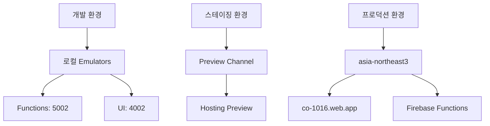
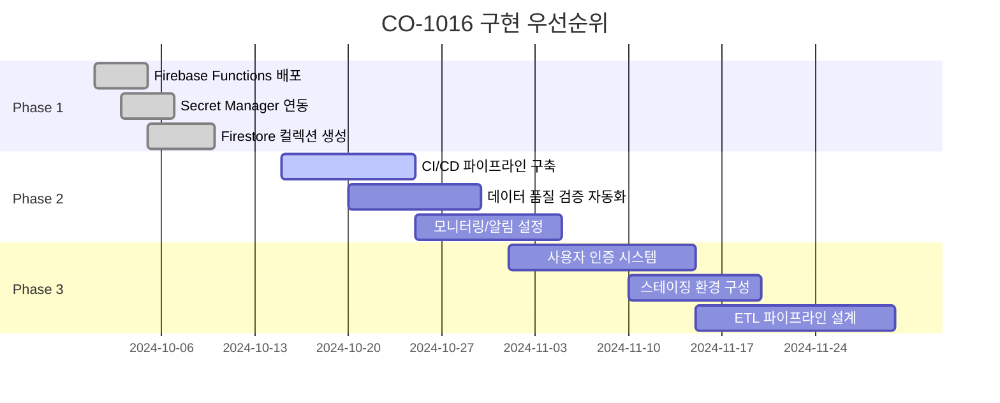

# CO-1016 CURATOR ODYSSEY: 인프라 및 배포 가이드

버전: 1.0  
최종 수정: 2025-01-XX  
작성자: NEO GOD (Director)  

## 목차

1. [인프라 구성](#1-인프라-구성)
2. [환경 전략](#2-환경-전략)
3. [CI/CD 파이프라인](#3-cicd-파이프라인)
4. [Secret Manager 연동](#4-secret-manager-연동)
5. [IAM 정책](#5-iam-정책)
6. [배포 절차](#6-배포-절차)
7. [롤백 절차](#7-롤백-절차)
8. [구현 우선순위 Gantt 차트](#8-구현-우선순위-gantt-차트)

---

## 1. 인프라 구성

### 1.1 Firebase Hosting 설정

**firebase.json:**
```json
{
  "hosting": {
    "public": "public",
    "rewrites": [
      {
        "source": "/api/artist/*/summary",
        "function": "getArtistSummary"
      },
      {
        "source": "/api/artist/*/sunburst",
        "function": "getArtistSunburst"
      },
      {
        "source": "/api/artist/*/timeseries/*",
        "function": "getArtistTimeseries"
      },
      {
        "source": "/api/compare/*/*",
        "function": "getCompareArtists"
      },
      {
        "source": "/api/report/generate",
        "function": "generateAiReport"
      },
      {
        "source": "**",
        "destination": "/index.html"
      }
    ]
  }
}
```

### 1.2 Firebase Functions 설정

**functions/package.json:**
```json
{
  "engines": {
    "node": "20"
  }
}
```

**firebase.json:**
```json
{
  "functions": [
    {
      "source": "functions",
      "codebase": "default",
      "runtime": "nodejs20"
    }
  ]
}
```

---

## 2. 환경 전략

### 2.1 환경 다이어그램



### 2.2 환경별 설정

| 환경 | Hosting | Functions | Firestore | 설명 |
|------|---------|-----------|-----------|------|
| 개발 | localhost:3000 | localhost:5002 | Emulator | 로컬 개발 |
| 스테이징 | Preview Channel | Staging 프로젝트 | Staging DB | 테스트 배포 |
| 프로덕션 | co-1016.web.app | asia-northeast3 | Production DB | 실제 서비스 |

---

## 3. CI/CD 파이프라인

**파일 위치**: `cloudbuild.yaml`

### 3.1 Cloud Build 트리거 설정

**상세 가이드**: [Cloud Build 트리거 설정 가이드](docs/deployment/CLOUD_BUILD_TRIGGER_SETUP.md) 참조

**트리거 기본 설정**:
- **이름**: `curator-odyssey-prod-deploy`
- **이벤트**: 브랜치에 푸시
- **브랜치**: `^main$` (정규식)
- **구성 파일**: `/cloudbuild.yaml`
- **서비스 계정**: `501326088107@cloudbuild.gserviceaccount.com`

**Substitution 변수**:
- `_ENVIRONMENT`: `production`
- `_PROJECT_ID`: `co-1016`
- `_FIREBASE_PROJECT`: `co-1016`
- `_FIREBASE_TOKEN`: Secret Manager에서 참조

**트리거 생성 방법**:
1. GCP Console > Cloud Build > 트리거 페이지로 이동
2. 저장소 연결 (GitHub 또는 Cloud Source Repositories)
3. **[+ 트리거 만들기]** 클릭
4. 위 설정값 입력 및 저장

**gcloud CLI로 트리거 생성**:
```bash
gcloud builds triggers create github \
  --name="curator-odyssey-prod-deploy" \
  --repo-name="YOUR_REPO_NAME" \
  --repo-owner="YOUR_GITHUB_USERNAME" \
  --branch-pattern="^main$" \
  --build-config="cloudbuild.yaml" \
  --substitutions="_ENVIRONMENT=production,_PROJECT_ID=co-1016,_FIREBASE_PROJECT=co-1016" \
  --service-account="projects/co-1016/serviceAccounts/501326088107@cloudbuild.gserviceaccount.com" \
  --project=co-1016
```

### 3.2 기본 파이프라인 단계

자세한 내용은 확장된 `cloudbuild.yaml` 파일을 참조하세요.

**주요 단계**:
1. 의존성 설치 및 빌드 (Frontend)
2. 의존성 설치 (Backend Functions)
3. 빌드 검증 (테스트 실행)
4. **Firebase CLI 설치** (npm을 통한 전역 설치)
5. Firebase 배포 (hosting, functions, firestore:indexes)
6. 배포 검증 (API 엔드포인트 테스트)
7. 롤백 준비 (이전 버전 정보 저장)
8. 알림 (Slack/PagerDuty - 선택적)

**주의사항**:
- Step 3.5: Firebase CLI는 npm을 통해 전역 설치 (`npm install -g firebase-tools`)
- Step 4: Firebase 배포는 `gcr.io/cloud-builders/node` 이미지 사용, `entrypoint: 'firebase'` 설정
- Step 6: 롤백 정보 저장은 `script`만 사용 (args/entrypoint 제거)
- Firebase 토큰은 `_FIREBASE_TOKEN` substitution 변수 사용
- Firestore 인덱스 배포 포함 (`--only firestore:indexes`)

**Firebase Builder 이미지 사용 방식**:
- 기존 방식: `gcr.io/$_PROJECT_ID/firebase` 커스텀 이미지 사용 (이미지 빌드 필요)
- 현재 방식: npm을 통한 Firebase CLI 설치 (이미지 빌드 불필요, 더 간단함)

**문제 해결**:
- [Cloud Build 문제 해결 가이드](../deployment/CLOUD_BUILD_TROUBLESHOOTING.md) 참조
- [Cloud Build 모범 사례](../deployment/CLOUD_BUILD_BEST_PRACTICES.md) 참조

```yaml
steps:
  # 1. Frontend 의존성 설치
  - name: 'gcr.io/cloud-builders/npm'
    args: ['ci']
  
  # 2. Frontend 빌드
  - name: 'gcr.io/cloud-builders/npm'
    args: ['run','build']
  
  # 3. Backend 의존성 설치
  - name: 'gcr.io/cloud-builders/npm'
    args: ['ci']
    dir: 'functions'
  
  # 4. 빌드 검증
  - name: 'gcr.io/cloud-builders/npm'
    args: ['run','test']
  
  # 5. Firebase CLI 설치 (npm 기반)
  - name: 'gcr.io/cloud-builders/npm'
    args: ['install', '-g', 'firebase-tools']
  
  # 6. Firebase 배포 (npm 기반)
  - name: 'gcr.io/cloud-builders/node'
    entrypoint: 'firebase'
    args: ['deploy','--only','hosting,functions,firestore:indexes','--project','co-1016']
```

---

## 4. Secret Manager 연동

### 4.1 시크릿 생성 및 관리

**현재 프로젝트에 생성된 Secret 목록**:

```bash
# Secret 목록 확인
gcloud secrets list --project=co-1016
```

**실제 Secret 목록** (2025-11-02 기준):

1. `ANTHROPIC_API_KEY` - Anthropic Claude API 키
2. `OPENAI_API_KEY` - OpenAI GPT-4 API 키 (폴백용)
3. `VERTEX_AI_CREDENTIALS` - Vertex AI Gemini 서비스 계정 인증 정보
4. `app-config` - 애플리케이션 설정 (AI 모델, 환경 변수 등)
5. `apphosting-github-conn-bf9212r-github-oauthtoken-111de7` - GitHub App Hosting 연결 토큰
6. `co-1016-firebase-adminsdk-fbsvc-ec20702062` - Firebase Admin SDK 서비스 계정 키

**Secret 생성 예시**:

```bash
# OpenAI API 키
echo -n "your-api-key" | gcloud secrets create OPENAI_API_KEY --data-file=- --project=co-1016

# Anthropic API 키
echo -n "your-api-key" | gcloud secrets create ANTHROPIC_API_KEY --data-file=- --project=co-1016

# Vertex AI 인증 정보
echo -n '{"type":"service_account",...}' | gcloud secrets create VERTEX_AI_CREDENTIALS --data-file=- --project=co-1016

# 애플리케이션 설정
echo -n '{"ai":{"vertex":{"model":"gemini-1.5-pro"}}}' | gcloud secrets create app-config --data-file=- --project=co-1016
```

**Secret 버전 관리**:

```bash
# Secret 버전 목록 확인
gcloud secrets versions list SECRET_NAME --project=co-1016

# 새 버전 추가
echo -n "new-value" | gcloud secrets versions add SECRET_NAME --data-file=- --project=co-1016

# 특정 버전 접근
gcloud secrets versions access VERSION_NUMBER --secret=SECRET_NAME --project=co-1016
```

### 4.2 서비스 계정 권한 부여

```bash
gcloud projects add-iam-policy-binding co-1016 \
  --member="serviceAccount:co-function-runner@co-1016.iam.gserviceaccount.com" \
  --role="roles/secretmanager.secretAccessor"
```

---

## 5. IAM 정책

### 5.1 서비스 계정 역할 매핑

#### Firebase Admin SDK 서비스 계정

**서비스 계정**: `firebase-adminsdk-fbsvc@co-1016.iam.gserviceaccount.com`

**부여된 역할** (총 28개):

**Firebase 관련**:
- `roles/firebase.admin` - Firebase 전체 관리
- `roles/firebase.sdkAdminServiceAgent` - Firebase SDK 관리
- `roles/firebaseappdistro.admin` - Firebase App Distribution 관리
- `roles/firebasedatabase.admin` - Firebase Realtime Database 관리

**데이터베이스**:
- `roles/datastore.user` - Firestore 접근

**AI 및 머신러닝**:
- `roles/aiplatform.admin` - Vertex AI 관리 (Gemini 1.5 Pro 사용)

**컨테이너 및 컴퓨팅**:
- `roles/container.developer` - GKE 컨테이너 관리
- `roles/compute.instanceAdmin.v1` - Compute Engine 인스턴스 관리

**빌드 및 배포**:
- `roles/cloudbuild.workerPoolUser` - Cloud Build Worker Pool 사용
- `roles/cloudconfig.admin` - Cloud Config 관리

**Functions 및 서버리스**:
- `roles/cloudfunctions.admin` - Cloud Functions 관리
- `roles/cloudfunctions.developer` - Cloud Functions 개발

**보안 및 키 관리**:
- `roles/cloudkms.cryptoKeyDecrypter` - Cloud KMS 키 복호화
- `roles/secretmanager.secretAccessor` - Secret Manager 접근
- `roles/secretmanager.secretVersionManager` - Secret 버전 관리

**IAM 및 인증**:
- `roles/iam.serviceAccountTokenCreator` - 서비스 계정 토큰 생성
- `roles/iam.serviceAccountUser` - 서비스 계정 사용

**스토리지**:
- `roles/storage.admin` - Cloud Storage 전체 관리
- `roles/storage.objectCreator` - Cloud Storage 객체 생성

**로깅 및 모니터링**:
- `roles/logging.configWriter` - Cloud Logging 설정 작성
- `roles/logging.logWriter` - Cloud Logging 로그 작성

**기타**:
- `roles/editor` - 프로젝트 편집 권한
- `roles/artifactregistry.writer` - Artifact Registry 쓰기
- `roles/run.admin` - Cloud Run 관리

**권한 확인 명령어**:
```bash
gcloud projects get-iam-policy co-1016 \
  --flatten="bindings[].members" \
  --format="table(bindings.role)" \
  --filter="bindings.members:firebase-adminsdk-fbsvc@co-1016.iam.gserviceaccount.com"
```

#### Cloud Build 서비스 계정

**서비스 계정**: `501326088107@cloudbuild.gserviceaccount.com`

**부여된 역할** (총 17개):

**Cloud Build 관련**:
- `roles/cloudbuild.builds.builder` - 빌드 실행
- `roles/cloudbuild.builds.editor` - 빌드 관리
- `roles/cloudbuild.workerPoolUser` - Worker Pool 사용

**Firebase 관련**:
- `roles/firebase.admin` - Firebase 배포 및 관리

**Functions 및 서버리스**:
- `roles/cloudfunctions.developer` - Cloud Functions 개발

**보안 및 키 관리**:
- `roles/cloudkms.cryptoKeyDecrypter` - Cloud KMS 키 복호화
- `roles/secretmanager.secretAccessor` - Secret Manager 접근

**컨테이너 및 컴퓨팅**:
- `roles/container.developer` - GKE 컨테이너 관리
- `roles/compute.instanceAdmin.v1` - Compute Engine 인스턴스 관리

**IAM**:
- `roles/iam.serviceAccountUser` - 서비스 계정 사용

**스토리지**:
- `roles/storage.admin` - Cloud Storage 관리
- `roles/storage.objectCreator` - Cloud Storage 객체 생성
- `roles/artifactregistry.writer` - Artifact Registry 쓰기

**로깅 및 모니터링**:
- `roles/logging.configWriter` - Cloud Logging 설정 작성
- `roles/logging.logWriter` - Cloud Logging 로그 작성

**기타**:
- `roles/editor` - 프로젝트 편집 권한
- `roles/run.admin` - Cloud Run 관리

**권한 확인 명령어**:
```bash
export PROJECT_NUMBER=$(gcloud projects describe co-1016 --format="value(projectNumber)")
gcloud projects get-iam-policy co-1016 \
  --flatten="bindings[].members" \
  --format="table(bindings.role)" \
  --filter="bindings.members:serviceAccount:${PROJECT_NUMBER}@cloudbuild.gserviceaccount.com"
```

#### 주요 역할 요약

| 서비스 계정 | 주요 역할 | 용도 |
|------------|---------|------|
| `firebase-adminsdk-fbsvc@co-1016` | `roles/firebase.admin`, `roles/datastore.user`, `roles/secretmanager.secretAccessor`, `roles/aiplatform.admin` | Firebase 관리, Firestore 접근, Secret Manager 접근, Vertex AI 관리 |
| `501326088107@cloudbuild.gserviceaccount.com` | `roles/cloudbuild.builds.builder`, `roles/firebase.admin`, `roles/secretmanager.secretAccessor` | CI/CD 빌드 실행, Firebase 배포, Secret Manager 접근 |

### 5.2 최소 권한 원칙

- 각 서비스 계정은 필요한 최소한의 권한만 부여
- 개발 환경과 프로덕션 환경의 권한 분리

---

## 6. 배포 절차

### 6.1 사전 점검

- [ ] GCP 프로젝트 활성화 확인
- [ ] Firebase CLI 로그인 확인
- [ ] Secret Manager 키 설정 확인
- [ ] IAM 권한 확인

### 6.2 배포 명령어

```bash
# Functions 배포
cd functions
npm ci
firebase deploy --only functions --project co-1016

# Hosting 배포
npm ci
npm run build
firebase deploy --only hosting --project co-1016

# 동시 배포
firebase deploy --only hosting,functions --project co-1016
```

### 6.3 배포 검증

```bash
# API 엔드포인트 테스트
curl https://co-1016.web.app/api/artist/ARTIST_0005/summary

# 헬스체크
curl https://co-1016.web.app/api/ai/vertex-health
```

---

## 7. 롤백 절차

### 7.1 Hosting 롤백

```bash
# Preview 채널로 배포
firebase hosting:channel:deploy preview --project co-1016

# 검증 후 프로덕션으로 승격
firebase hosting:channel:deploy preview --project co-1016 --only production

# 또는 이전 버전으로 롤백
firebase hosting:rollback --project co-1016
```

### 7.2 Functions 롤백

```bash
# 특정 함수만 롤백
firebase deploy --only functions:getArtistSummary@previous-version --project co-1016

# 또는 전체 Functions 롤백
firebase functions:rollback --project co-1016
```

### 7.3 긴급 폴백

**임시 조치:**
- `useDataSource`를 `mock` 모드로 전환
- API 요청을 Mock 데이터로 라우팅

---

## 8. 구현 우선순위 Gantt 차트



---

**문서 버전 관리:**
- v1.0 (2025-01-XX): 초기 작성

