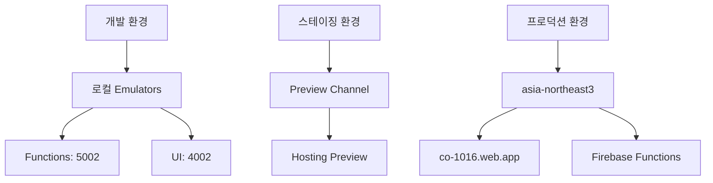
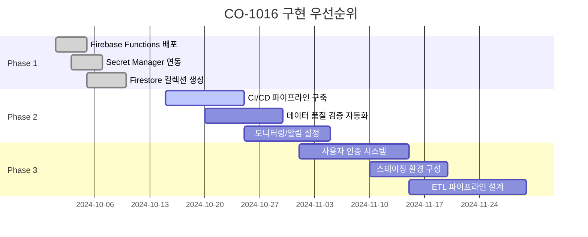

# CO-1016 CURATOR ODYSSEY: 인프라 및 배포 가이드

버전: 1.0  
최종 수정: 2025-01-XX  
작성자: NEO GOD (Director)  

## 목차

1. [인프라 구성](#1-인프라-구성)
2. [환경 전략](#2-환경-전략)
3. [CI/CD 파이프라인](#3-cicd-파이프라인)
4. [Secret Manager 연동](#4-secret-manager-연동)
5. [IAM 정책](#5-iam-정책)
6. [배포 절차](#6-배포-절차)
7. [롤백 절차](#7-롤백-절차)
8. [구현 우선순위 Gantt 차트](#8-구현-우선순위-gantt-차트)

---

## 1. 인프라 구성

### 1.1 Firebase Hosting 설정

**firebase.json:**
```json
{
  "hosting": {
    "public": "public",
    "rewrites": [
      {
        "source": "/api/artist/*/summary",
        "function": "getArtistSummary"
      },
      {
        "source": "/api/artist/*/sunburst",
        "function": "getArtistSunburst"
      },
      {
        "source": "/api/artist/*/timeseries/*",
        "function": "getArtistTimeseries"
      },
      {
        "source": "/api/compare/*/*",
        "function": "getCompareArtists"
      },
      {
        "source": "/api/report/generate",
        "function": "generateAiReport"
      },
      {
        "source": "**",
        "destination": "/index.html"
      }
    ]
  }
}
```

### 1.2 Firebase Functions 설정

**functions/package.json:**
```json
{
  "engines": {
    "node": "20"
  }
}
```

**firebase.json:**
```json
{
  "functions": [
    {
      "source": "functions",
      "codebase": "default",
      "runtime": "nodejs20"
    }
  ]
}
```

---

## 2. 환경 전략

### 2.1 환경 다이어그램



### 2.2 환경별 설정

| 환경 | Hosting | Functions | Firestore | 설명 |
|------|---------|-----------|-----------|------|
| 개발 | localhost:3000 | localhost:5002 | Emulator | 로컬 개발 |
| 스테이징 | Preview Channel | Staging 프로젝트 | Staging DB | 테스트 배포 |
| 프로덕션 | co-1016.web.app | asia-northeast3 | Production DB | 실제 서비스 |

---

## 3. CI/CD 파이프라인

**파일 위치**: `cloudbuild.yaml`

자세한 내용은 확장된 `cloudbuild.yaml` 파일을 참조하세요.

### 3.1 기본 파이프라인 단계

```yaml
steps:
  - name: 'gcr.io/cloud-builders/npm'
    args: ['ci']
  
  - name: 'gcr.io/cloud-builders/npm'
    args: ['run','build']
  
  - name: 'gcr.io/cloud-builders/npm'
    args: ['ci']
    dir: 'functions'
  
  - name: 'gcr.io/$PROJECT_ID/firebase'
    args: ['deploy','--only','hosting,functions','--project','co-1016']
```

---

## 4. Secret Manager 연동

### 4.1 시크릿 생성

```bash
# OpenAI API 키
echo -n "your-api-key" | gcloud secrets create openai-api-key --data-file=-

# Vertex AI 인증 정보
echo -n '{"type":"service_account",...}' | gcloud secrets create vertex-ai-credentials --data-file=-

# 애플리케이션 설정
echo -n '{"ai":{"vertex":{"model":"gemini-1.5-pro"}}}' | gcloud secrets create app-config --data-file=-
```

### 4.2 서비스 계정 권한 부여

```bash
gcloud projects add-iam-policy-binding co-1016 \
  --member="serviceAccount:co-function-runner@co-1016.iam.gserviceaccount.com" \
  --role="roles/secretmanager.secretAccessor"
```

---

## 5. IAM 정책

### 5.1 서비스 계정 역할 매핑

| 서비스 계정 | 역할 | 설명 |
|------------|------|------|
| `firebase-adminsdk-fbsvc@co-1016` | `roles/firebase.admin` | 전체 Firebase 관리 |
| `firebase-adminsdk-fbsvc@co-1016` | `roles/datastore.user` | Firestore 접근 |
| `co-function-runner@co-1016` | `roles/secretmanager.secretAccessor` | Secret Manager 접근 |
| `co-function-runner@co-1016` | `roles/aiplatform.user` | Vertex AI 접근 |
| `co-function-runner@co-1016` | `roles/datastore.user` | Firestore 접근 |

### 5.2 최소 권한 원칙

- 각 서비스 계정은 필요한 최소한의 권한만 부여
- 개발 환경과 프로덕션 환경의 권한 분리

---

## 6. 배포 절차

### 6.1 사전 점검

- [ ] GCP 프로젝트 활성화 확인
- [ ] Firebase CLI 로그인 확인
- [ ] Secret Manager 키 설정 확인
- [ ] IAM 권한 확인

### 6.2 배포 명령어

```bash
# Functions 배포
cd functions
npm ci
firebase deploy --only functions --project co-1016

# Hosting 배포
npm ci
npm run build
firebase deploy --only hosting --project co-1016

# 동시 배포
firebase deploy --only hosting,functions --project co-1016
```

### 6.3 배포 검증

```bash
# API 엔드포인트 테스트
curl https://co-1016.web.app/api/artist/ARTIST_0005/summary

# 헬스체크
curl https://co-1016.web.app/api/ai/vertex-health
```

---

## 7. 롤백 절차

### 7.1 Hosting 롤백

```bash
# Preview 채널로 배포
firebase hosting:channel:deploy preview --project co-1016

# 검증 후 프로덕션으로 승격
firebase hosting:channel:deploy preview --project co-1016 --only production

# 또는 이전 버전으로 롤백
firebase hosting:rollback --project co-1016
```

### 7.2 Functions 롤백

```bash
# 특정 함수만 롤백
firebase deploy --only functions:getArtistSummary@previous-version --project co-1016

# 또는 전체 Functions 롤백
firebase functions:rollback --project co-1016
```

### 7.3 긴급 폴백

**임시 조치:**
- `useDataSource`를 `mock` 모드로 전환
- API 요청을 Mock 데이터로 라우팅

---

## 8. 구현 우선순위 Gantt 차트



---

**문서 버전 관리:**
- v1.0 (2025-01-XX): 초기 작성

