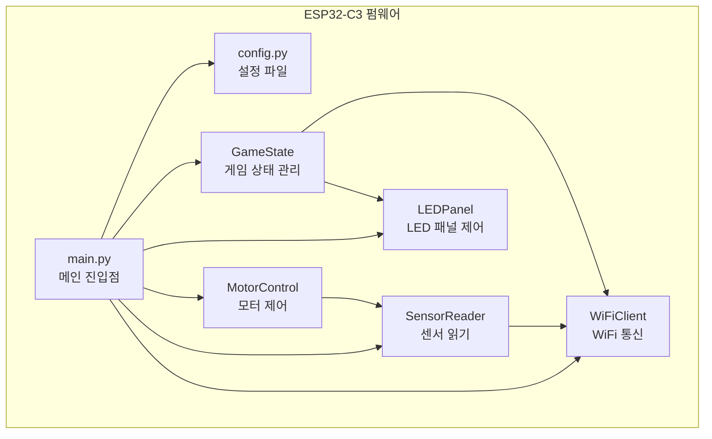
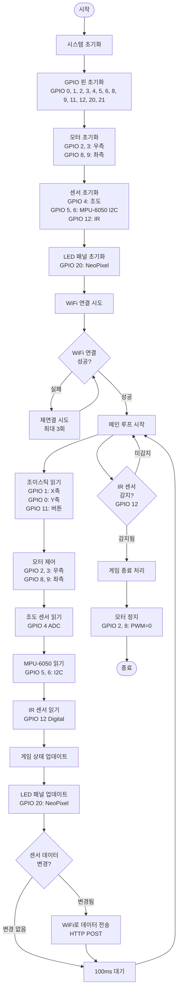
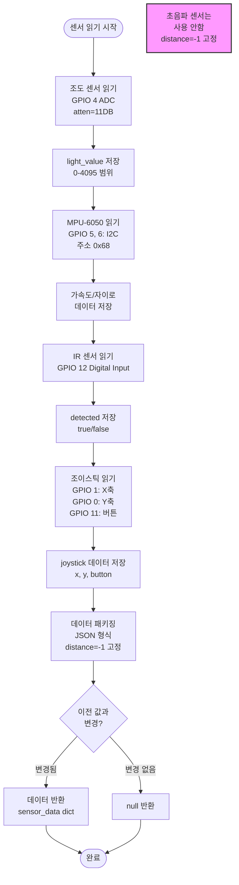

# 피지컬 컴퓨팅 MVP 기술 설계 문서 (Physical Computing MVP Technical Design Document)

**버전**: MVP v1.1

**상태**: Draft (초안)

**최종 수정**: 2025-11-10

**소유자**: NEO GOD (Director)

**승인자**: Technical Lead (TBD)

**개정 이력**:
- MVP v1.0 (2025-11-13): 초기 작성
- MVP v1.1 (2025-11-10): 버전 동기화, 참조 문서 정리

**배포 범위**: Physical Computing MVP Development Team, Hardware Team, QA Team

**변경 관리 프로세스**: GitHub Issues/PR 워크플로, 변경 시 MVP_FRD/MVP_SRD/MVP_VID 동시 업데이트

**참조 문서 (References)**:
- **[BRD v1.1](../requirements/BRD.md)** - 피지컬 컴퓨팅 아트워크 및 웹앱 통합 비즈니스 요구사항
- **[피지컬 컴퓨팅 MVP FRD](MVP_PHYSICAL_COMPUTING_FRD.md)** - MVP 기능 요구사항 문서
- **[피지컬 컴퓨팅 MVP SRD](MVP_PHYSICAL_COMPUTING_SRD.md)** - MVP 소프트웨어 요구사항 문서
- **[피지컬 컴퓨팅 TSD](PHYSICAL_COMPUTING_TSD.md)** - 전체 기술 설계 문서
- **[하드웨어 세팅 체크리스트](HARDWARE_SETUP_CHECKLIST.md)** - 하드웨어 세팅 단계별 체크리스트

---

## 1. 문서 개요 (Introduction)

### 1.1 문서 목적 (Purpose)

본 문서는 피지컬 컴퓨팅 아트워크 MVP의 기술 설계를 상세히 정의합니다. ESP32-C3 기반 하드웨어 스펙, GPIO 핀 할당, 펌웨어 구조, 플로우차트, 통신 프로토콜을 포함합니다.

### 1.2 프로젝트 개요 (Project Overview)

MVP는 핵심 기능만 포함하여 하드웨어 작동성과 기본 인터랙션을 검증하는 것을 목표로 합니다.

**주요 특징**:
- 배 모형 불도저 제어 (모터 2개)
- 공 포집 검증 (그물망)
- 센서 데이터 수집 (조도, 초음파, IR)
- LED RGB 64 패널 표시
- WiFi 통신 (HTTP POST만)

### 1.3 대상 독자 (Audience)

- Physical Computing MVP 개발자 (ESP32-C3 펌웨어)
- 하드웨어 엔지니어 (배 모형 불도저 제작)
- QA 엔지니어 (테스트 시나리오)

---

## 2. 하드웨어 스펙 상세 (Hardware Specification)

### 2.1 ESP32-C3 GPIO 핀 할당 테이블

| GPIO 핀 | 구성요소 | 용도 | 모드 | 설명 |
|---------|---------|------|------|------|
| GPIO 0 | 조이스틱 Y축 | 조이스틱 Y 입력 | ADC Input | 0-4095 범위, 중앙 ~2048 |
| GPIO 1 | 조이스틱 X축 | 조이스틱 X 입력 | ADC Input | 0-4095 범위, 중앙 ~2048 |
| GPIO 2 | 모터 우측 PWM | 우측 모터 속도 제어 | PWM Output | 고정 속도 512 (0-1023) |
| GPIO 3 | 모터 우측 방향 | 우측 모터 방향 제어 | Digital Output | HIGH: 전진, LOW: 역회전 |
| GPIO 4 | 조도 센서 (CDS) | 공 감지 | ADC Input | 0-4095 범위, 11dB 감쇠 |
| GPIO 5 | MPU-6050 SDA | MPU-6050 I2C 데이터 | I2C SDA | I2C 통신 (400kHz) |
| GPIO 6 | MPU-6050 SCL | MPU-6050 I2C 클럭 | I2C SCL | I2C 통신 (400kHz) |
| GPIO 8 | 모터 좌측 PWM | 좌측 모터 속도 제어 | PWM Output | 고정 속도 512 (0-1023) |
| GPIO 9 | 모터 좌측 방향 | 좌측 모터 방향 제어 | Digital Output | HIGH: 전진, LOW: 역회전 |
| GPIO 11 | 조이스틱 버튼 | 조이스틱 버튼 입력 | Digital Input | 풀업 모드, LOW: 눌림 |
| GPIO 12 | IR 센서 | 배 감지 (골인) | Digital Input | HIGH/LOW (센서 타입에 따라) |
| GPIO 20 | LED RGB 64 패널 NEO | LED 패널 NeoPixel 데이터 | Digital Output | WS2812B 프로토콜 (단일 핀) |
| GPIO 21 | 버튼 (선택사항) | 보물 상자 선택 | Digital Input | 풀업 모드, LOW: 눌림 |
| WiFi | WiFi 모듈 | 백엔드 통신 | WiFi | ESP32-C3 내장 |
| - | 초음파 센서 | 초음파 거리 측정 | - | 현재 사용 안함 |

### 2.2 구성요소별 연결 회로도

#### 2.2.1 모터 연결 회로도

```
ESP32-C3                    모터 드라이버 모듈
GPIO 2 (PWM)  ────────────> 우측 모터 PWM 입력
GPIO 3 (DIR)  ────────────> 우측 모터 방향 제어
GPIO 8 (PWM)  ────────────> 좌측 모터 PWM 입력
GPIO 9 (DIR)  ────────────> 좌측 모터 방향 제어
GND          ────────────> GND
5V/VCC       ────────────> VCC (모터 전원)

모터 드라이버 모듈
우측 모터 출력 ────────────> 우측 모터 (+/-)
좌측 모터 출력 ────────────> 좌측 모터 (+/-)
```

**모터 제어 로직**:
- PWM 값: 0-1023 (고정 속도 512)
- 방향 제어: HIGH = 전진, LOW = 역회전
- 좌회전: 좌측 모터 역회전/정지, 우측 모터 전진
- 우회전: 좌측 모터 전진, 우측 모터 역회전/정지

#### 2.2.2 조도 센서 연결 회로도

```
ESP32-C3                    조도 센서 (CDS)
GPIO 4 (ADC)  ────────────> 센서 출력
3.3V          ────────────> VCC
GND           ────────────> GND
                     |
                     └─── 저항 (10kΩ) ─── GND
```

**ADC 설정**:
- 감쇠: `ADC.ATTN_11DB` (0-3.3V 범위)
- 해상도: 12비트 (0-4095)
- 읽기 주기: 100ms

#### 2.2.3 초음파 센서 연결 회로도 (현재 사용 안함)

**참고**: 초음파 센서는 현재 MVP에서 사용하지 않습니다.

```
ESP32-C3                    초음파 센서 (HC-SR04) - 비활성화
(사용 안함)                  TRIG
(사용 안함)                  ECHO
5V                           VCC
GND                          GND
```

**초음파 센서 동작** (참고용, 현재 비활성화):
- 현재 사용하지 않음
- 코드에서 항상 -1 반환

#### 2.2.4 IR 센서 연결 회로도

```
ESP32-C3                    IR 센서
GPIO 12 (Digital) <──────── OUT
3.3V               ─────── VCC
GND                 ─────── GND
```

**IR 센서 동작**:
- 디지털 입력으로 감지 여부 확인
- HIGH 또는 LOW (센서 타입에 따라 반전 가능)
- 배 감지 시 상태 변경

#### 2.2.5 LED RGB 64 패널 연결 회로도 (WS2812B NeoPixel)

```
ESP32-C3                    LED RGB 64 패널 (8x8 WS2812B)
GPIO 20 (NEO)  ────────────> DIN (NeoPixel 데이터 입력)
5V             ────────────> VCC (LED 전원)
GND            ────────────> GND
```

**LED 패널 동작**:
- WS2812B NeoPixel 프로토콜 사용 (단일 데이터 핀)
- MicroPython `neopixel` 라이브러리 사용
- 8x8 = 64개 LED 제어 (행 우선 순서)
- 업데이트 주기: 33ms (30fps)
- 데이터 전송: NeoPixel.write() 메서드 사용

#### 2.2.6 조이스틱 연결 회로도 (Deek-Robot joystick-02)

```
ESP32-C3                    조이스틱 모듈
GPIO 1 (ADC)   <─────────── X축 (VRX)
GPIO 0 (ADC)   <─────────── Y축 (VRY)
GPIO 11 (Digital) <──────── SW (버튼)
3.3V           ──────────── VCC
GND            ──────────── GND
```

**조이스틱 동작**:
- X축 (GPIO 1): 좌우 방향 제어 (0-4095, 중앙 ~2048)
- Y축 (GPIO 0): 상하 방향 (현재 미사용)
- 버튼 (GPIO 11): 풀업 모드, LOW = 눌림
- 데드존: 중앙 ±50

#### 2.2.7 MPU-6050 연결 회로도

```
ESP32-C3                    MPU-6050 모듈
GPIO 6 (SCL)  ────────────> SCL (I2C 클럭)
GPIO 5 (SDA)  ────────────> SDA (I2C 데이터)
3.3V          ────────────> VCC
GND           ────────────> GND
```

**MPU-6050 동작**:
- I2C 통신 프로토콜 사용
- 주소: 0x68
- 통신 주파수: 400kHz
- 가속도계 및 자이로스코프 데이터 제공

### 2.3 전원 공급 명세

**ESP32-C3 전원**:
- 입력: USB-C 5V
- 내부 레귤레이터: 3.3V

**모터 전원**:
- 외부 전원: 5V 또는 12V (모터 사양에 따라)
- 모터 드라이버 모듈 사용 권장

**센서 전원**:
- 조도 센서: 3.3V (ESP32-C3 공급)
- MPU-6050: 3.3V (ESP32-C3 공급)
- IR 센서: 3.3V 또는 5V (센서 사양에 따라)
- 초음파 센서: 사용 안함

**LED RGB 64 패널 전원**:
- 5V 외부 전원 권장 (전류 소비 큼)
- 최대 전류: 64개 × 60mA = 3.84A (전체 밝기 시)

**공통 그라운드**:
- 모든 구성요소의 GND를 공통 연결 필수

---

## 3. 펌웨어 구조 상세 (Firmware Structure)

### 3.1 모듈 구조 다이어그램



### 3.2 모듈별 함수 명세

#### 3.2.1 motor_control.py

**클래스**: `MotorController`

**함수**:
- `__init__(self)`: 모터 핀 초기화 (GPIO 2, 3: 우측 모터, GPIO 8, 9: 좌측 모터)
- `set_direction(self, joystick_x: int)`: 조이스틱 X값에 따라 모터 방향 제어
  - 파라미터: `joystick_x` (0-4095, 중앙 ~2048)
  - 반환값: 없음
  - 동작: 데드존 체크 후 모터 PWM 및 방향 설정

**핵심 로직**:
```python
def set_direction(self, joystick_x):
    """조이스틱 X값에 따라 모터 방향 제어"""
    deadzone = 50
    center = 2048
    MOTOR_SPEED = 512
    
    x_offset = joystick_x - center
    
    if abs(x_offset) < deadzone:
        # 직진: 양쪽 모터 동일 속도 전진
        self.motor_left_pwm.duty(MOTOR_SPEED)
        self.motor_left_dir.value(1)  # FORWARD
        self.motor_right_pwm.duty(MOTOR_SPEED)
        self.motor_right_dir.value(1)  # FORWARD
    elif x_offset < -deadzone:
        # 좌회전: 왼쪽 모터 역회전/정지, 오른쪽 전진
        self.motor_left_pwm.duty(MOTOR_SPEED // 2)
        self.motor_left_dir.value(0)  # REVERSE
        self.motor_right_pwm.duty(MOTOR_SPEED)
        self.motor_right_dir.value(1)  # FORWARD
    else:  # x_offset > deadzone
        # 우회전: 왼쪽 전진, 오른쪽 모터 역회전/정지
        self.motor_left_pwm.duty(MOTOR_SPEED)
        self.motor_left_dir.value(1)  # FORWARD
        self.motor_right_pwm.duty(MOTOR_SPEED // 2)
        self.motor_right_dir.value(0)  # REVERSE
```

#### 3.2.2 sensor_reader.py

**클래스**: `SensorReader`

**함수**:
- `__init__(self)`: 센서 핀 초기화
  - 조도 센서: GPIO 6 (ADC)
  - 초음파 센서: GPIO 7 (Trigger), GPIO 8 (Echo)
  - IR 센서: GPIO 12 (Digital)
  - 조이스틱: GPIO 9 (X축), GPIO 10 (Y축), GPIO 11 (버튼)

- `read_light_sensor(self) -> int`: 조도 센서 읽기
  - 반환값: 0-4095 (ADC 값)
  - 읽기 주기: 100ms

- `read_ultrasonic(self) -> float`: 초음파 센서 읽기
  - 반환값: 거리 (cm)
  - 동작: Trigger 신호 출력 → Echo 신호 대기 → 거리 계산

- `read_ir_sensor(self) -> bool`: IR 센서 읽기
  - 반환값: True (감지됨) 또는 False (미감지)

- `read_joystick(self) -> dict`: 조이스틱 읽기
  - 반환값: `{"x": int, "y": int, "button": bool}`

**핵심 로직**:
```python
def read_ultrasonic(self):
    """초음파 센서 읽기"""
    # Trigger 신호 출력 (10μs HIGH)
    self.ultrasonic_trigger.value(1)
    sleep_us(10)
    self.ultrasonic_trigger.value(0)
    
    # Echo 신호 대기
    timeout = 30000  # 30ms 타임아웃
    start_time = ticks_us()
    
    while self.ultrasonic_echo.value() == 0:
        if ticks_diff(ticks_us(), start_time) > timeout:
            return -1  # 타임아웃
        pass
    
    pulse_start = ticks_us()
    
    while self.ultrasonic_echo.value() == 1:
        if ticks_diff(ticks_us(), pulse_start) > timeout:
            return -1  # 타임아웃
        pass
    
    pulse_end = ticks_us()
    pulse_width = ticks_diff(pulse_end, pulse_start)
    
    # 거리 계산 (cm)
    distance = (pulse_width * 0.034) / 2
    return distance
```

#### 3.2.3 led_panel.py

**클래스**: `LEDPanel`

**함수**:
- `__init__(self)`: LED 패널 초기화 (GPIO 13, 14, 15)
- `set_pixel(self, x: int, y: int, r: int, g: int, b: int)`: 픽셀 색상 설정
  - 파라미터: x (0-7), y (0-7), r/g/b (0-255)
- `clear(self)`: 패널 클리어
- `show(self)`: 패널 업데이트 (데이터 전송)
- `display_game_state(self, state: str)`: 게임 상태 표시
  - 파라미터: `"init"`, `"waiting"`, `"playing"`, `"finished"`

**핵심 로직**:
```python
def display_game_state(self, state):
    """게임 상태 표시"""
    self.clear()
    
    if state == "init":
        # 전체 깜빡임
        for y in range(8):
            for x in range(8):
                self.set_pixel(x, y, 255, 255, 255)
        self.show()
        sleep_ms(200)
        self.clear()
        self.show()
        
    elif state == "waiting":
        # 중앙 점 표시
        self.set_pixel(3, 3, 0, 255, 0)
        self.set_pixel(4, 3, 0, 255, 0)
        self.set_pixel(3, 4, 0, 255, 0)
        self.set_pixel(4, 4, 0, 255, 0)
        self.show()
        
    elif state == "playing":
        # 진행 방향 화살표
        for i in range(3):
            self.set_pixel(2, 3+i, 0, 0, 255)
        for i in range(5):
            self.set_pixel(5+i, 3, 0, 0, 255)
        self.show()
        
    elif state == "finished":
        # 전체 밝기 증가
        for y in range(8):
            for x in range(8):
                self.set_pixel(x, y, 255, 255, 0)
        self.show()
```

#### 3.2.4 wifi_client.py

**클래스**: `WiFiClient`

**함수**:
- `__init__(self, ssid: str, password: str, backend_host: str, backend_port: int)`: WiFi 클라이언트 초기화
- `connect(self) -> bool`: WiFi 연결
  - 반환값: True (성공) 또는 False (실패)
  - 재시도: 최대 3회
- `send_sensor_data(self, sensor_type: str, sensor_id: int, data: dict) -> bool`: 센서 데이터 전송
  - 파라미터: 센서 타입, 센서 ID, 데이터 딕셔너리
  - 반환값: True (성공) 또는 False (실패)
  - 동작: HTTP POST 요청 생성 및 전송

**핵심 로직**:
```python
def send_sensor_data(self, sensor_type, sensor_id, data):
    """센서 데이터 전송"""
    try:
        payload = {
            "sensor_type": sensor_type,
            "sensor_id": sensor_id,
            **data,
            "timestamp": ticks_ms()
        }
        
        json_data = json.dumps(payload)
        
        # HTTP POST 요청 생성
        addr = socket.getaddrinfo(self.backend_host, self.backend_port)[0][-1]
        s = socket.socket()
        s.settimeout(5)  # 5초 타임아웃
        s.connect(addr)
        
        request = f"POST /api/sensor-data HTTP/1.1\r\n"
        request += f"Host: {self.backend_host}:{self.backend_port}\r\n"
        request += f"Content-Type: application/json\r\n"
        request += f"Content-Length: {len(json_data)}\r\n"
        request += f"\r\n"
        request += json_data
        
        s.send(request.encode())
        response = s.recv(1024)
        s.close()
        
        # 응답 파싱
        if b"status" in response and b"ok" in response:
            return True
        return False
        
    except Exception as e:
        print(f"전송 오류: {e}")
        return False
```

#### 3.2.5 game_state.py

**클래스**: `GameState`

**함수**:
- `__init__(self)`: 게임 상태 초기화
- `update_state(self, sensor_data: dict)`: 센서 데이터 기반 상태 업데이트
- `get_state(self) -> str`: 현재 게임 상태 반환
- `get_balls_collected(self) -> dict`: 공 수집 현황 반환

**상태 머신**:
- `INIT`: 초기화
- `WAITING`: 대기 (진입점 대기)
- `AGE_10`: 10대 구간
- `AGE_20`: 20대 구간
- `AGE_30`: 30대 구간
- `FINISHED`: 게임 종료

---

## 4. 플로우차트/흐름도 (Flowcharts)

### 4.1 전체 시스템 플로우차트



### 4.2 모터 제어 플로우차트

```mermaid
flowchart TD
    Start([조이스틱 입력]) --> ReadX[조이스틱 X축 읽기<br/>GPIO 1 ADC<br/>0-4095 범위]
    ReadX --> CalcOffset[X축 오프셋 계산<br/>x_offset = x - 2048]
    CalcOffset --> CheckDeadzone{데드존<br/>체크<br/>abs(x_offset) < 50?}
    
    CheckDeadzone -->|예| Forward[직진 모드]
    CheckDeadzone -->|아니오, x_offset < -50| LeftTurn[좌회전 모드]
    CheckDeadzone -->|아니오, x_offset > 50| RightTurn[우회전 모드]
    
    Forward --> SetMotorLeftF[좌측 모터 설정<br/>GPIO 8: PWM=512<br/>GPIO 9: HIGH FORWARD]
    SetMotorLeftF --> SetMotorRightF[우측 모터 설정<br/>GPIO 2: PWM=512<br/>GPIO 3: HIGH FORWARD]
    
    LeftTurn --> SetMotorLeftL[좌측 모터 설정<br/>GPIO 8: PWM=256<br/>GPIO 9: LOW REVERSE]
    SetMotorLeftL --> SetMotorRightL[우측 모터 설정<br/>GPIO 2: PWM=512<br/>GPIO 3: HIGH FORWARD]
    
    RightTurn --> SetMotorLeftR[좌측 모터 설정<br/>GPIO 8: PWM=512<br/>GPIO 9: HIGH FORWARD]
    SetMotorLeftR --> SetMotorRightR[우측 모터 설정<br/>GPIO 2: PWM=256<br/>GPIO 3: LOW REVERSE]
    
    SetMotorRightF --> End([완료])
    SetMotorRightL --> End
    SetMotorRightR --> End
```

### 4.3 센서 읽기 플로우차트



### 4.4 WiFi 통신 플로우차트

```mermaid
flowchart TD
    Start([센서 데이터 전송]) --> CheckWiFi{WiFi<br/>연결됨?<br/>wlan.isconnected()}
    CheckWiFi -->|아니오| ConnectWiFi[WiFi 연결 시도<br/>wlan.connect(SSID, PASSWORD)]
    ConnectWiFi --> WaitConnect[연결 대기<br/>최대 20초]
    WaitConnect --> CheckConnect{연결<br/>성공?}
    CheckConnect -->|실패| RetryCount{재시도<br/>횟수 < 3?}
    RetryCount -->|예| ConnectWiFi
    RetryCount -->|아니오| Error[에러 로그<br/>WiFi 연결 실패]
    CheckConnect -->|성공| CreateJSON
    CheckWiFi -->|예| CreateJSON[JSON 데이터 생성<br/>json.dumps(payload)]
    
    CreateJSON --> CreateHTTP[HTTP POST 요청 생성<br/>헤더 + 본문]
    CreateHTTP --> SocketConnect[소켓 연결<br/>socket.connect(addr)]
    SocketConnect --> SendRequest[요청 전송<br/>socket.send(request)]
    SendRequest --> WaitResponse[응답 대기<br/>socket.recv(1024)<br/>타임아웃 5초]
    WaitResponse --> CheckResponse{응답<br/>수신?}
    CheckResponse -->|타임아웃| RetryHTTP{재시도<br/>횟수 < 3?}
    RetryHTTP -->|예| SocketConnect
    RetryHTTP -->|아니오| Error
    CheckResponse -->|수신| ParseResponse[응답 파싱<br/>문자열 검색]
    ParseResponse --> CheckStatus{status ==<br/>'ok'?}
    CheckStatus -->|예| Success[성공 로그<br/>데이터 전송 완료]
    CheckStatus -->|아니오| Error
    Success --> CloseSocket[소켓 닫기<br/>socket.close()]
    CloseSocket --> End([완료])
    Error --> End
```

### 4.5 게임 상태 머신 플로우차트

```mermaid
stateDiagram-v2
    [*] --> INIT: 시스템 시작<br/>GPIO 초기화
    
    INIT --> WAITING: 초기화 완료<br/>WiFi 연결 성공
    
    WAITING --> GAME_START: 진입점 통과<br/>초음파 센서 GPIO 8<br/>distance < 30cm
    
    GAME_START --> AGE_10: 게임 시작<br/>LED 패널 상태 변경<br/>GPIO 13, 14, 15
    
    AGE_10 --> COLLECT_10: 10대 구간<br/>조도 센서 GPIO 6<br/>공 감지
    
    COLLECT_10 --> SELECT_BOX_10: 공 수집 중<br/>조이스틱 버튼 GPIO 11<br/>또는 GPIO 21 버튼
    
    SELECT_BOX_10 --> AGE_20: 보물 상자 선택<br/>LED 패널 피드백
    
    AGE_20 --> COLLECT_20: 20대 구간<br/>조도 센서 GPIO 6<br/>공 감지
    
    COLLECT_20 --> SELECT_BOX_20: 공 수집 중<br/>조이스틱 버튼 GPIO 11<br/>또는 GPIO 21 버튼
    
    SELECT_BOX_20 --> AGE_30: 보물 상자 선택<br/>LED 패널 피드백
    
    AGE_30 --> COLLECT_30: 30대 구간<br/>조도 센서 GPIO 6<br/>공 감지
    
    COLLECT_30 --> SELECT_BOX_30: 공 수집 중<br/>조이스틱 버튼 GPIO 11<br/>또는 GPIO 21 버튼
    
    SELECT_BOX_30 --> FINISH: 보물 상자 선택<br/>LED 패널 피드백
    
    FINISH --> GAME_END: 골인 지점 도달<br/>IR 센서 GPIO 12<br/>detected = true
    
    GAME_END --> [*]: 게임 종료<br/>모터 정지 GPIO 2, 8<br/>LED 패널 종료 표시
```



### 4.6 LED 패널 업데이트 플로우차트

```mermaid
flowchart TD
    Start([LED 패널 업데이트]) --> GetState[게임 상태 획득<br/>game_state.get_state()]
    GetState --> CheckState{게임 상태}
    
    CheckState -->|INIT| InitPattern[초기화 패턴<br/>전체 깜빡임<br/>흰색 255,255,255]
    CheckState -->|WAITING| WaitPattern[대기 패턴<br/>중앙 점 4개<br/>초록색 0,255,0]
    CheckState -->|PLAYING| PlayPattern[게임 진행 패턴<br/>진행 방향 화살표<br/>파란색 0,0,255]
    CheckState -->|FINISHED| FinishPattern[게임 종료 패턴<br/>전체 밝기 증가<br/>노란색 255,255,0]
    
    InitPattern --> UpdateBuffer[LED 버퍼 업데이트<br/>8x8 매트릭스]
    WaitPattern --> UpdateBuffer
    PlayPattern --> UpdateBuffer
    FinishPattern --> UpdateBuffer
    
    UpdateBuffer --> ConvertToArray[버퍼를 1차원 배열로 변환<br/>행 우선 순서<br/>index = y × 8 + x]
    ConvertToArray --> SetNeoPixel[NeoPixel 배열 설정<br/>np[index] = (r, g, b)]
    SetNeoPixel --> WriteNeoPixel[NeoPixel 데이터 전송<br/>GPIO 20: WS2812B 프로토콜<br/>np.write()]
    WriteNeoPixel --> CheckFPS{33ms<br/>경과?}
    CheckFPS -->|아니오| Wait[대기]
    CheckFPS -->|예| End([완료])
    Wait --> CheckFPS
```

---

## 5. 통신 프로토콜 명세 (Communication Protocol)

### 5.1 HTTP POST 요청 형식

**엔드포인트**: `POST http://{BACKEND_HOST}:8000/api/sensor-data`

**요청 헤더**:
```
POST /api/sensor-data HTTP/1.1
Host: {BACKEND_HOST}:8000
Content-Type: application/json
Content-Length: {json_length}
```

**요청 본문 (조도 센서)**:
```json
{
  "sensor_type": "light",
  "sensor_id": 1,
  "light_value": 800,
  "timestamp": 1699612800000
}
```

**요청 본문 (초음파 센서)**:
```json
{
  "sensor_type": "ultrasonic",
  "sensor_id": 1,
  "distance": 15.5,
  "timestamp": 1699612800000
}
```

**요청 본문 (IR 센서)**:
```json
{
  "sensor_type": "ir",
  "sensor_id": 1,
  "detected": true,
  "timestamp": 1699612800000
}
```

### 5.2 HTTP 응답 형식

**성공 응답**:
```
HTTP/1.1 200 OK
Content-Type: application/json
Content-Length: 35

{"status":"ok","processed":true}
```

**에러 응답**:
```
HTTP/1.1 400 Bad Request
Content-Type: application/json
Content-Length: {error_length}

{"error":{"code":"ERR_INVALID_DATA","message":"Invalid sensor data format"}}
```

### 5.3 에러 처리 프로토콜

**WiFi 연결 실패**:
- 재시도: 최대 3회
- 재시도 간격: 5초
- 실패 시: 로컬 로그 기록, 계속 시도

**HTTP 요청 실패**:
- 재시도: 최대 3회
- 재시도 간격: 1초
- 타임아웃: 5초
- 실패 시: 로컬 로그 기록, 다음 데이터 전송 시도

---

## 6. 백엔드 구조 (최소 기능)

### 6.1 FastAPI 앱 구조

**파일 구조**:
```
physical-computing-backend-mvp/
├── main.py                 # FastAPI 앱 진입점
├── config.py              # 설정 파일
├── models/
│   └── sensor_data.py     # 센서 데이터 모델
└── routes/
    └── sensor.py          # 센서 데이터 수신 라우트
```

### 6.2 센서 데이터 수신 API 명세

**엔드포인트**: `POST /api/sensor-data`

**구현 예시**:
```python
from fastapi import FastAPI, HTTPException
from pydantic import BaseModel
from typing import Literal
import json
from datetime import datetime

app = FastAPI()

class LightSensorData(BaseModel):
    sensor_type: Literal["light"]
    sensor_id: int
    light_value: int  # 0-4095
    timestamp: int

class UltrasonicSensorData(BaseModel):
    sensor_type: Literal["ultrasonic"]
    sensor_id: int
    distance: float  # cm
    timestamp: int

class IRSensorData(BaseModel):
    sensor_type: Literal["ir"]
    sensor_id: int
    detected: bool
    timestamp: int

@app.post("/api/sensor-data")
async def receive_sensor_data(data: dict):
    """센서 데이터 수신"""
    try:
        sensor_type = data.get("sensor_type")
        
        # 데이터 검증
        if sensor_type == "light":
            validated_data = LightSensorData(**data)
        elif sensor_type == "ultrasonic":
            validated_data = UltrasonicSensorData(**data)
        elif sensor_type == "ir":
            validated_data = IRSensorData(**data)
        else:
            raise HTTPException(status_code=400, detail="Invalid sensor_type")
        
        # 로그 저장 (로컬 파일)
        log_entry = {
            "timestamp": datetime.utcnow().isoformat(),
            "sensor_data": validated_data.dict()
        }
        with open("sensor_log.jsonl", "a") as f:
            f.write(json.dumps(log_entry) + "\n")
        
        return {"status": "ok", "processed": True}
        
    except Exception as e:
        raise HTTPException(status_code=500, detail=str(e))
```

### 6.3 로그 저장 기능

**로그 형식**: JSONL (JSON Lines)

**로그 파일**: `sensor_log.jsonl`

**로그 엔트리 예시**:
```json
{"timestamp":"2025-11-13T10:00:00Z","sensor_data":{"sensor_type":"light","sensor_id":1,"light_value":800,"timestamp":1699612800000}}
{"timestamp":"2025-11-13T10:00:01Z","sensor_data":{"sensor_type":"ultrasonic","sensor_id":1,"distance":15.5,"timestamp":1699612801000}}
{"timestamp":"2025-11-13T10:00:02Z","sensor_data":{"sensor_type":"ir","sensor_id":1,"detected":true,"timestamp":1699612802000}}
```

---

## 7. 참조 문서

- [피지컬 컴퓨팅 MVP FRD](MVP_PHYSICAL_COMPUTING_FRD.md) - MVP 기능 요구사항 문서
- [피지컬 컴퓨팅 MVP SRD](MVP_PHYSICAL_COMPUTING_SRD.md) - MVP 소프트웨어 요구사항 문서
- [피지컬 컴퓨팅 TSD](PHYSICAL_COMPUTING_TSD.md) - 전체 기술 설계 문서
- [피지컬 컴퓨팅 API Spec](PHYSICAL_COMPUTING_API_SPEC.md) - API 명세서

