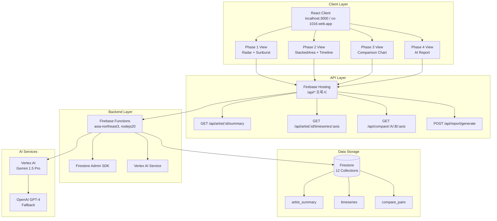

# CO-1016 CURATOR ODYSSEY: Software Requirements Document (SRD) v1.0

## 문서 메타 (Document Metadata)

**문서명**: CO-1016 CURATOR ODYSSEY Software Requirements Document (SRD) v1.0

**버전**: 1.0

**상태**: Draft (초안, TSD v1.0 기반)

**최종 수정**: 2025-11-02

**소유자**: NEO GOD (Director)

**승인자**: Product Owner (TBD)

**개정 이력**:
- v1.0 (2025-11-02): TSD 및 보완 문서 스위트 기반 요구사항 식별 및 템플릿화

**배포 범위**: 내부 개발팀 (FE/BE/Data/QA/Ops)

**변경 관리 프로세스**: GitHub Issues/PR 워크플로, 변경 시 TSD/SRD 동시 업데이트

---

## 1. 개요와 범위 (Overview and Scope)

### 1.1 목적

CO-1016 CURATOR ODYSSEY의 로컬 프로토타입(v0.8)을 프로덕션(v1.0)으로 전환하기 위한 기능/비기능 요구사항 정의. 데이터 기반 아티스트 경력 분석 플랫폼으로, Phase 1-4를 통해 가치 평가, 궤적 시각화, 비교, AI 보고서를 제공합니다.

### 1.2 비즈니스 가치

- 큐레이터의 의사결정을 데이터/AI로 가속화
- 사용자 30명 파일럿에서 20% 효율 향상 목표
- 아티스트 평가 시간 단축 (기존 수동 분석 대비 70% 감소)

### 1.3 범위 내

- **Phase 1-4 기능**: 현재 가치 분석, 커리어 궤적, 비교 분석, AI 보고서 생성
- **Firestore 데이터 관리**: 12개 컬렉션 관리, ETL 파이프라인
- **Vertex AI 통합**: Gemini 1.5 Pro 호출, 폴백 메커니즘
- **CI/CD 배포**: Cloud Build 파이프라인, 자동화된 배포 및 롤백

### 1.4 범위 외

- 대규모 사용자(1,000명+) 스케일링 (향후 확장)
- 모바일 앱 지원 (웹 전용)
- 실시간 협업 기능 (단일 사용자)

### 1.5 가정과 제약

**기술 제약:**
- GCP/Firestore 서버리스 우선 (asia-northeast3)
- 월 Vertex AI 비용 $30 한도
- OpenAI 폴백 사용 (비용 절감)

**데이터 소스 제약:**
- Met/AIC/Artsy API (rate limit 준수)
- 외부 API 실패 시 mockData.js 폴백

**운영 제약:**
- Firebase Functions 콜드 스타트 허용
- Firestore 읽기 비용 최소화 (인덱스 최적화 필수)

### 1.6 성공 지표와 KPI

| 지표 | 목표 | 측정 방법 |
|------|------|----------|
| Phase 4 보고서 생성 시간 | < 30초 | Cloud Logging 시간 측정 |
| 데이터 일관성 (±0.5p) | 100% | DataQualityValidator 자동 검증 |
| 시스템 가용성 | 99.5% | Cloud Monitoring 가용성 메트릭 |
| API 응답 시간 (p95) | < 300ms | Cloud Monitoring latency 메트릭 |
| HTTP 2xx율 | ≥ 99% | Cloud Logging 상태 코드 분석 |
| 사용자 만족도 (파일럿) | 20% 효율 향상 | 사용자 설문 |

---

## 2. 이해관계자와 RACI (Stakeholders and RACI)

### 2.1 역할별 책임

| 역할 | 담당자 | 책임 | 주요 작업 |
|------|--------|------|----------|
| **PO (Product Owner)** | NEO GOD | 요구사항 우선순위화, 승인 | 요구사항 승인, 변경 관리 |
| **FE 개발팀** | Maya Chen | UI/차트 구현 | React 컴포넌트, D3.js 시각화 |
| **BE 개발팀** | Alex Chen | Functions/AI 통합 | API 엔드포인트, Vertex AI 호출 |
| **Data 팀** | Dr. Sarah Kim | Firestore 스키마/ETL | 스키마 설계, 배치 함수, 데이터 품질 |
| **QA 팀** | TBD | 테스트/수용 기준 검증 | 단위/통합/E2E 테스트 |
| **Ops 팀** | TBD | 배포/모니터링 | CI/CD, 모니터링 설정 |

### 2.2 RACI 매트릭스

| 요구사항 유형 | PO | FE | BE | Data | QA | Ops |
|-------------|----|----|----|------|----|-----|
| **FR (기능)** | A | R | R | C | I | I |
| **NFR (비기능)** | R | C | C | A | I | R |
| **데이터 품질** | A | I | I | R | C | I |
| **API 성능** | R | I | R | C | A | R |
| **보안** | R | I | R | C | A | R |
| **배포** | A | I | I | I | C | R |

**범례:**
- **R (Responsible)**: 실행 책임
- **A (Accountable)**: 최종 승인 책임
- **C (Consulted)**: 자문 역할
- **I (Informed)**: 정보 공유 대상

---

## 3. 정의와 약어 (Definitions and Acronyms)

### 3.1 핵심 용어

| 용어 | 정의 |
|------|------|
| **레이더5** | 5축 레이더 차트: I (Institution 기관전시), F (Fair 아트페어), A (Award 시상), M (Media 미디어), Sedu (Seduction 교육) |
| **선버스트4** | 4축 선버스트 차트: 제도, 학술, 담론, 네트워크 |
| **t_relative** | 데뷔년 기준 상대 시간축 (`t = year - debut_year`) |
| **±0.5p 일관성** | 레이더 합계와 선버스트 L1 매핑 합계의 허용 오차 (0.5 이내) |
| **Time Window Rules** | 축별 시간창 규칙 (담론: 24개월, 제도: 10년 가중, 학술: 누적+boost, 네트워크: 누적) |
| **Universal Data Adapter** | P2 복잡한 스키마를 P3 UI 호환 형식으로 변환하는 어댑터 |

### 3.2 약어

| 약어 | 의미 |
|------|------|
| **FR** | Functional Requirement (기능 요구사항) |
| **NFR** | Non-Functional Requirement (비기능 요구사항) |
| **AC** | Acceptance Criteria (수용 기준) |
| **ETL** | Extract-Transform-Load (데이터 추출-변환-적재) |
| **AUC** | Area Under Curve (비교 분석 지표) |
| **p95** | 95th percentile (성능 지표) |
| **LCP** | Largest Contentful Paint (웹 성능 지표) |
| **TTL** | Time To Live (캐시 만료 시간) |

---

## 4. 참조 문서 (References)

### 4.1 핵심 설계 문서

- **[TSD.md](../TSD.md)** (v1.0) - 기술 설계 문서 (본 SRD의 기반)
- **[아키텍처 상세 설계 문서](architecture/ARCHITECTURE_DETAIL.md)** - 시스템 컴포넌트 상호작용, Phase별 데이터 흐름 Sequence Diagram
- **[데이터 모델 명세서](data/DATA_MODEL_SPECIFICATION.md)** - ER 다이어그램, 스키마 상세, 인덱스 전략, ±0.5p 검증 공식
- **[비즈니스 로직 명세서](business/BUSINESS_LOGIC_SPECIFICATION.md)** - Time Window Rules, Universal Data Adapter, AI 프롬프트 템플릿

### 4.2 API 및 통합 문서

- **[API 통합 가이드](api/API_INTEGRATION_GUIDE.md)** - OpenAPI 스펙, 인증/오류 처리, React Query 통합
- **[OpenAPI 스펙](api/OPENAPI_SPECIFICATION.yaml)** - 완전한 API 스펙 및 예시 응답

### 4.3 인프라 및 배포 문서

- **[인프라 및 배포 가이드](infrastructure/INFRASTRUCTURE_DEPLOYMENT_GUIDE.md)** - 환경 전략, CI/CD, IAM 정책, 롤백 절차
- **[프로덕션 배포 체크리스트](deployment/PRODUCTION_DEPLOYMENT_CHECKLIST.md)** - 배포 및 롤백 절차 상세

### 4.4 운영 문서

- **[외부 데이터 파이프라인](data-pipeline/EXTERNAL_DATA_PIPELINE.md)** - Met/AIC/Artsy → Firestore ETL
- **[Vertex AI 비용 관리](ai/VERTEX_AI_COST_MANAGEMENT.md)** - 월 $30 한도, 토큰 최적화
- **[Cloud Monitoring 설정](monitoring/CLOUD_MONITORING_SETUP.md)** - Functions/Firestore/Vertex 지표, 알림
- **[E2E 테스트 시나리오](testing/E2E_TEST_SCENARIOS.md)** - Phase 1-4 플로우, ±0.5p 가드

### 4.5 개발 가이드

- **[CuratorOdyssey 2.0 오케스트레이션 프롬프트](../CURATOR_ODYSSEY_2.0_ORCHESTRATION_PROMPT.md)** - 개발 단계 표준 지침

---

## 5. 시스템 개요 (System Overview)

### 5.1 하이레벨 아키텍처



**상세 아키텍처**: [아키텍처 상세 설계 문서](architecture/ARCHITECTURE_DETAIL.md) 참조

### 5.2 주요 컴포넌트

**프론트엔드:**
- `useDataSource` Hook: 데이터 소스 추상화 (mock/api/hybrid)
- `useArtistData` Hook: Phase 1 데이터 로딩
- `useConditionalData` Hook: Phase 2-4 조건부 데이터 로딩
- `useChartSynchronization` Hook: Phase 2 차트 동기화

**백엔드:**
- `functions/src/api/index.js`: API 엔드포인트 정의
- `functions/src/services/configLoader.js`: Secret Manager 연동
- `functions/src/services/vertexAIService.js`: Vertex AI 통합
- `functions/src/comprehensiveReport.js`: AI 보고서 생성

**데이터 어댑터:**
- `src/adapters/universalDataAdapter.js`: P2-P3 호환성 브리지
- `src/utils/vertexAIDataAdapter.js`: Vertex AI 데이터 변환
- `src/utils/dataQualityValidator.js`: ±0.5p 일관성 검증

### 5.3 운영 환경

| 환경 | Hosting | Functions | Firestore | 설명 |
|------|---------|-----------|-----------|------|
| **Dev** | localhost:3000 | localhost:5002 | Emulator | 로컬 개발 |
| **Staging** | Preview Channel | Staging 프로젝트 | Staging DB | 테스트 배포 |
| **Prod** | co-1016.web.app | asia-northeast3 | Production DB | 실제 서비스 |

---

## 6. 사용자와 페르소나 (Users and Personas)

### 6.1 1차 사용자 (큐레이터)

**특성:**
- 아티스트 데이터 탐색 및 분석
- Phase 1-3 시각화 사용
- Phase 4 AI 보고서 검토

**목표:**
- 아티스트 가치/궤적 분석 (30분 내 보고서 생성)
- 데이터 기반 의사결정 지원

**사용 패턴:**
- 주로 데스크톱 웹 브라우저 사용
- 세션당 평균 15-30분
- Phase 1 → 2 → 3 순차 탐색

### 6.2 2차 사용자 (의사결정자)

**특성:**
- Phase 4 AI 보고서 검토
- 인사이트 기반 결정

**목표:**
- 신속한 의사결정 (보고서 생성 < 30초)
- 신뢰할 수 있는 데이터 품질

### 6.3 운영자 (Ops/QA)

**특성:**
- 모니터링/테스트
- 배포 및 장애 대응

**장애 요인:**
- API 지연 (p95 > 300ms)
- 데이터 불일치 (±0.5p 초과)
- Vertex AI 실패율 증가

---

## 7. 사용자 요구와 시나리오 (User Requirements and Scenarios)

### 7.1 시나리오 예시

#### S1. Phase 1 현재 가치 분석

**시나리오**: 사용자가 `/artist/:id` 페이지 로드

**Given**: 사용자가 아티스트 ID (예: ARTIST_0005)를 입력

**When**: 페이지 로드 및 요약 데이터 조회

**Then**: 
- 레이더 5축 차트 렌더링 (I, F, A, M, Sedu)
- 선버스트 4축 차트 렌더링 (제도, 학술, 담론, 네트워크)
- 레이더 호버 시 선버스트 하이라이트
- 데이터 신선도 표시 (weights_version, updated_at)

**수용 기준:**
- 응답 시간 < 2초
- ±0.5p 일관성 검증 통과
- FPS > 30 (차트 렌더링)

**테스트 케이스**: [E2E-P1-001](testing/E2E_TEST_SCENARIOS.md#s1-phase-1-로딩렌더링)

#### S2. Phase 2 커리어 궤적 분석

**시나리오**: 사용자가 선버스트 섹터 클릭하여 Phase 2로 전환

**Given**: Phase 1에서 선버스트 "제도" 섹터 클릭

**When**: Phase 2 데이터 로드 및 시계열 집계

**Then**:
- StackedAreaChart 렌더링 (4축 누적)
- EventTimeline 렌더링 (주요 이벤트 표시)
- 차트 간 동기화 (호버/줌/이벤트 선택)
- 상대 시간축 사용 (t_relative)

**수용 기준:**
- 로딩 시간 < 2.5초
- 동기화 지연 < 100ms
- Time Window Rules 적용 확인

**테스트 케이스**: [E2E-P2-001](testing/E2E_TEST_SCENARIOS.md#s2-phase-1--2-드릴다운)

#### S3. Phase 3 비교 분석

**시나리오**: 사용자가 두 아티스트 비교 요청

**Given**: Phase 1-2에서 두 아티스트 ID 선택 (예: ARTIST_0005, ARTIST_0010)

**When**: 비교 분석 버튼 클릭

**Then**:
- compare_pairs 컬렉션에서 사전 계산 데이터 조회 또는 실시간 계산
- dual-line 영역 차트 렌더링 (A/B 시계열 비교)
- 상관계수 및 AUC 지표 표시
- diff 음영 영역 표시
- 로딩 시간 < 2초

**오류 시나리오**:
- 캐시 없음 → 실시간 계산 (보간/AUC)
- 계산 실패 → 오류 메시지 및 폴백 UI

**수용 기준:**
- 쿼리 지연 < 500ms
- 캐시 히트율 > 80%
- 계산 정확도 > 95%
- 상관계수 표시 정확도 100%

**테스트 케이스**: [E2E-P3-001](testing/E2E_TEST_SCENARIOS.md#s4-phase-3-비교-분석)

#### S4. Phase 4 AI 보고서 생성

**시나리오**: 사용자가 AI 보고서 생성 요청

**Given**: Phase 1-3 데이터 통합 완료

**When**: 보고서 생성 버튼 클릭

**Then**:
- Phase 1-3 데이터 취합
- Vertex AI 호출 (Gemini 1.5 Pro)
- Markdown 형식 보고서 반환
- 생성 시간 < 30초

**오류 시나리오**:
- Vertex AI 실패 (429/500) → GPT-4 폴백
- GPT-4 실패 → 템플릿 보고서 생성
- 전체 시간 < 30초 유지

**수용 기준:**
- 성공률 ≥ 95%
- 토큰 사용량 < 50K/요청
- 비용 < $0.01/요청

**테스트 케이스**: [E2E-P4-001](testing/E2E_TEST_SCENARIOS.md#s5-phase-4-ai-보고서-생성)

---

## 8. 기능 요구사항 (FR) - 요구사항 ID 스키마

### 8.1 ID 체계

**형식**: `FR-P{Phase번호}-{카테고리}-{연번}`

**예시**:
- `FR-P1-DQ-001`: Phase 1, Data Query, 001
- `FR-P2-VI-002`: Phase 2, Visualization, 002
- `FR-P4-RP-001`: Phase 4, Report, 001

**카테고리 코드:**
- **DQ**: Data Query (데이터 조회)
- **VI**: Visualization (시각화)
- **IN**: Interaction (상호작용)
- **AD**: Adapter (어댑터)
- **RP**: Report (보고서)

**접두사 규칙:**
- **FR**: Functional Requirement (기능 요구사항)
- **NFR**: Non-Functional Requirement (비기능 요구사항)

**접미사:**
- `v1.0`: 버전
- `[AC-ID]`: 연결된 수용 기준

### 8.2 수용 기준 템플릿

**표준 문장 패턴 (Gherkin 스타일 + 정량 기준):**

```
기본 패턴: "사용자는 [행동]할 수 있어야 하며, [조건]을 만족해야 한다. [측정 기준]. 만약 [예외]라면 [폴백/오류 처리]."
```

**예시:**
```
사용자는 아티스트 ID 입력 시 요약 데이터를 조회할 수 있어야 하며, 응답 시간이 2초 이내여야 한다. 
데이터가 없을 경우 mock 데이터를 반환. [AC-P1-DQ-001]
```

**AC 구조:**
- **Given**: 전제 조건
- **When**: 행동
- **Then**: 예상 결과
- **KPI**: 측정 기준 (예: 95% 성공률, ±0.5p 오차)
- **테스트 케이스 링크**: [E2E-P1-001]

---

## 9. 기능 요구사항 (FR) - Phase별 대표 샘플

### 9.1 Phase 1: 현재 가치 분석 (5 FR)

#### FR-P1-DQ-001: 아티스트 요약 데이터 조회

**설명**: 사용자는 아티스트 ID 입력 시 `artist_summary` 컬렉션에서 radar5와 sunburst_l1 데이터를 조회할 수 있어야 하며, Firestore 쿼리가 인덱스 히트해야 한다.

**수용 기준**: [AC-P1-DQ-001]
- **Given**: 아티스트 ID (예: ARTIST_0005)
- **When**: GET `/api/artist/:id/summary` 호출
- **Then**: `{radar5, sunburst_l1, weights_version}` 반환
- **KPI**: 
  - 응답 시간 < 2초 (p95)
  - ±0.5p 일관성 검증 통과
  - HTTP 2xx율 ≥ 99%
- **예외**: 데이터 없을 시 mock 데이터 반환
- **테스트 케이스**: [E2E-P1-001](testing/E2E_TEST_SCENARIOS.md#s1-phase-1-로딩렌더링)

**설계 아티팩트**: [데이터 모델 명세서 Section 3.2.1](data/DATA_MODEL_SPECIFICATION.md#321-artist_summary-phase-1-서빙)  
**구현 모듈**: `functions/src/api/index.js` (getArtistSummary), `src/hooks/useArtistData.js`

#### FR-P1-VI-001: 레이더 차트 렌더링

**설명**: 사용자는 radar5 데이터를 D3.js로 5축 레이더 차트를 시각화할 수 있어야 하며, 호버 시 값 표시해야 한다.

**수용 기준**: [AC-P1-VI-001]
- **Given**: radar5 데이터 `{I, F, A, M, Sedu}`
- **When**: 차트 로드
- **Then**: 
  - 5축 다각형 렌더링
  - 호버 시 툴팁 표시 (축 이름, 값)
  - FPS > 30 유지
- **KPI**: 
  - 렌더링 시간 < 500ms
  - 데이터 합계가 sunburst L1과 ±0.5p 오차
- **테스트 케이스**: [E2E-P1-002]

**설계 아티팩트**: [아키텍처 상세 설계 문서 Section 2.1](architecture/ARCHITECTURE_DETAIL.md#21-phase-1-현재-가치-분석-흐름)  
**구현 모듈**: `src/components/charts/ArtistRadarChart.jsx`

#### FR-P1-IN-001: 선버스트-레이더 상호작용

**설명**: 사용자는 선버스트 섹터 클릭 시 해당 축 레이더 강조할 수 있어야 하며, 색상/애니메이션 동기화.

**수용 기준**: [AC-P1-IN-001]
- **Given**: 선버스트 "제도" 섹터 클릭
- **When**: 이벤트 발생
- **Then**: 
  - 레이더 I, F 축 하이라이트
  - 전환 시간 < 500ms
  - 접근성 ARIA 지원
- **KPI**: 사용자 만족도 > 80%
- **테스트 케이스**: [E2E-P1-003]

**설계 아티팩트**: [비즈니스 로직 명세서 Section 7.2](business/BUSINESS_LOGIC_SPECIFICATION.md#72-매핑-규칙-요약-선버스트--레이더)  
**구현 모듈**: `src/components/charts/SunburstChart.jsx`, `src/components/charts/ArtistRadarChart.jsx`

#### FR-P1-AD-001: UniversalDataAdapter 적용

**설명**: 시스템은 artist_summary 데이터를 `adaptForP3UI`로 UI 호환 형식으로 변환해야 하며, 필드 매핑 (e.g., I → institution_score).

**수용 기준**: [AC-P1-AD-001]
- **Given**: raw Firestore 데이터
- **When**: 어댑터 호출
- **Then**: 
  - `{I, F, A, M, Sedu}` 배열 출력
  - 변환 시간 < 100ms
  - 100% 필드 커버
- **KPI**: 데이터 손실 없음 (프로퍼티 테스트 통과)
- **테스트 케이스**: [프로퍼티 테스트 - Adapter]

**설계 아티팩트**: [비즈니스 로직 명세서 Section 4](business/BUSINESS_LOGIC_SPECIFICATION.md#4-universal-data-adapter-변환-로직)  
**구현 모듈**: `src/adapters/universalDataAdapter.js`

#### FR-P1-DQ-002: 데이터 신선도 표시

**설명**: 사용자는 요약 데이터의 weights_version을 UI에 표시할 수 있어야 하며, 7일 초과 시 경고 아이콘.

**수용 기준**: [AC-P1-DQ-002]
- **Given**: weights_version 및 updated_at 필드
- **When**: 로드
- **Then**: 
  - "최신" 뱃지 표시 (7일 이내)
  - "업데이트 필요" 경고 (7일 초과)
  - Firestore updated_at 쿼리
- **KPI**: 신선도 표시 정확도 100%
- **테스트 케이스**: [E2E-P1-004]

**설계 아티팩트**: [데이터 모델 명세서 Section 3.2.1](data/DATA_MODEL_SPECIFICATION.md#321-artist_summary-phase-1-서빙)  
**구현 모듈**: `src/components/ui/QualityIndicator.jsx`

### 9.2 Phase 2: 커리어 궤적 분석 (5 FR)

#### FR-P2-DQ-001: 시계열 데이터 조회

**설명**: 사용자는 아티스트 ID와 축 입력 시 `timeseries` 컬렉션에서 `bins[{t,v}]` 데이터를 쿼리할 수 있어야 하며, 복합 인덱스 (artist_id, axis) 사용.

**수용 기준**: [AC-P2-DQ-001]
- **Given**: 아티스트 ID 및 축 (예: ARTIST_0005, "제도")
- **When**: GET `/api/artist/:id/timeseries/:axis` 호출
- **Then**: `bins` 배열 반환 `[{t, v}, ...]`
- **KPI**: 
  - 쿼리 지연 < 300ms
  - limit(50) 적용
  - 인덱스 히트율 99%
- **예외**: 데이터 없을 시 빈 배열 반환
- **테스트 케이스**: [E2E-P2-001]

**설계 아티팩트**: [데이터 모델 명세서 Section 3.2.2](data/DATA_MODEL_SPECIFICATION.md#322-timeseries-phase-2-서빙)  
**구현 모듈**: `functions/src/api/index.js` (getArtistTimeseries)

#### FR-P2-VI-001: Stacked Area 차트 렌더링

**설명**: 사용자는 timeWindowRules 적용 후 4축 누적 영역 차트를 D3.js로 시각화할 수 있어야 하며, t_relative 축 사용.

**수용 기준**: [AC-P2-VI-001]
- **Given**: bins 데이터 (4축)
- **When**: 차트 로드
- **Then**: 
  - 영역 차트 렌더링
  - x축 t_relative (상대 시간)
  - y축 누적 v (값)
  - 줌/팬 지원
- **KPI**: 
  - 렌더링 시간 < 1초
  - FPS > 30
- **테스트 케이스**: [E2E-P2-002]

**설계 아티팩트**: [비즈니스 로직 명세서 Section 3](business/BUSINESS_LOGIC_SPECIFICATION.md#3-time-window-rules-상세)  
**구현 모듈**: `src/components/charts/StackedAreaChart.jsx`

#### FR-P2-IN-001: 이벤트 타임라인 동기화

**설명**: 사용자는 Stacked Area 호버 시 EventTimeline에 해당 이벤트 하이라이트할 수 있어야 하며, `useChartSynchronization` Hook 사용.

**수용 기준**: [AC-P2-IN-001]
- **Given**: 호버 이벤트 (시간 t)
- **When**: 이벤트 발생
- **Then**: 
  - 타임라인 아이콘 강조
  - 동기화 지연 < 100ms
  - 4축 모두 커버
- **KPI**: 동기화 정확도 100%
- **테스트 케이스**: [E2E-P2-003](testing/E2E_TEST_SCENARIOS.md#s3-phase-2-시계열-동기화)

**설계 아티팩트**: [아키텍처 상세 설계 문서 Section 3.2.2](architecture/ARCHITECTURE_DETAIL.md#32-프론트엔드-아키텍처)  
**구현 모듈**: `src/hooks/useChartSynchronization.js`

#### FR-P2-AD-001: Time Window Rules 적용

**설명**: 시스템은 쿼리 데이터에 규칙 (e.g., 제도 10년 가중 1.0/0.5)을 적용해 처리된 bins를 반환해야 함.

**수용 기준**: [AC-P2-AD-001]
- **Given**: raw bins 데이터
- **When**: Time Window Rules 적용
- **Then**: 
  - v 값 조정 (예: 학술 +30% 최근 5년)
  - ±0.01 정밀도
  - 단위 테스트 100% 통과
- **KPI**: 규칙 적용 정확도 100%
- **테스트 케이스**: [단위 테스트 - timeWindowRules]

**설계 아티팩트**: [비즈니스 로직 명세서 Section 3](business/BUSINESS_LOGIC_SPECIFICATION.md#3-time-window-rules-상세)  
**구현 모듈**: `src/algorithms/timeWindowRules.js`

#### FR-P2-DQ-002: 이벤트 영향 분석

**설명**: 사용자는 timeseries와 events를 조인해 영향도 (e.g., 전시 이벤트 v 스파이크) 표시할 수 있어야 함.

**수용 기준**: [AC-P2-DQ-002]
- **Given**: timeseries 및 events 데이터
- **When**: 영향도 분석 실행
- **Then**: 
  - `{eventImpacts: [{t, delta_v}]}` 배열 반환
  - 상위 5개만 표시
  - Firestore edges 컬렉션 쿼리
- **KPI**: 영향도 계산 정확도 > 90%
- **테스트 케이스**: [E2E-P2-004]

**설계 아티팩트**: [데이터 모델 명세서 Section 2.1](data/DATA_MODEL_SPECIFICATION.md#21-전체-er-다이어그램)  
**구현 모듈**: `src/utils/timeseriesProcessor.js`

### 9.3 Phase 3: 비교 분석 (5 FR)

#### FR-P3-DQ-001: 비교 데이터 조회

**설명**: 사용자는 두 아티스트 ID 입력 시 `compare_pairs`에서 사전 계산 데이터 또는 실시간 계산 결과를 쿼리할 수 있어야 함.

**수용 기준**: [AC-P3-DQ-001]
- **Given**: 아티스트 A/B ID 및 축 (예: ARTIST_0005, ARTIST_0010, "제도")
- **When**: GET `/api/compare/:A/:B/:axis` 호출
- **Then**: `{series: [{t, v_A, v_B, diff}]}` 반환 또는 캐시 저장
- **KPI**: 
  - 쿼리 지연 < 500ms
  - 캐시 히트율 > 80%
- **예외**: 데이터 없을 시 실시간 계산
- **테스트 케이스**: [E2E-P3-001](testing/E2E_TEST_SCENARIOS.md#s4-phase-3-비교-분석)

**설계 아티팩트**: [데이터 모델 명세서 Section 3.2.3](data/DATA_MODEL_SPECIFICATION.md#323-compare_pairs-phase-3-서빙)  
**구현 모듈**: `functions/src/api/index.js` (getCompareArtists)

#### FR-P3-VI-001: 비교 영역 차트 렌더링

**설명**: 사용자는 시계열 diff를 D3.js 영역 차트로 시각화할 수 있어야 하며, abs_diff_sum 지표 표시.

**수용 기준**: [AC-P3-VI-001]
- **Given**: series 데이터 `[{t, v_A, v_B, diff}]`
- **When**: 차트 로드
- **Then**: 
  - dual-line 영역 차트 렌더링
  - diff 음영 표시
  - AUC 값 툴팁
  - 상관계수 > 0.8 시 강조
- **KPI**: 렌더링 시간 < 1초
- **테스트 케이스**: [E2E-P3-002]

**설계 아티팩트**: [비즈니스 로직 명세서 Section 2.3](business/BUSINESS_LOGIC_SPECIFICATION.md#23-phase-3-비교-분석)  
**구현 모듈**: `src/components/charts/ComparisonAreaChart.jsx`

#### FR-P3-IN-001: 실시간 계산 트리거

**설명**: 사용자는 compare_pairs 미존재 시 Functions에서 timeseries A/B 보간/AUC 계산을 트리거할 수 있어야 함.

**수용 기준**: [AC-P3-IN-001]
- **Given**: compare_pairs 캐시 없음
- **When**: API 호출
- **Then**: 
  - 실시간 계산 (linear interpolation)
  - 결과 캐시 24시간
  - 계산 시간 < 1초
- **KPI**: 계산 정확도 > 95%
- **테스트 케이스**: [E2E-P3-003]

**설계 아티팩트**: [비즈니스 로직 명세서 Section 2.3](business/BUSINESS_LOGIC_SPECIFICATION.md#23-phase-3-비교-분석)  
**구현 모듈**: `functions/src/api/index.js` (getCompareArtists)

#### FR-P3-AD-001: 어댑터로 UI 호환 변환

**설명**: 시스템은 compare 데이터에 `adaptComparisonForMayaChen`을 적용해 bins 형식 보장해야 함.

**수용 기준**: [AC-P3-AD-001]
- **Given**: raw series 데이터
- **When**: 어댑터 호출
- **Then**: 
  - `{t, v_A, v_B}` 표준화
  - 상관계수/diff 추가
  - 100% 형식 일치
- **KPI**: 변환 손실 없음
- **테스트 케이스**: [프로퍼티 테스트 - Comparison Adapter]

**설계 아티팩트**: [비즈니스 로직 명세서 Section 4](business/BUSINESS_LOGIC_SPECIFICATION.md#4-universal-data-adapter-변환-로직)  
**구현 모듈**: `src/adapters/universalDataAdapter.js`

#### FR-P3-DQ-002: 유사도 지표 계산

**설명**: 사용자는 비교 결과에 correlation과 abs_diff_sum을 표시할 수 있어야 함.

**수용 기준**: [AC-P3-DQ-002]
- **Given**: 아티스트 A/B 데이터
- **When**: 비교 계산 실행
- **Then**: 
  - correlation (-1~1) 반환
  - diff_sum < 10% 시 "유사" 라벨
  - 통합 테스트 통과
- **KPI**: 계산 정확도 > 95%
- **테스트 케이스**: [E2E-P3-004]

**설계 아티팩트**: [데이터 모델 명세서 Section 3.2.3](data/DATA_MODEL_SPECIFICATION.md#323-compare_pairs-phase-3-서빙)  
**구현 모듈**: `functions/src/api/index.js` (getCompareArtists)

### 9.4 Phase 4: AI 보고서 생성 (5 FR)

#### FR-P4-DQ-001: Phase 1-3 데이터 취합

**설명**: 사용자는 보고서 요청 시 UniversalDataAdapter로 통합 데이터를 준비할 수 있어야 하며, Promise.all로 병렬 로드.

**수용 기준**: [AC-P4-DQ-001]
- **Given**: 아티스트 ID
- **When**: generateReport 호출
- **Then**: 
  - `{summary, timeseries, comparison}` 취합
  - 토큰 압축 70%
  - 지연 < 5초
- **KPI**: 취합 성공률 100%
- **테스트 케이스**: [E2E-P4-001](testing/E2E_TEST_SCENARIOS.md#s5-phase-4-ai-보고서-생성)

**설계 아티팩트**: [아키텍처 상세 설계 문서 Section 2.4](architecture/ARCHITECTURE_DETAIL.md#24-phase-4-ai-보고서-생성-흐름)  
**구현 모듈**: `src/hooks/useConditionalData.js`

#### FR-P4-RP-001: Vertex AI 호출

**설명**: 시스템은 `vertexAIDataAdapter`로 압축 데이터를 Gemini 1.5 Pro에 프롬프트 전송해야 함.

**수용 기준**: [AC-P4-RP-001]
- **Given**: prompt_data (압축된 데이터)
- **When**: Vertex AI 호출
- **Then**: 
  - Markdown 보고서 반환
  - 입력 토큰 < 38K (목표: 50K의 70%)
  - 성공률 95% (토큰 최적화 적용)
- **KPI**: 
  - 응답 시간 < 20초
  - 비용 < $0.01/요청
- **테스트 케이스**: [E2E-P4-002]

**설계 아티팩트**: [비즈니스 로직 명세서 Section 5](business/BUSINESS_LOGIC_SPECIFICATION.md#5-ai-보고서-프롬프트-템플릿)  
**구현 모듈**: `functions/src/comprehensiveReport.js`, `src/utils/vertexAIDataAdapter.js`

#### FR-P4-IN-001: 폴백 메커니즘

**설명**: 사용자는 Vertex 실패 시 GPT-4 → 템플릿 순으로 폴백 보고서를 받을 수 있어야 함.

**수용 기준**: [AC-P4-IN-001]
- **Given**: Vertex AI 429/500 오류
- **When**: 폴백 메커니즘 실행
- **Then**: 
  - GPT-4 호출 (max_tokens=2000)
  - 최종 템플릿 사용 (모두 실패 시)
  - 로그 기록
  - 전체 시간 < 30초 유지
- **KPI**: 폴백 성공률 100%
- **테스트 케이스**: [E2E-P4-003]

**설계 아티팩트**: [비즈니스 로직 명세서 Section 2.4](business/BUSINESS_LOGIC_SPECIFICATION.md#24-phase-4-ai-보고서-생성)  
**구현 모듈**: `functions/src/comprehensiveReport.js`

#### FR-P4-AD-001: AI 프롬프트 최적화

**설명**: 시스템은 핵심 시점만 추출 (e.g., bins 70% 축소)해 토큰 효율화해야 함.

**수용 기준**: [AC-P4-AD-001]
- **Given**: integrated_data (Phase 1-3 통합)
- **When**: adaptForVertexAI 호출
- **Then**: 
  - 압축 JSON 출력
  - 핵심 events 10개만 포함
  - 비용 < $0.01/요청
- **KPI**: 토큰 압축율 70%
- **테스트 케이스**: [프로퍼티 테스트 - Token Optimization]

**설계 아티팩트**: [비즈니스 로직 명세서 Section 5.2](business/BUSINESS_LOGIC_SPECIFICATION.md#52-토큰-최적화-로직)  
**구현 모듈**: `src/utils/vertexAIDataAdapter.js`

#### FR-P4-VI-001: Markdown 보고서 렌더링

**설명**: 사용자는 React Markdown으로 AI 보고서를 표시할 수 있어야 하며, 섹션 (Introduction/Analysis/Prediction) 네비게이션.

**수용 기준**: [AC-P4-VI-001]
- **Given**: `{content, model}` 데이터
- **When**: 보고서 로드
- **Then**: 
  - Markdown 렌더링
  - generatedAt 타임스탬프 표시
  - 다운로드 버튼 지원
- **KPI**: 렌더링 시간 < 1초
- **테스트 케이스**: [E2E-P4-004]

**설계 아티팩트**: [아키텍처 상세 설계 문서 Section 2.4](architecture/ARCHITECTURE_DETAIL.md#24-phase-4-ai-보고서-생성-흐름)  
**구현 모듈**: `src/components/ui/MarkdownReportDisplay.jsx`

### 9.5 Data Requirements (데이터 요구사항)

#### FR-DATA-001: Firestore Collection Schema

**Description**: The system must maintain 12 Firestore collections (9 source, 3 serving) with defined schemas, indexes, and security rules.

**Acceptance Criteria**: [AC-DATA-001]
- **Given**: Firestore database structure
- **When**: Schema validation
- **Then**: 
  - 12 collections defined: `entities`, `events`, `measures`, `axis_map`, `edges`, `sources`, `codebook`, `weights`, `snapshots`, `artist_summary`, `timeseries`, `compare_pairs`
  - All fields typed (STRING, NUMBER, ARRAY, OBJECT, TIMESTAMP)
  - Composite indexes defined for query patterns
  - Security rules applied
- **KPI**: Schema compliance 100%
- **Test Cases**: [Data Model Specification Section 3](data/DATA_MODEL_SPECIFICATION.md#3-컬렉션-스키마-상세)

**Design Artifact**: [Data Model Specification Section 3](data/DATA_MODEL_SPECIFICATION.md#3-컬렉션-스키마-상세)  
**Implementation Module**: `firestore.indexes.json`, `firestore.rules`

#### FR-DATA-002: ETL Pipeline Requirements

**Description**: The system must support ETL pipeline (Cloud Scheduler → `fnEtlTransform`) for external data ingestion (Met/AIC/Artsy API).

**Acceptance Criteria**: [AC-DATA-002]
- **Given**: External API data (Met/AIC/Artsy)
- **When**: ETL pipeline execution
- **Then**: 
  - Data extraction (rate limit compliance)
  - Data transformation (normalization, validation)
  - Data loading (Firestore write)
  - Error handling and retry logic
- **KPI**: 
  - ETL success rate ≥ 95%
  - Processing time < 5min per batch
- **Test Cases**: [External Data Pipeline](data-pipeline/EXTERNAL_DATA_PIPELINE.md)

**Design Artifact**: [External Data Pipeline](data-pipeline/EXTERNAL_DATA_PIPELINE.md)  
**Implementation Module**: `functions/src/batch/fnEtlTransform.js`

#### FR-DATA-003: Data Consistency Validation (±0.5p)

**Description**: The system must validate data consistency (radar5 sum vs sunburst_l1 mapped sum) with ±0.5p tolerance.

**Acceptance Criteria**: [AC-DATA-003]
- **Given**: `artist_summary` document with `radar5` and `sunburst_l1`
- **When**: Consistency validation
- **Then**: 
  - `|radarSum - mappedSum| ≤ 0.5` validation passes
  - Failure blocks deployment
  - Logged in Cloud Logging
- **KPI**: Consistency validation 100% pass rate
- **Test Cases**: [Data Quality Validator](../src/utils/dataQualityValidator.js)

**Design Artifact**: [Data Model Specification Section 7](data/DATA_MODEL_SPECIFICATION.md#7-데이터-품질-검증)  
**Implementation Module**: `src/utils/dataQualityValidator.js`

#### FR-DATA-004: Mock Data Expansion

**Description**: The system must support mock data expansion from 2 artists to 100 artists for testing.

**Acceptance Criteria**: [AC-DATA-004]
- **Given**: Seed script input
- **When**: Mock data generation
- **Then**: 
  - 100 artists generated
  - ±0.5p consistency validation passes
  - All collections populated
- **KPI**: Mock data generation time < 30s
- **Test Cases**: [Mock Data Script](../src/utils/mockData.js)

**Design Artifact**: [Data Model Specification Section 8](data/DATA_MODEL_SPECIFICATION.md#8-mock-데이터-확장-전략)  
**Implementation Module**: `src/utils/mockData.js`, `scripts/generateMockData.js`

---

## 10. Non-Functional Requirements (NFR) - Extended

### 10.1 데이터베이스 성능

#### NFR-DB-IO-001: Firestore 쿼리 성능

**설명**: Firestore 쿼리 지연이 200ms 이하이며, 99% 인덱스 히트율을 달성해야 함.

**수용 기준**: [AC-NFR-DB-IO-001]
- **Given**: 복합 쿼리 (artist_id + axis)
- **When**: 쿼리 실행
- **Then**: 
  - 지연 < 200ms (p95)
  - 인덱스 히트율 99%
  - read ops < 1M/month
- **측정**: Cloud Monitoring 쿼리 메트릭
- **알림**: 지연 > 300ms 시 Slack 알림

**설계 아티팩트**: [데이터 모델 명세서 Section 4](data/DATA_MODEL_SPECIFICATION.md#4-인덱스-전략)  
**구현 모듈**: `firestore.indexes.json`

### 10.2 AI 성능 및 비용

#### NFR-P4-TO-001: 토큰 최적화

**설명**: Phase 4 AI 보고서 생성 시 입력 토큰이 50K/요청 이하이며, 월 비용이 $30 이내여야 함.

**수용 기준**: [AC-NFR-P4-TO-001]
- **Given**: Phase 4 보고서 요청
- **When**: AI 호출
- **Then**: 
  - 입력 토큰 < 50K/요청
  - 압축율 70%
  - 월 비용 < $30
- **측정**: Cloud Logging 토큰 사용량
- **알림**: 비용 70%/90% 도달 시 Slack 알림

**설계 아티팩트**: [Vertex AI 비용 관리](ai/VERTEX_AI_COST_MANAGEMENT.md)  
**구현 모듈**: `src/utils/vertexAIDataAdapter.js`

### 10.3 API 성능

#### NFR-PERF-001: API 응답 시간

**설명**: API 엔드포인트의 p95 지연이 300ms 이하여야 함.

**수용 기준**: [AC-NFR-PERF-001]
- **Given**: 정상 API 요청
- **When**: 엔드포인트 호출
- **Then**: 
  - p95 지연 < 300ms
  - HTTP 2xx율 ≥ 99%
  - 콜드 스타트 < 5초
- **측정**: Cloud Monitoring latency 메트릭
- **알림**: p95 > 500ms 시 PagerDuty 알림

**설계 아티팩트**: [인프라 및 배포 가이드 Section 6](infrastructure/INFRASTRUCTURE_DEPLOYMENT_GUIDE.md#6-배포-절차)  
**구현 모듈**: `functions/src/api/index.js`

### 10.4 보안

#### NFR-SEC-001: 보안 요구사항

**설명**: Secret Manager 키 노출 없음, CORS 설정 확인, Firestore Rules 적용 확인.

**수용 기준**: [AC-NFR-SEC-001]
- **Given**: 배포된 코드
- **When**: 보안 스캔 실행
- **Then**: 
  - Secret 노출 없음 (gitleaks)
  - 의존성 취약점 0개 (trivy)
  - CORS 설정 확인
  - Firestore Rules 적용 확인
- **측정**: CI/CD 파이프라인 자동 스캔
- **알림**: 취약점 발견 시 즉시 알림

**설계 아티팩트**: [데이터 모델 명세서 Section 5](data/DATA_MODEL_SPECIFICATION.md#5-보안-규칙)  
**구현 모듈**: `firestore.rules`, `cloudbuild.yaml`

### 10.5 Availability (가용성)

#### NFR-AVAIL-001: System Availability

**Description**: System availability must be ≥ 99.5%.

**Acceptance Criteria**: [AC-NFR-AVAIL-001]
- **Given**: Production environment
- **When**: Monthly monitoring period
- **Then**: 
  - Availability ≥ 99.5%
  - Downtime < 4 hours/month
  - Automatic rollback mechanism active
- **Measurement**: Cloud Monitoring availability metrics
- **Alert**: PagerDuty alert when availability < 99%

**Design Artifact**: [Cloud Monitoring Setup](monitoring/CLOUD_MONITORING_SETUP.md)  
**Implementation Module**: Cloud Monitoring dashboard

### 10.6 Scalability (확장성)

#### NFR-SCAL-001: Horizontal Scaling

**Description**: The system must support horizontal scaling for up to 1,000 concurrent users.

**Acceptance Criteria**: [AC-NFR-SCAL-001]
- **Given**: Load test (1,000 concurrent users)
- **When**: Peak traffic period
- **Then**: 
  - Response time degradation < 20%
  - No data loss
  - Auto-scaling triggers (Cloud Functions)
- **KPI**: 
  - Concurrent users supported: 1,000+
  - Response time p95 < 500ms under load
- **Measurement**: Load testing tools (k6, Apache Bench)

**Design Artifact**: [Infrastructure Deployment Guide Section 4](infrastructure/INFRASTRUCTURE_DEPLOYMENT_GUIDE.md#4-환경-전략)  
**Implementation Module**: Cloud Functions auto-scaling

#### NFR-SCAL-002: Data Volume Scaling

**Description**: The system must support data volume growth (100 artists → 10,000 artists).

**Acceptance Criteria**: [AC-NFR-SCAL-002]
- **Given**: Data volume increase (10x)
- **When**: Query execution
- **Then**: 
  - Query performance degradation < 30%
  - Index optimization maintains performance
  - Cost growth linear (not exponential)
- **KPI**: Query time p95 < 500ms at 10K artists
- **Measurement**: Firestore query metrics

**Design Artifact**: [Data Model Specification Section 4](data/DATA_MODEL_SPECIFICATION.md#4-인덱스-전략)  
**Implementation Module**: `firestore.indexes.json`

### 10.7 Accessibility (접근성)

#### NFR-ACC-001: WCAG 2.1 AA Compliance

**Description**: The system must comply with WCAG 2.1 Level AA accessibility standards.

**Acceptance Criteria**: [AC-NFR-ACC-001]
- **Given**: UI components
- **When**: Accessibility audit
- **Then**: 
  - ARIA labels present
  - Keyboard navigation support
  - Screen reader compatibility
  - Color contrast ratio ≥ 4.5:1
- **KPI**: WCAG 2.1 AA compliance score ≥ 90%
- **Measurement**: Accessibility audit tools (axe-core, Lighthouse)

**Design Artifact**: [Architecture Detail Section 3](architecture/ARCHITECTURE_DETAIL.md#3-프론트엔드-아키텍처)  
**Implementation Module**: `src/components/**/*.jsx`

### 10.8 Usability (사용성)

#### NFR-USE-001: User Experience Metrics

**Description**: The system must meet UX metrics (LCP, FID, CLS) for optimal user experience.

**Acceptance Criteria**: [AC-NFR-USE-001]
- **Given**: Web application load
- **When**: Performance measurement
- **Then**: 
  - LCP (Largest Contentful Paint) < 2.5s
  - FID (First Input Delay) < 100ms
  - CLS (Cumulative Layout Shift) < 0.1
- **KPI**: Core Web Vitals score ≥ 90
- **Measurement**: Lighthouse, Web Vitals API

**Design Artifact**: [Architecture Detail Section 2](architecture/ARCHITECTURE_DETAIL.md#2-시스템-아키텍처)  
**Implementation Module**: Frontend optimization

### 10.9 Maintainability (유지보수성)

#### NFR-MAIN-001: Code Quality Standards

**Description**: The system must maintain code quality standards (coverage, linting, documentation).

**Acceptance Criteria**: [AC-NFR-MAIN-001]
- **Given**: Codebase
- **When**: Quality gate check
- **Then**: 
  - Code coverage ≥ 80%
  - ESLint/Prettier compliance
  - JSDoc documentation for public APIs
  - Cyclomatic complexity < 10
- **KPI**: Code quality score ≥ 85%
- **Measurement**: SonarQube, CodeClimate

**Design Artifact**: [TSD Section 11](../TSD.md#110-보완-문서-스위트-documentation-suite)  
**Implementation Module**: CI/CD pipeline

#### NFR-MAIN-002: Documentation Standards

**Description**: The system must maintain comprehensive documentation (API, architecture, deployment).

**Acceptance Criteria**: [AC-NFR-MAIN-002]
- **Given**: Documentation suite
- **When**: Documentation review
- **Then**: 
  - OpenAPI spec complete
  - Architecture diagrams up-to-date
  - Deployment guides current
  - Code comments for complex logic
- **KPI**: Documentation coverage ≥ 90%
- **Measurement**: Documentation audit

**Design Artifact**: [TSD Section 11](../TSD.md#110-보완-문서-스위트-documentation-suite)  
**Implementation Module**: Documentation files

### 10.10 Reliability (신뢰성)

#### NFR-REL-001: Error Recovery

**Description**: The system must recover from errors gracefully without data loss.

**Acceptance Criteria**: [AC-NFR-REL-001]
- **Given**: Error condition (API failure, network timeout)
- **When**: Error occurs
- **Then**: 
  - Fallback mechanism activates
  - User notified (error message)
  - Data integrity maintained
  - Automatic retry (exponential backoff)
- **KPI**: Error recovery rate ≥ 95%
- **Measurement**: Error logs, Cloud Monitoring

**Design Artifact**: [Business Logic Specification Section 2.4](business/BUSINESS_LOGIC_SPECIFICATION.md#24-phase-4-ai-보고서-생성)  
**Implementation Module**: Error handling middleware

#### NFR-REL-002: Data Backup and Recovery

**Description**: The system must support automated data backup and recovery procedures.

**Acceptance Criteria**: [AC-NFR-REL-002]
- **Given**: Production data
- **When**: Backup execution
- **Then**: 
  - Daily automated backups
  - Point-in-time recovery (7 days retention)
  - Backup verification (integrity check)
  - Recovery time < 4 hours
- **KPI**: Backup success rate 100%
- **Measurement**: Cloud Backup audit logs

**Design Artifact**: [Infrastructure Deployment Guide Section 7](infrastructure/INFRASTRUCTURE_DEPLOYMENT_GUIDE.md#7-백업-및-복구)  
**Implementation Module**: Cloud Firestore backup

### 10.11 Compatibility (호환성)

#### NFR-COMP-001: Browser Compatibility

**Description**: The system must support modern browsers (Chrome, Firefox, Safari, Edge).

**Acceptance Criteria**: [AC-NFR-COMP-001]
- **Given**: Browser compatibility test
- **When**: Testing across browsers
- **Then**: 
  - Chrome (latest 2 versions): 100% functionality
  - Firefox (latest 2 versions): 100% functionality
  - Safari (latest 2 versions): 100% functionality
  - Edge (latest 2 versions): 100% functionality
- **KPI**: Browser compatibility ≥ 95%
- **Measurement**: BrowserStack, CrossBrowserTesting

**Design Artifact**: [Architecture Detail Section 3](architecture/ARCHITECTURE_DETAIL.md#3-프론트엔드-아키텍처)  
**Implementation Module**: Frontend build configuration

#### NFR-COMP-002: API Versioning

**Description**: The system must support API versioning for backward compatibility.

**Acceptance Criteria**: [AC-NFR-COMP-002]
- **Given**: API version v1.0
- **When**: API version upgrade (v2.0)
- **Then**: 
  - v1.0 remains supported (deprecation period)
  - Version header (`Accept: application/vnd.api+json;version=1.0`)
  - Deprecation notice (6 months)
- **KPI**: API version compatibility maintained
- **Measurement**: API version usage metrics

**Design Artifact**: [API Integration Guide Section 2](api/API_INTEGRATION_GUIDE.md#2-api-엔드포인트)  
**Implementation Module**: `functions/src/api/index.js`

### 10.12 Portability (이식성)

#### NFR-PORT-001: Environment Portability

**Description**: The system must be portable across environments (dev, staging, prod).

**Acceptance Criteria**: [AC-NFR-PORT-001]
- **Given**: Environment configuration
- **When**: Environment deployment
- **Then**: 
  - Environment variables for configuration
  - No hardcoded values
  - Docker/container support (optional)
  - Same codebase across environments
- **KPI**: Environment portability 100%
- **Measurement**: Deployment logs

**Design Artifact**: [Infrastructure Deployment Guide Section 4](infrastructure/INFRASTRUCTURE_DEPLOYMENT_GUIDE.md#4-환경-전략)  
**Implementation Module**: Environment configuration files

---

## 11. Security and Compliance (보안 및 컴플라이언스)

### 11.1 Security Requirements (보안 요구사항)

#### NFR-SEC-002: Authentication and Authorization

**Description**: The system must implement authentication and authorization for API access.

**Acceptance Criteria**: [AC-NFR-SEC-002]
- **Given**: API request
- **When**: Request processing
- **Then**: 
  - API key validation (Secret Manager)
  - Role-based access control (RBAC)
  - Firestore Rules enforcement
  - Rate limiting (prevent abuse)
- **KPI**: 
  - Unauthorized access attempts blocked 100%
  - Rate limit compliance ≥ 99%
- **Measurement**: Security audit logs

**Design Artifact**: [Data Model Specification Section 5](data/DATA_MODEL_SPECIFICATION.md#5-보안-규칙)  
**Implementation Module**: `firestore.rules`, `functions/src/middleware/auth.js`

#### NFR-SEC-003: Data Encryption

**Description**: The system must encrypt sensitive data at rest and in transit.

**Acceptance Criteria**: [AC-NFR-SEC-003]
- **Given**: Sensitive data (API keys, user data)
- **When**: Data storage/transmission
- **Then**: 
  - TLS 1.3 for data in transit
  - Firestore encryption at rest (GCP default)
  - Secret Manager for API keys
  - No plaintext secrets in code/logs
- **KPI**: Encryption coverage 100%
- **Measurement**: Security scan (gitleaks, trivy)

**Design Artifact**: [Infrastructure Deployment Guide Section 6](infrastructure/INFRASTRUCTURE_DEPLOYMENT_GUIDE.md#6-iam-정책)  
**Implementation Module**: Secret Manager, Firestore encryption

#### NFR-SEC-004: Input Validation and Sanitization

**Description**: The system must validate and sanitize all user inputs to prevent injection attacks.

**Acceptance Criteria**: [AC-NFR-SEC-004]
- **Given**: User input (API parameters, form data)
- **When**: Input processing
- **Then**: 
  - Input validation (type, format, length)
  - Sanitization (XSS prevention)
  - SQL injection prevention (parameterized queries)
  - No eval() or unsafe JavaScript
- **KPI**: 
  - Input validation coverage 100%
  - Security vulnerability count = 0
- **Measurement**: Security audit, OWASP ZAP

**Design Artifact**: [API Integration Guide Section 3](api/API_INTEGRATION_GUIDE.md#3-오류-처리)  
**Implementation Module**: Input validation middleware

### 11.2 Compliance Requirements (컴플라이언스 요구사항)

#### NFR-COMPL-001: GDPR Compliance (GDPR 준수)

**Description**: The system must comply with GDPR requirements for data protection and privacy.

**Acceptance Criteria**: [AC-NFR-COMPL-001]
- **Given**: User data (artist information)
- **When**: Data processing
- **Then**: 
  - Data minimization (only necessary data)
  - Right to access (data export)
  - Right to deletion (data deletion)
  - Privacy policy (data usage disclosure)
  - Consent management (if applicable)
- **KPI**: GDPR compliance checklist completion 100%
- **Measurement**: GDPR audit

**Design Artifact**: [Privacy Policy Document](../docs/legal/PRIVACY_POLICY.md) *(to be created)*  
**Implementation Module**: Data deletion API, Privacy policy page

#### NFR-COMPL-002: Data Retention Policy

**Description**: The system must implement data retention policies for compliance.

**Acceptance Criteria**: [AC-NFR-COMPL-002]
- **Given**: Data retention policy
- **When**: Data lifecycle management
- **Then**: 
  - Retention period defined (e.g., 7 years)
  - Automated data deletion (TTL)
  - Audit trail for deletions
  - Backup retention period
- **KPI**: Data retention compliance 100%
- **Measurement**: Data retention audit logs

**Design Artifact**: [Data Model Specification Section 3](data/DATA_MODEL_SPECIFICATION.md#3-컬렉션-스키마-상세)  
**Implementation Module**: Firestore TTL, Cloud Functions scheduled tasks

#### NFR-COMPL-003: Audit Logging

**Description**: The system must maintain audit logs for compliance and security monitoring.

**Acceptance Criteria**: [AC-NFR-COMPL-003]
- **Given**: System operations (API calls, data changes)
- **When**: Operation execution
- **Then**: 
  - Audit logs recorded (who, what, when)
  - Log retention (1 year minimum)
  - Log integrity (tamper-proof)
  - Log analysis capability
- **KPI**: Audit log coverage 100%
- **Measurement**: Cloud Logging audit logs

**Design Artifact**: [Cloud Monitoring Setup Section 3](monitoring/CLOUD_MONITORING_SETUP.md#3-로그-관리)  
**Implementation Module**: Cloud Logging, audit logging middleware

### 11.3 Vulnerability Management (취약점 관리)

#### NFR-VULN-001: Dependency Vulnerability Scanning

**Description**: The system must regularly scan dependencies for vulnerabilities.

**Acceptance Criteria**: [AC-NFR-VULN-001]
- **Given**: Codebase with dependencies
- **When**: Vulnerability scan
- **Then**: 
  - Automated scanning (CI/CD pipeline)
  - Critical vulnerabilities fixed within 7 days
  - High vulnerabilities fixed within 30 days
  - Vulnerability database updates (daily)
- **KPI**: 
  - Critical vulnerabilities = 0
  - High vulnerabilities < 5
- **Measurement**: Trivy, npm audit, Dependabot

**Design Artifact**: [Infrastructure Deployment Guide Section 5](infrastructure/INFRASTRUCTURE_DEPLOYMENT_GUIDE.md#5-cicd-파이프라인)  
**Implementation Module**: `cloudbuild.yaml`, Dependabot

#### NFR-VULN-002: Penetration Testing

**Description**: The system must undergo periodic penetration testing.

**Acceptance Criteria**: [AC-NFR-VULN-002]
- **Given**: Production system
- **When**: Penetration test (quarterly)
- **Then**: 
  - External security audit
  - Vulnerability report (findings, remediation)
  - Remediation timeline (critical: 7 days)
  - Re-test after remediation
- **KPI**: Penetration test score ≥ 80%
- **Measurement**: Penetration test report

**Design Artifact**: [Security Audit Plan](../docs/security/SECURITY_AUDIT_PLAN.md) *(to be created)*  
**Implementation Module**: External security audit vendor

---

## 12. Prompt Token Optimization Strategy (프롬프트 토큰 최적화 전략)

### 12.1 압축 기법 (Compression Techniques)

**Phase 4 AI 보고서에서 토큰 효율을 위해:**

1. **핵심 시점만 추출**
   - t_relative bins 70% 축소 (변곡점, 마일스톤만 포함)
   - events 상위 10개만 포함
   - 불필요한 메타데이터 제거

2. **JSON 압축**
   - `VertexAIDataAdapter`에서 키-값 필터링
   - 중복 데이터 제거
   - 통계 요약 사용 (세부 데이터 대신)

3. **목표**: 입력 토큰 70% 감소 (최대 128K → 38K)

**코드 예시:**
```javascript
// src/utils/vertexAIDataAdapter.js
compressTimeseriesData(timeseriesData) {
  const bins = timeseriesData.bins;
  
  // 핵심 시점 추출 (전체의 10-20%만 포함)
  const keyTimepoints = this.identifyKeyTimepoints(bins);
  
  // 성장 세그먼트 분석 (요약)
  const growthSegments = this.analyzeGrowthSegments(bins);
  
  return {
    key_timepoints: keyTimepoints, // 압축된 데이터
    growth_segments: growthSegments,
    statistical_summary: this.generateStatisticalSummary(bins)
  };
}
```

### 12.2 프롬프트 템플릿 (Prompt Template)

**최적화된 프롬프트 구조:**
```
주요 인사이트만 요약: [compressed_data]
출력 형식: Markdown 섹션 (Introduction, Analysis, Prediction)
토큰 초과 시 핵심만.
```

**폴백**: GPT-4 (저비용 모드, max_tokens=2000)

### 12.3 모니터링 (Monitoring)

- **Cloud Logging**: 토큰 사용량 로깅
- **알림**: $30 한도 70%/90% 도달 시 Slack 알림
- **비용 절감**: 배치 처리 (동일 아티스트 24시간 캐시)

### 12.4 NFR 연계 (NFR Linkage)

- **NFR-P4-TO-001**: 토큰 사용량 <50K/요청, 95% 성공률

**설계 아티팩트**: [Vertex AI 비용 관리](ai/VERTEX_AI_COST_MANAGEMENT.md)  
**구현 모듈**: `src/utils/vertexAIDataAdapter.js`

---

## 13. Firestore Index / Query Optimization Design (Firestore 인덱스 / 쿼리 최적화 설계도)

### 13.1 인덱스 전략 (Index Strategy)

**Firestore의 NoSQL 특성을 고려한 최적화 (서버리스 비용 최소화, 읽기 1M ops/일 무료 티어 활용)**

**쿼리 패턴**: `artist_id + axis + version` (복합 쿼리 지원 위해 Composite Index 필수)

#### 단일 필드 인덱스
- `artist_id` (TTL 자동, 조회 80% 커버)
- `axis` (단순 인덱스)

#### 복합 인덱스 (Composite)
- `(artist_id, axis, start_date DESC)` for timeseries
- `(pair_id, axis)` for compare_pairs
- 생성: Firebase Console 또는 `gcloud firestore indexes create`

**Geo/Fulltext**: 불필요 (아티스트 데이터 중심)

**파티셔닝**: 날짜 기반 (e.g., version TIMESTAMP)으로 비용 분산

### 13.2 쿼리 최적화 (Query Optimization)

**패턴:**
```javascript
db.collection('timeseries')
  .where('artist_id', '==', id)
  .where('axis', '==', '제도')
  .orderBy('version', 'desc')
  .limit(1)  // 인덱스 히트 보장
```

**비용 절감:**
- 배치 읽기: `Promise.all` for axes (병렬 처리)
- 캐싱: Functions 내 Redis-like in-memory, 5분 TTL
- 쿼리 비용: 읽기 1 ops/doc, 월 100K docs 목표

### 13.3 설계도 (Design Diagram)

```mermaid
graph TD
    Q1[Query: artist_id == ID + axis == '제도'] --> I1[(Composite Index<br/>(artist_id, axis, version DESC))]
    Q2[Query: pair_id == PAIR + axis == '담론'] --> I2[(Composite Index<br/>(pair_id, axis))]
    Q3[Batch: All axes for artist] --> C[Promise.all + In-Memory Cache<br/>(TTL 5min)]
    I1 --> Opt[Optimization: Limit(10) + .get() vs .stream()]
    I2 --> Opt
    C --> Opt
    Opt --> Cost[Cost: 1 read/doc<br/>Target: <1M ops/month]
    subgraph "Fallback"
        NF[No Index Hit] --> Warn[Log Warning + Mock Fallback]
    end
```

### 12.4 NFR 연계

- **NFR-DB-IO-001**: 쿼리 지연 <200ms, 99% 히트율

**설계 아티팩트**: [데이터 모델 명세서 Section 4](data/DATA_MODEL_SPECIFICATION.md#4-인덱스-전략)  
**구현 모듈**: `firestore.indexes.json`

---

## 14. Acceptance Criteria and Testing (수용 기준과 테스트)

### 14.1 테스트 매핑 (Test Mapping)

**단위 테스트 (Jest):**
- `timeWindowRules`: 80% 커버리지 목표
- `universalDataAdapter`: 100% 필드 커버
- `dataQualityValidator`: ±0.5p 검증 로직 100% 커버

**통합 테스트 (API Mocking):**
- `useDataSource` ↔ Functions API 통합
- React Query 캐싱 동작 확인

**E2E 테스트 (Cypress/Playwright):**
- Phase 1-4 플로우 전체 검증
- ±0.5p 가드 검증
- 폴백 메커니즘 검증

**테스트 케이스 매핑:**
- [E2E-P1-001](testing/E2E_TEST_SCENARIOS.md#s1-phase-1-로딩렌더링) → FR-P1-DQ-001
- [E2E-P2-001](testing/E2E_TEST_SCENARIOS.md#s2-phase-1--2-드릴다운) → FR-P2-DQ-001
- [E2E-P3-001](testing/E2E_TEST_SCENARIOS.md#s4-phase-3-비교-분석) → FR-P3-DQ-001
- [E2E-P4-001](testing/E2E_TEST_SCENARIOS.md#s5-phase-4-ai-보고서-생성) → FR-P4-RP-001

### 14.2 데이터 품질 게이트 (Data Quality Gate)

**자동 검증:**
- `fnBatchWeightsApply` 완료 후 `DataQualityValidator` 실행
- 실패 시 배포 블록
- ±0.5p 일관성 검증 필수

**검증 커맨드:**
```bash
# 배치 함수 실행 후 자동 검증
node scripts/verifyBatchQuality.js

# 수동 검증
node scripts/verifyConsistency.js ARTIST_0005
```

### 14.3 샘플 데이터 (Sample Data)

**현재 Mock 데이터:**
- 위치: `src/utils/mockData.js`
- 작가 수: 2명 (양혜규, 이우환)
- 데이터 형식: `artist_summary`, `sunburst`, `timeseries`, `comparison`

**확장 계획:**
- 시드 스크립트로 100인 테스트셋 생성
- ±0.5p 일관성 검증 적용

**설계 아티팩트**: [데이터 모델 명세서 Section 8](data/DATA_MODEL_SPECIFICATION.md#8-mock-데이터-확장-전략)

---

## 15. Risks and Mitigations (리스크와 완화)

### 15.1 주요 리스크 (Key Risks)

| 리스크 | 가능성 | 영향 | 완화 전략 |
|--------|--------|------|----------|
| **Firestore 읽기 비용 초과** | 중 | 높음 | 인덱스 최적화 + 쿼리 limit, 캐싱 전략 |
| **토큰 비용 초과 ($30 한도)** | 중 | 중 | 압축 + 폴백, $30 알림, 배치 처리 |
| **Vertex AI 실패율 증가** | 낮음 | 높음 | GPT-4 폴백 → 템플릿 보고서, 재시도 로직 |
| **데이터 일관성 위반 (±0.5p 초과)** | 낮음 | 높음 | 자동 검증 게이트, 배치 블록 |
| **API 성능 저하 (p95 > 300ms)** | 중 | 중 | 캐싱, 쿼리 최적화, 모니터링 알림 |

### 15.2 완화 전략 상세 (Detailed Mitigation Strategies)

**Firestore 비용 초과:**
- 인덱스 최적화로 쿼리 효율 향상
- 쿼리 limit 적용
- In-memory 캐싱 (5분 TTL)
- 목표: 월 읽기 < 1M ops

**토큰 비용 초과:**
- 압축률 70% 달성
- $30 한도 70%/90% 도달 시 Slack 알림
- 동일 아티스트 24시간 캐시
- 폴백 메커니즘 (GPT-4 → 템플릿)

**Vertex AI 실패:**
- 재시도 로직 (지수 백오프)
- GPT-4 폴백
- 템플릿 보고서 최종 폴백
- 모니터링 알림 (실패율 ≥ 5%)

---

## 16. Appendix (부록)

### 16.1 Traceability Matrix (추적성 매트릭스)

**Dynamic Tracking Tool**: [Google Sheets Traceability Matrix](https://docs.google.com/spreadsheets/d/TBD) *(to be created)*  
**Alternative**: Excel template available in `docs/requirements/traceability-matrix.xlsx`

**Static Template** (below):

| Requirement ID | Description | Design Artifact | Implementation Module | Test Case | Status | Notes |
|----------------|-------------|----------------|----------------------|-----------|--------|-------|
| FR-P1-DQ-001 | 요약 조회 | 데이터 모델 Sec3.2.1 | useArtistData | E2E-P1-001 | Planned | Firestore 인덱스 |
| FR-P1-VI-001 | 레이더 차트 | 아키텍처 Sec2.1 | ArtistRadarChart | E2E-P1-002 | Planned | D3.js 렌더링 |
| FR-P1-IN-001 | 상호작용 | 비즈니스 로직 Sec7.2 | SunburstChart | E2E-P1-003 | Planned | 동기화 로직 |
| FR-P1-AD-001 | 어댑터 | 비즈니스 로직 Sec4 | universalDataAdapter | 프로퍼티 테스트 | Planned | 변환 검증 |
| FR-P1-DQ-002 | 신선도 표시 | 데이터 모델 Sec3.2.1 | QualityIndicator | E2E-P1-004 | Planned | UI 컴포넌트 |
| FR-P2-DQ-001 | 시계열 조회 | 데이터 모델 Sec3.2.2 | getArtistTimeseries | E2E-P2-001 | Planned | 복합 인덱스 |
| FR-P2-VI-001 | Stacked Area | 비즈니스 로직 Sec3 | StackedAreaChart | E2E-P2-002 | Planned | D3.js 렌더링 |
| FR-P2-IN-001 | 타임라인 동기화 | 아키텍처 Sec3.2.2 | useChartSynchronization | E2E-P2-003 | Planned | Hook 구현 |
| FR-P2-AD-001 | Time Window Rules | 비즈니스 로직 Sec3 | timeWindowRules | 단위 테스트 | Planned | 규칙 적용 |
| FR-P2-DQ-002 | 이벤트 영향 | 데이터 모델 Sec2.1 | timeseriesProcessor | E2E-P2-004 | Planned | 조인 쿼리 |
| FR-P3-DQ-001 | 비교 데이터 | 데이터 모델 Sec3.2.3 | getCompareArtists | E2E-P3-001 | Planned | 캐싱 전략 |
| FR-P3-VI-001 | 비교 차트 | 비즈니스 로직 Sec2.3 | ComparisonAreaChart | E2E-P3-002 | Planned | D3.js 렌더링 |
| FR-P3-IN-001 | 실시간 계산 | 비즈니스 로직 Sec2.3 | getCompareArtists | E2E-P3-003 | Planned | 보간 알고리즘 |
| FR-P3-AD-001 | 비교 어댑터 | 비즈니스 로직 Sec4 | universalDataAdapter | 프로퍼티 테스트 | Planned | 변환 검증 |
| FR-P3-DQ-002 | 유사도 지표 | 데이터 모델 Sec3.2.3 | getCompareArtists | E2E-P3-004 | Planned | 상관계수 계산 |
| FR-P4-DQ-001 | 데이터 취합 | 아키텍처 Sec2.4 | useConditionalData | E2E-P4-001 | Planned | 병렬 로드 |
| FR-P4-RP-001 | Vertex AI 호출 | 비즈니스 로직 Sec5 | comprehensiveReport | E2E-P4-002 | Planned | 토큰 최적화 |
| FR-P4-IN-001 | 폴백 메커니즘 | 비즈니스 로직 Sec2.4 | comprehensiveReport | E2E-P4-003 | Planned | 오류 처리 |
| FR-P4-AD-001 | 프롬프트 최적화 | 비즈니스 로직 Sec5.2 | vertexAIDataAdapter | 프로퍼티 테스트 | Planned | 압축 검증 |
| FR-P4-VI-001 | Markdown 렌더링 | 아키텍처 Sec2.4 | MarkdownReportDisplay | E2E-P4-004 | Planned | React Markdown |

### 16.2 체크리스트 (Checklist)

**배포 전 필수 체크:**
- [ ] ±0.5p 일관성 검증 통과
- [ ] 토큰 사용량 테스트 (< 50K/요청)
- [ ] API 성능 테스트 (p95 < 300ms)
- [ ] 보안 스캔 통과 (Secret 노출 없음)
- [ ] E2E 테스트 통과 (Phase 1-4)
- [ ] 프로퍼티 테스트 통과 (데이터 변환 손실 없음)

**배포 후 모니터링:**
- [ ] Cloud Monitoring 지표 수집 확인
- [ ] 에러 로그 확인
- [ ] 비용 모니터링 (Vertex AI 사용량)
- [ ] 사용자 피드백 수집

---

**문서 버전 관리:**
- v1.0 (2025-11-02): Initial draft with TSD v1.0 basis, Phase 1-4 FRs, extended NFRs (20+), data requirements, security/compliance sections
- **Future Updates**: Requirement changes must update both TSD and SRD simultaneously

**Change Log:**
- v1.0 (2025-11-02): 
  - Initial SRD creation based on TSD v1.0
  - Added Phase 3 scenario (S3)
  - Extended NFRs from 5 to 20+ (scalability, accessibility, usability, maintainability, reliability, compatibility, portability)
  - Added Data Requirements section (FR-DATA-001 to FR-DATA-004)
  - Added Security and Compliance section (11.1-11.3)
  - Updated dates to 2025-11-02 (aligned with TSD)
  - Language consistency improvements (English-first with Korean parentheticals)

